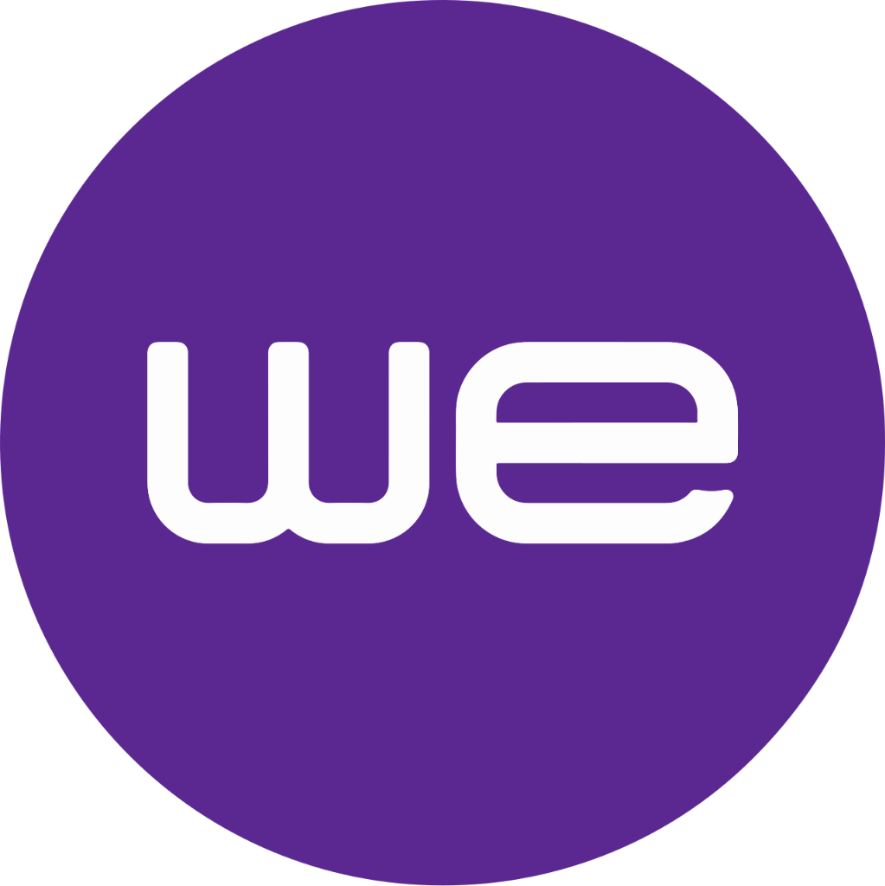

# WE Ops Control System - All Source Code

This document contains the complete source code for all components of the **WE Ops Control / Operations System** project, compiled on 6/15/2026.

## Table of Contents

1. [package.json](#packagejson) - Node.js dependencies and build configuration.
2. [main.js](#mainjs) - Electron main process entry point.
3. [server.js](#serverjs) - Express API server and SQLite database backend.
4. [index.html](#indexhtml) - Main Frontend Single Page Application (SPA).
5. [sw.js](#swjs) - PWA Service Worker for offline support.
6. [manifest.json](#manifestjson) - Progressive Web App (PWA) manifest file.
7. [warehouse_os.html](#warehouse_oshtml) - Warehouse Management dashboard interface.
8. [Launcher.cs](#launchercs) - C# Helper program to run backend and browser automatically.
9. [run_app.bat](#run_appbat) - Setup and startup batch script for Windows.
10. [query_db.js](#query_dbjs) - Database helper script to query SQLite database.
11. [check_db_icons.js](#check_db_iconsjs) - Helper script to check icon assets in database.
12. [we_corporate_presentation.html](#we_corporate_presentationhtml) - Corporate Presentation HTML slides.
13. [executive_presentation.html](#executive_presentationhtml) - Executive Presentation HTML slides.
14. [cyber_presentation.html](#cyber_presentationhtml) - Cybersecurity Presentation HTML slides.

---

## <a name="packagejson"></a> package.json

**Description:** Node.js dependencies and build configuration.  
**File Path:** `C:/Users/WE/Downloads/My/package.json`  

```json
{
  "name": "ops-reporting-backend",
  "version": "1.0.0",
  "description": "Backend server for Ops Reporting System with SQLite and JWT Authentication",
  "main": "main.js",
  "scripts": {
    "start": "node server.js",
    "electron:start": "electron .",
    "electron:build": "electron-builder --win"
  },
  "dependencies": {
    "bcryptjs": "^2.4.3",
    "cors": "^2.8.5",
    "express": "^4.18.2",
    "jsonwebtoken": "^9.0.2",
    "nodemailer": "^8.0.8",
    "pptxgenjs": "^4.0.1",
    "selfsigned": "^5.5.0",
    "sqlite3": "^5.1.7",
    "ws": "^8.21.0"
  },
  "author": "Antigravity",
  "license": "ISC",
  "devDependencies": {
    "electron": "^42.3.2",
    "electron-builder": "^26.8.1"
  },
  "build": {
    "appId": "com.we.opscontrol",
    "productName": "WEOpsControl",
    "win": {
      "target": "portable",
      "icon": "we_logo.png"
    },
    "files": [
      "**/*",
      "!dist/**/*",
      "!backups/**/*",
      "!uploads/**/*"
    ]
  }
}
```

[Back to Top](#table-of-contents)

---

## <a name="mainjs"></a> main.js

**Description:** Electron main process entry point.  
**File Path:** `C:/Users/WE/Downloads/My/main.js`  

```javascript
const { app, BrowserWindow, Menu } = require('electron');
const path = require('path');

// Disable security warnings in Electron
process.env['ELECTRON_DISABLE_SECURITY_WARNINGS'] = 'true';

// Add command line switch to ignore SSL certificate errors since the backend uses self-signed certificates
app.commandLine.appendSwitch('ignore-certificate-errors');
app.commandLine.appendSwitch('allow-insecure-localhost', 'true');

// Start backend Express server
try {
  require('./server.js');
  console.log('[Electron] Backend Express server initialized successfully.');
} catch (err) {
  console.error('[Electron] Error starting backend Express server:', err);
}

let mainWindow;

function createWindow() {
  mainWindow = new BrowserWindow({
    width: 1366,
    height: 768,
    title: "WE Ops Control System",
    icon: path.join(__dirname, 'we_logo.png'),
    webPreferences: {
      nodeIntegration: false,
      contextIsolation: true
    }
  });

  // Load backend homepage (HTTPS on port 3000)
  mainWindow.loadURL('https://localhost:3000');

  // Handle load failure (e.g. if SSL is bypassed and we fell back to HTTP)
  mainWindow.webContents.on('did-fail-load', (event, errorCode, errorDescription, validatedURL) => {
    console.log(`[Electron] Failed to load URL: ${validatedURL}, Error: ${errorDescription} (${errorCode})`);
    
    // If HTTPS fails, attempt HTTP fallback
    if (validatedURL.startsWith('https://localhost:3000')) {
      console.log('[Electron] Attempting fallback to HTTP...');
      mainWindow.loadURL('http://localhost:3000');
    }
  });

  // Remove default Electron menu bar
  Menu.setApplicationMenu(null);

  mainWindow.on('closed', function () {
    mainWindow = null;
  });
}

app.whenReady().then(() => {
  createWindow();

  app.on('activate', function () {
    if (mainWindow === null) createWindow();
  });
});

app.on('window-all-closed', function () {
  // Terminate process when windows are closed
  if (process.platform !== 'darwin') {
    app.quit();
  }
});
```

[Back to Top](#table-of-contents)

---

## <a name="serverjs"></a> server.js

**Description:** Express API server and SQLite database backend.  
**File Path:** `C:/Users/WE/Downloads/My/server.js`  

```javascript
const express = require('express');
const cors = require('cors');
const sqlite3 = require('sqlite3').verbose();
const bcrypt = require('bcryptjs');
const jwt = require('jsonwebtoken');
const path = require('path');
const fs = require('fs');
const WebSocket = require('ws');
const nodemailer = require('nodemailer');

const app = express();
const PORT = process.env.PORT || 3000;
const JWT_SECRET = process.env.JWT_SECRET || 'ops_reporting_secret_key_987654321_abc';

const clients = new Map(); // client -> { ws, username, roomId, voiceRoomId }

function broadcastToAll(payload) {
  const msg = JSON.stringify(payload);
  for (const [ws, info] of clients.entries()) {
    if (ws.readyState === WebSocket.OPEN) {
      ws.send(msg);
    }
  }
}

async function sendEmailAlert(toUser, subject, text) {
  const host = process.env.SMTP_HOST || 'smtp.office365.com'; // Default for te.eg (Office 365)
  const port = process.env.SMTP_PORT || '587';
  const user = process.env.SMTP_USER || 'ahmed.t.ahmad@te.eg'; // Default sender email
  
  let pass = process.env.SMTP_PASS || '';
  if (!pass) {
    const passwordFilePath = path.join(__dirname, 'email_password.txt');
    if (fs.existsSync(passwordFilePath)) {
      const fileContent = fs.readFileSync(passwordFilePath, 'utf8').trim();
      if (fileContent && fileContent !== 'YOUR_PASSWORD_HERE') {
        pass = fileContent;
      }
    }
  }
  
  if (!host || !user || !pass) {
    console.log(`[Email Mock Alert] (To: ${toUser}): Subject: ${subject}. Content: ${text}`);
    return;
  }
  
  try {
    const transporter = nodemailer.createTransport({
      host,
      port: parseInt(port) || 587,
      secure: port === '465',
      auth: { user, pass }
    });
    
    // Auto-complete default domain as te.eg if not specified
    const toEmail = toUser.includes('@') ? toUser : `${toUser}@te.eg`;
    
    await transporter.sendMail({
      from: `"WE Ops Control" <${user}>`,
      to: toEmail,
      subject: subject,
      text: text
    });
    console.log(`[Email Alert Sent] To: ${toEmail}`);
  } catch (err) {
    console.error('[Email Alert Error]:', err);
  }
}

function sendNotificationToUser(username, payload) {
  const msg = JSON.stringify(payload);
  for (const [ws, info] of clients.entries()) {
    if (info.username === username && ws.readyState === WebSocket.OPEN) {
      ws.send(msg);
    }
  }
}

async function createNotification(username, title, message) {
  const id = 'notif_' + Date.now() + '_' + Math.random().toString(36).substr(2, 5);
  const timestamp = new Date().toISOString();
  try {
    await dbRun(
      'INSERT INTO notifications (id, username, title, message, read, timestamp) VALUES (?, ?, ?, ?, 0, ?)',
      [id, username, title, message, timestamp]
    );
    sendNotificationToUser(username, {
      type: 'notification-new',
      notification: { id, title, message, read: 0, timestamp }
    });
  } catch (err) {
    console.error('Error creating notification:', err);
  }
}

app.use(cors());
app.use(express.json({ limit: '50mb' })); // support large payloads for file attachments
app.use(express.urlencoded({ limit: '50mb', extended: true }));

// Serve frontend static files from current directory
app.use(express.static(__dirname));
app.use('/uploads', express.static(path.join(__dirname, 'uploads')));

// Helper to save base64 files to disk
function saveBase64Files(filesArray) {
  if (!Array.isArray(filesArray)) return [];
  
  const uploadsDir = path.join(__dirname, 'uploads');
  if (!fs.existsSync(uploadsDir)) {
    fs.mkdirSync(uploadsDir);
  }
  
  return filesArray.map(file => {
    // If already uploaded, keep original URL
    if (!file.dataUrl || !file.dataUrl.startsWith('data:')) {
      return {
        name: file.name,
        size: file.size,
        type: file.type,
        url: file.url || file.path
      };
    }
    
    try {
      const matches = file.dataUrl.match(/^data:([A-Za-z-+\/]+);base64,(.+)$/);
      if (!matches || matches.length !== 3) {
        console.error('[Upload] Invalid base64 structure');
        return null;
      }
      
      const fileBuffer = Buffer.from(matches[2], 'base64');
      const sanitizedExt = path.extname(file.name) || '.' + matches[1].split('/')[1] || '';
      const fileNameOnly = path.basename(file.name, sanitizedExt).replace(/[^a-zA-Z0-9]/g, '_');
      const uniqueFilename = `${fileNameOnly}_${Date.now()}${sanitizedExt}`;
      const filePath = path.join(uploadsDir, uniqueFilename);
      
      fs.writeFileSync(filePath, fileBuffer);
      console.log(`[Upload] File saved to disk: ${uniqueFilename}`);
      
      return {
        name: file.name,
        size: file.size,
        type: file.type,
        url: `/uploads/${uniqueFilename}`
      };
    } catch (err) {
      console.error('[Upload] Error saving file to disk:', err);
      return null;
    }
  }).filter(Boolean);
}

// Connect to SQLite Database
const dbPath = path.join(__dirname, 'data.db');
const db = new sqlite3.Database(dbPath, (err) => {
  if (err) {
    console.error('Error connecting to SQLite database:', err.message);
  } else {
    console.log('Connected to SQLite database at:', dbPath);
    initializeDatabase();
  }
});

// Helper for db queries (Promise-based)
const dbRun = (sql, params = []) => {
  return new Promise((resolve, reject) => {
    db.run(sql, params, function(err) {
      if (err) reject(err);
      else resolve(this);
    });
  });
};

const dbAll = (sql, params = []) => {
  return new Promise((resolve, reject) => {
    db.all(sql, params, (err, rows) => {
      if (err) reject(err);
      else resolve(rows);
    });
  });
};

const dbGet = (sql, params = []) => {
  return new Promise((resolve, reject) => {
    db.get(sql, params, (err, row) => {
      if (err) reject(err);
      else resolve(row);
    });
  });
};

// Activity Logger Helper
async function logActivity(username, action, targetType, targetId, details) {
  const id = 'log_' + Date.now() + '_' + Math.random().toString(36).substr(2, 5);
  const timestamp = new Date().toISOString();
  try {
    await dbRun(
      'INSERT INTO activity_log (id, username, action, target_type, target_id, details, timestamp) VALUES (?, ?, ?, ?, ?, ?, ?)',
      [id, username || 'System', action, targetType || '', targetId || '', details || '', timestamp]
    );
  } catch (err) {
    console.error('Error writing activity log:', err);
  }
}

// Telegram Notifier Helper
const https = require('https');
function sendTelegramNotification(message) {
  const token = process.env.TELEGRAM_BOT_TOKEN;
  const chatIds = process.env.TELEGRAM_CHAT_ID;
  if (!token || !chatIds) {
    console.log('[Telegram Mock Alert]:', message.replace(/<[^>]*>/g, '')); // Strips HTML for clean console log
    return;
  }

  const ids = chatIds.split(',').map(id => id.trim());
  ids.forEach(chatId => {
    const payload = JSON.stringify({
      chat_id: chatId,
      text: message,
      parse_mode: 'HTML'
    });

    const options = {
      hostname: 'api.telegram.org',
      port: 443,
      path: `/bot${token}/sendMessage`,
      method: 'POST',
      headers: {
        'Content-Type': 'application/json',
        'Content-Length': payload.length
      }
    };

    const req = https.request(options, (res) => {
      res.on('data', () => {});
    });

    req.on('error', (e) => {
      console.error('Error sending Telegram notification:', e);
    });

    req.write(payload);
    req.end();
  });
}

// SMS/WhatsApp Notifier Helper
async function sendSmsOrWhatsAppNotification(username, message) {
  try {
    const user = await dbGet('SELECT phone FROM users WHERE username = ?', [username]);
    const phone = user ? user.phone : null;
    
    // Default mock phone or user's phone
    const targetPhone = phone || '01000000000';
    
    const gatewayUrl = process.env.SMS_GATEWAY_URL;
    const whatsappToken = process.env.WHATSAPP_API_TOKEN;
    
    if (!gatewayUrl && !whatsappToken) {
      console.log(`[SMS/WhatsApp Mock Alert] (To: ${targetPhone}): ${message}`);
      return;
    }
    
    // SMS Gateway Integration boilerplate
    if (gatewayUrl) {
      const payload = JSON.stringify({ to: targetPhone, text: message });
      const urlObj = new URL(gatewayUrl);
      const options = {
        hostname: urlObj.hostname,
        path: urlObj.pathname + urlObj.search,
        method: 'POST',
        headers: {
          'Content-Type': 'application/json',
          'Content-Length': payload.length
        }
      };
      const req = https.request(options, (res) => {});
      req.on('error', (e) => console.error('SMS Gateway Error:', e));
      req.write(payload);
      req.end();
      console.log(`[SMS Sent] To: ${targetPhone}`);
    }
  } catch (err) {
    console.error('Error in sendSmsOrWhatsAppNotification:', err);
  }
}

// Initialize Tables & Seed Demo Data
async function initializeDatabase() {
  try {
    // 1. Create tables
    await dbRun(`CREATE TABLE IF NOT EXISTS users (
      id TEXT PRIMARY KEY,
      username TEXT UNIQUE,
      password_hash TEXT,
      role TEXT,
      allowed_depts TEXT,
      allowed_tabs TEXT,
      phone TEXT
    )`);

    await dbRun(`CREATE TABLE IF NOT EXISTS departments (
      id TEXT PRIMARY KEY,
      name TEXT UNIQUE
    )`);

    await dbRun(`CREATE TABLE IF NOT EXISTS categories (
      id TEXT PRIMARY KEY,
      dept_id TEXT,
      name TEXT,
      FOREIGN KEY (dept_id) REFERENCES departments(id) ON DELETE CASCADE
    )`);

    await dbRun(`CREATE TABLE IF NOT EXISTS subcategories (
      id TEXT PRIMARY KEY,
      cat_id TEXT,
      name TEXT,
      FOREIGN KEY (cat_id) REFERENCES categories(id) ON DELETE CASCADE
    )`);

    await dbRun(`CREATE TABLE IF NOT EXISTS items (
      id TEXT PRIMARY KEY,
      sub_id TEXT,
      name TEXT,
      FOREIGN KEY (sub_id) REFERENCES subcategories(id) ON DELETE CASCADE
    )`);

    await dbRun(`CREATE TABLE IF NOT EXISTS entries (
      id TEXT PRIMARY KEY,
      title TEXT,
      dept_id TEXT,
      cat_id TEXT,
      sub_id TEXT,
      item_id TEXT,
      date TEXT,
      status TEXT,
      priority TEXT,
      progress INTEGER,
      notes TEXT,
      files TEXT,
      assigned_to TEXT,
      subtasks TEXT,
      blocked_by TEXT
    )`);

    try { await dbRun("ALTER TABLE entries ADD COLUMN assigned_to TEXT"); } catch(e) {}
    try { await dbRun("ALTER TABLE entries ADD COLUMN subtasks TEXT"); } catch(e) {}
    try { await dbRun("ALTER TABLE entries ADD COLUMN due_date TEXT"); } catch(e) {}
    try { await dbRun("ALTER TABLE entries ADD COLUMN blocked_by TEXT"); } catch(e) {}
    try { await dbRun("ALTER TABLE users ADD COLUMN phone TEXT"); } catch(e) {}
    try { await dbRun("ALTER TABLE users ADD COLUMN allowed_tabs TEXT"); } catch(e) {}
    try { await dbRun("ALTER TABLE entries ADD COLUMN points INTEGER DEFAULT 0"); } catch(e) {}
    try { await dbRun("ALTER TABLE entries ADD COLUMN parts_used TEXT"); } catch(e) {}
    try { await dbRun("ALTER TABLE entries ADD COLUMN latitude REAL"); } catch(e) {}
    try { await dbRun("ALTER TABLE entries ADD COLUMN longitude REAL"); } catch(e) {}

    await dbRun(`CREATE TABLE IF NOT EXISTS comments (
      id TEXT PRIMARY KEY,
      entry_id TEXT,
      username TEXT,
      comment_text TEXT,
      timestamp TEXT,
      FOREIGN KEY (entry_id) REFERENCES entries(id) ON DELETE CASCADE
    )`);

    await dbRun(`CREATE TABLE IF NOT EXISTS activity_log (
      id TEXT PRIMARY KEY,
      username TEXT,
      action TEXT,
      target_type TEXT,
      target_id TEXT,
      details TEXT,
      timestamp TEXT
    )`);

    await dbRun(`CREATE TABLE IF NOT EXISTS group_chats (
      id TEXT PRIMARY KEY,
      room_id TEXT,
      username TEXT,
      message TEXT,
      timestamp TEXT
    )`);

    await dbRun(`CREATE TABLE IF NOT EXISTS notifications (
      id TEXT PRIMARY KEY,
      username TEXT,
      title TEXT,
      message TEXT,
      read INTEGER,
      timestamp TEXT
    )`);

    await dbRun(`CREATE TABLE IF NOT EXISTS preventive_templates (
      id TEXT PRIMARY KEY,
      title TEXT,
      dept_id TEXT,
      cat_id TEXT,
      sub_id TEXT,
      item_id TEXT,
      frequency TEXT,
      last_generated TEXT,
      assigned_to TEXT,
      priority TEXT,
      notes TEXT
    )`);

    await dbRun(`CREATE TABLE IF NOT EXISTS entry_revisions (
      id TEXT PRIMARY KEY,
      entry_id TEXT,
      changed_by TEXT,
      old_notes TEXT,
      new_notes TEXT,
      timestamp TEXT
    )`);

    await dbRun(`CREATE TABLE IF NOT EXISTS shifts (
      id INTEGER PRIMARY KEY AUTOINCREMENT,
      date TEXT,
      engineer TEXT,
      sector TEXT,
      shift_type TEXT
    )`);

    await dbRun(`CREATE TABLE IF NOT EXISTS stakeholders (
      id TEXT PRIMARY KEY,
      name TEXT,
      job_title TEXT,
      governorate TEXT,
      mobile TEXT,
      email TEXT
    )`);

    await dbRun(`CREATE TABLE IF NOT EXISTS evaluations (
      id TEXT PRIMARY KEY,
      year INTEGER,
      engineer TEXT,
      total_points INTEGER,
      rating TEXT,
      comments TEXT,
      approved_by TEXT,
      timestamp TEXT,
      UNIQUE(year, engineer)
    )`);

    await dbRun(`CREATE TABLE IF NOT EXISTS spare_parts (
      id TEXT PRIMARY KEY,
      name TEXT UNIQUE,
      sku TEXT,
      quantity INTEGER DEFAULT 0,
      min_quantity INTEGER DEFAULT 5,
      unit TEXT
    )`);

    await dbRun(`CREATE TABLE IF NOT EXISTS part_transactions (
      id TEXT PRIMARY KEY,
      part_id TEXT,
      entry_id TEXT,
      type TEXT,
      quantity INTEGER,
      username TEXT,
      timestamp TEXT,
      FOREIGN KEY (part_id) REFERENCES spare_parts(id)
    )`);

    await dbRun(`CREATE TABLE IF NOT EXISTS handovers (
      id TEXT PRIMARY KEY,
      outgoing_engineer TEXT,
      incoming_engineer TEXT,
      active_faults TEXT,
      general_notes TEXT,
      status TEXT,
      timestamp TEXT
    )`);

    console.log('Database tables verified/created.');

    // 2. Seed default users if empty
    const userCount = await dbGet('SELECT COUNT(*) as count FROM users');
    if (userCount.count === 0) {
      const adminPass = bcrypt.hashSync('admin123', 10);
      const editorPass = bcrypt.hashSync('editor123', 10);
      const viewerPass = bcrypt.hashSync('viewer123', 10);

      await dbRun('INSERT INTO users (id, username, password_hash, role, allowed_depts) VALUES (?, ?, ?, ?, ?)', ['u_1', 'admin', adminPass, 'admin', '[]']);
      await dbRun('INSERT INTO users (id, username, password_hash, role, allowed_depts) VALUES (?, ?, ?, ?, ?)', ['u_2', 'editor', editorPass, 'editor', '[]']);
      await dbRun('INSERT INTO users (id, username, password_hash, role, allowed_depts) VALUES (?, ?, ?, ?, ?)', ['u_3', 'viewer', viewerPass, 'viewer', '[]']);

      // Seed default engineers
      const engineers = [
        'م الهادي احمد', 'م هنادي الحلو', 'م محمد مصطفي', 'م محمد صلاح',
        'م ايمان عبدالرازق', 'اشرف كمال', 'م رانيا محمود', 'وفاء عبدالرازق',
        'م احمد طه', 'م احمد حمدي', 'م نور', 'م علاء'
      ];
      const defaultEngPass = bcrypt.hashSync('123456', 10);
      for (let i = 0; i < engineers.length; i++) {
        await dbRun('INSERT INTO users (id, username, password_hash, role, allowed_depts) VALUES (?, ?, ?, ?, ?)', [`u_eng_${i}`, engineers[i], defaultEngPass, 'editor', '[]']);
      }

      console.log('Seeded default users and engineers (default password: 123456).');
    }

    // Seed default spare parts if empty
    const partCount = await dbGet('SELECT COUNT(*) as count FROM spare_parts');
    if (partCount.count === 0) {
      const defaultParts = [
        { id: 'p_1', name: 'Control Card (كرت تحكم رئيسي)', sku: 'CTRL-CARD-V1', quantity: 15, min_quantity: 3, unit: 'pcs' },
        { id: 'p_2', name: 'Fiber Patch Cord 3m (كابل فايبر 3م)', sku: 'FIB-PATCH-3M', quantity: 50, min_quantity: 10, unit: 'pcs' },
        { id: 'p_3', name: 'Fuse 16A (فيوز 16 أمبير)', sku: 'FUSE-16A', quantity: 120, min_quantity: 20, unit: 'pcs' },
        { id: 'p_4', name: 'Lithium Battery 12V (بطارية ليثيوم 12فولت)', sku: 'BATT-LITH-12V', quantity: 8, min_quantity: 2, unit: 'pcs' },
        { id: 'p_5', name: 'SFP Transceiver 10G (موديول SFP 10G)', sku: 'SFP-10G-LR', quantity: 25, min_quantity: 5, unit: 'pcs' }
      ];
      for (const p of defaultParts) {
        await dbRun('INSERT INTO spare_parts (id, name, sku, quantity, min_quantity, unit) VALUES (?, ?, ?, ?, ?, ?)',
          [p.id, p.name, p.sku, p.quantity, p.min_quantity, p.unit]
        );
      }
      console.log('Seeded default spare parts.');
    }

    // Destructive SPM category migration check removed to prevent database from being wiped on startup.

    // 3. Seed demo structure if empty (only on initial database creation when both departments and users are empty)
    const deptCount = await dbGet('SELECT COUNT(*) as count FROM departments');
    if (deptCount.count === 0 && userCount.count === 0) {
      console.log('Seeding demo departments, hierarchy, and entries...');
      const depts = [
        { id: 'd_1', name: 'S.Sinai' },
        { id: 'd_2', name: 'N.Sinai' },
        { id: 'd_3', name: 'ISM' },
        { id: 'd_4', name: 'Suez' },
        { id: 'd_5', name: 'Port Said' },
        { id: 'd_6', name: 'Red Sea' }
      ];

      const categoryNames = [
        "Correlative Maintenance",
        "Preventive Maintenance",
        "New Project",
        "CID's Installation",
        "Hall Layout",
        "SPM"
      ];

      for (const d of depts) {
        await dbRun('INSERT INTO departments VALUES (?, ?)', [d.id, d.name]);

        for (const catName of categoryNames) {
          const catClean = catName.toLowerCase().replace(/[^a-z0-9]/g, '_');
          const catId = `c_${catClean}_${d.id}`;
          await dbRun('INSERT INTO categories VALUES (?, ?, ?)', [catId, d.id, catName]);

          // Seed a sample subcategory and item for each category to keep it structured
          const subId = `s_${catClean}_${d.id}`;
          let subName = '';
          let itemName = '';
          
          if (catName === 'Correlative Maintenance') {
            subName = 'Mechanical Repairs';
            itemName = 'Main Engine Repair';
          } else if (catName === 'Preventive Maintenance') {
            subName = 'Routine Inspection';
            itemName = 'Daily Equipment Check';
          } else if (catName === 'New Project') {
            subName = 'Phase 1';
            itemName = 'Site Preparation';
          } else if (catName === 'CID\'s Installation') {
            subName = 'Hardware Setup';
            itemName = 'Camera Mounting';
          } else if (catName === 'Hall Layout') {
            subName = 'Space Planning';
            itemName = 'Floor Grid Design';
          } else if (catName === 'SPM') {
            subName = 'SPM Monitoring';
            itemName = 'Daily SPM Log';
          }

          await dbRun('INSERT INTO subcategories VALUES (?, ?, ?)', [subId, catId, subName]);
          const itemId = "i_" + catClean + "_" + d.id;
          await dbRun("INSERT INTO items VALUES (?, ?, ?)", [itemId, subId, itemName]);
        }
      }
        // Add a couple of sample Fault & Solution entries
      const statuses = ['On track', 'At risk', 'Delayed', 'Completed', 'Pending'];
      const priorities = ['High', 'Medium', 'Low'];

      // Add 6 standard demo entries (assigned to Preventive Maintenance)
      for (let i = 0; i < 6; i++) {
        const d = depts[i];
        const catId = `c_preventive_maintenance_${d.id}`;
        const subId = `s_preventive_maintenance_${d.id}`;
        const itemId = `i_preventive_maintenance_${d.id}`;
        
        await dbRun(`INSERT INTO entries (id, title, dept_id, cat_id, sub_id, item_id, date, status, priority, progress, notes, files) VALUES (?, ?, ?, ?, ?, ?, ?, ?, ?, ?, ?, ?)`, [
          'e_' + i,
          `${d.name} – Preventive Maintenance Task`,
          d.id,
          catId,
          subId,
          itemId,
          `2026-05-${10 + i}`,
          statuses[i % statuses.length],
          priorities[i % priorities.length],
          30 + (i * 12),
          `Sample notes for department operational task at ${d.name}.`,
          '[]'
        ]);
      }
 
      // Add specific Faults and Solutions for "Smart Search"
      await dbRun(`INSERT INTO entries (id, title, dept_id, cat_id, sub_id, item_id, date, status, priority, progress, notes, files) VALUES (?, ?, ?, ?, ?, ?, ?, ?, ?, ?, ?, ?)`, [
        'e_fault_1',
        'عطل كهربائي في الونش الرئيسي رقم 4 (Main Crane Failure)',
        'd_1',
        'c_correlative_maintenance_d_1',
        's_correlative_maintenance_d_1',
        'i_correlative_maintenance_d_1',
        '2026-05-20',
        'Completed',
        'High',
        100,
        'الوصف: توقف مفاجئ للونش الرئيسي رقم 4 بسبب احتراق فيوز التحكم الرئيسي.\nالحل: تم فحص الدائرة واستبدال الفيوز التالف بفيوز آخر أصلي 16 أمبير، وتمت إعادة التشغيل بنجاح والونش يعمل بكفاءة الآن.',
        '[]'
      ]);
 
      await dbRun(`INSERT INTO entries (id, title, dept_id, cat_id, sub_id, item_id, date, status, priority, progress, notes, files) VALUES (?, ?, ?, ?, ?, ?, ?, ?, ?, ?, ?, ?)`, [
        'e_fault_2',
        'تسريب زيت هيدروليكي في رصيف 2 (Hydraulic Leakage)',
        'd_5',
        'c_preventive_maintenance_d_5',
        's_preventive_maintenance_d_5',
        'i_preventive_maintenance_d_5',
        '2026-05-22',
        'Completed',
        'Medium',
        100,
        'الوصف: وجود بقع زيتية وتسريب هيدروليكي أسفل رافعة Berth 2.\nالحل: تم إيقاف العمل مؤقتاً، واستبدال الأنابيب التالفة (Hydraulic Hoses) وتنظيف الرصيف بالكامل لمنع الانزلاق.',
        '[]'
      ]);

      console.log('Seeded demo structure and fault-solution data successfully.');
    }
  } catch (error) {
    console.error('Error seeding database:', error);
  }
}

// Token Verification Middleware
function authenticateToken(req, res, next) {
  const authHeader = req.headers['authorization'];
  const token = authHeader && authHeader.split(' ')[1];

  if (!token) return res.status(401).json({ error: 'Access token required. Please log in.' });

  jwt.verify(token, JWT_SECRET, (err, user) => {
    if (err) return res.status(403).json({ error: 'Token is invalid or expired.' });
    req.user = user;
    next();
  });
}

// Role Authorization Middleware
function requireRole(roles) {
  return (req, res, next) => {
    if (!req.user || !roles.includes(req.user.role)) {
      return res.status(403).json({ error: 'Unauthorized: You do not have permission for this action.' });
    }
    next();
  };
}

// Department access helper
function getDeptFilter(user) {
  if (user.role === 'admin' || !user.allowed_depts || user.allowed_depts.length === 0) {
    return null; // No restriction
  }
  return user.allowed_depts; // returns array of allowed deptIds
}

// Authentication Endpoint
app.post('/api/auth/login', async (req, res) => {
  const { username, password } = req.body;
  if (!username || !password) {
    return res.status(400).json({ error: 'Username and password are required' });
  }

  try {
    const user = await dbGet('SELECT * FROM users WHERE username = ?', [username]);
    if (!user) {
      return res.status(400).json({ error: 'Invalid username or password' });
    }

    const validPass = bcrypt.compareSync(password, user.password_hash);
    if (!validPass) {
      return res.status(400).json({ error: 'Invalid username or password' });
    }

    const allowedDepts = JSON.parse(user.allowed_depts || '[]');
    const allowedTabs = JSON.parse(user.allowed_tabs || '[]');
    const token = jwt.sign(
      { id: user.id, username: user.username, role: user.role, allowed_depts: allowedDepts, allowed_tabs: allowedTabs },
      JWT_SECRET,
      { expiresIn: '8h' }
    );

    await logActivity(user.username, 'Login', 'user', user.id, 'User logged in successfully');

    res.json({
      token,
      user: {
        id: user.id,
        username: user.username,
        role: user.role,
        allowed_depts: allowedDepts,
        allowed_tabs: allowedTabs
      }
    });
  } catch (error) {
    res.status(500).json({ error: 'Server error during login' });
  }
});

// GET Current Session User profile
app.get('/api/auth/me', authenticateToken, (req, res) => {
  res.json({ user: req.user });
});

// SMART SEARCH Endpoint
// Searches faults and solutions in 'title' and 'notes' fields
app.get('/api/entries/search', authenticateToken, async (req, res) => {
  const query = req.query.q || '';
  if (!query.trim()) {
    return res.json([]);
  }

  try {
    const allowedDepts = getDeptFilter(req.user);
    let sql = 'SELECT * FROM entries WHERE (title LIKE ? OR notes LIKE ?)';
    let params = [`%${query}%`, `%${query}%`];

    if (allowedDepts) {
      const placeholders = allowedDepts.map(() => '?').join(',');
      sql += ` AND dept_id IN (${placeholders})`;
      params.push(...allowedDepts);
    }

    sql += ' ORDER BY date DESC';
    const results = await dbAll(sql, params);
    
    // Parse files JSON for each entry
    results.forEach(r => {
      r.files = JSON.parse(r.files || '[]');
      r.subtasks = JSON.parse(r.subtasks || '[]');
      r.parts_used = JSON.parse(r.parts_used || '[]');
    });

    res.json(results);
  } catch (error) {
    res.status(500).json({ error: 'Error performing search' });
  }
});

// GET Fetch All Dashboard Data
app.get('/api/data', authenticateToken, async (req, res) => {
  try {
    const allowedDepts = getDeptFilter(req.user);

    let depts, cats, subs, items, entries;

    if (allowedDepts) {
      const placeholders = allowedDepts.map(() => '?').join(',');
      
      depts = await dbAll(`SELECT * FROM departments WHERE id IN (${placeholders})`, allowedDepts);
      
      cats = await dbAll(`SELECT * FROM categories WHERE dept_id IN (${placeholders})`, allowedDepts);
      const catIds = cats.map(c => c.id);
      
      if (catIds.length > 0) {
        const catPlaceholders = catIds.map(() => '?').join(',');
        subs = await dbAll(`SELECT * FROM subcategories WHERE cat_id IN (${catPlaceholders})`, catIds);
      } else {
        subs = [];
      }
      const subIds = subs.map(s => s.id);

      if (subIds.length > 0) {
        const subPlaceholders = subIds.map(() => '?').join(',');
        items = await dbAll(`SELECT * FROM items WHERE sub_id IN (${subPlaceholders})`, subIds);
      } else {
        items = [];
      }

      entries = await dbAll(`SELECT * FROM entries WHERE dept_id IN (${placeholders})`, allowedDepts);
    } else {
      depts = await dbAll('SELECT * FROM departments');
      cats = await dbAll('SELECT * FROM categories');
      subs = await dbAll('SELECT * FROM subcategories');
      items = await dbAll('SELECT * FROM items');
      entries = await dbAll('SELECT * FROM entries');
    }

    // Parse files JSON back to array
    entries.forEach(e => {
      e.files = JSON.parse(e.files || '[]');
      e.subtasks = JSON.parse(e.subtasks || '[]');
      e.parts_used = JSON.parse(e.parts_used || '[]');
    });

    const evaluations = await dbAll('SELECT * FROM evaluations');

    res.json({
      departments: depts,
      categories: cats,
      subcategories: subs,
      items: items,
      entries: entries,
      evaluations: evaluations
    });
  } catch (error) {
    res.status(500).json({ error: 'Failed to retrieve database contents' });
  }
});

// ================= HIERARCHY MUTATIONS =================

// Add Department (Admin Only)
app.post('/api/hierarchy/dept', authenticateToken, requireRole(['admin']), async (req, res) => {
  const { name } = req.body;
  if (!name || !name.trim()) return res.status(400).json({ error: 'Name is required' });
  const id = 'dept_' + Date.now();

  try {
    await dbRun('INSERT INTO departments VALUES (?, ?)', [id, name.trim()]);
    await logActivity(req.user.username, 'Create Department', 'department', id, `Created department: ${name}`);
    broadcastToAll({ type: 'db-update' });
    res.json({ success: true, id, name });
  } catch (error) {
    res.status(500).json({ error: 'Department name already exists or server error.' });
  }
});

// Add Category (Admin/Editor)
app.post('/api/hierarchy/cat', authenticateToken, requireRole(['admin', 'editor']), async (req, res) => {
  const { deptId, name } = req.body;
  if (!deptId || !name || !name.trim()) return res.status(400).json({ error: 'Required fields missing' });

  // Enforce Editor Department restriction
  const allowedDepts = getDeptFilter(req.user);
  if (allowedDepts && !allowedDepts.includes(deptId)) {
    return res.status(403).json({ error: 'You do not have write access for this department' });
  }

  const id = 'cat_' + Date.now();
  try {
    await dbRun('INSERT INTO categories VALUES (?, ?, ?)', [id, deptId, name.trim()]);
    await logActivity(req.user.username, 'Create Category', 'category', id, `Created category: ${name}`);
    broadcastToAll({ type: 'db-update' });
    res.json({ success: true, id, name });
  } catch (error) {
    res.status(500).json({ error: 'Error adding category' });
  }
});

// Add Subcategory (Admin/Editor)
app.post('/api/hierarchy/sub', authenticateToken, requireRole(['admin', 'editor']), async (req, res) => {
  const { catId, name } = req.body;
  if (!catId || !name || !name.trim()) return res.status(400).json({ error: 'Required fields missing' });

  try {
    const cat = await dbGet('SELECT dept_id FROM categories WHERE id = ?', [catId]);
    if (!cat) return res.status(404).json({ error: 'Parent category not found' });

    const allowedDepts = getDeptFilter(req.user);
    if (allowedDepts && !allowedDepts.includes(cat.dept_id)) {
      return res.status(403).json({ error: 'You do not have write access for this department' });
    }

    const id = 'sub_' + Date.now();
    await dbRun('INSERT INTO subcategories VALUES (?, ?, ?)', [id, catId, name.trim()]);
    await logActivity(req.user.username, 'Create Subcategory', 'subcategory', id, `Created subcategory: ${name}`);
    broadcastToAll({ type: 'db-update' });
    res.json({ success: true, id, name });
  } catch (error) {
    res.status(500).json({ error: 'Error adding subcategory' });
  }
});

// Add Item (Admin/Editor)
app.post('/api/hierarchy/item', authenticateToken, requireRole(['admin', 'editor']), async (req, res) => {
  const { subId, name } = req.body;
  if (!subId || !name || !name.trim()) return res.status(400).json({ error: 'Required fields missing' });

  try {
    const sub = await dbGet(`SELECT categories.dept_id FROM subcategories 
      JOIN categories ON subcategories.cat_id = categories.id 
      WHERE subcategories.id = ?`, [subId]);
    if (!sub) return res.status(404).json({ error: 'Parent subcategory not found' });

    const allowedDepts = getDeptFilter(req.user);
    if (allowedDepts && !allowedDepts.includes(sub.dept_id)) {
      return res.status(403).json({ error: 'You do not have write access for this department' });
    }

    const id = 'itm_' + Date.now();
    await dbRun('INSERT INTO items VALUES (?, ?, ?)', [id, subId, name.trim()]);
    await logActivity(req.user.username, 'Create Item', 'item', id, `Created item: ${name}`);
    broadcastToAll({ type: 'db-update' });
    res.json({ success: true, id, name });
  } catch (error) {
    res.status(500).json({ error: 'Error adding item' });
  }
});

// Rename Node (Admin/Editor)
app.put('/api/hierarchy/:type/:id', authenticateToken, requireRole(['admin', 'editor']), async (req, res) => {
  const { type, id } = req.params;
  const { name } = req.body;
  if (!name || !name.trim()) return res.status(400).json({ error: 'Name is required' });

  try {
    let deptId = null;

    if (type === 'cat') {
      const cat = await dbGet('SELECT dept_id FROM categories WHERE id = ?', [id]);
      if (cat) deptId = cat.dept_id;
    } else if (type === 'sub') {
      const sub = await dbGet('SELECT categories.dept_id FROM subcategories JOIN categories ON subcategories.cat_id = categories.id WHERE subcategories.id = ?', [id]);
      if (sub) deptId = sub.dept_id;
    } else if (type === 'item') {
      const itm = await dbGet('SELECT categories.dept_id FROM items JOIN subcategories ON items.sub_id = subcategories.id JOIN categories ON subcategories.cat_id = categories.id WHERE items.id = ?', [id]);
      if (itm) deptId = itm.dept_id;
    }

    const allowedDepts = getDeptFilter(req.user);
    if (allowedDepts && deptId && !allowedDepts.includes(deptId)) {
      return res.status(403).json({ error: 'Unauthorized operation for your assigned departments' });
    }

    if (type === 'cat') {
      await dbRun('UPDATE categories SET name = ? WHERE id = ?', [name.trim(), id]);
    } else if (type === 'sub') {
      await dbRun('UPDATE subcategories SET name = ? WHERE id = ?', [name.trim(), id]);
    } else if (type === 'item') {
      await dbRun('UPDATE items SET name = ? WHERE id = ?', [name.trim(), id]);
    } else {
      return res.status(400).json({ error: 'Invalid node type' });
    }

    await logActivity(req.user.username, 'Rename Node', type, id, `Renamed ${type} to: ${name.trim()}`);
    broadcastToAll({ type: 'db-update' });
    res.json({ success: true });
  } catch (error) {
    res.status(500).json({ error: 'Error renaming node' });
  }
});

// Delete Node (Admin/Editor)
app.delete('/api/hierarchy/:type/:id', authenticateToken, requireRole(['admin', 'editor']), async (req, res) => {
  const { type, id } = req.params;

  try {
    let deptId = null;

    if (type === 'cat') {
      const cat = await dbGet('SELECT dept_id FROM categories WHERE id = ?', [id]);
      if (cat) deptId = cat.dept_id;
    } else if (type === 'sub') {
      const sub = await dbGet('SELECT categories.dept_id FROM subcategories JOIN categories ON subcategories.cat_id = categories.id WHERE subcategories.id = ?', [id]);
      if (sub) deptId = sub.dept_id;
    } else if (type === 'item') {
      const itm = await dbGet('SELECT categories.dept_id FROM items JOIN subcategories ON items.sub_id = subcategories.id JOIN categories ON subcategories.cat_id = categories.id WHERE items.id = ?', [id]);
      if (itm) deptId = itm.dept_id;
    }

    const allowedDepts = getDeptFilter(req.user);
    if (allowedDepts && deptId && !allowedDepts.includes(deptId)) {
      return res.status(403).json({ error: 'Unauthorized operation for your assigned departments' });
    }

    let targetName = 'Unknown';
    if (type === 'cat') {
      const node = await dbGet('SELECT name FROM categories WHERE id = ?', [id]);
      if (node) targetName = node.name;
      await dbRun('DELETE FROM entries WHERE cat_id = ?', [id]);
      await dbRun('DELETE FROM categories WHERE id = ?', [id]);
    } else if (type === 'sub') {
      const node = await dbGet('SELECT name FROM subcategories WHERE id = ?', [id]);
      if (node) targetName = node.name;
      await dbRun('DELETE FROM entries WHERE sub_id = ?', [id]);
      await dbRun('DELETE FROM subcategories WHERE id = ?', [id]);
    } else if (type === 'item') {
      const node = await dbGet('SELECT name FROM items WHERE id = ?', [id]);
      if (node) targetName = node.name;
      await dbRun('DELETE FROM entries WHERE item_id = ?', [id]);
      await dbRun('DELETE FROM items WHERE id = ?', [id]);
    } else {
      return res.status(400).json({ error: 'Invalid node type' });
    }

    await logActivity(req.user.username, 'Delete Node', type, id, `Deleted ${type}: ${targetName}`);
    broadcastToAll({ type: 'db-update' });
    res.json({ success: true });
  } catch (error) {
    res.status(500).json({ error: 'Error deleting node' });
  }
});


// ================= ENTRY MUTATIONS =================

// Create Entry (Admin/Editor)
app.post('/api/entries', authenticateToken, requireRole(['admin', 'editor']), async (req, res) => {
  const { title, deptId, catId, subId, itemId, date, status, priority, progress, notes, files, assignedTo, subtasks, dueDate, blockedBy, points, partsUsed, latitude, longitude } = req.body;
  if (!title || !deptId) {
    return res.status(400).json({ error: 'Title and Department are required.' });
  }

  const allowedDepts = getDeptFilter(req.user);
  if (allowedDepts && !allowedDepts.includes(deptId)) {
    return res.status(403).json({ error: 'Unauthorized department for new entry.' });
  }

  const id = 'entry_' + Date.now();
  const savedFiles = saveBase64Files(files || []);
  const filesStr = JSON.stringify(savedFiles);
  const subtasksStr = JSON.stringify(subtasks || []);
  const partsUsedStr = JSON.stringify(partsUsed || []);
  const pointsVal = req.user.role === 'admin' ? (parseInt(points) || 0) : 0;
  const latVal = latitude ? parseFloat(latitude) : null;
  const lngVal = longitude ? parseFloat(longitude) : null;

  try {
    await dbRun(`INSERT INTO entries (id, title, dept_id, cat_id, sub_id, item_id, date, status, priority, progress, notes, files, assigned_to, subtasks, due_date, blocked_by, points, parts_used, latitude, longitude) 
      VALUES (?, ?, ?, ?, ?, ?, ?, ?, ?, ?, ?, ?, ?, ?, ?, ?, ?, ?, ?, ?)`, 
      [id, title, deptId, catId, subId, itemId, date, status, priority, parseInt(progress) || 0, notes, filesStr, assignedTo || '', subtasksStr, dueDate || '', blockedBy || '', pointsVal, partsUsedStr, latVal, lngVal]
    );

    // Deduct stock for parts used
    if (partsUsed && Array.isArray(partsUsed)) {
      for (const p of partsUsed) {
        await dbRun('UPDATE spare_parts SET quantity = quantity - ? WHERE id = ?', [p.quantity, p.partId]);
        await dbRun('INSERT INTO part_transactions (id, part_id, entry_id, type, quantity, username, timestamp) VALUES (?, ?, ?, ?, ?, ?, ?)',
          ['tx_' + Date.now() + '_' + Math.random().toString(36).substr(2, 5), p.partId, id, 'OUT', p.quantity, req.user.username, new Date().toISOString()]
        );
        
        // Low stock alert check
        const part = await dbGet('SELECT * FROM spare_parts WHERE id = ?', [p.partId]);
        if (part && part.quantity <= part.min_quantity) {
          sendTelegramNotification(`⚠️ <b>تنبيه مخزن قطع الغيار:</b>\nرصيد قطعة الغيار <b>${part.name}</b> شارف على النفاد!\nالكمية الحالية: ${part.quantity} (الحد الأدنى: ${part.min_quantity})`);
        }
      }
    }

    await logActivity(req.user.username, 'Create Entry', 'entry', id, `Created entry: ${title} with ${pointsVal} points`);

    // Real-time notification for assignee
    if (assignedTo && assignedTo !== req.user.username) {
      await createNotification(
        assignedTo,
        'مهمة جديدة مسندة إليك (New Task Assigned)',
        `تم إسناد المهمة: "${title}" إليك بواسطة ${req.user.username}.`
      );
      await sendEmailAlert(
        assignedTo,
        'مهمة جديدة مسندة إليك (New Task Assigned)',
        `تم إسناد المهمة: "${title}" إليك بواسطة ${req.user.username} في تاريخ ${date}.`
      );
      await sendSmsOrWhatsAppNotification(
        assignedTo,
        `تنبيه: تم إسناد مهمة جديدة إليك: "${title}" بواسطة ${req.user.username}.`
      );
    }

    // Trigger Telegram notification
    if (priority === 'High' && (status === 'Delayed' || status === 'At risk')) {
      const dept = await dbGet('SELECT name FROM departments WHERE id = ?', [deptId]);
      const deptNameStr = dept ? dept.name : deptId;
      const msg = `⚠️ <b>تنبيه عطل طارئ (High Priority Alert)</b>\n\n` +
                  `<b>العنوان:</b> ${title}\n` +
                  `<b>المحافظة/القطاع:</b> ${deptNameStr}\n` +
                  `<b>الحالة:</b> ${status}\n` +
                  `<b>المسؤول:</b> ${assignedTo || 'غير محدد'}\n` +
                  `<b>تاريخ الاستحقاق:</b> ${dueDate || 'غير محدد'}\n\n` +
                  `<i>يرجى المتابعة وسرعة حل العطل.</i>`;
      sendTelegramNotification(msg);
    }

    broadcastToAll({ type: 'db-update' });

    const newEntry = { id, title, deptId, catId, subId, itemId, date, status, priority, progress: parseInt(progress) || 0, notes, files: savedFiles, assignedTo: assignedTo || '', subtasks: subtasks || [], due_date: dueDate || '', blocked_by: blockedBy || '', points: pointsVal, parts_used: partsUsed, latitude: latVal, longitude: lngVal };
    res.json(newEntry);
  } catch (error) {
    console.error('Error creating entry:', error);
    res.status(500).json({ error: 'Error creating entry.' });
  }
});

// Update Entry (Admin/Editor)
app.put('/api/entries/:id', authenticateToken, requireRole(['admin', 'editor']), async (req, res) => {
  const { id } = req.params;
  const { title, deptId, catId, subId, itemId, date, status, priority, progress, notes, files, assignedTo, subtasks, dueDate, blockedBy, points, partsUsed, latitude, longitude } = req.body;

  try {
    const oldEntry = await dbGet('SELECT * FROM entries WHERE id = ?', [id]);
    if (!oldEntry) return res.status(404).json({ error: 'Entry not found' });

    const allowedDepts = getDeptFilter(req.user);
    if (allowedDepts && (!allowedDepts.includes(oldEntry.dept_id) || !allowedDepts.includes(deptId))) {
      return res.status(403).json({ error: 'Unauthorized department for entry edit.' });
    }

    // Check if notes changed to write a revision history record
    if (notes !== undefined && notes !== oldEntry.notes) {
      const revisionId = 'rev_' + Date.now() + '_' + Math.random().toString(36).substr(2, 5);
      const timestamp = new Date().toISOString();
      await dbRun(
        'INSERT INTO entry_revisions (id, entry_id, changed_by, old_notes, new_notes, timestamp) VALUES (?, ?, ?, ?, ?, ?)',
        [revisionId, id, req.user.username, oldEntry.notes || '', notes || '', timestamp]
      );
    }

    // Reverse old inventory adjustments
    if (oldEntry.parts_used) {
      try {
        const oldParts = JSON.parse(oldEntry.parts_used);
        for (const p of oldParts) {
          await dbRun('UPDATE spare_parts SET quantity = quantity + ? WHERE id = ?', [p.quantity, p.partId]);
          await dbRun('INSERT INTO part_transactions (id, part_id, entry_id, type, quantity, username, timestamp) VALUES (?, ?, ?, ?, ?, ?, ?)',
            ['tx_' + Date.now() + '_' + Math.random().toString(36).substr(2, 5), p.partId, id, 'IN_REV', p.quantity, req.user.username, new Date().toISOString()]
          );
        }
      } catch (e) {
        console.error('Error reversing old inventory:', e);
      }
    }

    // Apply new inventory adjustments
    if (partsUsed && Array.isArray(partsUsed)) {
      for (const p of partsUsed) {
        await dbRun('UPDATE spare_parts SET quantity = quantity - ? WHERE id = ?', [p.quantity, p.partId]);
        await dbRun('INSERT INTO part_transactions (id, part_id, entry_id, type, quantity, username, timestamp) VALUES (?, ?, ?, ?, ?, ?, ?)',
          ['tx_' + Date.now() + '_' + Math.random().toString(36).substr(2, 5), p.partId, id, 'OUT', p.quantity, req.user.username, new Date().toISOString()]
        );

        // Low stock alert check
        const part = await dbGet('SELECT * FROM spare_parts WHERE id = ?', [p.partId]);
        if (part && part.quantity <= part.min_quantity) {
          sendTelegramNotification(`⚠️ <b>تنبيه مخزن قطع الغيار:</b>\nرصيد قطعة الغيار <b>${part.name}</b> شارف على النفاد!\nالكمية الحالية: ${part.quantity} (الحد الأدنى: ${part.min_quantity})`);
        }
      }
    }

    const savedFiles = saveBase64Files(files || []);
    const filesStr = JSON.stringify(savedFiles);
    const subtasksStr = JSON.stringify(subtasks || []);
    const partsUsedStr = JSON.stringify(partsUsed || []);
    const pointsVal = req.user.role === 'admin' ? (points !== undefined ? (parseInt(points) || 0) : oldEntry.points) : oldEntry.points;
    const latVal = latitude ? parseFloat(latitude) : null;
    const lngVal = longitude ? parseFloat(longitude) : null;

    await dbRun(`UPDATE entries 
      SET title = ?, dept_id = ?, cat_id = ?, sub_id = ?, item_id = ?, date = ?, status = ?, priority = ?, progress = ?, notes = ?, files = ?, assigned_to = ?, subtasks = ?, due_date = ?, blocked_by = ?, points = ?, parts_used = ?, latitude = ?, longitude = ? 
      WHERE id = ?`,
      [title, deptId, catId, subId, itemId, date, status, priority, parseInt(progress) || 0, notes, filesStr, assignedTo || '', subtasksStr, dueDate || '', blockedBy || '', pointsVal, partsUsedStr, latVal, lngVal, id]
    );

    await logActivity(req.user.username, 'Update Entry', 'entry', id, `Updated entry: ${title} with points ${pointsVal}`);

    // Trigger In-App Notifications for changes
    if (assignedTo && assignedTo !== oldEntry.assigned_to && assignedTo !== req.user.username) {
      await createNotification(
        assignedTo,
        'مهمة مسندة إليك (Task Assigned)',
        `تم إسناد المهمة: "${title}" إليك بواسطة ${req.user.username}.`
      );
      await sendEmailAlert(
        assignedTo,
        'مهمة مسندة إليك (Task Assigned)',
        `تم إسناد المهمة: "${title}" إليك بواسطة ${req.user.username}.`
      );
      await sendSmsOrWhatsAppNotification(
        assignedTo,
        `تنبيه: تم إسناد المهمة: "${title}" إليك بواسطة ${req.user.username}.`
      );
    }
    if (status !== oldEntry.status) {
      const msgText = `تم تغيير حالة المهمة "${title}" إلى [${status}] بواسطة ${req.user.username}.`;
      if (assignedTo && assignedTo !== req.user.username) {
        await createNotification(assignedTo, 'تحديث حالة المهمة (Task Status Update)', msgText);
        await sendEmailAlert(assignedTo, 'تحديث حالة المهمة (Task Status Update)', msgText);
        await sendSmsOrWhatsAppNotification(assignedTo, `تنبيه: تم تغيير حالة المهمة "${title}" إلى [${status}] بواسطة ${req.user.username}.`);
      }
    }

    // Trigger Telegram notification
    if (priority === 'High' && (status === 'Delayed' || status === 'At risk')) {
      const dept = await dbGet('SELECT name FROM departments WHERE id = ?', [deptId]);
      const deptNameStr = dept ? dept.name : deptId;
      const msg = `⚠️ <b>تحديث عطل طارئ (High Priority Alert Update)</b>\n\n` +
                  `<b>العنوان:</b> ${title}\n` +
                  `<b>المحافظة/القطاع:</b> ${deptNameStr}\n` +
                  `<b>الحالة:</b> ${status}\n` +
                  `<b>المسؤول:</b> ${assignedTo || 'غير محدد'}\n` +
                  `<b>تاريخ الاستحقاق:</b> ${dueDate || 'غير محدد'}\n\n` +
                  `<i>تم تحديث تفاصيل العطل.</i>`;
      sendTelegramNotification(msg);
    }

    broadcastToAll({ type: 'db-update' });

    res.json({ id, title, deptId, catId, subId, itemId, date, status, priority, progress: parseInt(progress) || 0, notes, files: savedFiles, assignedTo: assignedTo || '', subtasks: subtasks || [], due_date: dueDate || '', blocked_by: blockedBy || '', points: pointsVal, parts_used: partsUsed, latitude: latVal, longitude: lngVal });
  } catch (error) {
    console.error('Error updating entry:', error);
    res.status(500).json({ error: 'Error updating entry.' });
  }
});

// Delete Entry (Admin/Editor)
app.delete('/api/entries/:id', authenticateToken, requireRole(['admin', 'editor']), async (req, res) => {
  const { id } = req.params;

  try {
    const existing = await dbGet('SELECT title, dept_id FROM entries WHERE id = ?', [id]);
    if (!existing) return res.status(404).json({ error: 'Entry not found' });

    const allowedDepts = getDeptFilter(req.user);
    if (allowedDepts && !allowedDepts.includes(existing.dept_id)) {
      return res.status(403).json({ error: 'Unauthorized department for entry deletion.' });
    }

    await dbRun('DELETE FROM entries WHERE id = ?', [id]);
    await logActivity(req.user.username, 'Delete Entry', 'entry', id, `Deleted entry: ${existing.title}`);
    
    broadcastToAll({ type: 'db-update' });

    res.json({ success: true });
  } catch (error) {
    res.status(500).json({ error: 'Error deleting entry.' });
  }
});


// ================= USER MANAGEMENT (Admin Only) =================

// Fetch Users
app.get('/api/users', authenticateToken, requireRole(['admin', 'editor']), async (req, res) => {
  try {
    const users = await dbAll('SELECT id, username, role, allowed_depts, allowed_tabs, phone FROM users');
    users.forEach(u => {
      u.allowed_depts = JSON.parse(u.allowed_depts || '[]');
      u.allowed_tabs = JSON.parse(u.allowed_tabs || '[]');
    });
    res.json(users);
  } catch (error) {
    res.status(500).json({ error: 'Failed to retrieve users' });
  }
});

// Create User
app.post('/api/users', authenticateToken, requireRole(['admin']), async (req, res) => {
  const { username, password, role, allowedDepts, allowedTabs, phone } = req.body;
  if (!username || !password || !role) {
    return res.status(400).json({ error: 'Username, password and role are required.' });
  }

  const id = 'usr_' + Date.now();
  const passwordHash = bcrypt.hashSync(password, 10);
  const allowedDeptsStr = JSON.stringify(allowedDepts || []);
  const allowedTabsStr = JSON.stringify(allowedTabs || []);

  try {
    await dbRun('INSERT INTO users (id, username, password_hash, role, allowed_depts, allowed_tabs, phone) VALUES (?, ?, ?, ?, ?, ?, ?)', [id, username.trim(), passwordHash, role, allowedDeptsStr, allowedTabsStr, phone || '']);
    broadcastToAll({ type: 'db-update' });
    res.json({ id, username: username.trim(), role, allowedDepts: allowedDepts || [], allowedTabs: allowedTabs || [], phone: phone || '' });
  } catch (error) {
    res.status(400).json({ error: 'Username already exists.' });
  }
});

// Update User
app.put('/api/users/:id', authenticateToken, requireRole(['admin']), async (req, res) => {
  const { id } = req.params;
  const { username, password, role, allowedDepts, allowedTabs, phone } = req.body;

  try {
    const user = await dbGet('SELECT * FROM users WHERE id = ?', [id]);
    if (!user) return res.status(404).json({ error: 'User not found' });

    let sql = 'UPDATE users SET username = ?, role = ?, allowed_depts = ?, allowed_tabs = ?, phone = ?';
    let params = [username.trim(), role, JSON.stringify(allowedDepts || []), JSON.stringify(allowedTabs || []), phone || ''];

    if (password && password.trim()) {
      const passwordHash = bcrypt.hashSync(password, 10);
      sql += ', password_hash = ?';
      params.push(passwordHash);
    }

    sql += ' WHERE id = ?';
    params.push(id);

    await dbRun(sql, params);
    broadcastToAll({ type: 'db-update' });
    res.json({ id, username: username.trim(), role, allowedDepts: allowedDepts || [], allowedTabs: allowedTabs || [], phone: phone || '' });
  } catch (error) {
    res.status(400).json({ error: 'Error updating user or username already exists.' });
  }
});

// Delete User
app.delete('/api/users/:id', authenticateToken, requireRole(['admin']), async (req, res) => {
  const { id } = req.params;
  if (id === req.user.id) {
    return res.status(400).json({ error: 'You cannot delete your own admin account.' });
  }

  try {
    await dbRun('DELETE FROM users WHERE id = ?', [id]);
    broadcastToAll({ type: 'db-update' });
    res.json({ success: true });
  } catch (error) {
    res.status(500).json({ error: 'Error deleting user.' });
  }
});

// ================= STAKEHOLDERS MANAGEMENT =================

// Fetch Stakeholders
app.get('/api/stakeholders', authenticateToken, async (req, res) => {
  try {
    const list = await dbAll('SELECT * FROM stakeholders ORDER BY name ASC');
    res.json(list);
  } catch (error) {
    res.status(500).json({ error: 'Failed to retrieve stakeholders' });
  }
});

// Create Stakeholder
app.post('/api/stakeholders', authenticateToken, requireRole(['admin', 'editor']), async (req, res) => {
  const { name, jobTitle, governorate, mobile, email } = req.body;
  if (!name || !name.trim()) {
    return res.status(400).json({ error: 'Name is required.' });
  }

  const id = 'stk_' + Date.now();
  try {
    await dbRun(
      'INSERT INTO stakeholders (id, name, job_title, governorate, mobile, email) VALUES (?, ?, ?, ?, ?, ?)',
      [id, name.trim(), jobTitle || '', governorate || '', mobile || '', email || '']
    );
    await logActivity(req.user.username, 'Create Stakeholder', 'stakeholder', id, `Created stakeholder: ${name.trim()}`);
    broadcastToAll({ type: 'db-update' });
    res.json({ id, name: name.trim(), jobTitle, governorate, mobile, email });
  } catch (error) {
    res.status(500).json({ error: 'Failed to create stakeholder.' });
  }
});

// Update Stakeholder
app.put('/api/stakeholders/:id', authenticateToken, requireRole(['admin', 'editor']), async (req, res) => {
  const { id } = req.params;
  const { name, jobTitle, governorate, mobile, email } = req.body;
  if (!name || !name.trim()) {
    return res.status(400).json({ error: 'Name is required.' });
  }

  try {
    const existing = await dbGet('SELECT * FROM stakeholders WHERE id = ?', [id]);
    if (!existing) return res.status(404).json({ error: 'Stakeholder not found' });

    await dbRun(
      'UPDATE stakeholders SET name = ?, job_title = ?, governorate = ?, mobile = ?, email = ? WHERE id = ?',
      [name.trim(), jobTitle || '', governorate || '', mobile || '', email || '', id]
    );
    await logActivity(req.user.username, 'Update Stakeholder', 'stakeholder', id, `Updated stakeholder: ${name.trim()}`);
    broadcastToAll({ type: 'db-update' });
    res.json({ id, name: name.trim(), jobTitle, governorate, mobile, email });
  } catch (error) {
    res.status(500).json({ error: 'Failed to update stakeholder.' });
  }
});

// Delete Stakeholder
app.delete('/api/stakeholders/:id', authenticateToken, requireRole(['admin', 'editor']), async (req, res) => {
  const { id } = req.params;
  try {
    const existing = await dbGet('SELECT * FROM stakeholders WHERE id = ?', [id]);
    if (!existing) return res.status(404).json({ error: 'Stakeholder not found' });

    await dbRun('DELETE FROM stakeholders WHERE id = ?', [id]);
    await logActivity(req.user.username, 'Delete Stakeholder', 'stakeholder', id, `Deleted stakeholder: ${existing.name}`);
    broadcastToAll({ type: 'db-update' });
    res.json({ success: true });
  } catch (error) {
    res.status(500).json({ error: 'Failed to delete stakeholder.' });
  }
});


// ================= COMMENTS & PASSWORD MANAGEMENT =================

// GET Entry Comments
app.get('/api/entries/:id/comments', authenticateToken, async (req, res) => {
  const { id } = req.params;
  try {
    const comments = await dbAll('SELECT * FROM comments WHERE entry_id = ? ORDER BY timestamp ASC', [id]);
    res.json(comments);
  } catch (error) {
    res.status(500).json({ error: 'Failed to retrieve comments' });
  }
});

// POST Add Comment
app.post('/api/entries/:id/comments', authenticateToken, async (req, res) => {
  const { id } = req.params;
  const { commentText } = req.body;
  if (!commentText || !commentText.trim()) {
    return res.status(400).json({ error: 'Comment text is required' });
  }

  const commentId = 'comm_' + Date.now() + '_' + Math.random().toString(36).substr(2, 5);
  const timestamp = new Date().toISOString();

  try {
    const entry = await dbGet('SELECT title, assigned_to FROM entries WHERE id = ?', [id]);
    if (!entry) return res.status(404).json({ error: 'Entry not found' });

    await dbRun(
      'INSERT INTO comments (id, entry_id, username, comment_text, timestamp) VALUES (?, ?, ?, ?, ?)',
      [commentId, id, req.user.username, commentText.trim(), timestamp]
    );

    await logActivity(req.user.username, 'Add Comment', 'entry', id, `Added comment to: ${entry.title}`);

    // Trigger notification if assignee exists and is not the commentator
    if (entry.assigned_to && entry.assigned_to !== req.user.username) {
      await createNotification(
        entry.assigned_to,
        'تعليق جديد على المهمة (New Comment Added)',
        `أضاف ${req.user.username} تعليقاً جديداً على المهمة "${entry.title}": "${commentText.trim().substring(0, 50)}${commentText.trim().length > 50 ? '...' : ''}"`
      );
      await sendSmsOrWhatsAppNotification(
        entry.assigned_to,
        `تنبيه: أضاف ${req.user.username} تعليقاً على مهمتك "${entry.title}": ${commentText.trim()}`
      );
    }

    broadcastToAll({ type: 'db-update' });

    res.json({ id: commentId, entry_id: id, username: req.user.username, comment_text: commentText.trim(), timestamp });
  } catch (error) {
    res.status(500).json({ error: 'Failed to add comment' });
  }
});

// POST Change Own Password
app.post('/api/users/change-password', authenticateToken, async (req, res) => {
  const { currentPassword, newPassword } = req.body;
  if (!currentPassword || !newPassword) {
    return res.status(400).json({ error: 'Current password and new password are required.' });
  }

  try {
    const user = await dbGet('SELECT * FROM users WHERE id = ?', [req.user.id]);
    if (!user) return res.status(404).json({ error: 'User not found' });

    const validPass = bcrypt.compareSync(currentPassword, user.password_hash);
    if (!validPass) {
      return res.status(400).json({ error: 'Incorrect current password.' });
    }

    const newPasswordHash = bcrypt.hashSync(newPassword, 10);
    await dbRun('UPDATE users SET password_hash = ? WHERE id = ?', [newPasswordHash, req.user.id]);

    await logActivity(user.username, 'Change Password', 'user', user.id, 'User changed their own password');

    res.json({ success: true, message: 'Password changed successfully.' });
  } catch (error) {
    res.status(500).json({ error: 'Failed to change password.' });
  }
});


// Fetch Activity Logs (Admin Only)
app.get('/api/logs', authenticateToken, requireRole(['admin']), async (req, res) => {
  try {
    const logs = await dbAll('SELECT * FROM activity_log ORDER BY timestamp DESC LIMIT 500');
    res.json(logs);
  } catch (error) {
    res.status(500).json({ error: 'Failed to retrieve activity logs' });
  }
});

// GET Backup Export (Admin Only)
app.get('/api/backup/export', authenticateToken, requireRole(['admin']), async (req, res) => {
  try {
    const data = {};
    data.users = await dbAll('SELECT id, username, password_hash, role, allowed_depts, allowed_tabs, phone FROM users');
    data.departments = await dbAll('SELECT * FROM departments');
    data.categories = await dbAll('SELECT * FROM categories');
    data.subcategories = await dbAll('SELECT * FROM subcategories');
    data.items = await dbAll('SELECT * FROM items');
    data.entries = await dbAll('SELECT * FROM entries');
    data.comments = await dbAll('SELECT * FROM comments');
    data.activity_log = await dbAll('SELECT * FROM activity_log');
    data.group_chats = await dbAll('SELECT * FROM group_chats');
    data.stakeholders = await dbAll('SELECT * FROM stakeholders');
    data.evaluations = await dbAll('SELECT * FROM evaluations');
    res.json(data);
  } catch (error) {
    res.status(500).json({ error: 'Failed to export database backup: ' + error.message });
  }
});

// POST Backup Import (Admin Only)
app.post('/api/backup/import', authenticateToken, requireRole(['admin']), async (req, res) => {
  const data = req.body;
  if (!data || typeof data !== 'object') {
    return res.status(400).json({ error: 'Invalid backup payload structure.' });
  }

  try {
    await dbRun('BEGIN TRANSACTION');

    const tables = ['users', 'departments', 'categories', 'subcategories', 'items', 'entries', 'comments', 'activity_log', 'group_chats', 'notifications', 'stakeholders', 'evaluations'];
    for (const t of tables) {
      await dbRun(`DELETE FROM ${t}`);
    }

    if (Array.isArray(data.users)) {
      for (const u of data.users) {
        const passHash = u.password_hash || bcrypt.hashSync('123456', 10);
        const allowedTabsStr = typeof u.allowed_tabs === 'string' ? u.allowed_tabs : JSON.stringify(u.allowed_tabs || []);
        await dbRun('INSERT INTO users (id, username, password_hash, role, allowed_depts, allowed_tabs, phone) VALUES (?, ?, ?, ?, ?, ?, ?)', [u.id, u.username, passHash, u.role, typeof u.allowed_depts === 'string' ? u.allowed_depts : JSON.stringify(u.allowed_depts || []), allowedTabsStr, u.phone || '']);
      }
    }
    if (Array.isArray(data.departments)) {
      for (const d of data.departments) {
        await dbRun('INSERT INTO departments VALUES (?, ?)', [d.id, d.name]);
      }
    }
    if (Array.isArray(data.categories)) {
      for (const c of data.categories) {
        await dbRun('INSERT INTO categories VALUES (?, ?, ?)', [c.id, c.dept_id, c.name]);
      }
    }
    if (Array.isArray(data.subcategories)) {
      for (const s of data.subcategories) {
        await dbRun('INSERT INTO subcategories VALUES (?, ?, ?)', [s.id, s.cat_id, s.name]);
      }
    }
    if (Array.isArray(data.items)) {
      for (const i of data.items) {
        await dbRun('INSERT INTO items VALUES (?, ?, ?)', [i.id, i.sub_id, i.name]);
      }
    }
    if (Array.isArray(data.entries)) {
      for (const e of data.entries) {
        const filesStr = typeof e.files === 'string' ? e.files : JSON.stringify(e.files || []);
        const subtasksStr = typeof e.subtasks === 'string' ? e.subtasks : JSON.stringify(e.subtasks || []);
        await dbRun(`INSERT INTO entries (id, title, dept_id, cat_id, sub_id, item_id, date, status, priority, progress, notes, files, assigned_to, subtasks, due_date, blocked_by, points)
          VALUES (?, ?, ?, ?, ?, ?, ?, ?, ?, ?, ?, ?, ?, ?, ?, ?, ?)`,
          [e.id, e.title, e.dept_id, e.cat_id, e.sub_id, e.item_id, e.date, e.status, e.priority, parseInt(e.progress) || 0, e.notes || '', filesStr, e.assigned_to || '', subtasksStr, e.due_date || '', e.blocked_by || '', parseInt(e.points) || 0]
        );
      }
    }
    if (Array.isArray(data.comments)) {
      for (const c of data.comments) {
        await dbRun('INSERT INTO comments VALUES (?, ?, ?, ?, ?)', [c.id, c.entry_id, c.username, c.comment_text, c.timestamp]);
      }
    }
    if (Array.isArray(data.activity_log)) {
      for (const l of data.activity_log) {
        await dbRun('INSERT INTO activity_log VALUES (?, ?, ?, ?, ?, ?, ?)', [l.id, l.username, l.action, l.target_type, l.target_id, l.details, l.timestamp]);
      }
    }
    if (Array.isArray(data.group_chats)) {
      for (const ch of data.group_chats) {
        await dbRun('INSERT INTO group_chats VALUES (?, ?, ?, ?, ?)', [ch.id, ch.room_id, ch.username, ch.message, ch.timestamp]);
      }
    }
    if (Array.isArray(data.stakeholders)) {
      for (const s of data.stakeholders) {
        await dbRun('INSERT INTO stakeholders VALUES (?, ?, ?, ?, ?, ?)', [s.id, s.name, s.job_title, s.governorate, s.mobile, s.email]);
      }
    }
    if (Array.isArray(data.evaluations)) {
      for (const ev of data.evaluations) {
        await dbRun('INSERT INTO evaluations VALUES (?, ?, ?, ?, ?, ?, ?, ?)', [ev.id, ev.year, ev.engineer, ev.total_points, ev.rating, ev.comments, ev.approved_by, ev.timestamp]);
      }
    }

    await dbRun('COMMIT');
    await logActivity(req.user.username, 'Import Database', 'system', 'backup', 'Database fully restored from JSON backup');
    broadcastToAll({ type: 'db-update' });
    res.json({ success: true, message: 'Database imported successfully.' });
  } catch (error) {
    try { await dbRun('ROLLBACK'); } catch (err) {}
    res.status(500).json({ error: 'Failed to import backup data: ' + error.message });
  }
});

// GET notifications
app.get('/api/notifications', authenticateToken, async (req, res) => {
  try {
    const notifs = await dbAll('SELECT * FROM notifications WHERE username = ? ORDER BY timestamp DESC LIMIT 50', [req.user.username]);
    res.json(notifs);
  } catch (error) {
    res.status(500).json({ error: 'Failed to retrieve notifications' });
  }
});

// POST mark notifications as read
app.post('/api/notifications/read', authenticateToken, async (req, res) => {
  try {
    await dbRun('UPDATE notifications SET read = 1 WHERE username = ?', [req.user.username]);
    res.json({ success: true });
  } catch (error) {
    res.status(500).json({ error: 'Failed to mark notifications as read' });
  }
});
// GET Chat Room Messages
app.get('/api/chats/:roomId', authenticateToken, async (req, res) => {
  const { roomId } = req.params;
  try {
    const messages = await dbAll('SELECT * FROM group_chats WHERE room_id = ? ORDER BY timestamp ASC LIMIT 100', [roomId]);
    res.json(messages);
  } catch (error) {
    res.status(500).json({ error: 'Failed to retrieve messages' });
  }
});

// --- PREVENTIVE MAINTENANCE SCHEDULER ENDPOINTS ---

// GET Fetch All templates
app.get('/api/preventive/templates', authenticateToken, requireRole(['admin', 'editor']), async (req, res) => {
  try {
    const templates = await dbAll('SELECT * FROM preventive_templates');
    res.json(templates);
  } catch (error) {
    res.status(500).json({ error: 'Failed to retrieve preventive templates' });
  }
});

// POST Create template
app.post('/api/preventive/templates', authenticateToken, requireRole(['admin', 'editor']), async (req, res) => {
  const { title, deptId, catId, subId, itemId, frequency, assignedTo, priority, notes } = req.body;
  if (!title || !deptId || !frequency) {
    return res.status(400).json({ error: 'Title, Department, and Frequency are required.' });
  }

  const id = 'temp_' + Date.now();
  try {
    await dbRun(`INSERT INTO preventive_templates (id, title, dept_id, cat_id, sub_id, item_id, frequency, last_generated, assigned_to, priority, notes)
      VALUES (?, ?, ?, ?, ?, ?, ?, '', ?, ?, ?)`,
      [id, title, deptId, catId || '', subId || '', itemId || '', frequency, assignedTo || '', priority || 'Medium', notes || '']
    );
    await logActivity(req.user.username, 'Create PM Template', 'template', id, `Created recurring PM template: ${title}`);
    res.json({ success: true, id });
  } catch (error) {
    res.status(500).json({ error: 'Failed to create template' });
  }
});

// DELETE template
app.delete('/api/preventive/templates/:id', authenticateToken, requireRole(['admin', 'editor']), async (req, res) => {
  const { id } = req.params;
  try {
    const temp = await dbGet('SELECT title FROM preventive_templates WHERE id = ?', [id]);
    if (!temp) return res.status(404).json({ error: 'Template not found' });
    
    await dbRun('DELETE FROM preventive_templates WHERE id = ?', [id]);
    await logActivity(req.user.username, 'Delete PM Template', 'template', id, `Deleted recurring PM template: ${temp.title}`);
    res.json({ success: true });
  } catch (error) {
    res.status(500).json({ error: 'Failed to delete template' });
  }
});

// --- REVISION HISTORY ENDPOINT ---

// GET Entry Revisions
app.get('/api/entries/:id/revisions', authenticateToken, async (req, res) => {
  const { id } = req.params;
  try {
    const revisions = await dbAll('SELECT * FROM entry_revisions WHERE entry_id = ? ORDER BY timestamp DESC', [id]);
    res.json(revisions);
  } catch (error) {
    res.status(500).json({ error: 'Failed to retrieve revisions' });
  }
});

// GET Fetch All shifts
app.get('/api/shifts', authenticateToken, async (req, res) => {
  try {
    const shifts = await dbAll('SELECT * FROM shifts');
    res.json(shifts);
  } catch (error) {
    res.status(500).json({ error: 'Failed to retrieve shifts' });
  }
});

// POST Create/Update shift
app.post('/api/shifts', authenticateToken, requireRole(['admin', 'editor']), async (req, res) => {
  const { date, engineer, sector, shift_type } = req.body;
  if (!date || !engineer) {
    return res.status(400).json({ error: 'Date and Engineer are required.' });
  }
  try {
    // Check if shift already exists for this date and sector
    const existing = await dbGet('SELECT id FROM shifts WHERE date = ? AND sector = ?', [date, sector || '']);
    if (existing) {
      await dbRun('UPDATE shifts SET engineer = ?, shift_type = ? WHERE id = ?', [engineer, shift_type || 'Morning', existing.id]);
    } else {
      await dbRun('INSERT INTO shifts (date, engineer, sector, shift_type) VALUES (?, ?, ?, ?)', [date, engineer, sector || '', shift_type || 'Morning']);
    }
    broadcastToAll({ type: 'db-update' });
    res.json({ success: true });
  } catch (error) {
    res.status(500).json({ error: 'Failed to save shift' });
  }
});

// DELETE shift
app.delete('/api/shifts/:id', authenticateToken, requireRole(['admin', 'editor']), async (req, res) => {
  const { id } = req.params;
  try {
    await dbRun('DELETE FROM shifts WHERE id = ?', [id]);
    broadcastToAll({ type: 'db-update' });
    res.json({ success: true });
  } catch (error) {
    res.status(500).json({ error: 'Failed to delete shift' });
  }
});

// --- EVALUATION ENDPOINTS ---

// Fetch Evaluations
app.get('/api/evaluations', authenticateToken, async (req, res) => {
  try {
    const list = await dbAll('SELECT * FROM evaluations ORDER BY year DESC, total_points DESC');
    res.json(list);
  } catch (error) {
    res.status(500).json({ error: 'Failed to retrieve evaluations' });
  }
});

// Create/Update Evaluation (Admin Only)
app.post('/api/evaluations', authenticateToken, requireRole(['admin']), async (req, res) => {
  const { year, engineer, totalPoints, rating, comments } = req.body;
  if (!year || !engineer || !rating) {
    return res.status(400).json({ error: 'Year, Engineer and Rating are required.' });
  }

  const id = 'eval_' + Date.now();
  const timestamp = new Date().toISOString();

  try {
    const existing = await dbGet('SELECT id FROM evaluations WHERE year = ? AND engineer = ?', [year, engineer]);
    if (existing) {
      await dbRun(
        'UPDATE evaluations SET total_points = ?, rating = ?, comments = ?, approved_by = ?, timestamp = ? WHERE id = ?',
        [parseInt(totalPoints) || 0, rating, comments || '', req.user.username, timestamp, existing.id]
      );
    } else {
      await dbRun(
        'INSERT INTO evaluations (id, year, engineer, total_points, rating, comments, approved_by, timestamp) VALUES (?, ?, ?, ?, ?, ?, ?, ?)',
        [id, parseInt(year), engineer, parseInt(totalPoints) || 0, rating, comments || '', req.user.username, timestamp]
      );
    }
    await logActivity(req.user.username, 'Save Evaluation', 'evaluation', year + '_' + engineer, `Approved evaluation for ${engineer} in ${year}: ${rating}`);
    broadcastToAll({ type: 'db-update' });
    res.json({ success: true });
  } catch (error) {
    res.status(500).json({ error: 'Failed to save evaluation: ' + error.message });
  }
});

// Delete Evaluation (Admin Only)
app.delete('/api/evaluations/:id', authenticateToken, requireRole(['admin']), async (req, res) => {
  const { id } = req.params;
  try {
    const existing = await dbGet('SELECT * FROM evaluations WHERE id = ?', [id]);
    if (!existing) return res.status(404).json({ error: 'Evaluation not found' });

    await dbRun('DELETE FROM evaluations WHERE id = ?', [id]);
    await logActivity(req.user.username, 'Delete Evaluation', 'evaluation', id, `Deleted evaluation for ${existing.engineer} in ${existing.year}`);
    broadcastToAll({ type: 'db-update' });
    res.json({ success: true });
  } catch (error) {
    res.status(500).json({ error: 'Failed to delete evaluation' });
  }
});


// --- OPERATIONAL ADVANCED MODULES API ---

// 1. Intelligent Troubleshooting Recommendation
app.get('/api/entries/recommend-solutions', authenticateToken, async (req, res) => {
  const query = req.query.q || '';
  if (!query.trim()) {
    return res.json([]);
  }
  try {
    const sql = "SELECT title, notes, status, date FROM entries WHERE status = 'Completed' AND (title LIKE ? OR notes LIKE ?) LIMIT 5";
    const results = await dbAll(sql, [`%${query}%`, `%${query}%`]);
    res.json(results);
  } catch (error) {
    res.status(500).json({ error: 'Error getting recommendations' });
  }
});

// 2. Digital Shift Handover
app.get('/api/handovers', authenticateToken, async (req, res) => {
  try {
    const results = await dbAll('SELECT * FROM handovers ORDER BY timestamp DESC');
    // Parse active_faults JSON array back to object
    results.forEach(r => {
      r.active_faults = JSON.parse(r.active_faults || '[]');
    });
    res.json(results);
  } catch (error) {
    res.status(500).json({ error: 'Failed to retrieve handovers' });
  }
});

app.post('/api/handovers', authenticateToken, requireRole(['admin', 'editor']), async (req, res) => {
  const { active_faults, general_notes } = req.body;
  const id = 'handover_' + Date.now();
  const timestamp = new Date().toISOString();
  const outgoing = req.user.username;
  
  try {
    const activeFaultsStr = JSON.stringify(active_faults || []);
    await dbRun('INSERT INTO handovers (id, outgoing_engineer, incoming_engineer, active_faults, general_notes, status, timestamp) VALUES (?, ?, ?, ?, ?, ?, ?)',
      [id, outgoing, '', activeFaultsStr, general_notes || '', 'Pending Sign-off', timestamp]
    );
    await logActivity(req.user.username, 'Create Handover', 'handover', id, `Created shift handover report`);
    broadcastToAll({ type: 'db-update' });
    res.json({ success: true, id });
  } catch (error) {
    res.status(500).json({ error: 'Failed to create handover report' });
  }
});

app.post('/api/handovers/:id/sign', authenticateToken, requireRole(['admin', 'editor']), async (req, res) => {
  const { id } = req.params;
  const incoming = req.user.username;
  
  try {
    const handover = await dbGet('SELECT * FROM handovers WHERE id = ?', [id]);
    if (!handover) return res.status(404).json({ error: 'Handover report not found' });
    if (handover.status === 'Completed') return res.status(400).json({ error: 'Handover report already signed' });
    if (handover.outgoing_engineer === incoming) return res.status(400).json({ error: 'Outgoing engineer cannot sign-off their own handover' });

    await dbRun("UPDATE handovers SET incoming_engineer = ?, status = 'Completed' WHERE id = ?", [incoming, id]);
    await logActivity(incoming, 'Sign Handover', 'handover', id, `Signed off handover from ${handover.outgoing_engineer}`);
    broadcastToAll({ type: 'db-update' });
    
    await createNotification(
      handover.outgoing_engineer,
      'اعتماد تسليم الوردية (Handover Signed Off)',
      `قام المهندس ${incoming} باعتماد واستلام الوردية منك بنجاح.`
    );

    res.json({ success: true });
  } catch (error) {
    res.status(500).json({ error: 'Failed to sign handover' });
  }
});

// 3. Spare Parts Inventory
app.get('/api/inventory', authenticateToken, async (req, res) => {
  try {
    const parts = await dbAll('SELECT * FROM spare_parts ORDER BY name ASC');
    res.json(parts);
  } catch (error) {
    res.status(500).json({ error: 'Failed to retrieve spare parts' });
  }
});

app.post('/api/inventory', authenticateToken, requireRole(['admin', 'editor']), async (req, res) => {
  const { name, sku, quantity, min_quantity, unit } = req.body;
  if (!name) return res.status(400).json({ error: 'Name is required' });
  
  const id = 'part_' + Date.now();
  try {
    await dbRun('INSERT INTO spare_parts (id, name, sku, quantity, min_quantity, unit) VALUES (?, ?, ?, ?, ?, ?)',
      [id, name.trim(), sku || '', parseInt(quantity) || 0, parseInt(min_quantity) || 5, unit || 'pcs']
    );
    
    if (parseInt(quantity) > 0) {
      await dbRun('INSERT INTO part_transactions (id, part_id, entry_id, type, quantity, username, timestamp) VALUES (?, ?, ?, ?, ?, ?, ?)',
        ['tx_' + Date.now(), id, '', 'IN', parseInt(quantity) || 0, req.user.username, new Date().toISOString()]
      );
    }
    
    await logActivity(req.user.username, 'Add Spare Part', 'spare_part', id, `Added spare part: ${name}`);
    broadcastToAll({ type: 'db-update' });
    res.json({ success: true, id });
  } catch (error) {
    res.status(500).json({ error: 'Spare part name already exists or server error' });
  }
});

app.post('/api/inventory/adjust', authenticateToken, requireRole(['admin', 'editor']), async (req, res) => {
  const { partId, type, quantity, notes } = req.body;
  if (!partId || !type || !quantity) return res.status(400).json({ error: 'Part ID, type and quantity are required' });
  
  try {
    const part = await dbGet('SELECT * FROM spare_parts WHERE id = ?', [partId]);
    if (!part) return res.status(404).json({ error: 'Spare part not found' });
    
    const qtyVal = parseInt(quantity);
    if (qtyVal <= 0) return res.status(400).json({ error: 'Quantity must be positive' });
    
    let newQty = part.quantity;
    if (type === 'IN') {
      newQty += qtyVal;
    } else if (type === 'OUT') {
      if (part.quantity < qtyVal) return res.status(400).json({ error: 'Insufficient stock in inventory' });
      newQty -= qtyVal;
    } else {
      return res.status(400).json({ error: 'Invalid adjustment type' });
    }
    
    await dbRun('UPDATE spare_parts SET quantity = ? WHERE id = ?', [newQty, partId]);
    
    const txId = 'tx_' + Date.now() + '_' + Math.random().toString(36).substr(2, 5);
    await dbRun('INSERT INTO part_transactions (id, part_id, entry_id, type, quantity, username, timestamp) VALUES (?, ?, ?, ?, ?, ?, ?)',
      [txId, partId, '', type, qtyVal, req.user.username, new Date().toISOString()]
    );
    
    await logActivity(req.user.username, 'Adjust Inventory', 'spare_part', partId, `Adjusted ${part.name} quantity by ${type === 'IN' ? '+' : '-'}${qtyVal}. Notes: ${notes || ''}`);
    broadcastToAll({ type: 'db-update' });
    
    if (type === 'OUT' && newQty <= part.min_quantity) {
      sendTelegramNotification(`⚠️ <b>تنبيه مخزن قطع الغيار:</b>\nرصيد قطعة الغيار <b>${part.name}</b> شارف على النفاد!\nالكمية الحالية: ${newQty} ${part.unit} (الحد الأدنى: ${part.min_quantity})`);
    }

    res.json({ success: true, newQuantity: newQty });
  } catch (error) {
    res.status(500).json({ error: 'Database error adjusting stock' });
  }
});

app.get('/api/inventory/transactions', authenticateToken, async (req, res) => {
  try {
    const txs = await dbAll(`
      SELECT t.*, p.name as part_name, p.unit
      FROM part_transactions t
      JOIN spare_parts p ON t.part_id = p.id
      ORDER BY t.timestamp DESC LIMIT 100
    `);
    res.json(txs);
  } catch (error) {
    res.status(500).json({ error: 'Failed to retrieve transactions' });
  }
});


// Auto-Shutdown Heartbeat Mechanism
let lastHeartbeat = Date.now() + 180000; // 3 minutes grace period for server to boot and client to load

app.post('/api/heartbeat', (req, res) => {
  lastHeartbeat = Date.now();
  res.json({ success: true });
});

setInterval(() => {
  const inactiveTime = Date.now() - lastHeartbeat;
  if (inactiveTime > 120000) { // Shut down if no heartbeat for > 120s (2 minutes)
    console.log(`[Heartbeat] No active clients detected. Auto-shutting down server...`);
    process.exit(0);
  }
}, 30000); // Check every 30s

// Start Server with HTTPS (Auto-generated self-signed certificates)
(async () => {
  const keyPath = path.join(__dirname, 'key.pem');
  const certPath = path.join(__dirname, 'cert.pem');
  let credentials = null;

  try {
    if (!fs.existsSync(keyPath) || !fs.existsSync(certPath)) {
      console.log('[HTTPS] SSL certificates not found. Generating self-signed certificates...');
      const selfsigned = require('selfsigned');
      const attrs = [{ name: 'commonName', value: 'localhost' }];
      const pems = await selfsigned.generate(attrs, { days: 365 });
      fs.writeFileSync(keyPath, pems.private, 'utf8');
      fs.writeFileSync(certPath, pems.cert, 'utf8');
      console.log('[HTTPS] Self-signed certificates generated and saved successfully.');
    }

    const privateKey = fs.readFileSync(keyPath, 'utf8');
    const certificate = fs.readFileSync(certPath, 'utf8');
    credentials = { key: privateKey, cert: certificate };
    console.log('[HTTPS] SSL certificates loaded successfully.');
  } catch (err) {
    console.error('[HTTPS] Failed to configure SSL:', err.message);
    console.log('[HTTPS] Falling back to standard HTTP.');
  }

  let server;
  if (credentials) {
    server = https.createServer(credentials, app);
    server.listen(PORT, () => {
      console.log(`Backend server is running on HTTPS: https://localhost:${PORT}`);
    });
  } else {
    server = app.listen(PORT, () => {
      console.log(`Backend server is running on HTTP: http://localhost:${PORT}`);
    });
  }

  // WebSocket Server for Group Chat and WebRTC signaling
  const wss = new WebSocket.Server({ server });

  wss.on('connection', (ws) => {
    clients.set(ws, { ws, username: null, roomId: null, voiceRoomId: null });

    ws.on('message', async (messageStr) => {
      try {
        const data = JSON.parse(messageStr);
        const clientInfo = clients.get(ws);

        if (data.type === 'join') {
          clientInfo.username = data.username;
          clientInfo.roomId = data.roomId || 'general';
          return;
        }

        if (data.type === 'message') {
          if (!clientInfo.username || !clientInfo.roomId) return;
          const msgId = 'msg_' + Date.now() + '_' + Math.random().toString(36).substr(2, 5);
          const timestamp = new Date().toISOString();
          await dbRun(
            'INSERT INTO group_chats (id, room_id, username, message, timestamp) VALUES (?, ?, ?, ?, ?)',
            [msgId, clientInfo.roomId, clientInfo.username, data.message, timestamp]
          );

          const outMessage = JSON.stringify({
            type: 'message',
            roomId: clientInfo.roomId,
            username: clientInfo.username,
            message: data.message,
            timestamp
          });

          for (const [c, info] of clients.entries()) {
            if (info.roomId === clientInfo.roomId && c.readyState === WebSocket.OPEN) {
              c.send(outMessage);
            }
          }
          return;
        }

        // --- WEBRTC SIGNALLING ---
        if (data.type === 'voice-join') {
          clientInfo.voiceRoomId = data.voiceRoomId;
          
          // Notify other peers in this room that a new peer joined
          broadcastToVoiceRoom(clientInfo.voiceRoomId, ws, {
            type: 'peer-joined',
            peerId: clientInfo.username
          });
          
          // Send current list of participants in this voice room to the new joiner
          const peers = [];
          for (const [c, info] of clients.entries()) {
            if (info.voiceRoomId === clientInfo.voiceRoomId && c !== ws && info.username) {
              peers.push(info.username);
            }
          }
          ws.send(JSON.stringify({ type: 'voice-peers', peers }));
          return;
        }

        if (data.type === 'voice-leave') {
          const oldRoom = clientInfo.voiceRoomId;
          clientInfo.voiceRoomId = null;
          if (oldRoom) {
            broadcastToVoiceRoom(oldRoom, ws, {
              type: 'peer-left',
              peerId: clientInfo.username
            });
          }
          return;
        }

        if (data.type === 'signal') {
          const targetUsername = data.target;
          for (const [c, info] of clients.entries()) {
            if (info.username === targetUsername && info.voiceRoomId === clientInfo.voiceRoomId && c.readyState === WebSocket.OPEN) {
              c.send(JSON.stringify({
                type: 'signal',
                sender: clientInfo.username,
                signal: data.signal
              }));
              break;
            }
          }
          return;
        }

      } catch (err) {
        console.error('Error handling WebSocket message:', err);
      }
    });

    ws.on('close', () => {
      const clientInfo = clients.get(ws);
      if (clientInfo) {
        if (clientInfo.voiceRoomId) {
          broadcastToVoiceRoom(clientInfo.voiceRoomId, ws, {
            type: 'peer-left',
            peerId: clientInfo.username
          });
        }
        clients.delete(ws);
      }
    });
  });
})();

function broadcastToVoiceRoom(voiceRoomId, senderWs, payload) {
  const message = JSON.stringify(payload);
  for (const [c, info] of clients.entries()) {
    if (info.voiceRoomId === voiceRoomId && c !== senderWs && c.readyState === WebSocket.OPEN) {
      c.send(message);
    }
  }
}

// --- BACKGROUND PM TEMPLATE TASK SPARK ENGINE ---

async function checkAndSpawnPreventiveTasks() {
  console.log('[PM Scheduler] Checking preventive maintenance templates...');
  try {
    const templates = await dbAll('SELECT * FROM preventive_templates');
    const today = new Date();
    const todayStr = today.toISOString().slice(0, 10);
    
    for (const temp of templates) {
      let shouldSpawn = false;
      
      if (!temp.last_generated) {
        shouldSpawn = true;
      } else {
        const lastGen = new Date(temp.last_generated);
        const diffMs = today - lastGen;
        const diffDays = diffMs / (1000 * 60 * 60 * 24);
        
        if (temp.frequency === 'Daily' && diffDays >= 1) {
          shouldSpawn = true;
        } else if (temp.frequency === 'Weekly' && diffDays >= 7) {
          shouldSpawn = true;
        } else if (temp.frequency === 'Monthly' && diffDays >= 30) {
          shouldSpawn = true;
        }
      }
      
      if (shouldSpawn) {
        const entryId = 'entry_' + Date.now() + '_' + Math.random().toString(36).substr(2, 5);
        
        await dbRun(`INSERT INTO entries (id, title, dept_id, cat_id, sub_id, item_id, date, status, priority, progress, notes, files, assigned_to, subtasks, due_date, blocked_by) 
          VALUES (?, ?, ?, ?, ?, ?, ?, 'Pending', ?, 0, ?, '[]', ?, '[]', '', '')`,
          [
            entryId,
            `[Preventive] ${temp.title}`,
            temp.dept_id,
            temp.cat_id || '',
            temp.sub_id || '',
            temp.item_id || '',
            todayStr,
            temp.priority || 'Medium',
            temp.notes || '',
            temp.assigned_to || ''
          ]
        );
        
        await dbRun('UPDATE preventive_templates SET last_generated = ? WHERE id = ?', [todayStr, temp.id]);
        await logActivity('System', 'Spawn PM Task', 'entry', entryId, `Automatically spawned preventive task: ${temp.title}`);
        
        if (temp.assigned_to) {
          await createNotification(
            temp.assigned_to,
            'مهمة صيانة وقائية جديدة (New PM Task Assigned)',
            `تم توليد مهمة صيانة وقائية تلقائياً وإسنادها إليك: "${temp.title}"`
          );
          await sendEmailAlert(
            temp.assigned_to,
            'مهمة صيانة وقائية جديدة (New PM Task Assigned)',
            `تم توليد مهمة صيانة وقائية جديدة تلقائياً في القطاع وإسنادها إليك: "${temp.title}"`
          );
        }
        
        console.log(`[PM Scheduler] Spawning preventive task for template: ${temp.title}`);
      }
    }
    
    broadcastToAll({ type: 'db-update' });
    
  } catch (err) {
    console.error('[PM Scheduler] Error in PM Spawner:', err);
  }
}

// Start PM Scheduler check on startup and check every 12 hours
setTimeout(checkAndSpawnPreventiveTasks, 5000); // 5 seconds after startup
setInterval(checkAndSpawnPreventiveTasks, 12 * 60 * 60 * 1000); // every 12 hours

// --- AUTOMATIC DATABASE BACKUP MECHANISM ---

function runAutomaticBackup() {
  const backupsDir = path.join(__dirname, 'backups');
  if (!fs.existsSync(backupsDir)) {
    fs.mkdirSync(backupsDir);
  }
  
  const timestamp = new Date().toISOString().replace(/[:.]/g, '-');
  const backupFileName = `db_backup_${timestamp}.db`;
  const backupPath = path.join(backupsDir, backupFileName);
  const sourcePath = path.join(__dirname, 'data.db');
  
  if (!fs.existsSync(sourcePath)) {
    console.log('[Auto-Backup] Source database file data.db does not exist yet.');
    return;
  }
  
  fs.copyFile(sourcePath, backupPath, async (err) => {
    if (err) {
      console.error('[Auto-Backup] Failed to create automatic backup:', err);
      return;
    }
    console.log(`[Auto-Backup] Automatic backup created successfully: ${backupFileName}`);
    await logActivity('System', 'Automatic Backup', 'system', 'backup', `Database backed up automatically to ${backupFileName}`);
    
    // Clean up old backups (keep only the last 15 backups)
    cleanUpOldBackups(backupsDir, 15);
  });
}

function cleanUpOldBackups(backupsDir, maxBackups = 15) {
  fs.readdir(backupsDir, (err, files) => {
    if (err) {
      console.error('[Auto-Backup] Failed to read backups directory for cleanup:', err);
      return;
    }
    
    // Filter for files starting with 'db_backup_' and ending with '.db'
    const backupFiles = files
      .filter(f => f.startsWith('db_backup_') && f.endsWith('.db'))
      .map(f => {
        const filePath = path.join(backupsDir, f);
        const stat = fs.statSync(filePath);
        return { name: f, path: filePath, mtime: stat.mtime };
      });
      
    // Sort by modified time ascending (oldest first)
    backupFiles.sort((a, b) => a.mtime - b.mtime);
    
    if (backupFiles.length > maxBackups) {
      const filesToDelete = backupFiles.slice(0, backupFiles.length - maxBackups);
      filesToDelete.forEach(file => {
        fs.unlink(file.path, (err) => {
          if (err) {
            console.error(`[Auto-Backup] Failed to delete old backup file ${file.name}:`, err);
          } else {
            console.log(`[Auto-Backup] Deleted old backup file: ${file.name}`);
          }
        });
      });
    }
  });
}

// Schedule automatic backups: once 10 seconds after startup, and then every 24 hours
setTimeout(runAutomaticBackup, 10000); 
setInterval(runAutomaticBackup, 24 * 60 * 60 * 1000);

```

[Back to Top](#table-of-contents)

---

## <a name="indexhtml"></a> index.html

**Description:** Main Frontend Single Page Application (SPA).  
**File Path:** `C:/Users/WE/Downloads/My/index.html`  

```html
<!DOCTYPE html>
<html lang="en">
<head>
    <script>
        (function() {
            function showError(type, msg, source, lineno, colno, error) {
                let container = document.getElementById('debug-error-banner');
                if (!container) {
                    container = document.createElement('div');
                    container.id = 'debug-error-banner';
                    container.style.cssText = 'position:fixed;top:0;left:0;width:100%;background:#fee2e2;color:#b91c1c;border-bottom:2px solid #b91c1c;padding:15px;z-index:999999;font-family:monospace;font-size:12px;box-sizing:border-box;display:flex;flex-direction:column;gap:5px;overflow:auto;max-height:50vh;';
                    document.body ? document.body.appendChild(container) : document.documentElement.appendChild(container);
                }
                const errorMsg = document.createElement('pre');
                errorMsg.style.margin = '0';
                errorMsg.style.whiteSpace = 'pre-wrap';
                errorMsg.style.wordBreak = 'break-all';
                let text = `[${type}]: ${msg}`;
                if (source) text += ` at ${source}:${lineno}:${colno}`;
                if (error && error.stack) text += `\nStack: ${error.stack}`;
                errorMsg.innerText = text;
                container.appendChild(errorMsg);
            }
            window.addEventListener('error', function(e) {
                showError('JS Error', e.message, e.filename, e.lineno, e.colno, e.error);
            });
            window.addEventListener('unhandledrejection', function(e) {
                showError('Promise Rejection', e.reason ? (e.reason.message || e.reason) : 'Unknown reason', null, null, null, e.reason);
            });
        })();
    </script>
    <meta charset="UTF-8">
    <meta name="viewport" content="width=device-width, initial-scale=1.0, user-scalable=yes">
    <title>OS Operation System | SQLite & Smart Search</title>
    <link rel="manifest" href="manifest.json">
    <!-- Poppins Font & Font Awesome Icons -->
    <link rel="preconnect" href="https://fonts.googleapis.com">
    <link rel="preconnect" href="https://fonts.gstatic.com" crossorigin>
    <link href="https://fonts.googleapis.com/css2?family=Poppins:wght@300;400;500;600;700;800&display=swap" rel="stylesheet">
    <link rel="stylesheet" href="libs/font-awesome/css/all.min.css">
    <!-- Leaflet CSS & JS for GIS Maps -->
    <link rel="stylesheet" href="libs/leaflet/leaflet.css" />
    <script src="libs/leaflet/leaflet.js"></script>
    <style>
        * {
            box-sizing: border-box;
            margin: 0;
            padding: 0;
        }

        .pulse-recording {
            animation: pulse-rec-anim 1.5s infinite !important;
        }
        @keyframes pulse-rec-anim {
            0% {
                box-shadow: 0 0 0 0 rgba(230, 81, 0, 0.7);
            }
            70% {
                box-shadow: 0 0 0 10px rgba(230, 81, 0, 0);
            }
            100% {
                box-shadow: 0 0 0 0 rgba(230, 81, 0, 0);
            }
        }

        /* ----- THEMES ----- */
        /* 1. Violet Dark (Default) */
        :root, body.theme-violet {
            --color-background-primary: #2a1b3d;
            --color-background-secondary: #3c2a5a;
            --color-background-tertiary: #1f1430;
            --color-border-tertiary: #5e4b7c;
            --color-border-secondary: #7b68a6;
            --color-text-primary: #ffffff;
            --color-text-secondary: #e0d6f0;
            --color-text-tertiary: #c4b5e0;
            --color-text-info: #d9c8ff;
            --color-background-info: #4a3770;
            --color-border-info: #9b86c9;
            --color-text-danger: #ffb3b3;
            --color-background-danger: #8b3c3c;
            --border-radius-md: 6px;
            --border-radius-lg: 12px;
        }

        /* 2. WE Brand Theme (Deep Purple, white background, lavender/violet highlights) */
        body.theme-we {
            --color-background-primary: #4F2683; /* WE Purple */
            --color-background-secondary: #ebdcfc; 
            --color-background-tertiary: #f4f0fa;
            --color-border-tertiary: #d4c4e8;
            --color-border-secondary: #ac91cc;
            --color-text-primary: #120524;
            --color-text-secondary: #4a3a63;
            --color-text-tertiary: #766391;
            --color-text-info: #4F2683;
            --color-background-info: #ebdcfc;
            --color-border-info: #9c6cde;
            --color-text-danger: #8b0000;
            --color-background-danger: #ffcccc;
            --border-radius-md: 6px;
            --border-radius-lg: 12px;
        }

        /* 3. Slate Dark Theme (Deep Navy/Slate blue) */
        body.theme-slate {
            --color-background-primary: #1e293b;
            --color-background-secondary: #334155;
            --color-background-tertiary: #0f172a;
            --color-border-tertiary: #475569;
            --color-border-secondary: #64748b;
            --color-text-primary: #f8fafc;
            --color-text-secondary: #cbd5e1;
            --color-text-tertiary: #94a3b8;
            --color-text-info: #38bdf8;
            --color-background-info: #0369a1;
            --color-border-info: #0ea5e9;
            --color-text-danger: #fca5a5;
            --color-background-danger: #7f1d1d;
            --border-radius-md: 6px;
            --border-radius-lg: 12px;
        }

        /* 4. Corporate Light Theme */
        body.theme-light {
            --color-background-primary: #ffffff;
            --color-background-secondary: #f1f5f9;
            --color-background-tertiary: #f8fafc;
            --color-border-tertiary: #e2e8f0;
            --color-border-secondary: #cbd5e1;
            --color-text-primary: #0f172a;
            --color-text-secondary: #334155;
            --color-text-tertiary: #64748b;
            --color-text-info: #4f2683;
            --color-background-info: #f3e8ff;
            --color-border-info: #c084fc;
            --color-text-danger: #b91c1c;
            --color-background-danger: #fee2e2;
            --border-radius-md: 6px;
            --border-radius-lg: 12px;
        }

        body {
            font-family: 'Poppins', 'Inter', system-ui, -apple-system, sans-serif;
            background: var(--color-background-tertiary);
            height: 100vh;
            overflow: hidden;
            color: var(--color-text-primary);
        }

        /* ----- LOGIN SCREEN OVERLAY ----- */
        .login-overlay {
            position: fixed;
            inset: 0;
            background: radial-gradient(circle at center, #2e1d47 0%, #12091f 100%);
            display: flex;
            align-items: center;
            justify-content: center;
            z-index: 9999;
            opacity: 1;
            transition: opacity 0.25s ease-in-out;
        }
        .login-overlay.hidden {
            opacity: 0;
            pointer-events: none;
        }
        .login-card {
            background: rgba(42, 27, 61, 0.75);
            backdrop-filter: blur(15px);
            border: 1px solid var(--color-border-tertiary);
            border-radius: 20px;
            padding: 40px;
            width: 420px;
            max-width: 90%;
            box-shadow: 0 25px 50px -12px rgba(0, 0, 0, 0.6);
            text-align: center;
        }
        .login-card h2 {
            font-size: 26px;
            margin-bottom: 8px;
            font-weight: 800;
            letter-spacing: 1px;
            color: #fff;
        }
        .login-card p {
            color: var(--color-text-tertiary);
            font-size: 13px;
            margin-bottom: 24px;
        }
        .login-input-group {
            margin-bottom: 16px;
            text-align: left;
        }
        .login-input-group label {
            display: block;
            font-size: 11px;
            font-weight: 600;
            color: var(--color-text-secondary);
            margin-bottom: 6px;
            text-transform: uppercase;
        }
        .login-input-group input {
            width: 100%;
            padding: 12px;
            font-size: 13px;
            background: var(--color-background-tertiary);
            border: 1px solid var(--color-border-tertiary);
            border-radius: var(--border-radius-md);
            color: white;
            transition: border 0.15s;
        }
        .login-input-group input:focus {
            outline: none;
            border-color: var(--color-border-info);
        }
        .login-btn {
            width: 100%;
            padding: 12px;
            background: var(--color-background-info);
            border: 1px solid var(--color-border-info);
            border-radius: var(--border-radius-md);
            color: var(--color-text-info);
            font-size: 14px;
            font-weight: 700;
            cursor: pointer;
            transition: background 0.15s, transform 0.05s;
            margin-top: 10px;
        }
        .login-btn:hover {
            background: #5e4890;
        }
        .login-btn:active {
            transform: scale(0.98);
        }
        .login-error {
            color: var(--color-text-danger);
            background: rgba(139, 60, 60, 0.2);
            border: 0.5px solid var(--color-background-danger);
            padding: 10px;
            border-radius: var(--border-radius-md);
            font-size: 12px;
            margin-bottom: 16px;
            display: none;
        }

        /* ----- MAIN APPLICATION ----- */
        .app {
            display: flex;
            height: 100vh;
            min-height: 600px;
            background: var(--color-background-tertiary);
        }

        .sidebar {
            width: 280px;
            min-width: 280px;
            background: var(--color-background-primary);
            border-right: 0.5px solid var(--color-border-tertiary);
            display: flex;
            flex-direction: column;
            overflow: hidden;
        }

        .sidebar-header {
            padding: 16px;
            border-bottom: 0.5px solid var(--color-border-tertiary);
        }

        .sidebar-label {
            font-size: 11px;
            font-weight: 600;
            color: var(--color-text-tertiary);
            letter-spacing: 0.05em;
            text-transform: uppercase;
            margin-bottom: 10px;
        }

        .tree {
            overflow-y: auto;
            flex: 1;
            padding: 8px 10px;
        }

        .tree-node {
            user-select: none;
        }

        .tree-item {
            display: flex;
            align-items: center;
            gap: 6px;
            padding: 5px 8px;
            border-radius: var(--border-radius-md);
            cursor: pointer;
            font-size: 13px;
            color: var(--color-text-primary);
            transition: background 0.1s;
            position: relative;
        }

        .tree-item:hover {
            background: var(--color-background-secondary);
        }

        .tree-item:hover .tree-actions {
            opacity: 1;
        }

        .tree-item.active {
            background: var(--color-background-info);
            color: var(--color-text-info);
        }

        .tree-toggle {
            width: 16px;
            height: 16px;
            display: flex;
            align-items: center;
            justify-content: center;
            font-size: 9px;
            color: var(--color-text-tertiary);
            flex-shrink: 0;
            transition: transform 0.12s;
        }

        .tree-toggle.open {
            transform: rotate(90deg);
        }

        .tree-icon {
            width: 20px;
            height: 20px;
            border-radius: 5px;
            flex-shrink: 0;
            display: flex;
            align-items: center;
            justify-content: center;
            font-size: 11px;
            font-weight: 600;
            background: #6d4c9c;
            color: white;
        }

        .tree-item.category-item .tree-label {
            font-weight: 700;
            font-size: 13px;
        }
        .tree-item.subcategory-item .tree-label {
            font-size: 12px;
            font-weight: 500;
        }
        .tree-item.item-item .tree-label {
            font-size: 11px;
            font-weight: 400;
            opacity: 0.9;
        }

        .tree-label {
            flex: 1;
            overflow: hidden;
            text-overflow: ellipsis;
            white-space: nowrap;
        }

        .tree-actions {
            display: flex;
            gap: 3px;
            opacity: 0;
            transition: opacity 0.1s;
            flex-shrink: 0;
        }

        .ta-btn {
            padding: 2px 5px;
            font-size: 10px;
            border: none;
            background: transparent;
            cursor: pointer;
            color: var(--color-text-secondary);
            border-radius: 4px;
        }

        .ta-btn:hover {
            background: var(--color-border-tertiary);
        }

        .ta-btn.del:hover {
            color: var(--color-text-danger);
        }

        .tree-children {
            padding-left: 18px;
        }

        .main {
            flex: 1;
            display: flex;
            flex-direction: column;
            overflow: hidden;
        }

        .app-header {
            background: var(--color-background-primary);
            padding: 12px 20px;
            border-bottom: 0.5px solid var(--color-border-tertiary);
            display: grid;
            grid-template-columns: 1fr auto 1fr;
            align-items: center;
            direction: ltr !important;
        }
        .app-header h1 {
            font-size: 24px;
            font-weight: 800;
            color: white;
            letter-spacing: 1.5px;
            margin: 0;
        }
        
        .user-profile {
            display: flex;
            align-items: center;
            gap: 12px;
        }
        .user-info {
            text-align: right;
        }
        .user-name {
            font-size: 13px;
            font-weight: 600;
            color: var(--color-text-primary);
        }
        .user-role {
            font-size: 11px;
            color: var(--color-text-tertiary);
            text-transform: capitalize;
        }

        .topbar {
            padding: 12px 20px;
            background: var(--color-background-primary);
            border-bottom: 0.5px solid var(--color-border-tertiary);
            display: flex;
            align-items: center;
            gap: 10px;
            flex-wrap: wrap;
        }

        .topbar-path {
            display: none !important;
        }

        .search-wrap {
            position: relative;
        }

        .search-wrap input {
            padding: 6px 8px 6px 28px;
            font-size: 12px;
            border: 0.5px solid var(--color-border-tertiary);
            border-radius: var(--border-radius-md);
            background: var(--color-background-secondary);
            color: var(--color-text-primary);
            width: 250px;
            transition: width 0.15s;
        }
        .search-wrap input:focus {
            outline: none;
            width: 320px;
            border-color: var(--color-border-info);
        }

        .si {
            position: absolute;
            left: 9px;
            top: 50%;
            transform: translateY(-50%);
            font-size: 12px;
            color: var(--color-text-tertiary);
        }

        .filter-select {
            padding: 6px 12px;
            font-size: 12px;
            border: 0.5px solid var(--color-border-tertiary);
            border-radius: var(--border-radius-md);
            background: var(--color-background-secondary);
            color: var(--color-text-primary);
            cursor: pointer;
        }

        .btn {
            padding: 5px 14px;
            font-size: 12px;
            border: 0.5px solid var(--color-border-secondary);
            border-radius: var(--border-radius-md);
            background: transparent;
            color: var(--color-text-primary);
            cursor: pointer;
            transition: 0.08s linear;
        }

        .btn:hover {
            background: var(--color-background-secondary);
        }

        .btn-p {
            background: var(--color-background-info);
            color: var(--color-text-info);
            border-color: transparent;
        }

        .btn-p:hover {
            background: #5e4890;
        }

        .btn-d {
            background: var(--color-background-danger);
            color: var(--color-text-danger);
            border-color: transparent;
        }

        .content {
            flex: 1;
            overflow-y: auto;
            padding: 20px;
        }

        .sg {
            display: grid;
            grid-template-columns: repeat(auto-fit, minmax(130px, 1fr));
            gap: 12px;
            margin-bottom: 20px;
        }
        .mc {
            background: var(--color-background-primary);
            border-radius: var(--border-radius-lg);
            padding: 14px 16px;
            border: 0.5px solid var(--color-border-tertiary);
        }
        .ml {
            font-size: 11px;
            color: var(--color-text-secondary);
            margin-bottom: 6px;
        }
        .mv {
            font-size: 26px;
            font-weight: 600;
            color: var(--color-text-primary);
        }
        .cr {
            display: grid;
            grid-template-columns: repeat(auto-fit, minmax(240px, 1fr));
            gap: 16px;
            margin-bottom: 24px;
        }
        .cc {
            background: var(--color-background-primary);
            border: 0.5px solid var(--color-border-tertiary);
            border-radius: var(--border-radius-lg);
            padding: 14px;
        }
        .ct {
            font-size: 12px;
            font-weight: 500;
            color: var(--color-text-secondary);
            margin-bottom: 12px;
        }
        .sh {
            display: flex;
            align-items: center;
            justify-content: space-between;
            margin-bottom: 14px;
        }
        .st {
            font-size: 14px;
            font-weight: 600;
            color: var(--color-text-primary);
        }
        .tw {
            background: var(--color-background-primary);
            border: 0.5px solid var(--color-border-tertiary);
            border-radius: var(--border-radius-lg);
            overflow-x: auto;
        }
        table {
            width: 100%;
            border-collapse: collapse;
            font-size: 12px;
            min-width: 720px;
        }
        th {
            padding: 12px 12px;
            text-align: left;
            font-weight: 500;
            font-size: 11px;
            color: var(--color-text-secondary);
            background: var(--color-background-secondary);
            border-bottom: 0.5px solid var(--color-border-tertiary);
        }
        td {
            padding: 10px 12px;
            border-bottom: 0.5px solid var(--color-border-tertiary);
            color: var(--color-text-primary);
        }
        .badge {
            display: inline-block;
            padding: 3px 10px;
            border-radius: 30px;
            font-size: 11px;
            font-weight: 500;
        }
        .bb { background: #4a3770; color: #e0d6f0; }
        .bg { background: #3c5a2e; color: #e0f0da; }
        .ba { background: #8b6b3c; color: #fff0e0; }
        .br { background: #8b3c3c; color: #ffe0e0; }
        .bt { background: #3c6b5e; color: #e0f5ee; }
        
        .attach-badge {
            display: inline-flex;
            align-items: center;
            gap: 4px;
            background: #4a3770;
            color: #e0d6f0;
            padding: 3px 8px;
            border-radius: 20px;
            font-size: 11px;
            cursor: pointer;
        }
        
        /* ----- SMART SEARCH CARDS ----- */
        .search-results-grid {
            display: grid;
            grid-template-columns: 1fr;
            gap: 16px;
            margin-top: 14px;
        }
        .search-card {
            background: var(--color-background-primary);
            border: 1px solid var(--color-border-tertiary);
            border-radius: var(--border-radius-lg);
            padding: 20px;
            box-shadow: 0 10px 20px rgba(0,0,0,0.2);
            transition: transform 0.15s, border-color 0.15s;
        }
        .search-card:hover {
            transform: translateY(-2px);
            border-color: var(--color-border-secondary);
        }
        .search-card-header {
            display: flex;
            align-items: flex-start;
            justify-content: space-between;
            margin-bottom: 10px;
            gap: 10px;
        }
        .search-card-title {
            font-size: 16px;
            font-weight: 700;
            color: white;
        }
        .search-card-path {
            font-size: 11px;
            color: var(--color-text-tertiary);
            margin-bottom: 12px;
            display: flex;
            align-items: center;
            gap: 6px;
        }
        .search-card-body {
            background: var(--color-background-secondary);
            border-left: 3px solid var(--color-border-info);
            padding: 12px;
            border-radius: var(--border-radius-md);
            font-size: 13px;
            line-height: 1.6;
            margin-bottom: 12px;
            white-space: pre-line;
            color: var(--color-text-secondary);
        }
        .search-card-body strong.highlight-fault {
            color: #ffb3b3;
        }
        .search-card-body strong.highlight-sol {
            color: #a6e0a6;
        }
        .search-card-footer {
            display: flex;
            justify-content: space-between;
            align-items: center;
            font-size: 11px;
            color: var(--color-text-tertiary);
        }

        /* ----- MODALS ----- */
        .modal-bg {
            position: fixed;
            inset: 0;
            background: rgba(0,0,0,0.6);
            display: flex;
            align-items: flex-start;
            justify-content: center;
            z-index: 1000;
            opacity: 0;
            pointer-events: none;
            transition: opacity 0.15s;
            padding: 30px 16px;
            overflow-y: auto;
        }
        .modal-bg.open {
            opacity: 1;
            pointer-events: all;
        }
        .modal {
            background: var(--color-background-primary);
            border-radius: 20px;
            border: 0.5px solid var(--color-border-tertiary);
            padding: 24px;
            width: 520px;
            max-width: 96vw;
            margin: auto;
            box-shadow: 0 20px 35px -12px rgba(0,0,0,0.5);
        }
        .modal.large {
            width: 720px;
        }
        .mt2 { font-size: 16px; font-weight: 600; margin-bottom: 18px; }
        .fr { margin-bottom: 14px; }
        .fl { font-size: 11px; font-weight: 500; color: var(--color-text-secondary); margin-bottom: 5px; display: block; }
        .fr input, .fr select, .fr textarea {
            width: 100%;
            padding: 8px 10px;
            font-size: 12px;
            border: 0.5px solid var(--color-border-secondary);
            border-radius: var(--border-radius-md);
            background: var(--color-background-secondary);
            color: var(--color-text-primary);
        }
        .drop-zone {
            border: 1.5px dashed var(--color-border-secondary);
            border-radius: var(--border-radius-md);
            padding: 12px;
            text-align: center;
            cursor: pointer;
            background: var(--color-background-secondary);
        }
        .drop-zone.over {
            background: var(--color-background-info);
            border-color: var(--color-border-info);
        }
        .file-list {
            margin-top: 10px;
            display: flex;
            flex-direction: column;
            gap: 6px;
        }
        .file-chip {
            display: flex;
            align-items: center;
            gap: 8px;
            padding: 6px 10px;
            background: var(--color-background-secondary);
            border-radius: var(--border-radius-md);
            font-size: 12px;
        }
        .ma {
            display: flex;
            gap: 10px;
            justify-content: flex-end;
            margin-top: 20px;
        }
        
        .checkbox-grid {
            display: grid;
            grid-template-columns: repeat(2, 1fr);
            gap: 8px;
            background: var(--color-background-secondary);
            padding: 10px;
            border-radius: var(--border-radius-md);
            border: 0.5px solid var(--color-border-secondary);
            max-height: 120px;
            overflow-y: auto;
        }
        .checkbox-item {
            display: flex;
            align-items: center;
            gap: 6px;
            font-size: 12px;
            color: var(--color-text-primary);
        }
        .checkbox-item input {
            width: auto !important;
            margin: 0;
            cursor: pointer;
        }
        /* Date input alignment and WebKit calendar picker style */
        input[type="date"]::-webkit-calendar-picker-indicator {
            filter: invert(1);
            cursor: pointer;
        }
        .date-filter-label {
            font-size: 11px;
            font-weight: 500;
            color: var(--color-text-secondary);
            margin-left: 8px;
            margin-right: 4px;
        }

        /* Tabs Styling */
        .tab-bar {
            display: flex;
            gap: 8px;
            padding: 10px 20px;
            background: var(--color-background-primary);
            border-bottom: 0.5px solid var(--color-border-tertiary);
        }
        .tab-btn {
            padding: 8px 16px;
            font-size: 12px;
            font-weight: 600;
            background: transparent;
            border: none;
            border-radius: var(--border-radius-md);
            color: var(--color-text-secondary);
            cursor: pointer;
            display: flex;
            align-items: center;
            gap: 6px;
            transition: all 0.15s ease-in-out;
        }
        .tab-btn:hover {
            background: rgba(255, 255, 255, 0.05);
            color: white;
        }
        .tab-btn.active {
            background: var(--color-background-info);
            color: var(--color-text-info);
        }

        /* Animations */
        @keyframes pulse {
            0% { transform: scale(1); box-shadow: 0 0 0 0 rgba(139, 60, 60, 0.7); }
            70% { transform: scale(1.01); box-shadow: 0 0 0 10px rgba(139, 60, 60, 0); }
            100% { transform: scale(1); box-shadow: 0 0 0 0 rgba(139, 60, 60, 0); }
        }
        @keyframes blink {
            0% { opacity: 0.2; }
            50% { opacity: 1; }
            100% { opacity: 0.2; }
        }

        /* ----- TELECOM FLOATING CHAT WIDGET ----- */
        .telecom-chat-btn {
            position: fixed;
            bottom: 25px;
            right: 25px;
            width: 56px;
            height: 56px;
            border-radius: 50%;
            background: linear-gradient(135deg, #9b6ddf 0%, #6d4c9c 100%);
            display: flex;
            align-items: center;
            justify-content: center;
            color: white;
            font-size: 24px;
            cursor: pointer;
            box-shadow: 0 8px 24px rgba(155, 109, 223, 0.4);
            z-index: 999;
            transition: all 0.2s ease-in-out;
            border: 1px solid rgba(255, 255, 255, 0.2);
            display: none; /* Shown only after login */
        }
        .telecom-chat-btn:hover {
            transform: scale(1.08) translateY(-2px);
            box-shadow: 0 10px 28px rgba(155, 109, 223, 0.6);
        }
        .telecom-chat-btn:active {
            transform: scale(0.95);
        }
        .chat-badge {
            position: absolute;
            top: -2px;
            right: -2px;
            background: #d32f2f;
            color: white;
            font-size: 10px;
            font-weight: 700;
            padding: 3px 6px;
            border-radius: 10px;
            border: 1.5px solid var(--color-background-tertiary);
        }
        .chat-pulsing-halo {
            position: absolute;
            width: 100%;
            height: 100%;
            border-radius: 50%;
            background: rgba(155, 109, 223, 0.4);
            animation: chatGlow 2.5s infinite ease-out;
            z-index: -1;
        }
        @keyframes chatGlow {
            0% { transform: scale(1); opacity: 1; }
            100% { transform: scale(1.6); opacity: 0; }
        }

        .telecom-chat-panel {
            position: fixed;
            bottom: 95px;
            right: 25px;
            width: 360px;
            height: 520px;
            border-radius: 20px;
            background: rgba(42, 27, 61, 0.85);
            backdrop-filter: blur(20px);
            -webkit-backdrop-filter: blur(20px);
            border: 1px solid var(--color-border-tertiary);
            box-shadow: 0 12px 40px rgba(0, 0, 0, 0.5);
            z-index: 998;
            display: flex;
            flex-direction: column;
            overflow: hidden;
            transform: translateY(30px) scale(0.95);
            opacity: 0;
            pointer-events: none;
            transition: all 0.25s cubic-bezier(0.16, 1, 0.3, 1);
        }
        .telecom-chat-panel.open {
            transform: translateY(0) scale(1);
            opacity: 1;
            pointer-events: all;
        }
        
        .chat-panel-header {
            padding: 14px 18px;
            background: rgba(31, 20, 48, 0.9);
            border-bottom: 1px solid var(--color-border-tertiary);
            display: flex;
            justify-content: space-between;
            align-items: center;
        }
        .chat-header-title {
            display: flex;
            align-items: center;
            gap: 10px;
        }
        .chat-header-title i {
            font-size: 18px;
            color: #d9c8ff;
        }
        .chat-header-title h4 {
            font-size: 13px;
            font-weight: 700;
            color: white;
        }
        .chat-close-btn {
            background: transparent;
            border: none;
            color: var(--color-text-tertiary);
            font-size: 22px;
            cursor: pointer;
            line-height: 1;
            transition: color 0.1s;
        }
        .chat-close-btn:hover {
            color: white;
        }

        .chat-tabs {
            display: flex;
            background: rgba(31, 20, 48, 0.4);
            border-bottom: 1px solid var(--color-border-tertiary);
        }
        .chat-tab-btn {
            flex: 1;
            padding: 10px;
            background: transparent;
            border: none;
            border-bottom: 2px solid transparent;
            color: var(--color-text-tertiary);
            font-size: 11px;
            font-weight: 600;
            cursor: pointer;
            transition: all 0.15s;
            display: flex;
            align-items: center;
            justify-content: center;
            gap: 6px;
        }
        .chat-tab-btn:hover {
            color: white;
        }
        .chat-tab-btn.active {
            color: #d9c8ff;
            border-bottom-color: #9b6ddf;
            background: rgba(155, 109, 223, 0.05);
        }

        .chat-tab-content {
            flex: 1;
            display: none;
            flex-direction: column;
            overflow: hidden;
            background: rgba(42, 27, 61, 0.2);
        }
        .chat-tab-content.active {
            display: flex;
        }

        /* Chat Room Selector */
        .chat-room-selector {
            padding: 8px 12px;
            background: rgba(31, 20, 48, 0.6);
            border-bottom: 1px solid var(--color-border-tertiary);
            display: flex;
            align-items: center;
            justify-content: space-between;
            gap: 8px;
        }
        .chat-room-selector select {
            flex: 1;
            background: var(--color-background-secondary);
            border: 0.5px solid var(--color-border-tertiary);
            color: white;
            border-radius: 6px;
            padding: 4px 8px;
            font-size: 11px;
            outline: none;
        }

        /* Messages area styling */
        .chat-messages-area {
            flex: 1;
            overflow-y: auto;
            padding: 12px;
            display: flex;
            flex-direction: column;
            gap: 10px;
        }
        
        .chat-bubble-wrap {
            display: flex;
            flex-direction: column;
            max-width: 80%;
        }
        .chat-bubble-wrap.self {
            align-self: flex-start;
        }
        
        .chat-bubble {
            padding: 8px 12px;
            border-radius: 12px;
            font-size: 12px;
            line-height: 1.4;
            color: white;
            word-break: break-word;
            box-shadow: 0 2px 5px rgba(0,0,0,0.1);
        }
        .chat-bubble-wrap.incoming .chat-bubble {
            background: var(--color-background-secondary);
            border-top-left-radius: 2px;
            border: 0.5px solid var(--color-border-tertiary);
        }
        .chat-bubble-wrap.self .chat-bubble {
            background: linear-gradient(135deg, #8254c4 0%, #6d4c9c 100%);
            border-top-right-radius: 2px;
        }
        
        .chat-meta {
            font-size: 9px;
            color: var(--color-text-tertiary);
            margin-top: 3px;
            display: flex;
            gap: 6px;
            padding: 0 4px;
        }
        .chat-bubble-wrap.self {
            align-self: flex-end;
        }
        .chat-bubble-wrap.self .chat-meta {
            justify-content: flex-end;
        }
        .chat-sender-name {
            font-weight: 600;
            color: #d9c8ff;
        }

        /* Input area styling */
        .chat-input-area {
            padding: 10px 12px;
            background: rgba(31, 20, 48, 0.9);
            border-top: 1px solid var(--color-border-tertiary);
            display: flex;
            gap: 8px;
            align-items: center;
        }
        .chat-input-area input {
            flex: 1;
            background: var(--color-background-secondary);
            border: 0.5px solid var(--color-border-tertiary);
            border-radius: var(--border-radius-md);
            padding: 8px 12px;
            color: white;
            font-size: 12px;
            outline: none;
        }
        .chat-input-area input:focus {
            border-color: var(--color-border-info);
        }
        .chat-send-btn {
            width: 32px;
            height: 32px;
            border-radius: 50%;
            background: var(--color-background-info);
            border: none;
            color: var(--color-text-info);
            cursor: pointer;
            display: flex;
            align-items: center;
            justify-content: center;
            transition: background 0.15s;
        }
        .chat-send-btn:hover {
            background: #5e4890;
        }

        /* Voice meeting content */
        .voice-rooms-list {
            padding: 16px;
            display: flex;
            flex-direction: column;
            gap: 12px;
            overflow-y: auto;
            flex: 1;
        }
        .voice-room-card {
            background: var(--color-background-primary);
            border: 1px solid var(--color-border-tertiary);
            border-radius: 12px;
            padding: 14px;
            display: flex;
            flex-direction: column;
            gap: 12px;
            box-shadow: 0 4px 10px rgba(0,0,0,0.15);
        }
        .voice-room-info h5 {
            font-size: 13px;
            font-weight: 700;
            color: white;
            margin-bottom: 4px;
        }
        .voice-room-info p {
            font-size: 10px;
            color: var(--color-text-tertiary);
        }
        .voice-room-actions {
            display: flex;
            gap: 8px;
        }
        .voice-room-actions .btn {
            flex: 1;
            padding: 6px 12px;
            font-size: 11px;
            font-weight: 600;
        }
        
        .voice-participants-box {
            background: rgba(31, 20, 48, 0.4);
            border-radius: 12px;
            border: 0.5px solid var(--color-border-tertiary);
            padding: 12px;
        }
        .voice-participants-box h6 {
            font-size: 11px;
            font-weight: 600;
            color: #d9c8ff;
            margin-bottom: 8px;
            text-transform: uppercase;
        }
        .voice-participants-list {
            display: flex;
            flex-direction: column;
            gap: 6px;
            max-height: 160px;
            overflow-y: auto;
        }
        .voice-peer-item {
            display: flex;
            align-items: center;
            justify-content: space-between;
            background: rgba(42, 27, 61, 0.6);
            border-radius: 6px;
            padding: 6px 10px;
            border: 0.5px solid rgba(255,255,255,0.05);
        }
        .voice-peer-name {
            font-size: 11px;
            color: white;
            font-weight: 500;
        }
        .voice-peer-icon {
            font-size: 10px;
            color: #8b3c3c;
            display: flex;
            gap: 6px;
            align-items: center;
        }
        .voice-peer-icon.active {
            color: #a6e0a6;
        }
        
        /* Speaking animation */
        .voice-speaking-indicator {
            width: 8px;
            height: 8px;
            background-color: #a6e0a6;
            border-radius: 50%;
            display: inline-block;
            box-shadow: 0 0 0 0 rgba(166, 224, 166, 0.7);
            animation: peerSpeakGlow 1.5s infinite;
        }
        @keyframes peerSpeakGlow {
            0% { transform: scale(1); box-shadow: 0 0 0 0 rgba(166, 224, 166, 0.7); }
            70% { transform: scale(1.1); box-shadow: 0 0 0 6px rgba(166, 224, 166, 0); }
            100% { transform: scale(1); box-shadow: 0 0 0 0 rgba(166, 224, 166, 0); }
        }
        
        /* RTL support adaptations */
        body[style*="direction: rtl"] .telecom-chat-panel {
            right: auto;
            left: 25px;
        }
        body[style*="direction: rtl"] .telecom-chat-btn {
            right: auto;
            left: 25px;
        }

        /* ----- SCREEN SHARE VIDEO DISPLAY CARD ----- */
        .screenshare-container {
            position: fixed;
            top: 20px;
            left: 50%;
            transform: translateX(-50%);
            width: 720px;
            max-width: 90vw;
            background: rgba(31, 20, 48, 0.85);
            backdrop-filter: blur(25px);
            -webkit-backdrop-filter: blur(25px);
            border: 1px solid var(--color-border-secondary);
            border-radius: var(--border-radius-lg);
            box-shadow: 0 20px 50px rgba(0, 0, 0, 0.6);
            z-index: 1001;
            display: flex;
            flex-direction: column;
            overflow: hidden;
            opacity: 0;
            pointer-events: none;
            transition: all 0.3s cubic-bezier(0.16, 1, 0.3, 1);
        }
        .screenshare-container.open {
            opacity: 1;
            pointer-events: all;
        }
        .screenshare-header {
            padding: 10px 16px;
            background: rgba(0, 0, 0, 0.3);
            border-bottom: 0.5px solid var(--color-border-tertiary);
            display: flex;
            justify-content: space-between;
            align-items: center;
        }
        .screenshare-header h5 {
            font-size: 13px;
            font-weight: 600;
            color: white;
            display: flex;
            align-items: center;
            gap: 8px;
        }
        .screenshare-header h5 i {
            color: #ffb3b3;
            animation: blink 1.5s infinite;
        }
        .screenshare-close-btn {
            background: transparent;
            border: none;
            color: var(--color-text-tertiary);
            font-size: 18px;
            cursor: pointer;
        }
        .screenshare-close-btn:hover {
            color: white;
        }
        .screenshare-body {
            position: relative;
            background: black;
            aspect-ratio: 16/9;
            width: 100%;
            display: flex;
            align-items: center;
            justify-content: center;
        }
        .screenshare-video {
            width: 100%;
            height: 100%;
            object-fit: contain;
        }
        .screenshare-footer {
            padding: 8px 16px;
            background: rgba(0, 0, 0, 0.3);
            display: flex;
            justify-content: flex-end;
            gap: 10px;
        }
        .screenshare-footer .btn {
            padding: 4px 10px;
            font-size: 10px;
        }

        /* ----- NOTIFICATION BELL & DROPDOWN ----- */
        .notif-bell-container {
            position: relative;
            cursor: pointer;
            display: inline-flex;
            align-items: center;
            justify-content: center;
            width: 30px;
            height: 30px;
            border-radius: 50%;
            background: var(--color-background-secondary);
            border: 0.5px solid var(--color-border-secondary);
            color: var(--color-text-primary);
            transition: all 0.15s ease-in-out;
        }
        .notif-bell-container:hover {
            background: var(--color-border-tertiary);
            transform: scale(1.05);
        }
        .notif-badge {
            position: absolute;
            top: -3px;
            right: -3px;
            background: #d32f2f;
            color: white;
            font-size: 9px;
            font-weight: 700;
            padding: 2px 5px;
            border-radius: 10px;
            line-height: 1;
            border: 1px solid var(--color-background-primary);
        }
        .notif-dropdown {
            position: absolute;
            top: 42px;
            right: 0;
            width: 320px;
            max-height: 380px;
            background: var(--color-background-primary);
            border: 1px solid var(--color-border-tertiary);
            border-radius: var(--border-radius-lg);
            box-shadow: 0 10px 25px rgba(0,0,0,0.5);
            display: none;
            flex-direction: column;
            overflow: hidden;
            z-index: 1002;
            text-align: left;
        }
        body[style*="direction: rtl"] .notif-dropdown {
            right: auto;
            left: 0;
            text-align: right;
        }
        .notif-dropdown.open {
            display: flex;
        }
        .notif-header {
            padding: 10px 14px;
            background: var(--color-background-secondary);
            border-bottom: 1px solid var(--color-border-tertiary);
            font-size: 11px;
            font-weight: 700;
            display: flex;
            justify-content: space-between;
            align-items: center;
        }
        .notif-body {
            overflow-y: auto;
            flex: 1;
        }
        .notif-item {
            padding: 10px 14px;
            border-bottom: 0.5px solid var(--color-border-tertiary);
            transition: background 0.1s;
            font-size: 11px;
            display: flex;
            flex-direction: column;
            gap: 2px;
        }
        .notif-item:hover {
            background: rgba(255, 255, 255, 0.05);
        }
        .notif-item.unread {
            background: rgba(155, 109, 223, 0.08);
            border-left: 3px solid var(--color-border-info);
        }
        body[style*="direction: rtl"] .notif-item.unread {
            border-left: none;
            border-right: 3px solid var(--color-border-info);
        }
        .notif-title {
            font-weight: 700;
            color: var(--color-text-primary);
        }
        .notif-msg {
            color: var(--color-text-secondary);
            line-height: 1.3;
        }
        .notif-time {
            font-size: 9px;
            color: var(--color-text-tertiary);
            margin-top: 2px;
        }
        .notif-footer {
            padding: 8px 14px;
            background: var(--color-background-secondary);
            border-top: 1px solid var(--color-border-tertiary);
            text-align: center;
            font-size: 10px;
            cursor: pointer;
            font-weight: 600;
            color: var(--color-text-tertiary);
        }
        .notif-footer:hover {
            color: var(--color-text-primary);
        }

        /* ----- SUBTASK INLINE CHECKLIST ----- */
        .subtask-expander {
            cursor: pointer;
            color: var(--color-text-tertiary);
            margin-right: 6px;
            font-size: 11px;
            display: inline-block;
            transition: transform 0.15s;
        }
        body[style*="direction: rtl"] .subtask-expander {
            margin-right: 0;
            margin-left: 6px;
        }
        .subtask-expander.open {
            transform: rotate(90deg);
        }
        .inline-subtasks-container {
            display: none;
            margin-top: 8px;
            background: rgba(0, 0, 0, 0.15);
            border-radius: 6px;
            padding: 8px 12px;
            border: 0.5px solid var(--color-border-tertiary);
            flex-direction: column;
            gap: 6px;
        }
        .inline-subtasks-container.open {
            display: flex;
        }
        .inline-subtask-item {
            display: flex;
            align-items: center;
            gap: 8px;
            font-size: 11px;
        }
        .inline-subtask-item input[type="checkbox"] {
            width: auto;
            height: auto;
            margin: 0;
            cursor: pointer;
        }
        .inline-subtask-item.completed span {
            text-decoration: line-through;
            color: var(--color-text-tertiary);
        }

        /* ----- KANBAN BOARD STYLES ----- */
        .kanban-board {
            display: flex;
            gap: 16px;
            overflow-x: auto;
            padding-bottom: 12px;
            margin-top: 15px;
            align-items: flex-start;
        }
        .kanban-column {
            flex: 1;
            min-width: 250px;
            background: rgba(0, 0, 0, 0.2);
            border-radius: var(--border-radius-lg);
            border: 0.5px solid var(--color-border-tertiary);
            display: flex;
            flex-direction: column;
            max-height: 75vh;
        }
        .kanban-column-header {
            padding: 12px 16px;
            border-bottom: 0.5px solid var(--color-border-tertiary);
            font-weight: 600;
            font-size: 13px;
            color: var(--color-text-primary);
            display: flex;
            justify-content: space-between;
            align-items: center;
        }
        .kanban-column-badge {
            background: var(--color-background-secondary);
            color: var(--color-text-secondary);
            padding: 2px 8px;
            border-radius: 20px;
            font-size: 10px;
        }
        .kanban-cards-container {
            padding: 12px;
            display: flex;
            flex-direction: column;
            gap: 10px;
            overflow-y: auto;
            flex: 1;
            min-height: 150px;
        }
        .kanban-card {
            background: var(--color-background-primary);
            border-radius: var(--border-radius-md);
            border: 0.5px solid var(--color-border-tertiary);
            padding: 12px;
            cursor: grab;
            transition: transform 0.15s, box-shadow 0.15s;
            position: relative;
        }
        .kanban-card:hover {
            transform: translateY(-2px);
            box-shadow: 0 4px 12px rgba(0, 0, 0, 0.25);
            border-color: var(--color-border-secondary);
        }
        .kanban-card:active {
            cursor: grabbing;
        }
        .kanban-card-title {
            font-weight: 500;
            font-size: 12px;
            color: var(--color-text-primary);
            margin-bottom: 8px;
            display: flex;
            align-items: flex-start;
            gap: 6px;
        }
        .kanban-card-meta {
            display: flex;
            justify-content: space-between;
            align-items: center;
            font-size: 10px;
            color: var(--color-text-tertiary);
            margin-top: 8px;
        }
        
        /* ----- BLOCKED BADGE STYLES ----- */
        .blocked-badge {
            background: #ffebee;
            color: #c62828;
            border: 0.5px solid #ffcdd2;
            border-radius: 4px;
            padding: 4px 8px;
            font-size: 10px;
            font-weight: 600;
            display: inline-flex;
            align-items: center;
            gap: 4px;
            margin-top: 6px;
        }
        body.theme-violet .blocked-badge,
        body.theme-slate .blocked-badge {
            background: #8b3c3c;
            color: #ffb3b3;
            border-color: #ff8080;
        }
        
        /* ----- SLA TIMER BADGE ----- */
        .sla-timer-badge {
            font-size: 10px;
            font-weight: 600;
            padding: 2px 6px;
            border-radius: 4px;
            display: inline-flex;
            align-items: center;
            gap: 3px;
        }
        .sla-normal {
            background: rgba(255, 255, 255, 0.1);
            color: var(--color-text-secondary);
        }
        .sla-warning {
            background: rgba(255, 152, 0, 0.2);
            color: #ffb74d;
            animation: pulse 1.5s infinite;
        }
        .sla-danger {
            background: rgba(244, 67, 54, 0.2);
            color: #e57373;
            animation: pulse 1s infinite;
        }
        @keyframes pulse {
            0% { opacity: 0.7; }
            50% { opacity: 1; }
            100% { opacity: 0.7; }
        }

        /* ----- RICH TEXT EDITOR BAR ----- */
        .formatting-toolbar {
            display: flex;
            gap: 4px;
            background: var(--color-background-tertiary);
            border: 0.5px solid var(--color-border-tertiary);
            border-bottom: none;
            border-top-left-radius: var(--border-radius-md);
            border-top-right-radius: var(--border-radius-md);
            padding: 6px;
        }
        .format-btn {
            background: transparent;
            border: none;
            color: var(--color-text-secondary);
            padding: 4px 8px;
            font-size: 10px;
            cursor: pointer;
            border-radius: 4px;
            transition: background 0.1s;
        }
        .format-btn:hover {
            background: rgba(255, 255, 255, 0.1);
            color: white;
        }

        /* ----- THEME TOGGLER UI ----- */
        .theme-select-wrap {
            display: flex;
            align-items: center;
            gap: 4px;
        }
        .theme-select-wrap select {
            padding: 3px 6px;
            font-size: 10px;
            border: 0.5px solid var(--color-border-secondary);
            border-radius: var(--border-radius-md);
            background: var(--color-background-secondary);
            color: var(--color-text-primary);
            cursor: pointer;
            outline: none;
        }
        
        /* Light Theme Overrides */
        body.theme-light .login-card {
            background: rgba(255, 255, 255, 0.85);
            color: #1e293b;
        }
        body.theme-light .login-card h2 {
            color: #1e293b;
        }
        body.theme-light .login-card p {
            color: #64748b;
        }
        body.theme-light .login-btn {
            background: #4f2683;
            color: white;
            border-color: #4f2683;
        }
        body.theme-light .login-btn:hover {
            background: #391a61;
        }
        body.theme-light .sidebar-label {
            color: #4f2683;
        }
        body.theme-light .tree-item.active {
            background: #f3e8ff;
            color: #4f2683;
        }
        body.theme-light .chat-bubble-wrap.incoming .chat-bubble {
            background: #f1f5f9;
            color: #1e293b;
            border-color: #cbd5e1;
        }
        body.theme-light .chat-input-area {
            background: #f8fafc;
        }
        body.theme-light .chat-input-area input {
            background: #ffffff;
            color: #0f172a;
        }
        body.theme-light .chat-panel-header {
            background: #4f2683;
        }
        body.theme-light .chat-panel-header h4 {
            color: white;
        }
        body.theme-light .chat-tabs {
            background: #f1f5f9;
        }
        body.theme-light .chat-tab-btn.active {
            background: #ffffff;
            color: #4f2683;
            border-bottom-color: #4f2683;
        }
        body.theme-light .voice-room-card {
            background: #ffffff;
            border-color: #e2e8f0;
        }
        body.theme-light .voice-room-info h5 {
            color: #1e293b;
        }
        body.theme-light .voice-participants-box h6 {
            color: #4f2683;
        }
        body.theme-light .voice-peer-item {
            background: #ffffff;
            border-color: #cbd5e1;
        }
        body.theme-light .voice-peer-name {
            color: #1e293b;
        }
        body.theme-light .chat-badge {
            border-color: #ffffff;
        }
        body.theme-light #alarm-banner {
            border-color: #ef4444 !important;
            background: #fef2f2 !important;
        }
        body.theme-light #alarm-banner span {
            color: #b91c1c !important;
        }
        body.theme-light #alarm-banner button {
            color: #b91c1c !important;
            background: #fee2e2 !important;
        }
    </style>
    <script src="libs/chart.js/chart.umd.min.js"></script>
</head>
<body>

<!-- LOGIN SCREEN -->
<div class="login-overlay" id="loginOverlay">
    <div class="login-card">
        <div style="display: flex; justify-content: flex-end; margin-bottom: 15px;">
            <button class="btn" id="loginLangToggleBtn" style="padding: 4px 8px; font-size: 11px; background: rgba(255,255,255,0.05); border: 0.5px solid var(--color-border-tertiary); color: var(--color-text-secondary); cursor: pointer;"><i class="fas fa-globe"></i> العربية</button>
        </div>
        <div style="display: flex; flex-direction: column; align-items: center; gap: 10px; margin-bottom: 20px;">
            <div style="width: 70px; height: 70px; display: flex; align-items: center; justify-content: center; background: rgba(255,255,255,0.05); border-radius: 50%; box-shadow: 0 0 20px rgba(132, 94, 194, 0.2); border: 1px solid var(--color-border-tertiary);">
                
            </div>
            <div style="text-align: center;">
                <h4 style="color: #a090b8; font-size: 11px; font-weight: 600; letter-spacing: 0.5px; margin-bottom: 4px;" id="loginSectorLabel">Transmission Devices Operation & Maintenance Sector</h4>
                <h2 data-i18n="loginTitle" style="font-size: 22px; font-weight: 800; color: white;">OS Operation System</h2>
                <p data-i18n="loginSubtitle" style="font-size: 12px; color: var(--color-text-secondary); margin-top: 5px;">Enter your credentials to access the system</p>
            </div>
        </div>
        <div class="login-error" id="loginError"></div>
        <div class="login-input-group">
            <label for="usernameInput" data-i18n="usernameLabel">Username</label>
            <input type="text" id="usernameInput" data-i18n-placeholder="usernamePlaceholder" placeholder="e.g. admin" required>
        </div>
        <div class="login-input-group">
            <label for="passwordInput" data-i18n="passwordLabel">Password</label>
            <input type="password" id="passwordInput" data-i18n-placeholder="passwordPlaceholder" placeholder="••••••••" required>
        </div>
        <button class="login-btn" id="loginSubmitBtn" data-i18n="loginButton">Log In</button>
        <button class="login-btn" id="loginDemoBtn" data-i18n="loginDemoButton" style="margin-top: 8px; background: linear-gradient(135deg, #388e3c 0%, #2e7d32 100%); border: none; color: white;">Run Offline Demo (No Server)</button>
        <button class="login-btn" id="loginPresentationBtn" style="margin-top: 8px; background: linear-gradient(135deg, #4f2683 0%, #7a4bb7 100%); border: none; color: white; display: flex; align-items: center; justify-content: center; gap: 8px;" onclick="window.open('/we_corporate_presentation.html', '_blank')">
            <i class="fas fa-play-circle"></i> <span data-i18n="viewSystemPresentation">View System Presentation (Interactive)</span>
        </button>
        <div style="margin-top: 15px; font-size: 11px; color: var(--color-text-tertiary)" data-i18n="defaultAccounts">
            Default accounts: admin/admin123, editor/editor123, viewer/viewer123
        </div>
    </div>
</div>

<!-- MAIN DASHBOARD APP -->
<div class="app" id="app">
    <div class="sidebar">
        <div class="sidebar-header">
            <div class="sidebar-label" data-i18n="deptHeader">Departments & Hierarchy</div>
            <button class="btn btn-p" style="width:100%;" id="addDeptBtn"><i class="fas fa-plus-circle"></i> <span data-i18n="addDept">Add department</span></button>
        </div>
        <div class="tree" id="tree"></div>
    </div>
    <div class="main">
        <div class="app-header">
            <!-- Left Column: Backup & Restore Buttons -->
            <div style="display: flex; gap: 8px; align-items: center; justify-self: start;">
                <button class="btn" id="exportBackupBtn" style="display:none; padding: 4px 10px; font-size: 11px; background: #2e7d32; border-color: transparent; color: white; font-weight: 500;"><i class="fas fa-download"></i> Backup DB</button>
                <button class="btn" id="importBackupBtn" style="display:none; padding: 4px 10px; font-size: 11px; background: #e65100; border-color: transparent; color: white; font-weight: 500;"><i class="fas fa-upload"></i> Restore DB</button>
                <button class="btn" id="pmTemplatesBtn" style="display:none; padding: 4px 10px; font-size: 11px; background: #5e4b7c; border-color: transparent; color: white; font-weight: 500;" onclick="openPmTemplatesModal()"><i class="fas fa-calendar-alt"></i> PM Templates</button>
                <button class="btn" id="periodicReportsBtn" style="padding: 4px 10px; font-size: 11px; background: #880e4f; border-color: transparent; color: white; font-weight: 500;" onclick="openPeriodicReportsModal()"><i class="fas fa-file-pdf"></i> <span data-i18n="periodicReports">Periodic Reports</span></button>
                <button class="btn" id="systemPresentationBtn" style="padding: 4px 10px; font-size: 11px; background: #4f2683; border-color: transparent; color: white; font-weight: 500;" onclick="window.open('/we_corporate_presentation.html', '_blank')"><i class="fas fa-play-circle"></i> <span data-i18n="systemPresentation">System Presentation</span></button>
                <input type="file" id="dbImportInput" accept=".json" style="display:none">
            </div>
            
            <!-- Middle Column: Centered WE Brand Logo (No text next to it, large and clear) -->
            <div class="we-brand" style="display: flex; align-items: center; justify-content: center;">
                
            </div>
            
            <!-- Right Column: User profile controls -->
            <div class="user-profile" style="display: flex; flex-direction: column; align-items: flex-end; gap: 6px; justify-self: end;">
                <!-- Top Row: Lang, Export, Print, User info and Logout -->
                <div style="display: flex; align-items: center; gap: 6px; flex-wrap: nowrap;">
                    <!-- Network Status Badge -->
                    <div id="networkStatusBadge" style="display: flex; align-items: center; gap: 4px; font-size: 10px; background: rgba(76, 175, 80, 0.2); color: #81c784; padding: 3px 6px; border-radius: 4px; font-weight: 600; border: 0.5px solid rgba(76, 175, 80, 0.4);">
                        <i class="fas fa-wifi"></i> <span id="networkStatusText">Online</span>
                    </div>
                    <!-- Theme Selector -->
                    <div class="theme-select-wrap" style="margin-right: 4px; margin-left: 4px;">
                        <i class="fas fa-palette" style="font-size: 10px; color: var(--color-text-tertiary);"></i>
                        <select id="themeSelector" onchange="changeTheme(this.value)">
                            <option value="violet">Violet</option>
                            <option value="we">WE</option>
                            <option value="slate">Slate</option>
                            <option value="light">Light</option>
                        </select>
                    </div>
                    <!-- Notification Bell -->
                    <div class="notif-bell-container" id="notifBellBtn" onclick="toggleNotifDropdown(event)" style="margin-right: 2px; margin-left: 2px;">
                        <i class="fas fa-bell"></i>
                        <span class="notif-badge" id="notifBadge" style="display:none;">0</span>
                        <div class="notif-dropdown" id="notifDropdown" onclick="event.stopPropagation()">
                            <div class="notif-header">
                                <span data-i18n="notificationsHeader"><i class="fas fa-bell"></i> Notifications</span>
                                <span onclick="markAllNotificationsRead()" style="cursor:pointer; color:var(--color-text-info); font-size:9px;"><i class="fas fa-check-double"></i> Read All</span>
                            </div>
                            <div class="notif-body" id="notifBody">
                                <div style="padding:16px; text-align:center; color:var(--color-text-tertiary)">No notifications</div>
                            </div>
                        </div>
                    </div>
                    <button class="btn" id="langToggleBtn" style="padding: 3px 6px; font-size: 10px;"><i class="fas fa-globe"></i> العربية</button>
                    <div class="user-info" style="text-align: right; margin-left: 2px; margin-right: 2px;">
                        <div class="user-name" id="profileName" style="font-size: 12px; font-weight: 600;">Loading User...</div>
                        <div class="user-role" id="profileRole" style="font-size: 10px; color: var(--color-text-tertiary);">Viewer</div>
                    </div>
                    <button class="btn btn-d" id="logoutBtn" style="padding: 3px 6px; font-size: 10px;"><i class="fas fa-sign-out-alt"></i> <span data-i18n="logout">Logout</span></button>
                </div>
                <!-- Bottom Row: Management buttons (smaller font and padding) -->
                <div style="display: flex; align-items: center; gap: 6px;">
                    <button class="btn" id="usersManageBtn" style="display:none; padding: 2px 6px; font-size: 10px;"><i class="fas fa-users"></i> <span data-i18n="userManagement">User Management</span></button>
                    <button class="btn" id="logsHeaderBtn" style="display:none; padding: 2px 6px; font-size: 10px;"><i class="fas fa-history"></i> <span data-i18n="activityLog">Activity Log</span></button>
                    <button class="btn" id="changePasswordBtn" style="padding: 2px 6px; font-size: 10px;"><i class="fas fa-key"></i> <span data-i18n="changePassword">Change Password</span></button>
                </div>
            </div>
        </div>
        <div class="topbar">
            <!-- Weather Monitor Widget -->
            <div id="weatherWidget" style="display: flex; align-items: center; gap: 8px; font-size: 11px; color: var(--color-text-secondary); background: rgba(255,255,255,0.05); padding: 5px 12px; border-radius: var(--border-radius-md); border: 0.5px solid var(--color-border-tertiary); margin-right: auto;">
                <i class="fas fa-cloud-sun"></i>
                <span id="weatherText">Weather loading...</span>
            </div>
            <div class="topbar-path" id="topbar-path"><span>All entries</span></div>
            <div class="search-wrap">
                <span class="si"><i class="fas fa-search"></i></span>
                <input type="text" placeholder="Smart Search (faults, solutions)..." id="search-input" data-i18n-placeholder="smartSearchPlaceholder">
            </div>
            <select id="status-filter" class="filter-select">
                <option value="" data-i18n="allStatuses">All statuses</option>
                <option>On track</option><option>At risk</option><option>Delayed</option><option>Completed</option><option>Pending</option>
            </select>
            <select id="category-filter" class="filter-select">
                <option value="" data-i18n="allCategories">All categories</option>
            </select>
            <select id="priority-filter" class="filter-select">
                <option value="" data-i18n="allPriorities">All priorities</option>
                <option>High</option><option>Medium</option><option>Low</option>
            </select>
            <select id="assignee-filter" class="filter-select">
                <option value="" data-i18n="allAssignees">All assignees</option>
            </select>
            <span class="date-filter-label" data-i18n="from">From:</span>
            <input type="date" id="start-date-filter" class="filter-select">
            <span class="date-filter-label" data-i18n="to">To:</span>
            <input type="date" id="end-date-filter" class="filter-select">
            <button class="btn" id="clear-date-filter" title="Clear Date Filter" style="padding: 6px 10px;"><i class="fas fa-calendar-times"></i></button>
            <button class="btn btn-p" id="addEntryGlobalBtn"><i class="fas fa-plus"></i> <span data-i18n="addEntry">Add entry</span></button>
            <input type="file" id="importFileInput" accept=".json" style="display:none">
        </div>
        
        <!-- Tabbed Navigation Bar -->
        <div class="tab-bar">
            <button class="tab-btn active" onclick="switchTab('dashboard')"><i class="fas fa-home"></i> <span data-i18n="dashboard">Home</span></button>
            <button class="tab-btn" onclick="switchTab('kanban')"><i class="fas fa-columns"></i> <span data-i18n="kanbanTab">Kanban Board</span></button>
            <button class="tab-btn" onclick="switchTab('calendar')"><i class="fas fa-calendar-alt"></i> <span data-i18n="calendar">Calendar</span></button>
            <button class="tab-btn" onclick="switchTab('analytics')"><i class="fas fa-chart-line"></i> <span data-i18n="analytics">Analytics & KPIs</span></button>
            <button class="tab-btn" onclick="switchTab('map')"><i class="fas fa-map-marked-alt"></i> <span data-i18n="gisMapTab">GIS Map</span></button>
            <button class="tab-btn" onclick="switchTab('handover')"><i class="fas fa-exchange-alt"></i> <span data-i18n="handoverTab">Shift Handover</span></button>
            <button class="tab-btn" onclick="switchTab('inventory')"><i class="fas fa-boxes"></i> <span data-i18n="inventoryTab">Spare Parts</span></button>
            <button class="tab-btn" onclick="switchTab('stakeholders')"><i class="fas fa-user"></i> <span data-i18n="stakeholders">Stakeholders</span></button>
            <button class="tab-btn" onclick="switchTab('evaluation')"><i class="fas fa-trophy"></i> <span data-i18n="evaluationTab">Evaluation</span></button>
        </div>

        <div class="content" id="main-content"></div>
    </div>
    <div class="modal-bg" id="modal-bg"><div class="modal" id="modal-box"></div></div>
</div>

<script>
    const safeStorage = (type) => {
        try {
            const storage = window[type];
            const x = '__storage_test__';
            storage.setItem(x, x);
            storage.removeItem(x);
            return storage;
        } catch (e) {
            const data = {};
            return {
                getItem: (key) => key in data ? data[key] : null,
                setItem: (key, val) => { data[key] = String(val); },
                removeItem: (key) => { delete data[key]; },
                clear: () => { for (let k in data) delete data[k]; },
                key: (i) => Object.keys(data)[i] || null,
                get length() { return Object.keys(data).length; }
            };
        }
    };
    const localStorage = safeStorage('localStorage');
    const sessionStorage = safeStorage('sessionStorage');

    const localProtocol = localStorage.getItem('ops_local_protocol') || 'https:';
    const API_BASE = window.location.protocol === 'file:' ? `${localProtocol}//localhost:3000/api` : '/api';

    // Initial protocol check for file fallback
    if (window.location.protocol === 'file:') {
        fetch(`${API_BASE}/heartbeat`, { method: 'POST' }).catch(() => {
            const nextProtocol = localProtocol === 'https:' ? 'http:' : 'https:';
            fetch(`${nextProtocol}//localhost:3000/api/heartbeat`, { method: 'POST' })
                .then(res => {
                    if (res.ok) {
                        localStorage.setItem('ops_local_protocol', nextProtocol);
                        window.location.reload();
                    }
                })
                .catch(() => {});
        });
    }
    const getLogoUrl = () => {
        if (window.location.protocol === 'file:') {
            const href = window.location.href;
            return href.substring(0, href.lastIndexOf('/')) + '/we_logo.png';
        }
        return `${window.location.origin}/we_logo.png`;
    };
    let database = { departments: [], categories: [], subcategories: [], items: [], entries: [], shifts: [], evaluations: [] };
    let treeOpen = {};
    let openSubtaskIds = new Set();
    let selectedNode = { type: 'all', id: null };
    let editEntryId = null;
    let pendingFiles = [];
    let charts = {};
    let rootTabName = "الادارة العامة لمدن القناة وسيناء والبحر الاحمر";
    let activeUser = null;
    let activeTab = "dashboard";
    let calYear = new Date().getFullYear();
    let calMonth = new Date().getMonth();
    let evalYear = new Date().getFullYear();
    let isAlarmMuted = false;
    let alarmSnoozeTime = 0;
    let alarmIntervalId = null;

    function escapeHtml(str) {
        if (!str) return '';
        return str.replace(/[&<>]/g, function(m) {
            if (m === '&') return '&amp;';
            if (m === '<') return '&lt;';
            if (m === '>') return '&gt;';
            return m;
        });
    }

    function escapeRegExp(string) {
        if (!string) return '';
        return string.replace(/[.*+?^${}()|[\]\\]/g, '\\$&');
    }

    const cleanEntries = (entries) => {
        if (!Array.isArray(entries)) return [];
        return entries.map(e => {
            const cleaned = { ...e };
            if (typeof cleaned.subtasks === 'string') {
                try { cleaned.subtasks = JSON.parse(cleaned.subtasks || '[]'); } catch (err) { cleaned.subtasks = []; }
            }
            if (!Array.isArray(cleaned.subtasks)) cleaned.subtasks = [];
            
            if (typeof cleaned.files === 'string') {
                try { cleaned.files = JSON.parse(cleaned.files || '[]'); } catch (err) { cleaned.files = []; }
            }
            if (!Array.isArray(cleaned.files)) cleaned.files = [];

            if (typeof cleaned.parts_used === 'string') {
                try { cleaned.parts_used = JSON.parse(cleaned.parts_used || '[]'); } catch (err) { cleaned.parts_used = []; }
            }
            if (!Array.isArray(cleaned.parts_used)) cleaned.parts_used = [];
            
            return cleaned;
        });
    };

    function showToast(title, message) {
        let container = document.getElementById('toast-container');
        if (!container) {
            container = document.createElement('div');
            container.id = 'toast-container';
            container.style.cssText = 'position:fixed;bottom:20px;right:20px;display:flex;flex-direction:column;gap:10px;z-index:999999;pointer-events:none;';
            document.body.appendChild(container);
        }

        const toast = document.createElement('div');
        toast.style.cssText = 'min-width:280px;max-width:380px;background:rgba(30,20,50,0.85);backdrop-filter:blur(10px);border:1px solid rgba(132,94,194,0.4);border-radius:12px;padding:12px 16px;color:white;box-shadow:0 10px 30px rgba(0,0,0,0.3);display:flex;flex-direction:column;gap:4px;opacity:0;transform:translateY(20px);transition:all 0.3s cubic-bezier(0.175,0.885,0.32,1.275);pointer-events:auto;direction:' + (localStorage.getItem('ops_lang') === 'ar' ? 'rtl' : 'ltr') + ';';

        toast.innerHTML = '<div style="font-weight:700;font-size:13px;color:#d8c2ff;display:flex;justify-content:space-between;align-items:center;"><span>' + escapeHtml(title) + '</span><button style="background:none;border:none;color:rgba(255,255,255,0.4);cursor:pointer;padding:0;font-size:14px;" onclick="this.parentElement.parentElement.remove()">&times;</button></div><div style="font-size:12px;color:rgba(255,255,255,0.85);line-height:1.4;">' + escapeHtml(message) + '</div>';

        container.appendChild(toast);

        setTimeout(() => {
            toast.style.opacity = '1';
            toast.style.transform = 'translateY(0)';
        }, 50);

        setTimeout(() => {
            toast.style.opacity = '0';
            toast.style.transform = 'translateY(-20px)';
            setTimeout(() => { toast.remove(); }, 300);
        }, 5000);
    }
    window.showToast = showToast;

    // ----- THEME SYSTEM -----
    function changeTheme(themeName) {
        localStorage.setItem('ops_theme', themeName);
        document.body.className = `theme-${themeName}`;
        const themeSelector = document.getElementById('themeSelector');
        if (themeSelector) themeSelector.value = themeName;
    }

    function initTheme() {
        const savedTheme = localStorage.getItem('ops_theme') || 'violet';
        changeTheme(savedTheme);
    }

    // ----- NOTIFICATION CENTER -----
    window.toggleNotifDropdown = (event) => {
        if (event) event.stopPropagation();
        const dropdown = document.getElementById('notifDropdown');
        if (dropdown) {
            dropdown.classList.toggle('open');
            if (dropdown.classList.contains('open')) {
                fetchNotifications();
            }
        }
    };

    // Close notifications dropdown on clicking outside
    document.addEventListener('click', () => {
        const dropdown = document.getElementById('notifDropdown');
        if (dropdown) dropdown.classList.remove('open');
    });

    async function fetchNotifications() {
        try {
            const notifs = await apiFetch('/notifications');
            renderNotifications(notifs);
        } catch (error) {
            console.error('Failed to fetch notifications:', error);
        }
    }

    function renderNotifications(notifs) {
        const body = document.getElementById('notifBody');
        const badge = document.getElementById('notifBadge');
        if (!body) return;

        const unreadCount = notifs.filter(n => !n.read).length;
        if (badge) {
            if (unreadCount > 0) {
                badge.textContent = unreadCount;
                badge.style.display = 'block';
            } else {
                badge.style.display = 'none';
            }
        }

        if (notifs.length === 0) {
            body.innerHTML = '<div style="padding:16px; text-align:center; color:var(--color-text-tertiary)">لا توجد إشعارات (No notifications)</div>';
            return;
        }

        body.innerHTML = notifs.map(n => {
            const isUnread = !n.read;
            const timeLocal = new Date(n.timestamp).toLocaleString();
            return `
                <div class="notif-item ${isUnread ? 'unread' : ''}">
                    <div class="notif-title">${escapeHtml(n.title)}</div>
                    <div class="notif-msg">${escapeHtml(n.message)}</div>
                    <div class="notif-time"><i class="far fa-clock"></i> ${timeLocal}</div>
                </div>
            `;
        }).join('');
    }

    window.markAllNotificationsRead = async () => {
        try {
            await apiFetch('/notifications/read', { method: 'POST' });
            await fetchNotifications();
        } catch (error) {
            console.error('Failed to mark notifications read:', error);
        }
    };

    // ----- BACKUP & RESTORE -----
    async function exportBackup() {
        try {
            const data = await apiFetch('/backup/export');
            const blob = new Blob([JSON.stringify(data, null, 2)], { type: 'application/json' });
            const url = URL.createObjectURL(blob);
            const a = document.createElement('a');
            a.href = url;
            a.download = `ops_backup_${new Date().toISOString().slice(0, 10)}.json`;
            document.body.appendChild(a);
            a.click();
            document.body.removeChild(a);
            URL.revokeObjectURL(url);
        } catch (error) {
            alert('Failed to export backup: ' + error.message);
        }
    }

    function initBackupRestoreUI() {
        const exportBtn = document.getElementById('exportBackupBtn');
        const importBtn = document.getElementById('importBackupBtn');
        const importInput = document.getElementById('dbImportInput');

        if (exportBtn) {
            exportBtn.onclick = exportBackup;
        }

        if (importBtn && importInput) {
            importBtn.onclick = () => importInput.click();
            importInput.onchange = async (e) => {
                const file = e.target.files[0];
                if (!file) return;

                const confirmRestore = confirm("⚠️ تنبيه هام: سيتم مسح قاعدة البيانات الحالية بالكامل واسترجاع البيانات من هذا الملف. هل أنت متأكد من الاستمرار؟\n\n(Warning: This will overwrite all database tables. Proceed?)");
                if (!confirmRestore) {
                    importInput.value = '';
                    return;
                }

                const reader = new FileReader();
                reader.onload = async (evt) => {
                    try {
                        const payload = JSON.parse(evt.target.result);
                        const result = await apiFetch('/backup/import', {
                            method: 'POST',
                            body: JSON.stringify(payload)
                        });
                        alert('تم استرجاع البيانات بنجاح! (Database restored successfully)');
                        location.reload();
                    } catch (err) {
                        alert('فشل استيراد البيانات: ' + err.message);
                    }
                    importInput.value = '';
                };
                reader.readAsText(file);
            };
        }
    }

    const i18n = {
        en: {
            appName: "OS Operation System",
            deptHeader: "Departments & Hierarchy",
            addDept: "Add department",
            allEntries: "All entries",
            smartSearchPlaceholder: "Smart Search (faults, solutions)...",
            allStatuses: "All statuses",
            allCategories: "All categories",
            from: "From:",
            to: "To:",
            addEntry: "Add entry",
            totalEntries: "Total entries",
            completed: "Completed",
            atRiskDelayed: "At risk / delayed",
            avgProgress: "Avg progress",
            statusBreakdown: "Status breakdown",
            entriesByDept: "Entries by department",
            itemsCount: "items",
            itemCountSingle: "item",
            colTitle: "Title / Assignee",
            colDate: "Date / Due Date",
            colStatus: "Status",
            colPriority: "Priority",
            colProgress: "Progress",
            colFiles: "Files",
            colPath: "Path",
            userManagement: "User Management",
            activityLog: "Activity Log",
            changePassword: "Change Password",
            logout: "Logout",
            dashboard: "Home",
            calendar: "Calendar",
            analytics: "Analytics & KPIs",
            kpiReportsHeader: "KPIs & Reports",
            exportExcel: "Export Excel",
            printReport: "Print Report",
            topRecurringCategories: "Top Recurring Categories",
            averageProgress: "Average Progress",
            activeTasks: "Active Tasks",
            delayedRate: "Delayed / At Risk Rate",
            statusDistribution: "Status Distribution",
            departmentalWorkload: "Departmental Workload",
            loadingLogs: "Loading activity logs...",
            systemAuditLogs: "System Audit Logs",
            userColumn: "User",
            actionColumn: "Action",
            detailsColumn: "Details",
            timestampColumn: "Timestamp",
            noEntriesFound: "No entries found in this scope",
            readOnly: "Read-only",
            allAssignees: "All assignees",
            allPriorities: "All priorities",
            notificationsHeader: "Notifications",
            slaCompliance: "SLA Compliance",
            workloadChart: "Workload per Engineer",
            priorityChart: "Priority Distribution",
            kanbanTab: "Kanban Board",
            periodicReports: "Periodic Reports",
            systemPresentation: "System Presentation",
            viewSystemPresentation: "View System Presentation (Interactive)",
            stakeholders: "Stakeholders",
            evaluationTab: "Engineers Evaluation",
            leaderboard: "Leaderboard",
            evaluationYear: "Evaluation Year",
            finalizeEvaluation: "Finalize Evaluation",
            ratingExcellent: "Excellent",
            ratingVeryGood: "Very Good",
            ratingGood: "Good",
            ratingSatisfactory: "Satisfactory",
            taskPoints: "Task Points",
            loginTitle: "OS Operation System",
            loginSubtitle: "Enter your credentials to access the system",
            usernameLabel: "Username",
            passwordLabel: "Password",
            loginButton: "Log In",
            loginDemoButton: "Run Offline Demo (No Server)",
            defaultAccounts: "Default accounts: admin/admin123, editor/editor123, viewer/viewer123",
            usernamePlaceholder: "e.g. admin",
            passwordPlaceholder: "••••••••",
            gisMapTab: "GIS Map",
            handoverTab: "Shift Handover",
            inventoryTab: "Spare Parts Inventory",
            partsUsedLabel: "Spare Parts Used",
            latitudeLabel: "Latitude",
            longitudeLabel: "Longitude",
            getLocationBtn: "Get GPS Coordinates",
            similarSolutions: "Suggested Previous Solutions (Auto-Troubleshoot)"
        },
        ar: {
            appName: "نظام تشغيل عمليات OS",
            deptHeader: "القطاعات والمحافظات والهياكل",
            addDept: "إضافة محافظة / قطاع",
            allEntries: "جميع البيانات",
            smartSearchPlaceholder: "البحث الذكي عن الأعطال والحلول...",
            allStatuses: "كل الحالات",
            allCategories: "كل الأقسام",
            from: "من:",
            to: "إلى:",
            addEntry: "إضافة بيان",
            totalEntries: "إجمالي البيانات",
            completed: "مكتمل",
            atRiskDelayed: "في خطر / متأخر",
            avgProgress: "متوسط التقدم",
            statusBreakdown: "تحليل الحالات",
            entriesByDept: "البيانات حسب المحافظات",
            itemsCount: "عناصر",
            itemCountSingle: "عنصر",
            colTitle: "العنوان / المسؤول",
            colDate: "التاريخ / الاستحقاق",
            colStatus: "الحالة",
            colPriority: "الأهمية",
            colProgress: "نسبة الإنجاز",
            colFiles: "الملحقات",
            colPath: "المسار الهيكلي",
            userManagement: "إدارة المستخدمين",
            activityLog: "سجل الأنشطة",
            changePassword: "تغيير كلمة المرور",
            logout: "تسجيل الخروج",
            dashboard: "الرئيسية",
            calendar: "التقويم التشغيلي",
            analytics: "التحليلات ومؤشرات الأداء",
            kpiReportsHeader: "مؤشرات الأداء والتقارير",
            exportExcel: "تصدير إكسيل",
            printReport: "طباعة التقرير",
            topRecurringCategories: "التصنيفات الأكثر تكراراً",
            averageProgress: "متوسط نسبة الإنجاز",
            activeTasks: "المهام النشطة",
            delayedRate: "معدل التأخير والخطورة",
            statusDistribution: "توزيع الحالات",
            departmentalWorkload: "حجم العمل بالقطاعات",
            loadingLogs: "جاري تحميل سجل الأنشطة...",
            systemAuditLogs: "سجل الرقابة والأنشطة بالنظام",
            userColumn: "المستخدم",
            actionColumn: "النشاط",
            detailsColumn: "التفاصيل",
            timestampColumn: "التاريخ والوقت",
            noEntriesFound: "لا توجد بيانات مسجلة في هذا النطاق",
            readOnly: "عرض فقط",
            allAssignees: "كل المسؤولين",
            allPriorities: "كل درجات الأهمية",
            notificationsHeader: "الإشعارات",
            slaCompliance: "نسبة الالتزام بالخطة",
            workloadChart: "توزيع المهام على المهندسين",
            priorityChart: "تحليل مستوى الأهمية",
            kanbanTab: "لوحة كانبان",
            periodicReports: "التقارير الدورية",
            systemPresentation: "العرض التقديمي",
            viewSystemPresentation: "عرض العرض التقديمي (تفاعلي)",
            stakeholders: "أصحاب المصلحة",
            evaluationTab: "تقييم المهندسين",
            leaderboard: "لوحة متصدري الأداء",
            evaluationYear: "سنة التقييم",
            finalizeEvaluation: "اعتماد التقييم",
            ratingExcellent: "ممتاز",
            ratingVeryGood: "جيد جداً",
            ratingGood: "جيد",
            ratingSatisfactory: "مقبول",
            taskPoints: "نقاط المهمة",
            loginTitle: "نظام تشغيل عمليات OS",
            loginSubtitle: "أدخل بيانات الاعتماد الخاصة بك للوصول إلى النظام",
            usernameLabel: "اسم المستخدم",
            passwordLabel: "كلمة المرور",
            loginButton: "تسجيل الدخول",
            loginDemoButton: "تشغيل النسخة التجريبية (بدون خادم)",
            defaultAccounts: "الحسابات الافتراضية: admin/admin123, editor/editor123, viewer/viewer123",
            usernamePlaceholder: "مثال: admin",
            passwordPlaceholder: "••••••••",
            gisMapTab: "الخريطة التفاعلية",
            handoverTab: "تسليم واستلام الوردية",
            inventoryTab: "مخزن قطع الغيار",
            partsUsedLabel: "قطع الغيار المستخدمة",
            latitudeLabel: "خط العرض (Latitude)",
            longitudeLabel: "خط الطول (Longitude)",
            getLocationBtn: "تحديد موقعي الحالي",
            similarSolutions: "الحلول السابقة المقترحة (المساعد الذكي)"
        }
    };

    function getTranslation(key) {
        const currentLang = localStorage.getItem('ops_lang') || 'en';
        return i18n[currentLang][key] || key;
    }

    function applyLanguage(lang) {
        localStorage.setItem('ops_lang', lang);
        document.documentElement.lang = lang;
        
        if (lang === 'ar') {
            document.body.style.direction = 'rtl';
            document.body.style.textAlign = 'right';
            document.body.style.fontFamily = "'Cairo', 'Segoe UI', Tahoma, sans-serif";
        } else {
            document.body.style.direction = 'ltr';
            document.body.style.textAlign = 'left';
            document.body.style.fontFamily = "'Poppins', 'Inter', sans-serif";
        }
        
        document.querySelectorAll('[data-i18n]').forEach(el => {
            const key = el.getAttribute('data-i18n');
            if (i18n[lang] && i18n[lang][key]) {
                el.textContent = i18n[lang][key];
            }
        });

        document.querySelectorAll('[data-i18n-placeholder]').forEach(el => {
            const key = el.getAttribute('data-i18n-placeholder');
            if (i18n[lang] && i18n[lang][key]) {
                el.placeholder = i18n[lang][key];
            }
        });

        const langBtn = document.getElementById('langToggleBtn');
        if (langBtn) {
            langBtn.innerHTML = lang === 'ar' 
                ? '<i class="fas fa-globe"></i> English' 
                : '<i class="fas fa-globe"></i> العربية';
        }

        const loginLangBtn = document.getElementById('loginLangToggleBtn');
        if (loginLangBtn) {
            loginLangBtn.innerHTML = lang === 'ar' 
                ? '<i class="fas fa-globe"></i> English' 
                : '<i class="fas fa-globe"></i> العربية';
        }

        const sectorLabel = document.getElementById('loginSectorLabel');
        if (sectorLabel) {
            sectorLabel.textContent = lang === 'ar'
                ? 'قطاع تشغيل وصيانة أجهزة التراسل'
                : 'Transmission Devices Operation & Maintenance Sector';
        }

        const loginLogo = document.getElementById('loginLogoImg');
        if (loginLogo) {
            loginLogo.src = getLogoUrl();
        }

        renderMain();
    }

    // ----- CLIENT-SIDE OFFLINE DEMO LAYER -----
    function initDemoDb() {
        let db = {
            departments: [
                { id: 'd_1', name: 'S.Sinai' },
                { id: 'd_2', name: 'N.Sinai' },
                { id: 'd_3', name: 'ISM' },
                { id: 'd_4', name: 'Suez' },
                { id: 'd_5', name: 'Port Said' },
                { id: 'd_6', name: 'Red Sea' }
            ],
            categories: [],
            subcategories: [],
            items: [],
            entries: [],
            shifts: [],
            evaluations: [],
            users: [
                { id: 'u_1', username: 'admin', role: 'admin', allowed_depts: [], allowed_tabs: [], phone: '01000000001' },
                { id: 'u_2', username: 'editor', role: 'editor', allowed_depts: [], allowed_tabs: [], phone: '01000000002' },
                { id: 'u_3', username: 'viewer', role: 'viewer', allowed_depts: [], allowed_tabs: [], phone: '01000000003' }
            ],
            spare_parts: [
                { id: 'p_1', name: 'Control Card (كرت تحكم رئيسي)', sku: 'CTRL-CARD-V1', quantity: 15, min_quantity: 3, unit: 'pcs' },
                { id: 'p_2', name: 'Fiber Patch Cord 3m (كابل فايبر 3م)', sku: 'FIB-PATCH-3M', quantity: 50, min_quantity: 10, unit: 'pcs' },
                { id: 'p_3', name: 'Fuse 16A (فيوز 16 أمبير)', sku: 'FUSE-16A', quantity: 120, min_quantity: 20, unit: 'pcs' },
                { id: 'p_4', name: 'Lithium Battery 12V (بطارية ليثيوم 12فولت)', sku: 'BATT-LITH-12V', quantity: 8, min_quantity: 2, unit: 'pcs' },
                { id: 'p_5', name: 'SFP Transceiver 10G (موديول SFP 10G)', sku: 'SFP-10G-LR', quantity: 25, min_quantity: 5, unit: 'pcs' }
            ],
            part_transactions: [],
            preventive_templates: [],
            stakeholders: [],
            notifications: [
                { id: 'notif_1', title: 'مرحبا بك في النظام التجريبي', message: 'تعمل الآن في وضع التجربة أوفلاين بالكامل بدون إنترنت.', read: 0, timestamp: new Date().toISOString() }
            ],
            activity_log: [
                { id: 'log_1', username: 'System', action: 'Initialize Demo', target_type: 'system', target_id: 'demo', details: 'Initialized client-side local database', timestamp: new Date().toISOString() }
            ],
            comments: [],
            handovers: [],
            group_chats: []
        };
        
        // Seed engineers in users
        const engineers = [
            'م الهادي احمد', 'م هنادي الحلو', 'م محمد مصطفي', 'م محمد صلاح',
            'م ايمان عبدالرازق', 'اشرف كمال', 'م رانيا محمود', 'وفاء عبدالرازق',
            'م احمد طه', 'م احمد حمدي', 'م نور', 'م علاء'
        ];
        engineers.forEach((eng, i) => {
            db.users.push({ id: `u_eng_${i}`, username: eng, role: 'editor', allowed_depts: [], allowed_tabs: [], phone: `010000000${10+i}` });
        });

        // Seed categories, subcategories, items, and entries
        const categoryNames = [
            "Correlative Maintenance",
            "Preventive Maintenance",
            "New Project",
            "CID's Installation",
            "Hall Layout",
            "SPM"
        ];

        db.departments.forEach(d => {
            categoryNames.forEach(catName => {
                const catClean = catName.toLowerCase().replace(/[^a-z0-9]/g, '_');
                const catId = `c_${catClean}_${d.id}`;
                db.categories.push({ id: catId, dept_id: d.id, name: catName });

                const subId = `s_${catClean}_${d.id}`;
                let subName = 'Mechanical Repairs';
                let itemName = 'Main Engine Repair';
                if (catName === 'Preventive Maintenance') { subName = 'Routine Inspection'; itemName = 'Daily Equipment Check'; }
                else if (catName === 'New Project') { subName = 'Phase 1'; itemName = 'Site Preparation'; }
                else if (catName === "CID's Installation") { subName = 'Hardware Setup'; itemName = 'Camera Mounting'; }
                else if (catName === 'Hall Layout') { subName = 'Space Planning'; itemName = 'Floor Grid Design'; }
                else if (catName === 'SPM') { subName = 'SPM Monitoring'; itemName = 'Daily SPM Log'; }

                db.subcategories.push({ id: subId, cat_id: catId, name: subName });
                const itemId = `i_${catClean}_${d.id}`;
                db.items.push({ id: itemId, sub_id: subId, name: itemName });
            });
        });

        // Seed default entries
        const statuses = ['On track', 'At risk', 'Delayed', 'Completed', 'Pending'];
        const priorities = ['High', 'Medium', 'Low'];
        for (let i = 0; i < 6; i++) {
            const d = db.departments[i];
            const catId = `c_preventive_maintenance_${d.id}`;
            const subId = `s_preventive_maintenance_${d.id}`;
            const itemId = `i_preventive_maintenance_${d.id}`;
            db.entries.push({
                id: 'e_' + i,
                title: `${d.name} – Preventive Maintenance Task`,
                dept_id: d.id,
                cat_id: catId,
                sub_id: subId,
                item_id: itemId,
                date: `2026-05-${10 + i}`,
                status: statuses[i % statuses.length],
                priority: priorities[i % priorities.length],
                progress: 30 + (i * 12),
                notes: `Sample notes for department operational task at ${d.name}.`,
                files: [],
                assigned_to: engineers[i % engineers.length],
                subtasks: [],
                blocked_by: '',
                due_date: `2026-06-${15 + i}`,
                points: 10 + i * 5,
                parts_used: [],
                latitude: null,
                longitude: null
            });
        }

        // Add specific Faults and Solutions for "Smart Search"
        db.entries.push({
            id: 'e_fault_1',
            title: 'عطل كهربائي في الونش الرئيسي رقم 4 (Main Crane Failure)',
            dept_id: 'd_1',
            cat_id: 'c_correlative_maintenance_d_1',
            sub_id: 's_correlative_maintenance_d_1',
            item_id: 'i_correlative_maintenance_d_1',
            date: '2026-05-20',
            status: 'Completed',
            priority: 'High',
            progress: 100,
            notes: 'الوصف: توقف مفاجئ للونش الرئيسي رقم 4 بسبب احتراق فيوز التحكم الرئيسي.\nالحل: تم فحص الدائرة واستبدال الفيوز التالف بفيوز آخر أصلي 16 أمبير، وتمت إعادة التشغيل بنجاح والونش يعمل بكفاءة الآن.',
            files: [],
            assigned_to: 'م احمد طه',
            subtasks: [],
            blocked_by: '',
            due_date: '2026-05-21',
            points: 30,
            parts_used: [{"id":"p_3","name":"Fuse 16A (فيوز 16 أمبير)","quantity":1}],
            latitude: 27.9654,
            longitude: 34.3315
        });

        db.entries.push({
            id: 'e_fault_2',
            title: 'تسريب زيت هيدروليكي في رصيف 2 (Hydraulic Leakage)',
            dept_id: 'd_5',
            cat_id: 'c_preventive_maintenance_d_5',
            sub_id: 's_preventive_maintenance_d_5',
            item_id: 'i_preventive_maintenance_d_5',
            date: '2026-05-22',
            status: 'Completed',
            priority: 'Medium',
            progress: 100,
            notes: 'الوصف: وجود بقع زيتية وتسريب هيدروليكي أسفل رافعة Berth 2.\nالحل: تم إيقاف العمل مؤقتاً، واستبدال الأنابيب التالفة (Hydraulic Hoses) وتنظيف الرصيف بالكامل لمنع الانزلاق.',
            files: [],
            assigned_to: 'م محمد صلاح',
            subtasks: [],
            blocked_by: '',
            due_date: '2026-05-23',
            points: 20,
            parts_used: [],
            latitude: 31.2653,
            longitude: 32.3024
        });

        localStorage.setItem('ops_demo_db', JSON.stringify(db));
    }

    async function mockApiFetch(url, options = {}) {
        const method = options.method || 'GET';
        const body = options.body ? JSON.parse(options.body) : null;
        
        let db = JSON.parse(localStorage.getItem('ops_demo_db'));
        if (!db) {
            initDemoDb();
            db = JSON.parse(localStorage.getItem('ops_demo_db'));
        }
        
        const saveDb = () => {
            localStorage.setItem('ops_demo_db', JSON.stringify(db));
        };

        const logDemoActivity = (action, targetType, targetId, details) => {
            const timestamp = new Date().toISOString();
            const logId = 'log_' + Date.now() + '_' + Math.random().toString(36).substr(2, 5);
            const user = activeUser ? activeUser.username : 'Guest';
            db.activity_log.unshift({ id: logId, username: user, action, target_type: targetType, target_id: targetId, details, timestamp });
            saveDb();
        };

        // cleanEntries is defined globally

        await new Promise(resolve => setTimeout(resolve, 100));

        // Router
        if (url === '/auth/login') {
            const { username, password } = body;
            let user = db.users.find(u => u.username === username);
            if (!user) {
                user = { id: 'u_' + Date.now(), username, role: 'editor', allowed_depts: [], allowed_tabs: [] };
                db.users.push(user);
                saveDb();
            }
            return {
                token: 'demo-jwt-token-123456',
                user: { id: user.id, username: user.username, role: user.role, allowed_depts: user.allowed_depts || [], allowed_tabs: user.allowed_tabs || [] }
            };
        }

        if (url === '/data' && method === 'GET') {
            return {
                departments: db.departments,
                categories: db.categories,
                subcategories: db.subcategories,
                items: db.items,
                entries: cleanEntries(db.entries),
                evaluations: db.evaluations,
                shifts: db.shifts
            };
        }

        if (url === '/users' && method === 'GET') {
            return db.users;
        }

        if (url === '/shifts' && method === 'GET') {
            return db.shifts;
        }
        if (url === '/shifts' && method === 'POST') {
            const newShift = { id: 'sh_' + Date.now(), ...body };
            db.shifts.push(newShift);
            logDemoActivity('Add Shift', 'shift', newShift.id, `Shift added for ${newShift.engineer} on ${newShift.date}`);
            saveDb();
            return newShift;
        }
        if (url.startsWith('/shifts/') && method === 'DELETE') {
            const id = url.split('/').pop();
            db.shifts = db.shifts.filter(s => String(s.id) !== String(id));
            logDemoActivity('Delete Shift', 'shift', id, `Shift deleted`);
            saveDb();
            return { success: true };
        }

        if (url === '/preventive/templates' && method === 'GET') {
            return db.preventive_templates || [];
        }
        if (url === '/preventive/templates' && method === 'POST') {
            const newTemp = { id: 'temp_' + Date.now(), ...body };
            if (!db.preventive_templates) db.preventive_templates = [];
            db.preventive_templates.push(newTemp);
            logDemoActivity('Create PM Template', 'template', newTemp.id, `PM Template "${newTemp.title}" created`);
            saveDb();
            return newTemp;
        }
        if (url.startsWith('/preventive/templates/') && method === 'PUT') {
            const id = url.split('/').pop();
            const idx = db.preventive_templates.findIndex(t => t.id === id);
            if (idx !== -1) {
                db.preventive_templates[idx] = { ...db.preventive_templates[idx], ...body };
                logDemoActivity('Update PM Template', 'template', id, `PM Template "${db.preventive_templates[idx].title}" updated`);
                saveDb();
                return db.preventive_templates[idx];
            }
            throw new Error('Template not found');
        }
        if (url.startsWith('/preventive/templates/') && method === 'DELETE') {
            const id = url.split('/').pop();
            db.preventive_templates = db.preventive_templates.filter(t => t.id !== id);
            logDemoActivity('Delete PM Template', 'template', id, `PM Template deleted`);
            saveDb();
            return { success: true };
        }

        if (url === '/entries' && method === 'POST') {
            const newEntry = {
                id: 'e_' + Date.now(),
                progress: 0,
                files: [],
                subtasks: [],
                parts_used: [],
                points: 0,
                date: new Date().toISOString().slice(0, 10),
                ...body
            };
            db.entries.push(newEntry);
            logDemoActivity('Create Entry', 'entry', newEntry.id, `Entry "${newEntry.title}" created`);
            saveDb();
            return newEntry;
        }
        if (url.startsWith('/entries/') && !url.includes('/comments') && !url.includes('/revisions') && method === 'PUT') {
            const id = url.split('/').pop();
            const idx = db.entries.findIndex(e => e.id === id);
            if (idx !== -1) {
                const oldNotes = db.entries[idx].notes;
                const newNotes = body.notes;
                if (newNotes !== oldNotes) {
                    const revId = 'rev_' + Date.now();
                    if (!db.revisions) db.revisions = [];
                    db.revisions.push({
                        id: revId,
                        entry_id: id,
                        changed_by: activeUser ? activeUser.username : 'admin',
                        old_notes: oldNotes,
                        new_notes: newNotes,
                        timestamp: new Date().toISOString()
                    });
                }
                
                db.entries[idx] = { ...db.entries[idx], ...body };
                logDemoActivity('Update Entry', 'entry', id, `Entry "${db.entries[idx].title}" updated`);
                saveDb();
                return db.entries[idx];
            }
            throw new Error('Entry not found');
        }
        if (url.startsWith('/entries/') && method === 'DELETE') {
            const id = url.split('/').pop();
            const entry = db.entries.find(e => e.id === id);
            db.entries = db.entries.filter(e => e.id !== id);
            logDemoActivity('Delete Entry', 'entry', id, `Entry "${entry ? entry.title : id}" deleted`);
            saveDb();
            return { success: true };
        }

        if (url.startsWith('/entries/search') && method === 'GET') {
            const queryParams = new URLSearchParams(url.split('?')[1] || '');
            const q = (queryParams.get('q') || '').toLowerCase();
            if (!q.trim()) return [];
            return cleanEntries(db.entries.filter(e => 
                (e.title && e.title.toLowerCase().includes(q)) || 
                (e.notes && e.notes.toLowerCase().includes(q))
            ));
        }
        
        if (url.startsWith('/entries/recommend-solutions') && method === 'GET') {
            const queryParams = new URLSearchParams(url.split('?')[1] || '');
            const q = (queryParams.get('q') || '').toLowerCase();
            if (!q.trim()) return [];
            return cleanEntries(db.entries.filter(e => 
                e.status === 'Completed' && 
                ((e.title && e.title.toLowerCase().includes(q)) || (e.notes && e.notes.toLowerCase().includes(q)))
            ).slice(0, 5));
        }

        if (url.startsWith('/entries/') && url.includes('/comments')) {
            const parts = url.split('/');
            const entryId = parts[2];
            if (method === 'GET') {
                return db.comments.filter(c => c.entry_id === entryId);
            }
            if (method === 'POST') {
                const newComment = {
                    id: 'c_' + Date.now(),
                    entry_id: entryId,
                    username: activeUser ? activeUser.username : 'admin',
                    comment_text: body.commentText || '',
                    timestamp: new Date().toISOString()
                };
                db.comments.push(newComment);
                logDemoActivity('Add Comment', 'entry', entryId, `Comment added by ${newComment.username}`);
                saveDb();
                return newComment;
            }
        }
        
        if (url.startsWith('/comments/') && method === 'DELETE') {
            const id = url.split('/').pop();
            db.comments = db.comments.filter(c => c.id !== id);
            saveDb();
            return { success: true };
        }

        if (url.startsWith('/entries/') && url.includes('/revisions') && method === 'GET') {
            const entryId = url.split('/')[2];
            if (!db.revisions) db.revisions = [];
            return db.revisions.filter(r => r.entry_id === entryId);
        }

        if (url === '/logs' && method === 'GET') {
            return db.activity_log;
        }

        if (url === '/stakeholders' && method === 'GET') {
            return db.stakeholders || [];
        }
        if (url === '/stakeholders' && method === 'POST') {
            const newStakeholder = { id: 'st_' + Date.now(), ...body };
            if (!db.stakeholders) db.stakeholders = [];
            db.stakeholders.push(newStakeholder);
            logDemoActivity('Create Stakeholder', 'stakeholder', newStakeholder.id, `Stakeholder "${newStakeholder.name}" added`);
            saveDb();
            return newStakeholder;
        }
        if (url.startsWith('/stakeholders/') && method === 'PUT') {
            const id = url.split('/').pop();
            const idx = db.stakeholders.findIndex(s => s.id === id);
            if (idx !== -1) {
                db.stakeholders[idx] = { ...db.stakeholders[idx], ...body };
                logDemoActivity('Update Stakeholder', 'stakeholder', id, `Stakeholder "${db.stakeholders[idx].name}" updated`);
                saveDb();
                return db.stakeholders[idx];
            }
            throw new Error('Stakeholder not found');
        }
        if (url.startsWith('/stakeholders/') && method === 'DELETE') {
            const id = url.split('/').pop();
            db.stakeholders = (db.stakeholders || []).filter(s => s.id !== id);
            logDemoActivity('Delete Stakeholder', 'stakeholder', id, `Stakeholder deleted`);
            saveDb();
            return { success: true };
        }

        if (url === '/handovers' && method === 'GET') {
            return db.handovers || [];
        }
        if (url === '/handovers' && method === 'POST') {
            const newHandover = {
                id: 'ho_' + Date.now(),
                outgoing_engineer: activeUser ? activeUser.username : 'admin',
                incoming_engineer: body.incoming_engineer,
                active_faults: body.active_faults,
                general_notes: body.general_notes,
                status: 'Pending Signature',
                timestamp: new Date().toISOString()
            };
            if (!db.handovers) db.handovers = [];
            db.handovers.unshift(newHandover);
            logDemoActivity('Create Handover', 'handover', newHandover.id, `Shift handover created by ${newHandover.outgoing_engineer}`);
            saveDb();
            return newHandover;
        }
        if (url.startsWith('/handovers/') && url.includes('/sign') && method === 'POST') {
            const id = url.split('/')[2];
            const idx = db.handovers.findIndex(h => h.id === id);
            if (idx !== -1) {
                db.handovers[idx].status = 'Completed';
                logDemoActivity('Sign Handover', 'handover', id, `Shift handover signed by ${db.handovers[idx].incoming_engineer}`);
                saveDb();
                return db.handovers[idx];
            }
            throw new Error('Handover not found');
        }

        if (url === '/inventory' && method === 'GET') {
            return db.spare_parts;
        }
        if (url === '/inventory/transactions' && method === 'GET') {
            return db.part_transactions || [];
        }
        if (url === '/inventory' && method === 'POST') {
            const newPart = { id: 'p_' + Date.now(), quantity: 0, min_quantity: 5, ...body };
            db.spare_parts.push(newPart);
            logDemoActivity('Create Spare Part', 'part', newPart.id, `Spare part "${newPart.name}" added`);
            saveDb();
            return newPart;
        }
        if (url === '/inventory/adjust' && method === 'POST') {
            const { part_id, entry_id, type, quantity } = body;
            const partIdx = db.spare_parts.findIndex(p => p.id === part_id);
            if (partIdx !== -1) {
                const qty = parseInt(quantity);
                const part = db.spare_parts[partIdx];
                if (type === 'IN') {
                    part.quantity += qty;
                } else if (type === 'OUT') {
                    part.quantity -= qty;
                }
                const tx = {
                    id: 'tx_' + Date.now(),
                    part_id,
                    entry_id: entry_id || '',
                    type,
                    quantity: qty,
                    username: activeUser ? activeUser.username : 'admin',
                    timestamp: new Date().toISOString(),
                    part_name: part.name
                };
                if (!db.part_transactions) db.part_transactions = [];
                db.part_transactions.unshift(tx);
                logDemoActivity('Adjust Inventory', 'part', part_id, `Inventory transaction ${type}: ${qty} units of "${part.name}"`);
                saveDb();
                return { success: true };
            }
            throw new Error('Part not found');
        }

        if (url === '/notifications' && method === 'GET') {
            return db.notifications || [];
        }
        if (url === '/notifications/read' && method === 'POST') {
            (db.notifications || []).forEach(n => n.read = 1);
            saveDb();
            return { success: true };
        }

        if (url === '/backup/export' && method === 'GET') {
            return db;
        }
        if (url === '/backup/import' && method === 'POST') {
            db = { ...db, ...body };
            saveDb();
            return { success: true };
        }

        if (url.startsWith('/hierarchy/') && method === 'POST') {
            const type = url.split('/')[2];
            const id = type + '_' + Date.now();
            if (type === 'dept') {
                db.departments.push({ id, name: body.name });
                logDemoActivity('Create Dept', 'hierarchy', id, `Department "${body.name}" created`);
            } else if (type === 'cat') {
                db.categories.push({ id, dept_id: body.dept_id, name: body.name });
                logDemoActivity('Create Cat', 'hierarchy', id, `Category "${body.name}" created`);
            } else if (type === 'sub') {
                db.subcategories.push({ id, cat_id: body.cat_id, name: body.name });
                logDemoActivity('Create Subcat', 'hierarchy', id, `Subcategory "${body.name}" created`);
            } else if (type === 'item') {
                db.items.push({ id, sub_id: body.sub_id, name: body.name });
                logDemoActivity('Create Item', 'hierarchy', id, `Item "${body.name}" created`);
            }
            saveDb();
            return { id, success: true };
        }
        if (url.startsWith('/hierarchy/') && method === 'DELETE') {
            const parts = url.split('/');
            const type = parts[2];
            const id = parts[3];
            if (type === 'dept') {
                db.departments = db.departments.filter(d => d.id !== id);
                logDemoActivity('Delete Dept', 'hierarchy', id, `Department deleted`);
            } else if (type === 'cat') {
                db.categories = db.categories.filter(c => c.id !== id);
                logDemoActivity('Delete Cat', 'hierarchy', id, `Category deleted`);
            } else if (type === 'sub') {
                db.subcategories = db.subcategories.filter(s => s.id !== id);
                logDemoActivity('Delete Subcat', 'hierarchy', id, `Subcategory deleted`);
            } else if (type === 'item') {
                db.items = db.items.filter(i => i.id !== id);
                logDemoActivity('Delete Item', 'hierarchy', id, `Item deleted`);
            }
            saveDb();
            return { success: true };
        }

        if (url.startsWith('/chats/') && method === 'GET') {
            const roomId = url.split('/').pop();
            if (!db.group_chats) db.group_chats = [];
            return db.group_chats.filter(c => c.room_id === roomId);
        }

        throw new Error('Offline mock endpoint not implemented: ' + url);
    }

    // Helper for secure API requests (passes JWT token)
    async function apiFetch(url, options = {}) {
        if (localStorage.getItem('ops_demo_mode') === 'true') {
            return mockApiFetch(url, options);
        }
        const method = options.method || 'GET';
        
        // Offline mutation interceptor
        if (!navigator.onLine && (method === 'POST' || method === 'PUT' || method === 'DELETE')) {
            const queue = JSON.parse(localStorage.getItem('offline_updates') || '[]');
            queue.push({
                url,
                method,
                body: options.body,
                timestamp: Date.now()
            });
            localStorage.setItem('offline_updates', JSON.stringify(queue));
            updateOfflineBadge();
            
            showToast(
                localStorage.getItem('ops_lang') === 'ar' ? 'وضع عدم الاتصال' : 'Offline Mode', 
                localStorage.getItem('ops_lang') === 'ar' ? 'تم حفظ التعديل محلياً وسيتم مزامنته عند الاتصال.' : 'Changes saved locally. They will sync once back online.'
            );
            
            return { success: true, offline: true };
        }

        const token = sessionStorage.getItem('ops_jwt');
        const headers = {
            'Content-Type': 'application/json',
            ...(options.headers || {})
        };
        if (token) {
            headers['Authorization'] = `Bearer ${token}`;
        }
        
        const response = await fetch(`${API_BASE}${url}`, { ...options, headers });
        const result = await response.json();
        
        if (!response.ok) {
            if (response.status === 401 || response.status === 403) {
                // Token expired or invalid
                sessionStorage.removeItem('ops_jwt');
                sessionStorage.removeItem('ops_user');
                showLoginOverlay(true);
            }
            throw new Error(result.error || 'Server Request Failed');
        }
        return result;
    }

    // Heartbeat script to keep the backend server alive & auto-detect protocol fallback
    setInterval(() => {
        fetch(`${API_BASE}/heartbeat`, { method: 'POST' }).catch((err) => {
            if (window.location.protocol === 'file:') {
                const currentProtocol = localStorage.getItem('ops_local_protocol') || 'https:';
                const nextProtocol = currentProtocol === 'https:' ? 'http:' : 'https:';
                fetch(`${nextProtocol}//localhost:3000/api/heartbeat`, { method: 'POST' })
                    .then(res => {
                        if (res.ok) {
                            localStorage.setItem('ops_local_protocol', nextProtocol);
                            console.log('[Protocol Sync] Switched local protocol to ' + nextProtocol);
                            window.location.reload();
                        }
                    })
                    .catch(() => {});
            }
        });
    }, 5000);

    // Dynamic SLA Timer Refresher (Updates countdowns every minute)
    setInterval(() => {
        if (activeTab === 'kanban' || activeTab === 'dashboard') {
            renderMain();
        }
    }, 60000);

    // Authentication Checks
    window.onload = async () => {
        // Register Service Worker for PWA / offline support (only over HTTP/HTTPS)
        if ('serviceWorker' in navigator && window.location.protocol !== 'file:') {
            navigator.serviceWorker.register('sw.js')
                .then((registration) => {
                    console.log('Service Worker registered successfully.');
                    // Force update check on every load
                    registration.update().catch(e => console.warn('SW update check failed:', e));
                })
                .catch(err => console.error('Service Worker registration failed:', err));
        }

        // Initialize offline badge and queue check
        updateOfflineBadge();
        playBackOfflineQueue();

        // Initialize theme
        initTheme();

        // Initialize language
        const savedLang = localStorage.getItem('ops_lang') || 'en';
        applyLanguage(savedLang);
        
        // Initialize backup UI listeners
        initBackupRestoreUI();

        // Wire up lang toggle
        const langBtn = document.getElementById('langToggleBtn');
        if (langBtn) {
            langBtn.onclick = () => {
                const currentLang = localStorage.getItem('ops_lang') || 'en';
                const nextLang = currentLang === 'en' ? 'ar' : 'en';
                applyLanguage(nextLang);
            };
        }

        const loginLangBtn = document.getElementById('loginLangToggleBtn');
        if (loginLangBtn) {
            loginLangBtn.onclick = () => {
                const currentLang = localStorage.getItem('ops_lang') || 'en';
                const nextLang = currentLang === 'en' ? 'ar' : 'en';
                applyLanguage(nextLang);
            };
        }

        const token = sessionStorage.getItem('ops_jwt');
        const cachedUser = sessionStorage.getItem('ops_user');
        
        if (token && cachedUser) {
            try {
                activeUser = JSON.parse(cachedUser);
                setProfileUI();
                showLoginOverlay(false);
                await refreshData();
                showWelcomeSplash(activeUser.username);
            } catch (e) {
                showLoginOverlay(true);
            }
        } else {
            showLoginOverlay(true);
        }
    };

    function closeModal() {
        document.getElementById('modal-bg').classList.remove('open');
        document.getElementById('modal-box').className = 'modal'; // reset classes (like 'large')
        editEntryId = null;
    }

    function showLoginOverlay(show) {
        const overlay = document.getElementById('loginOverlay');
        if (show) {
            overlay.classList.remove('hidden');
        } else {
            overlay.classList.add('hidden');
        }
    }

    function showWelcomeSplash(username) {
        document.getElementById('welcome-splash-overlay')?.remove();
        
        const isAr = (localStorage.getItem('ops_lang') === 'ar');
        const sectorName = isAr ? 'قطاع تشغيل وصيانة أجهزة التراسل' : 'Transmission Devices Operation & Maintenance Sector';
        const welcomeText = isAr ? `مرحباً بك، م/ ${username}` : `Welcome, Eng. ${username}`;
        const appTitle = isAr ? 'نظام تشغيل عمليات OS' : 'OS Operation System';
        
        const splash = document.createElement('div');
        splash.id = 'welcome-splash-overlay';
        splash.style.cssText = `
            position: fixed;
            inset: 0;
            background: radial-gradient(circle at center, #2e1d47 0%, #0c0517 100%);
            display: flex;
            align-items: center;
            justify-content: center;
            z-index: 100000;
            opacity: 0;
            transition: opacity 0.5s ease-in-out;
            color: white;
            font-family: ${isAr ? "'Cairo', 'Segoe UI', sans-serif" : "'Poppins', sans-serif"};
        `;
        
        splash.innerHTML = `
            <div style="text-align: center; max-width: 90%; transform: scale(0.9); transition: transform 0.6s cubic-bezier(0.16, 1, 0.3, 1); display: flex; flex-direction: column; align-items: center; gap: 20px;" id="splash-card">
                <div style="position: relative; width: 120px; height: 120px; display: flex; align-items: center; justify-content: center; background: rgba(255, 255, 255, 0.05); border-radius: 50%; box-shadow: 0 0 40px rgba(132, 94, 194, 0.3); border: 2px solid #845ef2; animation: logoGlow 2s infinite ease-in-out;">
                    
                </div>
                <div style="margin-top: 10px;">
                    <h4 style="color: #c4b5e0; font-size: 14px; letter-spacing: 1px; text-transform: uppercase; margin-bottom: 8px; font-weight: 600;">${sectorName}</h4>
                    <h1 style="font-size: 28px; font-weight: 800; background: linear-gradient(135deg, #ffffff 0%, #d8c2ff 100%); -webkit-background-clip: text; -webkit-text-fill-color: transparent; margin-bottom: 8px; font-family: inherit;">${appTitle}</h1>
                    <div style="width: 60px; height: 3px; background: #845ef2; border-radius: 2px; margin: 15px auto;"></div>
                    <h2 style="font-size: 22px; font-weight: 700; color: #a6e0a6; font-family: inherit;">${welcomeText}</h2>
                </div>
                <div style="margin-top: 20px; display: flex; align-items: center; gap: 8px; font-size: 12px; color: #a090b8;">
                    <i class="fas fa-spinner fa-spin"></i>
                    <span>${isAr ? 'جاري تحميل لوحة التحكم...' : 'Loading dashboard...'}</span>
                </div>
            </div>
        `;
        
        if (!document.getElementById('welcome-splash-styles')) {
            const style = document.createElement('style');
            style.id = 'welcome-splash-styles';
            style.textContent = `
                @keyframes logoGlow {
                    0%, 100% { box-shadow: 0 0 25px rgba(132, 94, 194, 0.2); border-color: #845ef2; }
                    50% { box-shadow: 0 0 50px rgba(132, 94, 194, 0.5); border-color: #d8c2ff; }
                }
            `;
            document.head.appendChild(style);
        }
        
        document.body.appendChild(splash);
        
        setTimeout(() => {
            splash.style.opacity = '1';
            const card = document.getElementById('splash-card');
            if (card) card.style.transform = 'scale(1)';
        }, 50);
        
        // Auto-remove after 5 seconds
        setTimeout(() => {
            splash.style.opacity = '0';
            const card = document.getElementById('splash-card');
            if (card) card.style.transform = 'scale(0.95)';
            setTimeout(() => {
                splash.remove();
            }, 500);
        }, 5000);
    }

    function setProfileUI() {
        if (!activeUser) return;
        document.getElementById('profileName').textContent = activeUser.username;
        document.getElementById('profileRole').textContent = activeUser.role;
        renderTabBar();
        
        // Admin-only features
        const userBtn = document.getElementById('usersManageBtn');
        const addDeptBtn = document.getElementById('addDeptBtn');
        const logsHeaderBtn = document.getElementById('logsHeaderBtn');
        const exportBtn = document.getElementById('exportBackupBtn');
        const importBtn = document.getElementById('importBackupBtn');
        const pmTemplatesBtn = document.getElementById('pmTemplatesBtn');
        
        if (pmTemplatesBtn) {
            pmTemplatesBtn.style.display = (activeUser.role === 'admin' || activeUser.role === 'editor') ? 'inline-block' : 'none';
        }

        if (activeUser.role === 'admin') {
            userBtn.style.display = 'inline-block';
            addDeptBtn.style.display = 'block';
            if (logsHeaderBtn) logsHeaderBtn.style.display = 'inline-block';
            if (exportBtn) exportBtn.style.display = 'inline-block';
            if (importBtn) importBtn.style.display = 'inline-block';
        } else {
            userBtn.style.display = 'none';
            addDeptBtn.style.display = 'none';
            if (logsHeaderBtn) logsHeaderBtn.style.display = 'none';
            if (exportBtn) exportBtn.style.display = 'none';
            if (importBtn) importBtn.style.display = 'none';
        }

        // Viewer restricts global add entry
        const addEntryBtn = document.getElementById('addEntryGlobalBtn');
        if (activeUser.role === 'viewer') {
            addEntryBtn.style.display = 'none';
        } else {
            addEntryBtn.style.display = 'inline-block';
        }

        // Show floating chat button & init WebSocket
        const chatBtn = document.getElementById('telecomChatBtn');
        if (chatBtn) chatBtn.style.display = 'flex';
        initWebSocket();
        populateChatRooms();
    }

    // Login Action
    document.getElementById('loginSubmitBtn').onclick = performLogin;
    document.getElementById('passwordInput').onkeydown = (e) => { if (e.key === 'Enter') performLogin(); };
    
    // Wire up Login Demo Button
    const demoBtn = document.getElementById('loginDemoBtn');
    if (demoBtn) {
        demoBtn.onclick = () => {
            localStorage.setItem('ops_demo_mode', 'true');
            sessionStorage.setItem('ops_jwt', 'demo-jwt-token-123456');
            
            // Set default active user as admin in demo mode
            const demoUser = { id: 'u_1', username: 'admin', role: 'admin', allowed_depts: [], allowed_tabs: [] };
            sessionStorage.setItem('ops_user', JSON.stringify(demoUser));
            activeUser = demoUser;
            
            setProfileUI();
            showLoginOverlay(false);
            refreshData();
            showWelcomeSplash('admin (Offline Demo)');
        };
    }

    async function performLogin() {
        // Disable demo mode when logging in normally to connect to the server
        localStorage.setItem('ops_demo_mode', 'false');
        
        const usernameInput = document.getElementById('usernameInput');
        const passwordInput = document.getElementById('passwordInput');
        const submitBtn = document.getElementById('loginSubmitBtn');
        const errBox = document.getElementById('loginError');
        
        const username = usernameInput.value.trim();
        const password = passwordInput.value.trim();
        
        const isAr = (localStorage.getItem('ops_lang') === 'ar');
        
        if (!username || !password) {
            errBox.textContent = isAr ? 'يرجى إدخال اسم المستخدم وكلمة المرور.' : 'Please enter both username and password.';
            errBox.style.display = 'block';
            return;
        }

        // Visual loading state
        submitBtn.disabled = true;
        const originalText = submitBtn.textContent;
        submitBtn.innerHTML = `<i class="fas fa-spinner fa-spin"></i> ${isAr ? 'جاري تسجيل الدخول...' : 'Logging in...'}`;
        errBox.style.display = 'none';

        try {
            const res = await fetch(`${API_BASE}/auth/login`, {
                method: 'POST',
                headers: { 'Content-Type': 'application/json' },
                body: JSON.stringify({ username, password })
            });
            
            let result;
            try {
                result = await res.json();
            } catch (jsonErr) {
                throw new Error(isAr ? 'فشل الاتصال بالخادم الخلفي. تأكد من تشغيل البرنامج بشكل صحيح.' : 'Failed to connect to backend server. Make sure the program is running.');
            }
            
            if (!res.ok) {
                throw new Error(result.error || (isAr ? 'فشل تسجيل الدخول' : 'Login failed'));
            }

            sessionStorage.setItem('ops_jwt', result.token);
            sessionStorage.setItem('ops_user', JSON.stringify(result.user));
            activeUser = result.user;
            
            setProfileUI();
            showLoginOverlay(false);
            
            // Reset fields
            usernameInput.value = '';
            passwordInput.value = '';
            
            await refreshData();
            showWelcomeSplash(activeUser.username);
        } catch (error) {
            let userMsg = error.message;
            if (error.message.includes('Failed to fetch')) {
                userMsg = isAr 
                    ? 'تعذر الاتصال بالخادم الخلفي. يرجى التأكد من تشغيل ملف run_app.bat أو البرنامج المساعد.' 
                    : 'Could not connect to the backend server. Please verify that run_app.bat or the application is running.';
            }
            errBox.textContent = userMsg;
            errBox.style.display = 'block';
        } finally {
            submitBtn.disabled = false;
            submitBtn.textContent = originalText;
        }
    }

    // Logout Action
    document.getElementById('logoutBtn').onclick = () => {
        sessionStorage.removeItem('ops_jwt');
        sessionStorage.removeItem('ops_user');
        activeUser = null;
        
        // Hide and cleanup chat components
        const chatBtn = document.getElementById('telecomChatBtn');
        if (chatBtn) chatBtn.style.display = 'none';
        const panel = document.getElementById('telecomChatPanel');
        if (panel) panel.classList.remove('open');
        
        if (wsConn) {
            wsConn.close();
            wsConn = null;
        }
        leaveVoiceRoom();

        showLoginOverlay(true);
    };

    // Load Data from Database
    async function refreshData() {
        try {
            const data = await apiFetch('/data');
            database.departments = data.departments || [];
            database.categories = data.categories || [];
            database.subcategories = data.subcategories || [];
            database.items = data.items || [];
            database.entries = cleanEntries(data.entries || []);
            database.evaluations = data.evaluations || [];
            
            database.shifts = [];
            try {
                database.shifts = await apiFetch('/shifts');
            } catch (err) {
                console.error('Failed loading shifts:', err);
            }
            
            refreshCategoryFilter();
            refreshAssigneeFilter();
            renderTree();
            renderMain();
            checkDelayedTasksAlarms();
            populateChatRooms();
            fetchNotifications();
        } catch (error) {
            console.error('Failed loading data:', error);
        }
    }

    function statusColor(s) { return { Completed: 'bg', 'On track': 'bb', 'At risk': 'ba', Delayed: 'br', Pending: 'bt' }[s] || 'bb'; }
    function priorityColor(p) { return { High: 'br', Medium: 'ba', Low: 'bb' }[p] || 'bb'; }
    function fmtSize(b) { return b < 1024 ? b + 'B' : (b / 1024).toFixed(1) + 'KB'; }
    function extColor(ext) { const map = { pdf: '#FCEBEB|#A32D2D', doc: '#E6F1FB|#185FA5', docx: '#E6F1FB|#185FA5', xls: '#EAF3DE|#3B6D11', xlsx: '#EAF3DE|#3B6D11', png: '#FBEAF0|#72243E', jpg: '#FBEAF0|#72243E', txt: '#F1EFE8|#444441' }; const m = map[ext.toLowerCase()] || '#E6F1FB|#185FA5'; return m.split('|'); }

    function refreshCategoryFilter() {
        const categorySelect = document.getElementById('category-filter');
        if (!categorySelect) return;
        const currentValue = categorySelect.value;
        
        // Collect unique category names
        const catNames = [...new Set(database.categories.map(c => c.name))];
        
        let options = '<option value="">All categories</option>';
        catNames.forEach(name => {
            options += `<option value="${name}" ${currentValue === name ? 'selected' : ''}>${escapeHtml(name)}</option>`;
        });
        categorySelect.innerHTML = options;
    }

    function refreshAssigneeFilter() {
        const assigneeSelect = document.getElementById('assignee-filter');
        if (!assigneeSelect) return;
        const currentValue = assigneeSelect.value;

        // Gather unique assigned_to values from database.entries
        const assignees = [...new Set(database.entries.map(e => e.assigned_to).filter(Boolean))];

        let options = '<option value="">All assignees</option>';
        assignees.forEach(name => {
            options += `<option value="${name}" ${currentValue === name ? 'selected' : ''}>${escapeHtml(name)}</option>`;
        });
        assigneeSelect.innerHTML = options;
    }

    function getFilteredEntries() {
        const q = (document.getElementById('search-input')?.value || '').toLowerCase();
        const sf = document.getElementById('status-filter')?.value || '';
        const cf = document.getElementById('category-filter')?.value || '';
        const pf = document.getElementById('priority-filter')?.value || '';
        const af = document.getElementById('assignee-filter')?.value || '';
        const startDate = document.getElementById('start-date-filter')?.value || '';
        const endDate = document.getElementById('end-date-filter')?.value || '';
        
        return database.entries.filter(e => {
            let match = true;
            if (selectedNode.type === 'dept') match = e.dept_id === selectedNode.id;
            else if (selectedNode.type === 'cat') match = e.cat_id === selectedNode.id;
            else if (selectedNode.type === 'sub') match = e.sub_id === selectedNode.id;
            else if (selectedNode.type === 'item') match = e.item_id === selectedNode.id;
            
            if (match && cf) {
                const cat = database.categories.find(c => c.id === e.cat_id);
                match = match && cat && cat.name === cf;
            }
            if (match && sf) match = match && e.status === sf;
            if (match && pf) match = match && e.priority === pf;
            if (match && af) match = match && e.assigned_to === af;
            
            // Date filter
            if (match && startDate) match = match && e.date >= startDate;
            if (match && endDate) match = match && e.date <= endDate;
            
            // Standard client filter if not querying smart search
            if (match && q) {
                match = match && (e.title.toLowerCase().includes(q) || (e.notes || '').toLowerCase().includes(q));
            }
            return match;
        }).sort((a, b) => (a.date < b.date ? -1 : 1));
    }

    function renderTabBar() {
        const tabBar = document.querySelector('.tab-bar');
        if (!tabBar) return;

        const allTabs = [
            { id: 'dashboard', icon: 'fas fa-home', i18n: 'dashboard', label: 'Home' },
            { id: 'kanban', icon: 'fas fa-columns', i18n: 'kanbanTab', label: 'Kanban Board' },
            { id: 'calendar', icon: 'fas fa-calendar-alt', i18n: 'calendar', label: 'Calendar' },
            { id: 'analytics', icon: 'fas fa-chart-line', i18n: 'analytics', label: 'Analytics & KPIs' },
            { id: 'map', icon: 'fas fa-map-marked-alt', i18n: 'gisMapTab', label: 'GIS Map' },
            { id: 'handover', icon: 'fas fa-exchange-alt', i18n: 'handoverTab', label: 'Shift Handover' },
            { id: 'inventory', icon: 'fas fa-boxes', i18n: 'inventoryTab', label: 'Spare Parts' },
            { id: 'stakeholders', icon: 'fas fa-user', i18n: 'stakeholders', label: 'Stakeholders' },
            { id: 'evaluation', icon: 'fas fa-trophy', i18n: 'evaluationTab', label: 'Evaluation' }
        ];

        let allowed = allTabs;
        if (activeUser && activeUser.role !== 'admin') {
            const allowedTabs = activeUser.allowed_tabs || [];
            if (allowedTabs.length > 0) {
                allowed = allTabs.filter(t => allowedTabs.includes(t.id));
            }
        }

        if (allowed.length > 0 && !allowed.find(t => t.id === activeTab)) {
            if (!(activeTab === 'logs' && activeUser && activeUser.role === 'admin')) {
                activeTab = allowed[0].id;
            }
        }

        tabBar.innerHTML = allowed.map(t => {
            const isActive = activeTab === t.id;
            return `<button class="tab-btn ${isActive ? 'active' : ''}" onclick="switchTab('${t.id}')">
                <i class="${t.icon}"></i> 
                <span data-i18n="${t.i18n}">${t.label}</span>
            </button>`;
        }).join('');

        // Apply translations to tab-bar
        const lang = localStorage.getItem('ops_lang') || 'en';
        document.querySelectorAll('.tab-bar [data-i18n]').forEach(el => {
            const key = el.getAttribute('data-i18n');
            if (i18n[lang] && i18n[lang][key]) {
                el.textContent = i18n[lang][key];
            }
        });
    }

    // Tabs Switcher
    function switchTab(tabName) {
        activeTab = tabName;
        renderTabBar();
        renderMain();
    }

    function getStatusTranslation(s) {
        const isAr = (localStorage.getItem('ops_lang') === 'ar');
        const map = {
            'Completed': isAr ? 'مكتمل' : 'Completed',
            'On track': isAr ? 'على المسار' : 'On track',
            'At risk': isAr ? 'في خطر' : 'At risk',
            'Delayed': isAr ? 'متأخر' : 'Delayed',
            'Pending': isAr ? 'قيد الانتظار' : 'Pending'
        };
        return map[s] || s;
    }

    // --- PWA OFFLINE STORAGE & SYNC HANDLERS ---
    function updateOfflineBadge() {
        const badge = document.getElementById('networkStatusBadge');
        const text = document.getElementById('networkStatusText');
        if (!badge || !text) return;
        
        const isAr = (localStorage.getItem('ops_lang') === 'ar');
        const queue = JSON.parse(localStorage.getItem('offline_updates') || '[]');
        
        if (navigator.onLine) {
            if (queue.length > 0) {
                badge.style.background = 'rgba(255, 152, 0, 0.2)';
                badge.style.color = '#ffb74d';
                badge.style.borderColor = 'rgba(255, 152, 0, 0.4)';
                badge.innerHTML = `<i class="fas fa-sync fa-spin"></i> <span id="networkStatusText">${isAr ? 'معلق المزامنة' : 'Sync Pending'} (${queue.length})</span>`;
            } else {
                badge.style.background = 'rgba(76, 175, 80, 0.2)';
                badge.style.color = '#81c784';
                badge.style.borderColor = 'rgba(76, 175, 80, 0.4)';
                badge.innerHTML = `<i class="fas fa-wifi"></i> <span id="networkStatusText">${isAr ? 'متصل' : 'Online'}</span>`;
            }
        } else {
            badge.style.background = 'rgba(244, 67, 54, 0.2)';
            badge.style.color = '#e57373';
            badge.style.borderColor = 'rgba(244, 67, 54, 0.4)';
            const queueLabel = queue.length > 0 ? ` (${queue.length})` : '';
            badge.innerHTML = `<i class="fas fa-wifi-slash"></i> <span id="networkStatusText">${isAr ? 'غير متصل' : 'Offline'}${queueLabel}</span>`;
        }
    }

    async function playBackOfflineQueue() {
        const queue = JSON.parse(localStorage.getItem('offline_updates') || '[]');
        if (queue.length === 0) return;
        
        console.log('[Offline Sync] Syncing local modifications...');
        showToast(
            localStorage.getItem('ops_lang') === 'ar' ? 'متصل' : 'Online',
            localStorage.getItem('ops_lang') === 'ar' ? 'جاري مزامنة التغييرات المحلية...' : 'Syncing local changes...'
        );
        
        const remainingQueue = [];
        let hasFailures = false;
        let successCount = 0;
        
        for (const item of queue) {
            try {
                const token = sessionStorage.getItem('ops_jwt');
                const headers = {
                    'Content-Type': 'application/json'
                };
                if (token) headers['Authorization'] = `Bearer ${token}`;
                
                const res = await fetch(`${API_BASE}${item.url}`, {
                    method: item.method,
                    headers,
                    body: item.body
                });
                
                if (res.ok) {
                    successCount++;
                } else {
                    console.error('[Offline Sync] Server error response:', res.status, res.statusText);
                    // Keep 5xx and rate limits (408/429) to retry. Discard standard client errors (400, 403, etc.)
                    if (res.status >= 500 || res.status === 408 || res.status === 429) {
                        remainingQueue.push(item);
                        hasFailures = true;
                    } else {
                        console.warn('[Offline Sync] Discarding invalid request (4xx):', item);
                    }
                }
            } catch (err) {
                console.error('[Offline Sync] Network error during sync:', err);
                remainingQueue.push(item);
                hasFailures = true;
            }
        }
        
        if (remainingQueue.length > 0) {
            localStorage.setItem('offline_updates', JSON.stringify(remainingQueue));
        } else {
            localStorage.removeItem('offline_updates');
        }
        
        updateOfflineBadge();
        
        if (hasFailures) {
            showToast(
                localStorage.getItem('ops_lang') === 'ar' ? 'تنبيه المزامنة' : 'Sync Warning',
                localStorage.getItem('ops_lang') === 'ar' 
                    ? `تمت مزامنة ${successCount} عمليات، وفشلت ${remainingQueue.length} عمليات. سيتم إعادة المحاولة.`
                    : `Synced ${successCount} items, ${remainingQueue.length} failed. Will retry later.`
            );
        } else if (successCount > 0) {
            showToast(
                localStorage.getItem('ops_lang') === 'ar' ? 'متصل' : 'Online',
                localStorage.getItem('ops_lang') === 'ar' ? 'تم مزامنة جميع التغييرات بنجاح!' : 'All changes synced successfully!'
            );
        }
        
        await refreshData();
    }

    window.addEventListener('online', () => {
        updateOfflineBadge();
        playBackOfflineQueue();
    });
    window.addEventListener('offline', () => {
        updateOfflineBadge();
    });

    // --- REAL-TIME WEATHER INTEGRATION ---
    async function updateWeatherWidget() {
        const textSpan = document.getElementById('weatherText');
        if (!textSpan) return;

        const isAr = (localStorage.getItem('ops_lang') === 'ar');
        
        let deptId = null;
        if (selectedNode.type === 'dept') {
            deptId = selectedNode.id;
        } else if (selectedNode.type === 'cat') {
            const cat = database.categories.find(c => c.id === selectedNode.id);
            if (cat) deptId = cat.dept_id;
        } else if (selectedNode.type === 'sub') {
            const sub = database.subcategories.find(s => s.id === selectedNode.id);
            const cat = sub && database.categories.find(c => c.id === sub.cat_id);
            if (cat) deptId = cat.dept_id;
        } else if (selectedNode.type === 'item') {
            const itm = database.items.find(i => i.id === selectedNode.id);
            const sub = itm && database.subcategories.find(s => s.id === itm.sub_id);
            const cat = sub && database.categories.find(c => c.id === sub.cat_id);
            if (cat) deptId = cat.dept_id;
        }

        let deptName = 'ISM';
        if (deptId) {
            const dept = database.departments.find(d => d.id === deptId);
            if (dept) deptName = dept.name;
        }

        const DEPT_COORDS = {
            'S.Sinai': { lat: 27.9, lon: 34.3, nameAr: 'جنوب سيناء', nameEn: 'South Sinai' },
            'N.Sinai': { lat: 31.1, lon: 33.8, nameAr: 'شمال سيناء', nameEn: 'North Sinai' },
            'ISM': { lat: 30.04, lon: 31.23, nameAr: 'الإدارة العامة', nameEn: 'General HQ' },
            'Suez': { lat: 29.97, lon: 32.53, nameAr: 'السويس', nameEn: 'Suez' },
            'Port Said': { lat: 31.26, lon: 32.3, nameAr: 'بورسعيد', nameEn: 'Port Said' },
            'Red Sea': { lat: 27.25, lon: 33.8, nameAr: 'البحر الأحمر', nameEn: 'Red Sea' }
        };

        const coord = DEPT_COORDS[deptName] || DEPT_COORDS['ISM'];
        const dispName = isAr ? coord.nameAr : coord.nameEn;

        if (!navigator.onLine) {
            const simulatedTemp = Math.round(25 + Math.sin(Date.now() / 100000) * 5);
            const simulatedWind = Math.round(12 + Math.cos(Date.now() / 100000) * 8);
            textSpan.innerHTML = `<span><strong>${escapeHtml(dispName)}</strong>: <i class="fas fa-sun" style="color:#ffd54f"></i> ${simulatedTemp}°C | <i class="fas fa-wind"></i> ${simulatedWind} km/h (Offline)</span>`;
            return;
        }

        try {
            const res = await fetch(`https://api.open-meteo.com/v1/forecast?latitude=${coord.lat}&longitude=${coord.lon}&current_weather=true`);
            const data = await res.json();
            if (data && data.current_weather) {
                const temp = data.current_weather.temperature;
                const wind = data.current_weather.windspeed;
                const code = data.current_weather.weathercode;
                
                let iconClass = 'fa-sun';
                let iconColor = '#ffd54f';
                if (code >= 1 && code <= 3) { iconClass = 'fa-cloud-sun'; iconColor = '#b0bec5'; }
                else if (code >= 51 && code <= 67) { iconClass = 'fa-cloud-showers-heavy'; iconColor = '#80deea'; }
                else if (code >= 71 && code <= 86) { iconClass = 'fa-snowflake'; iconColor = '#e0f7fa'; }
                else if (code >= 95) { iconClass = 'fa-cloud-bolt'; iconColor = '#ffb300'; }

                const windWarning = wind > 22 
                    ? ` <span style="background:#d32f2f; color:#fff; padding:2px 4px; border-radius:3px; font-weight:700; margin-left:5px; animation:pulse 1s infinite;"><i class="fas fa-flag"></i> ${isAr ? 'رياح شديدة!' : 'High Wind!'}</span>`
                    : '';

                textSpan.innerHTML = `<span><strong>${escapeHtml(dispName)}</strong>: <i class="fas ${iconClass}" style="color:${iconColor}"></i> ${temp}°C | <i class="fas fa-wind"></i> ${wind} km/h${windWarning}</span>`;
            }
        } catch (err) {
            console.error('Weather fetch error:', err);
            textSpan.textContent = isAr ? 'خطأ في جلب الطقس' : 'Weather fetch error';
        }
    }

    // --- PREVENTIVE MAINTENANCE SCHEDULER PANEL & ACTION HANDLERS ---
    window.openPmTemplatesModal = async () => {
        const box = document.getElementById('modal-box');
        box.classList.add('large');
        
        let templates = [];
        try {
            templates = await apiFetch('/preventive/templates');
        } catch (err) {
            console.error('Failed to load PM templates:', err);
        }

        let usersList = [];
        try {
            usersList = await apiFetch('/users');
        } catch (err) {
            console.error('Failed to load users:', err);
        }

        const isAr = (localStorage.getItem('ops_lang') === 'ar');

        const deptOptions = database.departments.map(d => `<option value="${d.id}">${escapeHtml(d.name)}</option>`).join('');
        const assigneeOptions = `<option value="">— Select Assignee (غير محدد) —</option>` + 
            usersList.map(u => `<option value="${escapeHtml(u.username)}">${escapeHtml(u.username)} (${u.role})</option>`).join('');

        const templatesRows = templates.map(t => {
            const dept = database.departments.find(d => d.id === t.dept_id);
            const deptName = dept ? dept.name : 'Unknown';
            return `
            <tr>
                <td><strong>${escapeHtml(t.title)}</strong></td>
                <td>${escapeHtml(deptName)}</td>
                <td><span class="badge bb">${t.frequency}</span></td>
                <td>${t.assigned_to ? escapeHtml(t.assigned_to) : '—'}</td>
                <td>
                    <button class="btn btn-d" style="padding: 1px 6px; font-size:10px;" onclick="deletePmTemplate('${t.id}')">
                        <i class="fas fa-trash-alt"></i> ${isAr ? 'حذف' : 'Del'}
                    </button>
                </td>
            </tr>`;
        }).join('');

        const tableBody = templatesRows || `<tr><td colspan="5" style="text-align:center; padding:12px; color:var(--color-text-tertiary);">${isAr ? 'لا توجد قوالب دورية مضافة' : 'No templates configured'}</td></tr>`;

        box.innerHTML = `
        <div class="mt2"><i class="fas fa-calendar-alt"></i> ${isAr ? 'قوالب الصيانة الوقائية الدورية' : 'Preventive Maintenance Templates'}</div>
        
        <div style="display: grid; grid-template-columns: 1.2fr 1fr; gap: 20px; margin-top: 15px;">
            <!-- Left Side: List of current templates -->
            <div style="border-right: 0.5px solid var(--color-border-tertiary); padding-right: 15px;">
                <div style="font-size: 12px; font-weight:600; color:white; margin-bottom:10px;">${isAr ? 'القوالب الحالية' : 'Active Templates'}</div>
                <div class="tw" style="max-height: 350px; overflow-y:auto;">
                    <table style="width:100%;">
                        <thead>
                            <tr>
                                <th>${isAr ? 'العنوان' : 'Title'}</th>
                                <th>${isAr ? 'القسم' : 'Dept'}</th>
                                <th>${isAr ? 'التكرار' : 'Freq'}</th>
                                <th>${isAr ? 'المسؤول' : 'Assignee'}</th>
                                <th></th>
                            </tr>
                        </thead>
                        <tbody>
                            ${tableBody}
                        </tbody>
                    </table>
                </div>
            </div>

            <!-- Right Side: Add new template form -->
            <div>
                <div style="font-size: 12px; font-weight:600; color:white; margin-bottom:10px;">${isAr ? 'إضافة قالب دوري جديد' : 'Create PM Template'}</div>
                <div class="fr"><label class="fl">${isAr ? 'العنوان / طبيعة العمل' : 'Template Title *'}</label><input id="pmTitle" placeholder="e.g. صيانة تكييفات Suez"></div>
                <div class="fr"><label class="fl">${isAr ? 'القطاع / المحافظة *' : 'Department *'}</label><select id="pmDeptSelect">${deptOptions}</select></div>
                
                <div style="display: grid; grid-template-columns: 1fr 1fr; gap: 8px;">
                    <div class="fr"><label class="fl">${isAr ? 'معدل التكرار *' : 'Frequency *'}</label>
                        <select id="pmFrequency">
                            <option value="Daily">${isAr ? 'يومي' : 'Daily'}</option>
                            <option value="Weekly">${isAr ? 'أسبوعي' : 'Weekly'}</option>
                            <option value="Monthly">${isAr ? 'شهري' : 'Monthly'}</option>
                        </select>
                    </div>
                    <div class="fr"><label class="fl">${isAr ? 'درجة الأهمية' : 'Priority'}</label>
                        <select id="pmPriority">
                            <option value="High">High</option>
                            <option value="Medium" selected>Medium</option>
                            <option value="Low">Low</option>
                        </select>
                    </div>
                </div>

                <div class="fr"><label class="fl">${isAr ? 'المسؤول' : 'Assigned Engineer'}</label><select id="pmAssigneeSelect">${assigneeOptions}</select></div>
                <div class="fr"><label class="fl">${isAr ? 'الوصف والتفاصيل' : 'Notes / Instructions'}</label><textarea id="pmNotes" style="height: 60px;" placeholder="اكتب تعليمات الصيانة هنا..."></textarea></div>
                
                <button class="btn btn-p" style="width:100%; margin-top:10px;" onclick="savePmTemplate()"><i class="fas fa-plus"></i> ${isAr ? 'حفظ القالب الدوري' : 'Save Template'}</button>
            </div>
        </div>

        <div class="ma" style="margin-top:20px;">
            <button class="btn" onclick="closeModal()">Close</button>
        </div>`;

        document.getElementById('modal-bg').classList.add('open');
    };

    window.savePmTemplate = async () => {
        const title = document.getElementById('pmTitle')?.value.trim();
        const deptId = document.getElementById('pmDeptSelect')?.value;
        const frequency = document.getElementById('pmFrequency')?.value;
        const priority = document.getElementById('pmPriority')?.value;
        const assignedTo = document.getElementById('pmAssigneeSelect')?.value;
        const notes = document.getElementById('pmNotes')?.value;

        if (!title || !deptId) {
            alert('Title and Department are required.');
            return;
        }

        try {
            await apiFetch('/preventive/templates', {
                method: 'POST',
                body: JSON.stringify({ title, deptId, frequency, priority, assignedTo, notes })
            });
            openPmTemplatesModal();
        } catch (err) {
            alert('Failed to save template: ' + err.message);
        }
    };

    window.deletePmTemplate = async (id) => {
        if (!confirm('Are you sure you want to delete this template?')) return;
        try {
            await apiFetch(`/preventive/templates/${id}`, {
                method: 'DELETE'
            });
            openPmTemplatesModal();
        } catch (err) {
            alert('Failed to delete template: ' + err.message);
        }
    };

    function getBlockerBadge(entry) {
        if (!entry.blocked_by) return '';
        const blocker = database.entries.find(e => e.id === entry.blocked_by);
        if (blocker && blocker.status !== 'Completed') {
            const isAr = (localStorage.getItem('ops_lang') === 'ar');
            const label = isAr ? 'معطل بسبب: ' : 'Blocked by: ';
            return `<div class="blocked-badge" title="${escapeHtml(blocker.title)}"><i class="fas fa-ban"></i> ${label}${escapeHtml(blocker.title)}</div>`;
        }
        return '';
    }

    function getSlaTimerBadge(entry) {
        if (entry.priority !== 'High' || !entry.due_date || entry.status === 'Completed') return '';
        
        const dueDate = new Date(entry.due_date + 'T23:59:59');
        const now = new Date();
        const diffMs = dueDate - now;
        
        let label = '';
        let className = '';
        const isAr = (localStorage.getItem('ops_lang') === 'ar');
        
        if (diffMs < 0) {
            label = isAr ? '⚠️ متأخر' : '⚠️ Overdue';
            className = 'sla-danger';
        } else {
            const diffHrs = Math.floor(diffMs / (1000 * 60 * 60));
            if (diffHrs < 24) {
                label = isAr ? `⏳ متبقي ${diffHrs} ساعة` : `⏳ ${diffHrs}h left`;
                className = 'sla-danger';
            } else {
                const diffDays = Math.floor(diffHrs / 24);
                const remainingHrs = diffHrs % 24;
                if (diffDays <= 2) {
                    label = isAr ? `⏳ متبقي ${diffDays} يوم و ${remainingHrs} ساعة` : `⏳ ${diffDays}d ${remainingHrs}h left`;
                    className = 'sla-warning';
                } else {
                    label = isAr ? `⏳ متبقي ${diffDays} يوم` : `⏳ ${diffDays}d left`;
                    className = 'sla-normal';
                }
            }
        }
        
        return `<span class="sla-timer-badge ${className}" title="${entry.due_date}"><i class="fas fa-hourglass-half"></i> ${label}</span>`;
    }

    function renderFormattedNotes(text) {
        if (!text) return '';
        let html = escapeHtml(text);
        
        html = html.replace(/&lt;b&gt;/g, '<b>').replace(/&lt;\/b&gt;/g, '</b>');
        html = html.replace(/&lt;i&gt;/g, '<i>').replace(/&lt;\/i&gt;/g, '</i>');
        html = html.replace(/&lt;u&gt;/g, '<u>').replace(/&lt;\/u&gt;/g, '</u>');
        html = html.replace(/&lt;li&gt;/g, '<li>').replace(/&lt;\/li&gt;/g, '</li>');
        html = html.replace(/&lt;span style=&quot;color:\s*#ff8080;\s*&quot;&gt;/gi, '<span style="color:#ff8080;">');
        html = html.replace(/&lt;span style=&quot;color:\s*#a6e0a6;\s*&quot;&gt;/gi, '<span style="color:#a6e0a6;">');
        html = html.replace(/&lt;\/span&gt;/g, '</span>');
        
        html = html.replace(/\r?\n|\r/g, '<br>');
        
        return html;
    }

    window.insertFormatTag = function(tag) {
        const textarea = document.getElementById('entryNotes');
        if (!textarea) return;
        const start = textarea.selectionStart;
        const end = textarea.selectionEnd;
        const text = textarea.value;
        const selectedText = text.substring(start, end);
        
        let replacement = '';
        if (tag === 'b') replacement = `<b>${selectedText}</b>`;
        else if (tag === 'i') replacement = `<i>${selectedText}</i>`;
        else if (tag === 'u') replacement = `<u>${selectedText}</u>`;
        else if (tag === 'li') replacement = `<li>${selectedText}</li>`;
        else if (tag === 'red') replacement = `<span style="color:#ff8080;">${selectedText}</span>`;
        else if (tag === 'green') replacement = `<span style="color:#a6e0a6;">${selectedText}</span>`;
        
        textarea.value = text.substring(0, start) + replacement + text.substring(end);
        textarea.focus();
        textarea.selectionStart = start;
        textarea.selectionEnd = start + replacement.length;
    };

    window.dragTask = function(event, id) {
        event.dataTransfer.setData('text/plain', id);
    };

    window.allowDrop = function(event) {
        event.preventDefault();
    };

    window.dropTask = async function(event, targetStatus) {
        event.preventDefault();
        const id = event.dataTransfer.getData('text/plain');
        const entry = database.entries.find(e => e.id === id);
        if (!entry) return;
        if (entry.status === targetStatus) return;
        
        if (activeUser && activeUser.role === 'viewer') {
            const isAr = (localStorage.getItem('ops_lang') === 'ar');
            alert(isAr ? 'غير مسموح للمشاهد بتعديل الحالة' : 'Viewers are not allowed to update status');
            return;
        }

        entry.status = targetStatus;
        
        try {
            await apiFetch(`/entries/${id}`, {
                method: 'PUT',
                body: JSON.stringify({
                    title: entry.title,
                    deptId: entry.dept_id,
                    catId: entry.cat_id,
                    subId: entry.sub_id,
                    itemId: entry.item_id,
                    date: entry.date,
                    dueDate: entry.due_date,
                    status: entry.status,
                    priority: entry.priority,
                    progress: entry.progress,
                    notes: entry.notes,
                    files: entry.files,
                    assignedTo: entry.assigned_to,
                    subtasks: entry.subtasks,
                    blockedBy: entry.blocked_by
                })
            });
        } catch(err) {
            console.error(err);
            alert('Error updating status: ' + err.message);
        }
    };

    function renderKanbanTab() {
        const mainContent = document.getElementById('main-content');
        
        let path = rootTabName;
        if (selectedNode.type === 'dept') { const d = database.departments.find(x => x.id === selectedNode.id); if (d) path = d.name; }
        else if (selectedNode.type === 'cat') { const c = database.categories.find(x => x.id === selectedNode.id); if (c) { const d = database.departments.find(x => x.id === c.dept_id); path = (d ? d.name + ' / ' : '') + c.name; } }
        else if (selectedNode.type === 'sub') { const s = database.subcategories.find(x => x.id === selectedNode.id); if (s) { const c = database.categories.find(x => x.id === s.cat_id); const d = c && database.departments.find(x => x.id === c.dept_id); path = (d ? d.name + ' / ' : '') + (c ? c.name + ' / ' : '') + s.name; } }
        else if (selectedNode.type === 'item') { const i = database.items.find(x => x.id === selectedNode.id); if (i) { const s = database.subcategories.find(x => x.id === i.sub_id); const c = s && database.categories.find(x => x.id === s.cat_id); const d = c && database.departments.find(x => x.id === c.dept_id); path = (d ? d.name + ' / ' : '') + (c ? c.name + ' / ' : '') + (s ? s.name + ' / ' : '') + i.name; } }
        
        document.getElementById('topbar-path').innerHTML = `<span>${escapeHtml(path)}</span>`;

        const statuses = ['Pending', 'On track', 'At risk', 'Delayed', 'Completed'];
        const allEntries = getFilteredEntries();

        let boardHtml = `<div class="kanban-board">`;

        statuses.forEach(status => {
            const columnEntries = allEntries.filter(e => e.status === status);
            
            let cardsHtml = '';
            columnEntries.forEach(e => {
                const isDraggable = (activeUser && activeUser.role !== 'viewer') ? 'true' : 'false';
                const blockerBadge = getBlockerBadge(e);
                const slaBadge = getSlaTimerBadge(e);
                const attachmentIcon = e.files && e.files.length > 0 
                    ? `<span style="font-size:10px; color:var(--color-text-secondary); cursor:pointer;" onclick="event.stopPropagation(); openFilesModal('${e.id}')"><i class="fas fa-paperclip"></i> ${e.files.length}</span>` 
                    : '';
                const subtaskCount = e.subtasks && e.subtasks.length > 0
                    ? `<span style="font-size:10px; color:var(--color-text-secondary);"><i class="fas fa-tasks"></i> ${e.subtasks.filter(st => st.completed).length}/${e.subtasks.length}</span>`
                    : '';
                const assigneeLabel = e.assigned_to
                    ? `<span style="font-size:10px; color:var(--color-text-secondary);"><i class="fas fa-user"></i> ${escapeHtml(e.assigned_to)}</span>`
                    : `<span style="font-size:10px; color:var(--color-text-tertiary);"><i class="fas fa-user-slash"></i> غير محدد</span>`;

                let plainNotes = (e.notes || '').replace(/<[^>]*>/g, '').substring(0, 60);
                if ((e.notes || '').length > 60) plainNotes += '...';
                const notesPreview = plainNotes ? `<div style="font-size:10px; color:var(--color-text-secondary); margin-top:5px; font-style:italic;">${escapeHtml(plainNotes)}</div>` : '';

                const pointsBadge = e.points ? `<span class="badge bb" style="padding:1px 4px; font-size:8px; margin-left: 4px; margin-right: 4px; background: #6d4c9c; color: #fff;"><i class="fas fa-star" style="font-size: 7px; margin-right: 1px;"></i> ${e.points} pts</span>` : '';
                cardsHtml += `
                <div class="kanban-card" draggable="${isDraggable}" ondragstart="dragTask(event, '${e.id}')" onclick="editEntryById('${e.id}')">
                    <div class="kanban-card-title">
                        <span class="badge ${priorityColor(e.priority)}" style="padding:2px 4px; font-size:8px;">${e.priority}</span>
                        ${pointsBadge}
                        <strong>${escapeHtml(e.title)}</strong>
                    </div>
                    ${notesPreview}
                    ${blockerBadge}
                    ${slaBadge}
                    <div class="kanban-card-meta">
                        ${assigneeLabel}
                        <div style="display:flex; gap:6px; align-items:center;">
                            ${attachmentIcon}
                            ${subtaskCount}
                            <span style="font-weight:600; color:white;">${e.progress}%</span>
                        </div>
                    </div>
                </div>`;
            });

            if (!cardsHtml) {
                cardsHtml = `<div style="text-align:center; padding:20px; font-size:11px; color:var(--color-text-tertiary); border: 1px dashed rgba(255,255,255,0.05); border-radius:6px;">No tasks</div>`;
            }

            const headingLabel = getStatusTranslation(status);
            boardHtml += `
            <div class="kanban-column" ondragover="allowDrop(event)" ondrop="dropTask(event, '${status}')">
                <div class="kanban-column-header">
                    <span>${escapeHtml(headingLabel)}</span>
                    <span class="kanban-column-badge">${columnEntries.length}</span>
                </div>
                <div class="kanban-cards-container">
                    ${cardsHtml}
                </div>
            </div>`;
        });

        boardHtml += `</div>`;
        mainContent.innerHTML = boardHtml;
    }

    // Export Excel/CSV
    function exportToCsv() {
        const entries = getFilteredEntries();
        if (entries.length === 0) {
            alert('No entries found to export.');
            return;
        }
        
        let csvContent = "\ufeff";
        csvContent += "العنوان,المحافظة,القسم الرئيسي,التاريخ,الحالة,الأهمية,التقدم %,التفاصيل,المسؤول\r\n";
        
        entries.forEach(e => {
            const dept = database.departments.find(x => x.id === e.dept_id);
            const cat = database.categories.find(x => x.id === e.cat_id);
            const deptName = dept ? dept.name : '';
            const catName = cat ? cat.name : '';
            const assigneeName = e.assigned_to || 'غير محدد';
            
            const cleanNotes = (e.notes || '').replace(/"/g, '""').replace(/\r?\n|\r/g, ' ');
            const cleanTitle = (e.title || '').replace(/"/g, '""');
            
            csvContent += `"${cleanTitle}","${deptName}","${catName}","${e.date}","${e.status}","${e.priority}",${e.progress},"${cleanNotes}","${assigneeName}"\r\n`;
        });
        
        const blob = new Blob([csvContent], { type: 'text/csv;charset=utf-8;' });
        const url = URL.createObjectURL(blob);
        const link = document.createElement("a");
        link.setAttribute("href", url);
        link.setAttribute("download", `Ops_Reporting_Export_${new Date().toISOString().slice(0,10)}.csv`);
        document.body.appendChild(link);
        link.click();
        document.body.removeChild(link);
    }

    // Export PDF
    function exportToPdf() {
        const entries = getFilteredEntries();
        if (entries.length === 0) {
            alert('No entries found to print.');
            return;
        }
        
        const printWindow = window.open('', '_blank');
        const completedCount = entries.filter(e => e.status === 'Completed').length;
        const atRiskCount = entries.filter(e => e.status === 'At risk' || e.status === 'Delayed').length;
        const slaRateValue = entries.length ? Math.round(((entries.length - atRiskCount) / entries.length) * 100) : 100;
        
        let html = `
        <!DOCTYPE html>
        <html>
        <head>
            <title>تقرير التشغيل والصيانة - الإدارة العامة</title>
            <style>
                body { font-family: 'Cairo', 'Segoe UI', Tahoma, Geneva, Verdana, sans-serif; direction: rtl; padding: 20px; color: #333; }
                .report-header { display: flex; justify-content: space-between; align-items: center; border-bottom: 2px solid #4F2683; padding-bottom: 15px; margin-bottom: 20px; }
                .header-logo { height: 50px; object-fit: contain; }
                .header-title-box { text-align: right; }
                h1 { color: #4F2683; font-size: 20px; margin: 0 0 5px 0; font-weight: 700; }
                h3 { color: #555; margin: 0; font-size: 12px; font-weight: normal; }
                .stats-grid { display: grid; grid-template-columns: repeat(4, 1fr); gap: 10px; margin-top: 15px; margin-bottom: 15px; }
                .stat-box { border: 1px solid #ddd; padding: 8px; text-align: center; border-radius: 4px; }
                .stat-title { font-size: 9px; color: #666; margin-bottom: 4px; }
                .stat-value { font-size: 16px; font-weight: bold; color: #4F2683; }
                table { width: 100%; border-collapse: collapse; margin-top: 15px; font-size: 11px; }
                th, td { border: 1px solid #ddd; padding: 6px 8px; text-align: right; }
                th { background-color: #4F2683; color: white; font-weight: bold; }
                tr:nth-child(even) { background-color: #fafafa; }
                .badge { display: inline-block; padding: 2px 6px; border-radius: 4px; font-size: 9px; color: white; font-weight: 600; }
                .bg-Completed { background-color: #2e7d32; }
                .bg-On-track { background-color: #1565c0; }
                .bg-At-risk { background-color: #f57c00; }
                .bg-Delayed { background-color: #c62828; }
                .bg-Pending { background-color: #00838f; }
                .signatures-section { margin-top: 50px; display: flex; justify-content: space-between; font-size: 11px; font-weight: bold; }
                .sig-box { text-align: center; width: 180px; border-top: 1px solid #333; padding-top: 8px; }
                .footer { margin-top: 40px; text-align: left; font-size: 9px; color: #999; border-top: 0.5px solid #eee; padding-top: 8px; }
            </style>
        </head>
        <body>
            <div class="report-header">
                <div class="header-title-box">
                    <h1>المصرية للاتصالات WE</h1>
                    <h3>الإدارة العامة لمدن القناة وسيناء والبحر الأحمر</h3>
                    <h3 style="font-weight: 600; margin-top: 4px;">تقرير المتابعة التشغيلية للأعطال والمهام</h3>
                </div>
                
            </div>
            
            <div style="font-size: 11px; margin-bottom: 10px;">تاريخ الاستخراج: <strong>${new Date().toLocaleString('ar-EG')}</strong></div>
            
            <div class="stats-grid">
                <div class="stat-box"><div class="stat-title">إجمالي المهام</div><div class="stat-value">${entries.length}</div></div>
                <div class="stat-box"><div class="stat-title">المهام المكتملة</div><div class="stat-value" style="color:#2e7d32">${completedCount}</div></div>
                <div class="stat-box"><div class="stat-title">المتأخرة وفي خطر</div><div class="stat-value" style="color:#c62828">${atRiskCount}</div></div>
                <div class="stat-box"><div class="stat-title">نسبة الالتزام بالخطة</div><div class="stat-value">${slaRateValue}%</div></div>
            </div>
            
            <table>
                <thead>
                    <tr>
                        <th>المهمة / العطل</th>
                        <th>المحافظة</th>
                        <th>التصنيف</th>
                        <th>التاريخ</th>
                        <th>الحالة</th>
                        <th>الأهمية</th>
                        <th>النسبة %</th>
                        <th>المسؤول</th>
                    </tr>
                </thead>
                <tbody>
        `;
        
        entries.forEach(e => {
            const dept = database.departments.find(x => x.id === e.dept_id);
            const cat = database.categories.find(x => x.id === e.cat_id);
            const deptName = dept ? dept.name : '';
            const catName = cat ? cat.name : '';
            const statusClass = e.status.replace(' ', '-');
            const assigneeName = e.assigned_to || 'غير محدد';
            
            html += `
                <tr>
                    <td><strong>${escapeHtml(e.title)}</strong></td>
                    <td>${escapeHtml(deptName)}</td>
                    <td>${escapeHtml(catName)}</td>
                    <td>${e.date}</td>
                    <td><span class="badge bg-${statusClass}">${e.status}</span></td>
                    <td>${e.priority}</td>
                    <td>${e.progress}%</td>
                    <td>${escapeHtml(assigneeName)}</td>
                </tr>
            `;
        });
        
        html += `
                </tbody>
            </table>
            
            <div class="signatures-section">
                <div class="sig-box">إعداد المهندس المسؤول</div>
                <div class="sig-box">اعتماد مدير الإدارة العامة</div>
            </div>
            
            <div class="footer">تم التوليد تلقائياً بواسطة نظام WE Control Room - ${new Date().toLocaleString('ar-EG')}</div>
            \<script>
                window.onload = function() {
                    window.print();
                }
            <\/script>
        </body>
        </html>
        `;
        
        printWindow.document.write(html);
        printWindow.document.close();
    }

    // --- PERIODIC REPORTS GENERATOR ---
    function translateStatusArabic(s) {
        const isAr = (localStorage.getItem('ops_lang') === 'ar');
        if (!isAr) return s;
        const map = {
            'On track': 'جاري العمل',
            'At risk': 'في خطر',
            'Delayed': 'متأخر',
            'Completed': 'مكتمل',
            'Pending': 'معلق'
        };
        return map[s] || s;
    }

    function getPeriodicEntries(period, customStart, customEnd, deptId, status) {
        const today = new Date();
        const todayStr = today.toISOString().slice(0, 10);
        
        let filtered = [...database.entries];
        
        // Filter by Date Period
        if (period === 'daily') {
            filtered = filtered.filter(e => e.date === todayStr);
        } else if (period === 'weekly') {
            const weekAgo = new Date();
            weekAgo.setDate(today.getDate() - 7);
            const weekAgoStr = weekAgo.toISOString().slice(0, 10);
            filtered = filtered.filter(e => e.date >= weekAgoStr && e.date <= todayStr);
        } else if (period === 'monthly') {
            const currentMonthStr = today.toISOString().slice(0, 7); // YYYY-MM
            filtered = filtered.filter(e => e.date.startsWith(currentMonthStr));
        } else if (period === 'custom' && customStart && customEnd) {
            filtered = filtered.filter(e => e.date >= customStart && e.date <= customEnd);
        }
        
        // Filter by Department
        if (deptId) {
            filtered = filtered.filter(e => e.dept_id === deptId);
        }
        
        // Filter by Status
        if (status) {
            filtered = filtered.filter(e => e.status === status);
        }
        
        return filtered;
    }

    function openPeriodicReportsModal() {
        const isAr = (localStorage.getItem('ops_lang') === 'ar');
        const modalBg = document.getElementById('modal-bg');
        const modalBox = document.getElementById('modal-box');
        if (!modalBg || !modalBox) return;

        modalBox.className = 'modal'; // Reset classes
        
        // Generate department options
        let deptOptions = `<option value="">${isAr ? 'جميع القطاعات / المحافظات' : 'All Departments'}</option>`;
        database.departments.forEach(d => {
            deptOptions += `<option value="${d.id}">${escapeHtml(d.name)}</option>`;
        });

        // Generate status options
        const statuses = ['On track', 'At risk', 'Delayed', 'Completed', 'Pending'];
        let statusOptions = `<option value="">${isAr ? 'جميع الحالات' : 'All Statuses'}</option>`;
        statuses.forEach(s => {
            const trans = isAr ? translateStatusArabic(s) : s;
            statusOptions += `<option value="${s}">${trans}</option>`;
        });

        modalBox.innerHTML = `
            <h2 class="mt2"><i class="fas fa-file-pdf" style="color: #9b6ddf; margin-right: 6px; margin-left: 6px;"></i> ${isAr ? 'توليد تقرير دوري بما تم من أعمال' : 'Generate Periodic Report'}</h2>
            <div class="fr">
                <label class="fl">${isAr ? 'فترة التقرير' : 'Report Period'}</label>
                <select id="periodicReportPeriod" onchange="togglePeriodicCustomDates(this.value)">
                    <option value="weekly" selected>${isAr ? 'آخر 7 أيام (تقرير أسبوعي)' : 'Weekly (Last 7 Days)'}</option>
                    <option value="daily">${isAr ? 'اليوم (تقرير يومي)' : 'Daily (Today)'}</option>
                    <option value="monthly">${isAr ? 'الشهر الحالي (تقرير شهري)' : 'Monthly (Current Month)'}</option>
                    <option value="custom">${isAr ? 'فترة مخصصة' : 'Custom Period'}</option>
                </select>
            </div>
            <div id="periodicCustomDatesContainer" style="display: none; gap: 10px; margin-bottom: 14px;">
                <div style="flex: 1;">
                    <label class="fl">${isAr ? 'من تاريخ' : 'Start Date'}</label>
                    <input type="date" id="periodicStart" style="width: 100%;">
                </div>
                <div style="flex: 1;">
                    <label class="fl">${isAr ? 'إلى تاريخ' : 'End Date'}</label>
                    <input type="date" id="periodicEnd" style="width: 100%;">
                </div>
            </div>
            <div class="fr">
                <label class="fl">${isAr ? 'القطاع / المحافظة' : 'Department'}</label>
                <select id="periodicDept">
                    ${deptOptions}
                </select>
            </div>
            <div class="fr">
                <label class="fl">${isAr ? 'الحالة' : 'Status'}</label>
                <select id="periodicStatus">
                    ${statusOptions}
                </select>
            </div>
            <div class="ma">
                <button class="btn btn-d" onclick="closeModal()">${isAr ? 'إلغاء' : 'Cancel'}</button>
                <button class="btn btn-p" onclick="generatePeriodicPdfBtn()"><i class="fas fa-print"></i> ${isAr ? 'توليد وطباعة التقرير' : 'Generate & Print'}</button>
            </div>
        `;

        modalBg.classList.add('open');
    }

    window.togglePeriodicCustomDates = (val) => {
        const container = document.getElementById('periodicCustomDatesContainer');
        if (container) {
            container.style.display = val === 'custom' ? 'flex' : 'none';
        }
    };

    window.generatePeriodicPdfBtn = () => {
        const period = document.getElementById('periodicReportPeriod').value;
        const customStart = document.getElementById('periodicStart').value;
        const customEnd = document.getElementById('periodicEnd').value;
        const deptId = document.getElementById('periodicDept').value;
        const status = document.getElementById('periodicStatus').value;
        
        generatePeriodicPdf(period, customStart, customEnd, deptId, status);
    };

    function generatePeriodicPdf(period, customStart, customEnd, deptId, status) {
        const isAr = (localStorage.getItem('ops_lang') === 'ar');
        const entries = getPeriodicEntries(period, customStart, customEnd, deptId, status);
        
        if (entries.length === 0) {
            alert(isAr ? 'لا توجد بيانات مطابقة لتوليد التقرير في هذه الفترة.' : 'No entries found matching the criteria for this period.');
            return;
        }
        
        const completedCount = entries.filter(e => e.status === 'Completed').length;
        const atRiskCount = entries.filter(e => e.status === 'At risk' || e.status === 'Delayed').length;
        const slaRateValue = entries.length ? Math.round(((entries.length - atRiskCount) / entries.length) * 100) : 100;
        
        // Formulate period label
        let periodLabel = '';
        if (period === 'daily') {
            periodLabel = isAr ? 'يومي (اليوم)' : 'Daily';
        } else if (period === 'weekly') {
            periodLabel = isAr ? 'أسبوعي (آخر 7 أيام)' : 'Weekly (Last 7 Days)';
        } else if (period === 'monthly') {
            periodLabel = isAr ? 'شهري (الشهر الحالي)' : 'Monthly (Current Month)';
        } else if (period === 'custom') {
            periodLabel = isAr ? `مخصص (من ${customStart} إلى ${customEnd})` : `Custom (${customStart} to ${customEnd})`;
        }
        
        const dept = database.departments.find(x => x.id === deptId);
        const deptLabel = dept ? dept.name : (isAr ? 'جميع القطاعات' : 'All Departments');
        const statusLabel = status ? (isAr ? translateStatusArabic(status) : status) : (isAr ? 'جميع الحالات' : 'All Statuses');

        const printWindow = window.open('', '_blank');
        
        let html = `
        <!DOCTYPE html>
        <html>
        <head>
            <title>${isAr ? 'تقرير دوري للتشغيل والصيانة' : 'Periodic Ops Report'}</title>
            <style>
                body { font-family: 'Cairo', 'Segoe UI', Tahoma, Geneva, Verdana, sans-serif; direction: ${isAr ? 'rtl' : 'ltr'}; padding: 20px; color: #333; }
                .report-header { display: flex; justify-content: space-between; align-items: center; border-bottom: 2px solid #4F2683; padding-bottom: 15px; margin-bottom: 20px; }
                .header-logo { height: 50px; object-fit: contain; }
                .header-title-box { text-align: ${isAr ? 'right' : 'left'}; }
                h1 { color: #4F2683; font-size: 20px; margin: 0 0 5px 0; font-weight: 700; }
                h3 { color: #555; margin: 0; font-size: 12px; font-weight: normal; }
                .info-meta { font-size: 11px; margin-bottom: 15px; display: flex; gap: 20px; background: #f9f9f9; padding: 10px; border-radius: 6px; border: 0.5px solid #eee; }
                .stats-grid { display: grid; grid-template-columns: repeat(4, 1fr); gap: 10px; margin-top: 15px; margin-bottom: 15px; }
                .stat-box { border: 1px solid #ddd; padding: 8px; text-align: center; border-radius: 4px; }
                .stat-title { font-size: 9px; color: #666; margin-bottom: 4px; }
                .stat-value { font-size: 16px; font-weight: bold; color: #4F2683; }
                table { width: 100%; border-collapse: collapse; margin-top: 15px; font-size: 11px; }
                th, td { border: 1px solid #ddd; padding: 6px 8px; text-align: ${isAr ? 'right' : 'left'}; }
                th { background-color: #4F2683; color: white; font-weight: bold; }
                tr:nth-child(even) { background-color: #fafafa; }
                .badge { display: inline-block; padding: 2px 6px; border-radius: 4px; font-size: 9px; color: white; font-weight: 600; }
                .bg-Completed { background-color: #2e7d32; }
                .bg-On-track { background-color: #1565c0; }
                .bg-At-risk { background-color: #f57c00; }
                .bg-Delayed { background-color: #c62828; }
                .bg-Pending { background-color: #00838f; }
                .signatures-section { margin-top: 50px; display: flex; justify-content: space-between; font-size: 11px; font-weight: bold; }
                .sig-box { text-align: center; width: 180px; border-top: 1px solid #333; padding-top: 8px; }
                .footer { margin-top: 40px; text-align: ${isAr ? 'left' : 'right'}; font-size: 9px; color: #999; border-top: 0.5px solid #eee; padding-top: 8px; }
            </style>
        </head>
        <body>
            <div class="report-header">
                <div class="header-title-box">
                    <h1>المصرية للاتصالات WE</h1>
                    <h3>الإدارة العامة لمدن القناة وسيناء والبحر الأحمر</h3>
                    <h3 style="font-weight: 600; margin-top: 4px;">تقرير المتابعة التشغيلي الدوري (${periodLabel})</h3>
                </div>
                
            </div>
            
            <div class="info-meta">
                <div>${isAr ? 'تاريخ الاستخراج:' : 'Generated Date:'} <strong>${new Date().toLocaleString(isAr ? 'ar-EG' : 'en-US')}</strong></div>
                <div>${isAr ? 'فترة التقرير:' : 'Period:'} <strong>${periodLabel}</strong></div>
                <div>${isAr ? 'القطاع:' : 'Department:'} <strong>${deptLabel}</strong></div>
                <div>${isAr ? 'حالة التصفية:' : 'Filtered Status:'} <strong>${statusLabel}</strong></div>
            </div>
            
            <div class="stats-grid">
                <div class="stat-box"><div class="stat-title">${isAr ? 'إجمالي المهام' : 'Total Tasks'}</div><div class="stat-value">${entries.length}</div></div>
                <div class="stat-box"><div class="stat-title">${isAr ? 'المهام المكتملة' : 'Completed Tasks'}</div><div class="stat-value" style="color:#2e7d32">${completedCount}</div></div>
                <div class="stat-box"><div class="stat-title">${isAr ? 'المتأخرة وفي خطر' : 'Delayed & At Risk'}</div><div class="stat-value" style="color:#c62828">${atRiskCount}</div></div>
                <div class="stat-box"><div class="stat-title">${isAr ? 'نسبة الالتزام بالخطة' : 'SLA Compliance'}</div><div class="stat-value">${slaRateValue}%</div></div>
            </div>
            
            <table>
                <thead>
                    <tr>
                        <th>${isAr ? 'المهمة / العطل' : 'Task / Fault'}</th>
                        <th>${isAr ? 'المحافظة' : 'Department'}</th>
                        <th>${isAr ? 'التصنيف' : 'Category'}</th>
                        <th>${isAr ? 'التاريخ' : 'Date'}</th>
                        <th>${isAr ? 'الحالة' : 'Status'}</th>
                        <th>${isAr ? 'الأهمية' : 'Priority'}</th>
                        <th>${isAr ? 'النسبة %' : 'Progress %'}</th>
                        <th>${isAr ? 'المسؤول' : 'Assignee'}</th>
                    </tr>
                </thead>
                <tbody>
        `;
        
        entries.forEach(e => {
            const d = database.departments.find(x => x.id === e.dept_id);
            const c = database.categories.find(x => x.id === e.cat_id);
            const dName = d ? d.name : '';
            const cName = c ? c.name : '';
            const statusClass = e.status.replace(' ', '-');
            const statusAr = isAr ? translateStatusArabic(e.status) : e.status;
            const assigneeName = e.assigned_to || (isAr ? 'غير محدد' : 'Unassigned');
            
            html += `
                <tr>
                    <td><strong>${escapeHtml(e.title)}</strong></td>
                    <td>${escapeHtml(dName)}</td>
                    <td>${escapeHtml(cName)}</td>
                    <td>${e.date}</td>
                    <td><span class="badge bg-${statusClass}">${statusAr}</span></td>
                    <td>${e.priority}</td>
                    <td>${e.progress}%</td>
                    <td>${escapeHtml(assigneeName)}</td>
                </tr>
            `;
        });
        
        html += `
                </tbody>
            </table>
            
            <div class="signatures-section">
                <div class="sig-box">${isAr ? 'إعداد المهندس المسؤول' : 'Prepared by Engineer'}</div>
                <div class="sig-box">${isAr ? 'اعتماد مدير الإدارة العامة' : 'Approved by General Manager'}</div>
            </div>
            
            <div class="footer">WE Control Room System - ${new Date().toLocaleString(isAr ? 'ar-EG' : 'en-US')}</div>
            \<script>
                window.onload = function() {
                    window.print();
                }
            <\/script>
        </body>
        </html>
        `;
        
        printWindow.document.write(html);
        printWindow.document.close();
        closeModal();
    }

    // Render Calendar View
    function renderCalendarTab() {
        const mainContent = document.getElementById('main-content');
        const isAr = (localStorage.getItem('ops_lang') === 'ar');
        
        const monthNamesEn = ["January", "February", "March", "April", "May", "June", "July", "August", "September", "October", "November", "December"];
        const monthNamesAr = ["يناير", "فبراير", "مارس", "أبريل", "مايو", "يونيو", "يوليو", "أغسطس", "سبتمبر", "أكتوبر", "نوفمبر", "ديسمبر"];
        const monthNames = isAr ? monthNamesAr : monthNamesEn;
        
        const sectorMap = {
            'Suez': 'السويس',
            'Port Said': 'بورسعيد',
            'South Sinai': 'جنوب سيناء',
            'North Sinai': 'شمال سيناء',
            'Red Sea': 'البحر الأحمر',
            'HQ/ISM': 'المقر الرئيسي'
        };
        const shiftTypeMap = {
            'Morning': 'صباحي',
            'Night': 'مسائي',
            '24h': '٢٤ ساعة'
        };
        
        const firstDayIndex = new Date(calYear, calMonth, 1).getDay();
        const totalDays = new Date(calYear, calMonth + 1, 0).getDate();
        
        let html = `
        <div style="background: var(--color-background-primary); border-radius: var(--border-radius-lg); border: 0.5px solid var(--color-border-tertiary); padding: 20px; direction: ${isAr ? 'rtl' : 'ltr'};">
            <div style="display: flex; justify-content: space-between; align-items: center; margin-bottom: 20px;">
                <button class="btn" onclick="changeCalendarMonth(-1)"><i class="fas ${isAr ? 'fa-chevron-right' : 'fa-chevron-left'}"></i> ${isAr ? 'الشهر السابق' : 'Previous'}</button>
                <h2 style="font-size: 20px; font-weight: 700; color: white;">${monthNames[calMonth]} ${calYear}</h2>
                <button class="btn" onclick="changeCalendarMonth(1)">${isAr ? 'الشهر التالي' : 'Next'} <i class="fas ${isAr ? 'fa-chevron-left' : 'fa-chevron-right'}"></i></button>
            </div>
            <div style="display: grid; grid-template-columns: repeat(7, 1fr); gap: 6px; text-align: center; font-weight: 600; font-size: 11px; text-transform: uppercase; color: var(--color-text-secondary); margin-bottom: 8px;">
                ${isAr ? 
                    `<div>الأحد</div><div>الإثنين</div><div>الثلاثاء</div><div>الأربعاء</div><div>الخميس</div><div>الجمعة</div><div>السبت</div>` : 
                    `<div>Sun</div><div>Mon</div><div>Tue</div><div>Wed</div><div>Thu</div><div>Fri</div><div>Sat</div>`
                }
            </div>
            <div style="display: grid; grid-template-columns: repeat(7, 1fr); gap: 6px;" id="calendar-grid">
        `;
        
        for (let i = 0; i < firstDayIndex; i++) {
            html += `<div style="background: rgba(255,255,255,0.01); height: 115px; border-radius: 6px; border: 0.5px solid rgba(255,255,255,0.02);"></div>`;
        }
        
        for (let day = 1; day <= totalDays; day++) {
            const dateStr = `${calYear}-${String(calMonth + 1).padStart(2, '0')}-${String(day).padStart(2, '0')}`;
            const dayEntries = getFilteredEntries().filter(e => e.date === dateStr);
            const dayShifts = (database.shifts || []).filter(s => s.date === dateStr);
            
            let shiftsHtml = '';
            dayShifts.forEach(sh => {
                const sectorLabel = sh.sector ? (isAr ? (sectorMap[sh.sector] || sh.sector) : sh.sector) : (isAr ? 'عام' : 'Gen');
                const typeLabel = sh.shift_type ? (isAr ? (shiftTypeMap[sh.shift_type] || sh.shift_type) : sh.shift_type) : (isAr ? 'صباحي' : 'Morning');
                shiftsHtml += `
                    <div style="font-size: 9px; padding: 2px 4px; margin-top: 2px; border-radius: 3px; background: rgba(155, 134, 201, 0.12); border: 0.5px solid rgba(155, 134, 201, 0.3); color: #d9c8ff; text-overflow: ellipsis; white-space: nowrap; overflow: hidden; display: flex; align-items: center; gap: 3px;" title="${isAr ? 'مناوبة' : 'Shift'}: ${escapeHtml(sh.engineer)} (${escapeHtml(sectorLabel)}) [${escapeHtml(typeLabel)}]">
                        <i class="fas fa-user-clock" style="font-size: 8px;"></i>
                        <span style="font-weight: 600;">${escapeHtml(sh.engineer)}</span>
                        <span style="opacity: 0.8; font-size: 8px;">(${escapeHtml(sectorLabel)})</span>
                    </div>
                `;
            });
            
            let entriesHtml = '';
            dayEntries.forEach(e => {
                const badgeColor = statusColor(e.status);
                const isDraggable = activeUser && (activeUser.role === 'admin' || activeUser.role === 'editor');
                entriesHtml += `
                    <div draggable="${isDraggable}" 
                         ondragstart="calendarDragStart(event, '${e.id}')"
                         onclick="event.stopPropagation(); editEntryById('${e.id}')" 
                         style="font-size: 10px; padding: 2px 6px; margin-top: 3px; border-radius: 4px; text-overflow: ellipsis; white-space: nowrap; overflow: hidden; color: #fff; cursor: ${isDraggable ? 'grab' : 'pointer'};" 
                         class="badge ${badgeColor}" 
                         title="${escapeHtml(e.title)}">
                        ${escapeHtml(e.title)}
                    </div>
                `;
            });
            
            const isToday = new Date().toDateString() === new Date(calYear, calMonth, day).toDateString();
            const todayBg = isToday ? 'border: 1px solid var(--color-border-info); background: rgba(155, 134, 201, 0.08);' : 'background: var(--color-background-secondary); border: 0.5px solid var(--color-border-tertiary);';
            const dropHandler = (activeUser && (activeUser.role === 'admin' || activeUser.role === 'editor')) ? `ondragover="event.preventDefault()" ondrop="calendarDropTask(event, '${dateStr}')"` : '';
            
            html += `
                <div ondblclick="calendarDayDblClick(event, '${dateStr}')" ${dropHandler} style="${todayBg} height: 115px; padding: 6px; border-radius: 6px; display: flex; flex-direction: column; justify-content: flex-start; overflow-y: auto; cursor: pointer; transition: border-color 0.2s;" onmouseenter="this.style.borderColor='var(--color-border-info)'" onmouseleave="this.style.borderColor=${isToday ? "'var(--color-border-info)'" : "'var(--color-border-tertiary)'"}" title="${isAr ? 'انقر مرتين لإدارة المناوبات' : 'Double click to manage shifts'}">
                    <div style="display: flex; justify-content: space-between; align-items: center; margin-bottom: 2px;">
                        <span style="font-size: 10px; color: var(--color-text-secondary);">${dayShifts.length > 0 ? '👤' : ''}</span>
                        <div style="font-size: 12px; font-weight: 700; color: ${isToday ? '#d9c8ff' : 'var(--color-text-secondary)'}; text-align: ${isAr ? 'left' : 'right'};">${day}</div>
                    </div>
                    <div style="display: flex; flex-direction: column; gap: 2px;">
                        ${shiftsHtml}
                    </div>
                    <div style="display: flex; flex-direction: column; gap: 2px; margin-top: 2px; border-top: ${dayEntries.length > 0 && dayShifts.length > 0 ? '0.5px solid rgba(255,255,255,0.06)' : 'none'}; padding-top: 2px;">
                        ${entriesHtml}
                    </div>
                </div>
            `;
        }
        
        const totalCells = firstDayIndex + totalDays;
        const remainder = totalCells % 7;
        if (remainder > 0) {
            for (let i = remainder; i < 7; i++) {
                html += `<div style="background: rgba(255,255,255,0.01); height: 115px; border-radius: 6px; border: 0.5px solid rgba(255,255,255,0.02);"></div>`;
            }
        }
        
        html += `
            </div>
        </div>
        `;
        
        mainContent.innerHTML = html;
    }
    
    window.changeCalendarMonth = (val) => {
        calMonth += val;
        if (calMonth < 0) {
            calMonth = 11;
            calYear--;
        } else if (calMonth > 11) {
            calMonth = 0;
            calYear++;
        }
        renderCalendarTab();
    };

    window.calendarDragStart = (ev, taskId) => {
        ev.dataTransfer.setData('text/plain', taskId);
        ev.dataTransfer.effectAllowed = 'move';
    };

    window.calendarDropTask = async (ev, targetDate) => {
        ev.preventDefault();
        const taskId = ev.dataTransfer.getData('text/plain');
        if (!taskId) return;
        
        const isAr = (localStorage.getItem('ops_lang') === 'ar');
        if (!activeUser || (activeUser.role !== 'admin' && activeUser.role !== 'editor')) {
            alert(isAr ? 'عذراً، غير مسموح لك بتعديل المهام!' : 'Access denied: You do not have permissions to reschedule tasks.');
            return;
        }
        
        try {
            const entry = database.entries.find(e => e.id === taskId);
            if (!entry) return;
            if (entry.date === targetDate) return;
            
            const payload = {
                ...entry,
                date: targetDate
            };
            
            await apiFetch(`/entries/${taskId}`, {
                method: 'PUT',
                body: JSON.stringify(payload)
            });
        } catch (err) {
            console.error('Failed to reschedule task:', err);
            alert(err.message);
        }
    };

    window.calendarDayDblClick = async (ev, dateStr) => {
        const isAr = (localStorage.getItem('ops_lang') === 'ar');
        const isAdminOrEditor = activeUser && (activeUser.role === 'admin' || activeUser.role === 'editor');
        
        let usersList = [];
        try {
            usersList = await apiFetch('/users');
        } catch (err) {
            console.error('Failed to load users for shift modal:', err);
        }
        
        const dayShifts = (database.shifts || []).filter(s => s.date === dateStr);
        
        const sectorMap = {
            'Suez': 'السويس',
            'Port Said': 'بورسعيد',
            'South Sinai': 'جنوب سيناء',
            'North Sinai': 'شمال سيناء',
            'Red Sea': 'البحر الأحمر',
            'HQ/ISM': 'المقر الرئيسي'
        };
        const shiftTypeMap = {
            'Morning': 'صباحي',
            'Night': 'مسائي',
            '24h': '٢٤ ساعة'
        };
        
        let shiftsHtml = '';
        if (dayShifts.length === 0) {
            shiftsHtml = `<p style="color: var(--color-text-secondary); font-style: italic; font-size: 13px; margin: 10px 0;">${isAr ? 'لا يوجد مناوبات مسجلة لهذا اليوم.' : 'No shifts scheduled for this day.'}</p>`;
        } else {
            shiftsHtml = `
                <table style="width: 100%; border-collapse: collapse; margin-top: 10px; font-size: 13px;">
                    <thead>
                        <tr style="border-bottom: 1px solid var(--color-border-tertiary); text-align: left; color: var(--color-text-secondary);">
                            <th style="padding: 6px; text-align: ${isAr ? 'right' : 'left'};">${isAr ? 'المهندس' : 'Engineer'}</th>
                            <th style="padding: 6px; text-align: ${isAr ? 'right' : 'left'};">${isAr ? 'القطاع' : 'Sector'}</th>
                            <th style="padding: 6px; text-align: ${isAr ? 'right' : 'left'};">${isAr ? 'نوع المناوبة' : 'Shift'}</th>
                            ${isAdminOrEditor ? `<th style="padding: 6px; text-align: center;">${isAr ? 'إجراء' : 'Action'}</th>` : ''}
                        </tr>
                    </thead>
                    <tbody>
            `;
            dayShifts.forEach(sh => {
                const sectorName = sh.sector 
                    ? (isAr ? (sectorMap[sh.sector] || sh.sector) : sh.sector)
                    : (isAr ? 'عام' : 'General');
                const shiftTypeName = sh.shift_type 
                    ? (isAr ? (shiftTypeMap[sh.shift_type] || sh.shift_type) : sh.shift_type)
                    : (isAr ? 'صباحي' : 'Morning');
                    
                shiftsHtml += `
                    <tr style="border-bottom: 0.5px solid var(--color-border-tertiary); color: white;">
                        <td style="padding: 8px 6px; text-align: ${isAr ? 'right' : 'left'};"><strong>${escapeHtml(sh.engineer)}</strong></td>
                        <td style="padding: 8px 6px; text-align: ${isAr ? 'right' : 'left'};">${escapeHtml(sectorName)}</td>
                        <td style="padding: 8px 6px; text-align: ${isAr ? 'right' : 'left'};"><span class="badge bb" style="font-size:11px;">${escapeHtml(shiftTypeName)}</span></td>
                        ${isAdminOrEditor ? `
                        <td style="padding: 8px 6px; text-align: center;">
                            <button class="btn br" style="padding: 2px 6px; font-size: 11px;" onclick="deleteShift(${sh.id})">
                                <i class="fas fa-trash-alt"></i>
                            </button>
                        </td>` : ''}
                    </tr>
                `;
            });
            shiftsHtml += `</tbody></table>`;
        }
        
        let formHtml = '';
        if (isAdminOrEditor) {
            const userOptions = usersList.map(u => `<option value="${escapeHtml(u.username)}">${escapeHtml(u.username)} (${escapeHtml(u.role)})</option>`).join('');
            formHtml = `
                <div style="margin-top: 20px; border-top: 1px solid var(--color-border-tertiary); padding-top: 15px;">
                    <h4 style="margin-bottom: 12px; font-size: 14px; color: #d9c8ff; font-weight:600; text-align: ${isAr ? 'right' : 'left'};">${isAr ? 'إضافة مناوبة جديدة' : 'Add New Shift'}</h4>
                    <form id="add-shift-form" onsubmit="event.preventDefault(); saveShift('${dateStr}')">
                        <div style="display: grid; grid-template-columns: 1fr 1fr 1fr; gap: 10px; margin-bottom: 15px; text-align: ${isAr ? 'right' : 'left'};">
                            <div>
                                <label style="display: block; font-size: 11px; color: var(--color-text-secondary); margin-bottom: 4px;">${isAr ? 'المهندس' : 'Engineer'}</label>
                                <select id="shift-engineer" class="inp" style="width: 100%;" required>
                                    ${userOptions}
                                </select>
                            </div>
                            <div>
                                <label style="display: block; font-size: 11px; color: var(--color-text-secondary); margin-bottom: 4px;">${isAr ? 'القطاع' : 'Sector'}</label>
                                <select id="shift-sector" class="inp" style="width: 100%;">
                                    <option value="">${isAr ? 'عام / المقر' : 'General / HQ'}</option>
                                    <option value="Suez">${isAr ? 'السويس' : 'Suez'}</option>
                                    <option value="Port Said">${isAr ? 'بورسعيد' : 'Port Said'}</option>
                                    <option value="South Sinai">${isAr ? 'جنوب سيناء' : 'South Sinai'}</option>
                                    <option value="North Sinai">${isAr ? 'شمال سيناء' : 'North Sinai'}</option>
                                    <option value="Red Sea">${isAr ? 'البحر الأحمر' : 'Red Sea'}</option>
                                </select>
                            </div>
                            <div>
                                <label style="display: block; font-size: 11px; color: var(--color-text-secondary); margin-bottom: 4px;">${isAr ? 'نوع المناوبة' : 'Shift Type'}</label>
                                <select id="shift-type" class="inp" style="width: 100%;">
                                    <option value="Morning">${isAr ? 'صباحي' : 'Morning'}</option>
                                    <option value="Night">${isAr ? 'مسائي' : 'Night'}</option>
                                    <option value="24h">${isAr ? '٢٤ ساعة' : '24 Hours'}</option>
                                </select>
                            </div>
                        </div>
                        <div style="text-align: ${isAr ? 'left' : 'right'};">
                            <button type="submit" class="btn bb">${isAr ? 'حفظ المناوبة' : 'Save Shift'}</button>
                        </div>
                    </form>
                </div>
            `;
        }
        
        const modalBg = document.getElementById('modal-bg');
        const modalBox = document.getElementById('modal-box');
        modalBox.innerHTML = `
            <div style="padding: 20px; min-width: 450px; direction: ${isAr ? 'rtl' : 'ltr'};">
                <div style="display: flex; justify-content: space-between; align-items: center; border-bottom: 1px solid var(--color-border-tertiary); padding-bottom: 12px; margin-bottom: 15px;">
                    <h3 style="font-size: 16px; font-weight: 700; color: white; display: flex; align-items: center; gap: 6px;">
                        <i class="fas fa-calendar-day" style="color: var(--color-border-info);"></i>
                        ${isAr ? 'المناوبات ليوم:' : 'Shifts for Date:'} <span style="color:#d9c8ff; margin: 0 4px;">${dateStr}</span>
                    </h3>
                    <button class="btn" onclick="closeModal()"><i class="fas fa-times"></i></button>
                </div>
                
                ${shiftsHtml}
                ${formHtml}
            </div>
        `;
        modalBg.classList.add('open');
    };

    window.saveShift = async (dateStr) => {
        const engineer = document.getElementById('shift-engineer').value;
        const sector = document.getElementById('shift-sector').value;
        const shift_type = document.getElementById('shift-type').value;
        
        try {
            await apiFetch('/shifts', {
                method: 'POST',
                body: JSON.stringify({ date: dateStr, engineer, sector, shift_type })
            });
            closeModal();
        } catch (err) {
            alert(err.message);
        }
    };

    window.deleteShift = async (shiftId) => {
        const isAr = (localStorage.getItem('ops_lang') === 'ar');
        if (!confirm(isAr ? 'هل أنت متأكد من حذف هذه المناوبة؟' : 'Are you sure you want to delete this shift assignment?')) return;
        
        try {
            await apiFetch(`/shifts/${shiftId}`, {
                method: 'DELETE'
            });
            closeModal();
        } catch (err) {
            alert(err.message);
        }
    };

    // Render Analytics View
    function renderAnalyticsTab() {
        const mainContent = document.getElementById('main-content');
        const entries = getFilteredEntries();
        const total = entries.length;
        
        const activeTasks = entries.filter(e => e.status !== 'Completed').length;
        const completed = entries.filter(e => e.status === 'Completed').length;
        const delayed = entries.filter(e => e.status === 'Delayed').length;
        const atRisk = entries.filter(e => e.status === 'At risk').length;
        const delayedRate = activeTasks ? Math.round(((delayed + atRisk) / activeTasks) * 100) : 0;
        
        const avgProg = total ? Math.round(entries.reduce((a, e) => a + e.progress, 0) / total) : 0;
        
        const isAr = (localStorage.getItem('ops_lang') === 'ar');

        // Calculate Engineer KPI statistics
        const engineerStats = {};
        entries.forEach(e => {
            const eng = e.assigned_to ? e.assigned_to.trim() : '';
            if (!eng) return;
            if (!engineerStats[eng]) {
                engineerStats[eng] = { total: 0, completed: 0, delayed: 0, progressSum: 0 };
            }
            const stats = engineerStats[eng];
            stats.total++;
            if (e.status === 'Completed') {
                stats.completed++;
            } else if (e.status === 'Delayed' || e.status === 'At risk') {
                stats.delayed++;
            }
            stats.progressSum += (e.progress || 0);
        });

        let engineerRows = '';
        Object.entries(engineerStats).forEach(([name, stats]) => {
            const rate = stats.total ? Math.round((stats.completed / stats.total) * 100) : 0;
            const avgProgress = stats.total ? Math.round(stats.progressSum / stats.total) : 0;
            engineerRows += `
                <tr>
                    <td style="font-weight:600; color:white; padding: 6px;">${escapeHtml(name)}</td>
                    <td style="text-align:center; padding: 6px;">${stats.total}</td>
                    <td style="text-align:center;color:#81c784; padding: 6px;">${stats.completed}</td>
                    <td style="text-align:center;color:#e57373; padding: 6px;">${stats.delayed}</td>
                    <td style="text-align:center; padding: 6px;">${avgProgress}%</td>
                    <td style="text-align:center;font-weight:700;color:#cbd5e1; padding: 6px;">${rate}%</td>
                </tr>
            `;
        });
        if (!engineerRows) {
            engineerRows = `<tr><td colspan="6" style="text-align:center;color:var(--color-text-tertiary);padding:12px;">${isAr ? 'لا توجد مهام مسندة للمهندسين حالياً' : 'No tasks assigned to engineers yet'}</td></tr>`;
        }

        // Calculate Department KPI statistics
        const deptStats = {};
        database.departments.forEach(d => {
            deptStats[d.id] = { name: d.name, total: 0, completed: 0, delayed: 0, progressSum: 0 };
        });
        entries.forEach(e => {
            const dId = e.dept_id;
            if (!deptStats[dId]) return;
            const stats = deptStats[dId];
            stats.total++;
            if (e.status === 'Completed') {
                stats.completed++;
            } else if (e.status === 'Delayed' || e.status === 'At risk') {
                stats.delayed++;
            }
            stats.progressSum += (e.progress || 0);
        });
        
        let deptRows = '';
        Object.values(deptStats).forEach(stats => {
            if (stats.total === 0) return; // Skip empty departments for cleaner view
            const rate = stats.total ? Math.round((stats.completed / stats.total) * 100) : 0;
            const avgProgress = stats.total ? Math.round(stats.progressSum / stats.total) : 0;
            deptRows += `
                <tr>
                    <td style="font-weight:600; color:white; padding: 6px;">${escapeHtml(stats.name)}</td>
                    <td style="text-align:center; padding: 6px;">${stats.total}</td>
                    <td style="text-align:center;color:#81c784; padding: 6px;">${stats.completed}</td>
                    <td style="text-align:center;color:#e57373; padding: 6px;">${stats.delayed}</td>
                    <td style="text-align:center; padding: 6px;">${avgProgress}%</td>
                    <td style="text-align:center;font-weight:700;color:#cbd5e1; padding: 6px;">${rate}%</td>
                </tr>
            `;
        });
        if (!deptRows) {
            deptRows = `<tr><td colspan="6" style="text-align:center;color:var(--color-text-tertiary);padding:12px;">${isAr ? 'لا توجد بيانات مسجلة بالقطاعات' : 'No data recorded for departments'}</td></tr>`;
        }

        const catCounts = {};
        entries.forEach(e => {
            const cat = database.categories.find(c => c.id === e.cat_id);
            const catName = cat ? cat.name : 'Unknown';
            catCounts[catName] = (catCounts[catName] || 0) + 1;
        });
        const sortedCats = Object.entries(catCounts).sort((a,b) => b[1] - a[1]).slice(0, 5);
        
        let catRows = '';
        sortedCats.forEach(([name, count]) => {
            catRows += `
                <div style="display: flex; justify-content: space-between; align-items: center; padding: 10px 0; border-bottom: 0.5px solid var(--color-border-tertiary);">
                    <span style="font-size: 13px; font-weight: 500;">${escapeHtml(name)}</span>
                    <span style="font-size: 13px; font-weight: 700; color: #d9c8ff;">${count} tasks</span>
                </div>
            `;
        });
        if (!catRows) catRows = '<div style="padding: 10px 0; text-align: center; color: var(--color-text-tertiary);">No categories recorded</div>';

        mainContent.innerHTML = `
        <div style="display: flex; justify-content: space-between; align-items: center; margin-bottom: 15px; flex-wrap: wrap; gap: 10px;">
            <div style="font-size: 14px; font-weight: 600; color: white;"><i class="fas fa-chart-line" style="margin-right: 6px;"></i> ${getTranslation('kpiReportsHeader')}</div>
            <div style="display: flex; gap: 8px;">
                <button class="btn" onclick="exportToCsv()" style="background: #2e7d32; border-color: transparent; padding: 6px 14px; font-weight: 500;"><i class="fas fa-file-excel"></i> ${getTranslation('exportExcel')}</button>
                <button class="btn" onclick="openPeriodicReportsModal()" style="background: #e65100; border-color: transparent; padding: 6px 14px; font-weight: 500;"><i class="fas fa-file-pdf"></i> ${getTranslation('periodicReports')}</button>
                <button class="btn" onclick="exportToPdf()" style="background: #1565c0; border-color: transparent; padding: 6px 14px; font-weight: 500;"><i class="fas fa-print"></i> ${getTranslation('printReport')}</button>
            </div>
        </div>
        <div class="sg">
            <div class="mc"><div class="ml">${getTranslation('totalEntries')}</div><div class="mv">${total}</div></div>
            <div class="mc"><div class="ml">${getTranslation('activeTasks')}</div><div class="mv" style="color:#d9c8ff">${activeTasks}</div></div>
            <div class="mc"><div class="ml">${getTranslation('delayedRate')}</div><div class="mv" style="color:#ffb3b3">${delayedRate}%</div></div>
            <div class="mc"><div class="ml">${getTranslation('averageProgress')}</div><div class="mv">${avgProg}%</div></div>
        </div>
        <div class="cr">
            <div class="cc"><div class="ct">${getTranslation('statusDistribution')}</div><canvas id="chartStatus" height="140"></canvas></div>
            <div class="cc"><div class="ct">${getTranslation('departmentalWorkload')}</div><canvas id="chartDept" height="140"></canvas></div>
        </div>
        
        <!-- SIDE-BY-SIDE ENGINEER & SECTOR KPI BOARD -->
        <div style="display: grid; grid-template-columns: repeat(auto-fit, minmax(320px, 1fr)); gap: 20px; margin-top: 20px;">
            <!-- Engineer Performance Table -->
            <div class="cc" style="background: var(--color-background-primary); border: 0.5px solid var(--color-border-tertiary); border-radius: var(--border-radius-lg); padding: 18px;">
                <div class="ct" style="color: white; font-weight: 600; font-size: 13px; margin-bottom: 12px;"><i class="fas fa-user-tie" style="margin-right: 6px; margin-left: 6px;"></i> ${isAr ? 'مؤشرات أداء المهندسين' : 'Engineer KPI Performance'}</div>
                <div class="tw" style="max-height: 250px; overflow-y: auto;">
                    <table style="min-width: 100%; border: none;">
                        <thead>
                            <tr>
                                <th style="padding: 6px; font-size: 10px;">${isAr ? 'المهندس' : 'Engineer'}</th>
                                <th style="padding: 6px; font-size: 10px; text-align:center;">${isAr ? 'المهام' : 'Tasks'}</th>
                                <th style="padding: 6px; font-size: 10px; text-align:center;">${isAr ? 'مكتمل' : 'Done'}</th>
                                <th style="padding: 6px; font-size: 10px; text-align:center;">${isAr ? 'متأخر' : 'Delayed'}</th>
                                <th style="padding: 6px; font-size: 10px; text-align:center;">${isAr ? 'التقدم' : 'Progress'}</th>
                                <th style="padding: 6px; font-size: 10px; text-align:center;">${isAr ? 'الإنجاز %' : 'Success %'}</th>
                            </tr>
                        </thead>
                        <tbody>
                            ${engineerRows}
                        </tbody>
                    </table>
                </div>
            </div>
            <!-- Department Performance Table -->
            <div class="cc" style="background: var(--color-background-primary); border: 0.5px solid var(--color-border-tertiary); border-radius: var(--border-radius-lg); padding: 18px;">
                <div class="ct" style="color: white; font-weight: 600; font-size: 13px; margin-bottom: 12px;"><i class="fas fa-map-marker-alt" style="margin-right: 6px; margin-left: 6px;"></i> ${isAr ? 'مؤشرات أداء القطاعات والمحافظات' : 'Sector KPI Performance'}</div>
                <div class="tw" style="max-height: 250px; overflow-y: auto;">
                    <table style="min-width: 100%; border: none;">
                        <thead>
                            <tr>
                                <th style="padding: 6px; font-size: 10px;">${isAr ? 'القطاع' : 'Sector'}</th>
                                <th style="padding: 6px; font-size: 10px; text-align:center;">${isAr ? 'المهام' : 'Tasks'}</th>
                                <th style="padding: 6px; font-size: 10px; text-align:center;">${isAr ? 'مكتمل' : 'Done'}</th>
                                <th style="padding: 6px; font-size: 10px; text-align:center;">${isAr ? 'متأخر' : 'Delayed'}</th>
                                <th style="padding: 6px; font-size: 10px; text-align:center;">${isAr ? 'التقدم' : 'Progress'}</th>
                                <th style="padding: 6px; font-size: 10px; text-align:center;">${isAr ? 'الإنجاز %' : 'Success %'}</th>
                            </tr>
                        </thead>
                        <tbody>
                            ${deptRows}
                        </tbody>
                    </table>
                </div>
            </div>
        </div>

        <div style="background: var(--color-background-primary); border: 0.5px solid var(--color-border-tertiary); border-radius: var(--border-radius-lg); padding: 18px; margin-top: 20px;">
            <div class="ct" style="margin-bottom: 12px; font-weight: 600; color: white;"><i class="fas fa-exclamation-triangle" style="margin-right: 6px;"></i> ${getTranslation('topRecurringCategories')}</div>
            <div style="display: flex; flex-direction: column;">
                ${catRows}
            </div>
        </div>
        `;
        
        const statusCount = {}; entries.forEach(e => { statusCount[e.status] = (statusCount[e.status] || 0) + 1; });
        const deptCount = {}; entries.forEach(e => { const d = database.departments.find(x => x.id === e.dept_id); if (d) deptCount[d.name] = (deptCount[d.name] || 0) + 1; });
        
        Object.values(charts).forEach(c => { try { c.destroy(); } catch (e) {} });
        if (Object.keys(statusCount).length) charts.status = new Chart(document.getElementById('chartStatus'), { type: 'doughnut', data: { labels: Object.keys(statusCount), datasets: [{ data: Object.values(statusCount), backgroundColor: ['#9b6ddf','#7a4cbb','#c49af0','#e0b0ff','#b38fdd'], borderWidth: 0 }] }, options: { responsive: true, maintainAspectRatio: true, plugins: { legend: { position: 'bottom', labels: { color: 'white', boxWidth: 8, font: { size: 9 } } } } } });
        if (Object.keys(deptCount).length) charts.dept = new Chart(document.getElementById('chartDept'), { type: 'bar', data: { labels: Object.keys(deptCount), datasets: [{ data: Object.values(deptCount), backgroundColor: '#9b6ddf', borderRadius: 5 }] }, options: { responsive: true, maintainAspectRatio: true, plugins: { legend: { display: false } }, scales: { y: { beginAtZero: true, ticks: { color: 'white', stepSize: 1 }, grid: { color: '#5e4b7c' } }, x: { ticks: { color: 'white' }, grid: { display: false } } } } });
    }

    // Render Logs View
    async function renderLogsTab() {
        const mainContent = document.getElementById('main-content');
        mainContent.innerHTML = `<div style="text-align:center; padding: 20px;"><span style="font-size: 24px; animation: spin 1s linear infinite;">⏳</span> ${getTranslation('loadingLogs')}</div>`;
        
        try {
            const logs = await apiFetch('/logs');
            let rows = '';
            
            logs.forEach(log => {
                const dateLocal = new Date(log.timestamp).toLocaleString();
                rows += `
                    <tr>
                        <td style="font-weight: 600; color: #d9c8ff;">${escapeHtml(log.username)}</td>
                        <td>${escapeHtml(log.action)}</td>
                        <td style="color: var(--color-text-secondary);">${escapeHtml(log.details)}</td>
                        <td style="color: var(--color-text-tertiary); font-size: 11px;">${dateLocal}</td>
                    </tr>
                `;
            });
            
            if (!logs.length) {
                rows = `<tr><td colspan="4" style="text-align:center; padding:20px;">No activities logged yet.</td></tr>`;
            }
            
            mainContent.innerHTML = `
            <div style="background: var(--color-background-primary); border: 0.5px solid var(--color-border-tertiary); border-radius: var(--border-radius-lg); overflow: hidden;">
                <div style="padding: 16px; font-weight: 600; color: white; border-bottom: 0.5px solid var(--color-border-tertiary);"><i class="fas fa-history" style="margin-right: 6px;"></i> ${getTranslation('systemAuditLogs')}</div>
                <div class="tw" style="max-height: 500px; overflow-y: auto;">
                    <table style="min-width: 100%;">
                        <thead>
                            <tr>
                                <th>${getTranslation('userColumn')}</th>
                                <th>${getTranslation('actionColumn')}</th>
                                <th>${getTranslation('detailsColumn')}</th>
                                <th>${getTranslation('timestampColumn')}</th>
                            </tr>
                        </thead>
                        <tbody>
                            ${rows}
                        </tbody>
                    </table>
                </div>
            </div>
            `;
        } catch (error) {
            mainContent.innerHTML = `<div style="color:var(--color-text-danger);text-align:center;padding:30px;">Error loading logs: ${error.message}</div>`;
        }
    }

    // Render Stakeholders Registry View
    async function renderStakeholdersTab() {
        const mainContent = document.getElementById('main-content');
        const isAr = (localStorage.getItem('ops_lang') === 'ar');
        mainContent.innerHTML = `<div style="text-align:center; padding: 20px;"><span style="font-size: 24px; animation: spin 1s linear infinite;">⏳</span> ${isAr ? 'جاري تحميل سجل أصحاب المصلحة...' : 'Loading stakeholders...'}</div>`;
        
        try {
            const list = await apiFetch('/stakeholders');
            database.stakeholders = list; // Cache local state
            
            const canEdit = activeUser && activeUser.role !== 'viewer';
            
            let rows = '';
            list.forEach(stk => {
                rows += `
                    <tr style="border-bottom: 0.5px solid var(--color-border-tertiary);">
                        <td style="font-weight: 600; color: white; padding: 10px 8px;">${escapeHtml(stk.name)}</td>
                        <td style="color: var(--color-text-secondary); padding: 10px 8px;">${escapeHtml(stk.job_title || '-')}</td>
                        <td style="color: var(--color-text-secondary); padding: 10px 8px;">${escapeHtml(stk.governorate || '-')}</td>
                        <td style="font-weight: 500; color: #d9c8ff; padding: 10px 8px; direction: ltr; text-align: ${isAr ? 'right' : 'left'};">${escapeHtml(stk.mobile || '-')}</td>
                        <td style="color: var(--color-text-tertiary); font-size: 13px; padding: 10px 8px;">${escapeHtml(stk.email || '-')}</td>
                        ${canEdit ? `
                        <td style="padding: 10px 8px;">
                            <button class="btn" style="padding: 2px 8px; font-size: 11px; margin-right: 4px;" onclick="openStakeholderModal('${stk.id}')"><i class="fas fa-edit"></i> ${isAr ? 'تعديل' : 'Edit'}</button>
                            <button class="btn btn-d" style="padding: 2px 8px; font-size: 11px;" onclick="deleteStakeholder('${stk.id}')"><i class="fas fa-trash-alt"></i> ${isAr ? 'حذف' : 'Delete'}</button>
                        </td>` : ''}
                    </tr>
                `;
            });
            
            if (!list.length) {
                rows = `<tr><td colspan="${canEdit ? 6 : 5}" style="text-align:center; padding: 30px; color: var(--color-text-tertiary);">${isAr ? 'لا يوجد أصحاب مصلحة مسجلين حالياً.' : 'No stakeholders registered yet.'}</td></tr>`;
            }
            
            mainContent.innerHTML = `
            <div style="display: flex; justify-content: space-between; align-items: center; margin-bottom: 20px; flex-wrap: wrap; gap: 10px;">
                <div style="font-size: 16px; font-weight: 600; color: white;">
                    <i class="fas fa-user" style="margin-right: 6px; margin-left: 6px;"></i> 
                    ${isAr ? 'سجل أصحاب المصلحة (Stakeholders Registry)' : 'Stakeholders Registry'}
                </div>
                ${canEdit ? `
                <button class="btn btn-p" onclick="openStakeholderModal()" style="padding: 8px 16px; font-weight: 500;">
                    <i class="fas fa-user-plus"></i> ${isAr ? 'إضافة صاحب مصلحة' : 'Add Stakeholder'}
                </button>` : ''}
            </div>
            
            <div style="background: var(--color-background-primary); border: 0.5px solid var(--color-border-tertiary); border-radius: var(--border-radius-lg); overflow: hidden;">
                <div class="tw" style="max-height: 550px; overflow-y: auto;">
                    <table style="min-width: 100%; border-collapse: collapse;">
                        <thead>
                            <tr style="border-bottom: 1px solid var(--color-border-tertiary); background: rgba(0,0,0,0.2);">
                                <th style="padding: 10px 8px; text-align: ${isAr ? 'right' : 'left'}; font-size: 12px; font-weight: 600;">${isAr ? 'الاسم' : 'Name'}</th>
                                <th style="padding: 10px 8px; text-align: ${isAr ? 'right' : 'left'}; font-size: 12px; font-weight: 600;">${isAr ? 'الوظيفة' : 'Job Title'}</th>
                                <th style="padding: 10px 8px; text-align: ${isAr ? 'right' : 'left'}; font-size: 12px; font-weight: 600;">${isAr ? 'المحافظة / القطاع' : 'Governorate / Sector'}</th>
                                <th style="padding: 10px 8px; text-align: ${isAr ? 'right' : 'left'}; font-size: 12px; font-weight: 600;">${isAr ? 'رقم الهاتف' : 'Mobile'}</th>
                                <th style="padding: 10px 8px; text-align: ${isAr ? 'right' : 'left'}; font-size: 12px; font-weight: 600;">${isAr ? 'البريد الإلكتروني' : 'Email'}</th>
                                ${canEdit ? `<th style="padding: 10px 8px; text-align: ${isAr ? 'right' : 'left'}; font-size: 12px; font-weight: 600;">${isAr ? 'الإجراءات' : 'Actions'}</th>` : ''}
                            </tr>
                        </thead>
                        <tbody>
                            ${rows}
                        </tbody>
                    </table>
                </div>
            </div>
            `;
        } catch (error) {
            mainContent.innerHTML = `<div style="color:var(--color-text-danger);text-align:center;padding:30px;">Error loading stakeholders: ${error.message}</div>`;
        }
    }

    window.openStakeholderModal = (id = null) => {
        const isAr = (localStorage.getItem('ops_lang') === 'ar');
        const box = document.getElementById('modal-box');
        box.className = 'modal'; // Ensure standard modal styling
        
        let stakeholder = { name: '', job_title: '', governorate: '', mobile: '', email: '' };
        if (id) {
            stakeholder = database.stakeholders.find(s => s.id === id) || stakeholder;
        }
        
        box.innerHTML = `
        <div class="mt2"><i class="fas fa-user"></i> ${id ? (isAr ? 'تعديل بيانات صاحب المصلحة' : 'Edit Stakeholder Details') : (isAr ? 'إضافة صاحب مصلحة جديد' : 'Add New Stakeholder')}</div>
        
        <input type="hidden" id="editStkId" value="${id || ''}">
        
        <div class="fr">
            <label class="fl">${isAr ? 'الاسم كامل *' : 'Full Name *'}</label>
            <input type="text" id="stkName" placeholder="${isAr ? 'مثال: م. أحمد محمد' : 'e.g. Eng. Ahmed Mohamed'}" value="${escapeHtml(stakeholder.name)}" required>
        </div>
        
        <div class="fr">
            <label class="fl">${isAr ? 'الوظيفة' : 'Job Title'}</label>
            <input type="text" id="stkJob" placeholder="${isAr ? 'مثال: مدير قطاع الاتصالات' : 'e.g. Telecom Sector Director'}" value="${escapeHtml(stakeholder.job_title)}">
        </div>
        
        <div class="fr">
            <label class="fl">${isAr ? 'المحافظة / القطاع' : 'Governorate / Sector'}</label>
            <input type="text" id="stkGov" placeholder="${isAr ? 'مثال: السويس' : 'e.g. Suez'}" value="${escapeHtml(stakeholder.governorate)}">
        </div>
        
        <div class="fr">
            <label class="fl">${isAr ? 'رقم الهاتف' : 'Mobile Number'}</label>
            <input type="text" id="stkMobile" placeholder="${isAr ? 'مثال: 01012345678' : 'e.g. 01012345678'}" value="${escapeHtml(stakeholder.mobile)}">
        </div>
        
        <div class="fr">
            <label class="fl">${isAr ? 'البريد الإلكتروني' : 'Email Address'}</label>
            <input type="email" id="stkEmail" placeholder="${isAr ? 'مثال: name@domain.com' : 'e.g. name@domain.com'}" value="${escapeHtml(stakeholder.email)}">
        </div>
        
        <div class="ma">
            <button class="btn" onclick="closeModal()">${isAr ? 'إلغاء' : 'Cancel'}</button>
            <button class="btn btn-p" id="saveStkBtn"><i class="fas fa-check"></i> ${id ? (isAr ? 'تحديث البيانات' : 'Update Details') : (isAr ? 'إضافة الحساب' : 'Create Contact')}</button>
        </div>
        `;
        
        document.getElementById('modal-bg').classList.add('open');
        
        document.getElementById('saveStkBtn').onclick = async () => {
            const name = document.getElementById('stkName').value.trim();
            const jobTitle = document.getElementById('stkJob').value.trim();
            const governorate = document.getElementById('stkGov').value.trim();
            const mobile = document.getElementById('stkMobile').value.trim();
            const email = document.getElementById('stkEmail').value.trim();
            const editId = document.getElementById('editStkId').value;
            
            if (!name) {
                alert(isAr ? 'الرجاء إدخال الاسم الكامل.' : 'Please enter the full name.');
                return;
            }
            
            const payload = { name, jobTitle, governorate, mobile, email };
            
            try {
                if (editId) {
                    await apiFetch(`/stakeholders/${editId}`, { method: 'PUT', body: JSON.stringify(payload) });
                } else {
                    await apiFetch('/stakeholders', { method: 'POST', body: JSON.stringify(payload) });
                }
                closeModal();
                renderStakeholdersTab(); // Reload table
            } catch (error) {
                alert(error.message);
            }
        };
    };

    window.deleteStakeholder = async (id) => {
        const isAr = (localStorage.getItem('ops_lang') === 'ar');
        const confirmMsg = isAr ? 'هل أنت متأكد من حذف صاحب المصلحة هذا نهائياً؟' : 'Are you sure you want to permanently delete this stakeholder?';
        if (confirm(confirmMsg)) {
            try {
                await apiFetch(`/stakeholders/${id}`, { method: 'DELETE' });
                renderStakeholdersTab();
            } catch (err) {
                alert(err.message);
            }
        }
    };

    // Render Evaluation Tab View
    // ================= GIS MAP MODULE =================
    async function renderMapTab() {
        const mainContent = document.getElementById('main-content');
        const isAr = (localStorage.getItem('ops_lang') === 'ar');
        document.getElementById('topbar-path').innerHTML = `<span>${isAr ? 'الخريطة الجغرافية التفاعلية' : 'GIS Operational Map'}</span>`;
        
        mainContent.innerHTML = `
            <div class="cc" style="height: calc(100vh - 200px); display: flex; flex-direction: column; gap: 12px;">
                <div style="display:flex; justify-content:space-between; align-items:center;">
                    <h3 class="st">${isAr ? 'توزيع الأعطال والمهام تشغيلياً' : 'Geographical Task Distribution'}</h3>
                    <div style="display:flex; gap: 10px; font-size: 11px;">
                        <span class="badge bg">${isAr ? 'مكتمل' : 'Completed'}</span>
                        <span class="badge bb">${isAr ? 'تحت التنفيذ' : 'On Track'}</span>
                        <span class="badge ba">${isAr ? 'معلق' : 'Pending'}</span>
                        <span class="badge br">${isAr ? 'متأخر / في خطر' : 'At Risk / Delayed'}</span>
                    </div>
                </div>
                <div id="map-canvas" style="flex: 1; border-radius: var(--border-radius-lg); border: 1px solid var(--color-border-tertiary); z-index: 1;"></div>
            </div>
        `;

        setTimeout(() => {
            try {
                const map = L.map('map-canvas').setView([29.5, 33.5], 7);
                L.tileLayer('https://{s}.tile.openstreetmap.org/{z}/{x}/{y}.png', {
                    maxZoom: 18,
                    attribution: '© OpenStreetMap'
                }).addTo(map);

                const tasks = database.entries.filter(e => e.latitude && e.longitude);
                
                if (tasks.length === 0) {
                    const notice = document.createElement('div');
                    notice.style.cssText = 'position: absolute; top: 50%; left: 50%; transform: translate(-50%, -50%); background: rgba(31, 20, 48, 0.9); padding: 20px; border-radius: 12px; text-align: center; z-index: 1000; border: 1px solid var(--color-border-tertiary); max-width: 80%;';
                    notice.innerHTML = `<p style="color:var(--color-text-secondary); margin-bottom:10px;">${isAr ? 'لا توجد مهام تحتوي على إحداثيات خط طول وعرض حالياً.' : 'No tasks contain coordinates currently.'}</p>
                                        <p style="font-size:11px; color:var(--color-text-tertiary);">${isAr ? 'يرجى تعديل المهام وإضافة إحداثيات (خط طول/عرض) لتظهر على الخريطة.' : 'Please edit tasks to add latitude/longitude values to see them on the map.'}</p>`;
                    document.getElementById('map-canvas').appendChild(notice);
                    return;
                }

                tasks.forEach(t => {
                    let color = '#38bdf8'; // Blue (On track)
                    if (t.status === 'Completed') color = '#10b981'; // Green
                    else if (t.status === 'At risk' || t.status === 'Delayed') color = '#ef4444'; // Red
                    else if (t.status === 'Pending') color = '#eab308'; // Yellow

                    const marker = L.circleMarker([t.latitude, t.longitude], {
                        radius: 8,
                        fillColor: color,
                        color: '#ffffff',
                        weight: 2,
                        opacity: 1,
                        fillOpacity: 0.8
                    }).addTo(map);

                    const dept = database.departments.find(d => d.id === t.dept_id);
                    const cat = database.categories.find(c => c.id === t.cat_id);
                    
                    const popupHtml = `
                        <div style="color: #222; text-align: ${isAr ? 'right' : 'left'}; direction: ${isAr ? 'rtl' : 'ltr'}; font-family: system-ui, sans-serif; min-width: 180px;">
                            <h4 style="margin: 0 0 6px 0; font-size: 13px; font-weight: 700; color: #4F2683;">${escapeHtml(t.title)}</h4>
                            <p style="margin: 0 0 4px 0; font-size: 11px; color: #555;"><b>${isAr ? 'القطاع:' : 'Sector:'}</b> ${escapeHtml(dept ? dept.name : t.dept_id)}</p>
                            <p style="margin: 0 0 4px 0; font-size: 11px; color: #555;"><b>${isAr ? 'القسم:' : 'Category:'}</b> ${escapeHtml(cat ? cat.name : t.cat_id)}</p>
                            <p style="margin: 0 0 4px 0; font-size: 11px; color: #555;"><b>${isAr ? 'المسؤول:' : 'Assignee:'}</b> ${escapeHtml(t.assigned_to || (isAr ? 'غير محدد' : 'None'))}</p>
                            <p style="margin: 0 0 4px 0; font-size: 11px; color: #555;"><b>${isAr ? 'الحالة:' : 'Status:'}</b> <span style="color: ${color}; font-weight: bold;">${isAr ? getStatusTranslation(t.status) : t.status}</span> (${t.progress}%)</p>
                            <button onclick="window.viewOrEditMapTask('${t.id}')" style="margin-top: 6px; padding: 4px 8px; font-size: 10px; background: #4F2683; color: white; border: none; border-radius: 4px; cursor: pointer; font-weight: 600; width: 100%;">${isAr ? 'عرض التفاصيل' : 'View Details'}</button>
                        </div>
                    `;
                    marker.bindPopup(popupHtml);
                });
            } catch (err) {
                console.error('Failed to initialize Leaflet map:', err);
            }
        }, 150);
    }

    window.viewOrEditMapTask = (id) => {
        editEntry(id);
    };

    // ================= SHIFT HANDOVER MODULE =================
    async function renderHandoverTab() {
        const mainContent = document.getElementById('main-content');
        const isAr = (localStorage.getItem('ops_lang') === 'ar');
        document.getElementById('topbar-path').innerHTML = `<span>${isAr ? 'نظام تسليم واستلام الوردية الرقمي' : 'Digital Shift Handover Reports'}</span>`;
        
        mainContent.innerHTML = `
            <div style="display:flex; justify-content:space-between; align-items:center; margin-bottom:15px;">
                <h3 class="st">${isAr ? 'سجل تسليم الورديات' : 'Shift Handovers Log'}</h3>
                ${(activeUser.role === 'admin' || activeUser.role === 'editor') ? `
                    <button class="btn btn-p" onclick="window.openCreateHandoverModal()">
                        <i class="fas fa-plus-circle"></i> ${isAr ? 'تسليم وردية جديدة' : 'New Shift Handover'}
                    </button>
                ` : ''}
            </div>
            <div class="tw" style="margin-top: 10px;">
                <table id="handover-table">
                    <thead>
                        <tr>
                            <th>${isAr ? 'تاريخ الوردية' : 'Date/Time'}</th>
                            <th>${isAr ? 'المهندس المسلّم' : 'Outgoing Engineer'}</th>
                            <th>${isAr ? 'المهندس المستلم' : 'Incoming Engineer'}</th>
                            <th>${isAr ? 'الأعطال المفتوحة وقت التسليم' : 'Open Tasks Handed Over'}</th>
                            <th>${isAr ? 'ملاحظات عامة' : 'General Notes'}</th>
                            <th>${isAr ? 'الحالة' : 'Status'}</th>
                            <th>${isAr ? 'الإجراءات' : 'Actions'}</th>
                        </tr>
                    </thead>
                    <tbody id="handover-tbody">
                        <tr><td colspan="7" style="text-align:center; padding:20px;">${isAr ? 'جاري تحميل البيانات...' : 'Loading Handovers...'}</td></tr>
                    </tbody>
                </table>
            </div>
        `;

        try {
            const handovers = await apiFetch('/handovers');
            const tbody = document.getElementById('handover-tbody');
            if (handovers.length === 0) {
                tbody.innerHTML = `<tr><td colspan="7" style="text-align:center; padding:20px; color:var(--color-text-tertiary);">${isAr ? 'لا توجد تقارير تسليم مسجلة حالياً.' : 'No handover reports recorded yet.'}</td></tr>`;
                return;
            }

            tbody.innerHTML = '';
            handovers.forEach(h => {
                const dateStr = new Date(h.timestamp).toLocaleString(isAr ? 'ar-EG' : 'en-US');
                const isPending = h.status === 'Pending Sign-off';
                
                let tasksSummary = '';
                if (h.active_faults && h.active_faults.length > 0) {
                    const titles = h.active_faults.map(id => {
                        const entry = database.entries.find(e => e.id === id);
                        return entry ? `• ${entry.title}` : `• ${id}`;
                    });
                    tasksSummary = `<span style="cursor:help; text-decoration: underline;" title="${escapeHtml(titles.join('\n'))}">${h.active_faults.length} ${isAr ? 'مهام نشطة' : 'active tasks'}</span>`;
                } else {
                    tasksSummary = `<span style="color:var(--color-text-tertiary);">${isAr ? 'لا توجد مهام مفتوحة' : 'No open tasks'}</span>`;
                }

                const badgeClass = isPending ? 'badge ba' : 'badge bg';
                const statusText = isPending ? (isAr ? 'معلق توقيع المستلم' : 'Pending Sign-off') : (isAr ? 'مكتمل ومعتمد' : 'Completed');

                let actionBtn = '';
                if (isPending) {
                    if (activeUser.username !== h.outgoing_engineer) {
                        actionBtn = `<button class="btn btn-p" onclick="window.signHandoverReport('${h.id}')" style="padding:2px 8px; font-size:10px;"><i class="fas fa-signature"></i> ${isAr ? 'توقيع واستلام' : 'Sign & Accept'}</button>`;
                    } else {
                        actionBtn = `<span style="font-size:10px; color:var(--color-text-tertiary);">${isAr ? 'انتظار المستلم' : 'Waiting for incoming'}</span>`;
                    }
                } else {
                    actionBtn = `<span style="color:var(--color-text-tertiary); font-size:11px;"><i class="fas fa-check-circle" style="color:#10b981;"></i> ${isAr ? 'معتمد' : 'Signed'}</span>`;
                }

                tbody.innerHTML += `
                    <tr>
                        <td>${dateStr}</td>
                        <td style="font-weight:600;">${escapeHtml(h.outgoing_engineer)}</td>
                        <td style="font-weight:600;">${h.incoming_engineer ? escapeHtml(h.incoming_engineer) : `<span style="color:var(--color-text-danger); font-style:italic;">${isAr ? 'لم تسلم بعد' : 'Unassigned'}</span>`}</td>
                        <td>${tasksSummary}</td>
                        <td><div style="max-width:200px; overflow:hidden; text-overflow:ellipsis; white-space:nowrap;" title="${escapeHtml(h.general_notes)}">${escapeHtml(h.general_notes || '-')}</div></td>
                        <td><span class="${badgeClass}">${statusText}</span></td>
                        <td>${actionBtn}</td>
                    </tr>
                `;
            });
        } catch (err) {
            console.error('Failed to render handover tab:', err);
        }
    }

    window.openCreateHandoverModal = () => {
        const isAr = (localStorage.getItem('ops_lang') === 'ar');
        const activeTasks = database.entries.filter(e => e.status !== 'Completed');
        
        let tasksCheckboxes = '';
        if (activeTasks.length === 0) {
            tasksCheckboxes = `<p style="color:var(--color-text-tertiary); font-size:11px; padding:10px; text-align:center;">${isAr ? 'لا توجد أعطال أو مهام مفتوحة حالياً لتسليمها.' : 'No open tasks to hand over.'}</p>`;
        } else {
            tasksCheckboxes = `<div class="checkbox-grid" style="max-height: 200px; overflow-y:auto; margin-bottom:12px;">`;
            activeTasks.forEach(t => {
                tasksCheckboxes += `
                    <div class="checkbox-item">
                        <input type="checkbox" id="ho_task_${t.id}" value="${t.id}" checked>
                        <label style="cursor:pointer;" for="ho_task_${t.id}" title="${escapeHtml(t.title)}">${escapeHtml(t.title)}</label>
                    </div>
                `;
            });
            tasksCheckboxes += `</div>`;
        }

        const modalBox = document.getElementById('modal-box');
        modalBox.innerHTML = `
            <h2 class="mt2">${isAr ? 'إنشاء تقرير تسليم واستلام الوردية' : 'Create Shift Handover Report'}</h2>
            <div class="fr">
                <label class="fl">${isAr ? 'المهندس المسلّم (المسؤول الحالي)' : 'Outgoing Engineer'}</label>
                <input type="text" value="${activeUser.username}" disabled>
            </div>
            <div class="fr">
                <label class="fl">${isAr ? 'تحديد الأعطال والمهام المفتوحة الجاري تسليمها' : 'Select Open Tasks to Hand Over'}</label>
                ${tasksCheckboxes}
            </div>
            <div class="fr">
                <label class="fl">${isAr ? 'ملاحظات الوردية والتعليمات الهامة' : 'General Handover Notes & Instructions'}</label>
                <textarea id="handoverNotes" rows="4" placeholder="${isAr ? 'اكتب ملاحظات الوردية، حالة المواقع، الأعطال المستمرة...' : 'Enter comments about shift status, outstanding issues, etc.'}"></textarea>
            </div>
            <div class="ma">
                <button class="btn" onclick="closeModal()">${isAr ? 'إلغاء' : 'Cancel'}</button>
                <button class="btn btn-p" onclick="window.submitHandoverReport()">${isAr ? 'تأكيد وحفظ التقرير' : 'Create & Save'}</button>
            </div>
        `;
        document.getElementById('modal-bg').classList.add('open');
    };

    window.submitHandoverReport = async () => {
        const isAr = (localStorage.getItem('ops_lang') === 'ar');
        const notes = document.getElementById('handoverNotes').value.trim();
        
        const active_faults = [];
        document.querySelectorAll("[id^='ho_task_']:checked").forEach(checkbox => {
            active_faults.push(checkbox.value);
        });

        try {
            await apiFetch('/handovers', {
                method: 'POST',
                body: JSON.stringify({ active_faults, general_notes: notes })
            });
            closeModal();
            renderHandoverTab();
        } catch (err) {
            alert(isAr ? 'خطأ في حفظ التقرير: ' : 'Error saving report: ' + err.message);
        }
    };

    window.signHandoverReport = async (id) => {
        const isAr = (localStorage.getItem('ops_lang') === 'ar');
        const confirmMsg = isAr ? 'هل أنت متأكد من استلام الوردية واعتماد التقرير؟ سيتم تسجيل توقيعك كمهندس مستلم.' : 'Are you sure you want to sign-off and accept this shift handover? Your signature will be logged.';
        
        if (confirm(confirmMsg)) {
            try {
                await apiFetch(`/handovers/${id}/sign`, { method: 'POST' });
                renderHandoverTab();
            } catch (err) {
                alert(err.message);
            }
        }
    };

    // ================= SPARE PARTS INVENTORY MODULE =================
    async function renderInventoryTab() {
        const mainContent = document.getElementById('main-content');
        const isAr = (localStorage.getItem('ops_lang') === 'ar');
        document.getElementById('topbar-path').innerHTML = `<span>${isAr ? 'مخزن قطع الغيار والمستهلكات التشغيلية' : 'Spare Parts & Inventory'}</span>`;

        mainContent.innerHTML = `
            <div style="display:flex; justify-content:space-between; align-items:center; margin-bottom:15px;">
                <h3 class="st">${isAr ? 'قطع الغيار المسجلة' : 'Spare Parts Stock'}</h3>
                ${(activeUser.role === 'admin' || activeUser.role === 'editor') ? `
                    <button class="btn btn-p" onclick="window.openAddPartModal()">
                        <i class="fas fa-plus-circle"></i> ${isAr ? 'إضافة صنف جديد' : 'Add New Part'}
                    </button>
                ` : ''}
            </div>

            <div id="inventory-alerts" style="display:flex; flex-direction:column; gap:8px; margin-bottom:15px;"></div>

            <div style="display:grid; grid-template-columns: 2fr 1fr; gap:20px; align-items: flex-start;">
                <div class="cc">
                    <div class="ct">${isAr ? 'جرد كميات قطع الغيار' : 'Parts List'}</div>
                    <div class="tw">
                        <table>
                            <thead>
                                <tr>
                                    <th>${isAr ? 'اسم قطعة الغيار' : 'Part Name'}</th>
                                    <th>${isAr ? 'الرقم المرجعي SKU' : 'SKU'}</th>
                                    <th>${isAr ? 'الرصيد الحالي' : 'Quantity'}</th>
                                    <th>${isAr ? 'حد الأمان' : 'Safety Level'}</th>
                                    <th>${isAr ? 'الوحدة' : 'Unit'}</th>
                                    ${(activeUser.role === 'admin' || activeUser.role === 'editor') ? `<th>${isAr ? 'الإجراءات' : 'Actions'}</th>` : ''}
                                </tr>
                            </thead>
                            <tbody id="inventory-tbody">
                                <tr><td colspan="6" style="text-align:center; padding:15px;">${isAr ? 'جاري تحميل البيانات...' : 'Loading Inventory...'}</td></tr>
                            </tbody>
                        </table>
                    </div>
                </div>

                <div class="cc">
                    <div class="ct">${isAr ? 'سجل حركة المخزن' : 'Transaction History'}</div>
                    <div style="max-height:400px; overflow-y:auto; font-size:11px;" id="inventory-transactions-log">
                        ${isAr ? 'جاري تحميل السجل...' : 'Loading logs...'}
                    </div>
                </div>
            </div>
        `;

        try {
            const parts = await apiFetch('/inventory');
            const txs = await apiFetch('/inventory/transactions');
            
            const tbody = document.getElementById('inventory-tbody');
            const alertsContainer = document.getElementById('inventory-alerts');
            const logsContainer = document.getElementById('inventory-transactions-log');

            alertsContainer.innerHTML = '';
            const understocked = parts.filter(p => p.quantity <= p.min_quantity);
            understocked.forEach(p => {
                const alertDiv = document.createElement('div');
                alertDiv.style.cssText = 'background: rgba(139, 60, 60, 0.25); border: 1px solid var(--color-border-danger); border-radius: var(--border-radius-md); padding: 10px 14px; font-size: 12px; color: var(--color-text-danger); display:flex; justify-content:space-between; align-items:center;';
                alertDiv.innerHTML = `
                    <div><i class="fas fa-exclamation-triangle"></i> <b>${isAr ? 'تنبيه حد الأمان:' : 'Low Stock Alert:'}</b> ${escapeHtml(p.name)} (${p.sku}) ${isAr ? 'أوشك على النفاد. الرصيد الحالي:' : 'is low. Current:'} <b style="font-size:14px;">${p.quantity}</b> ${p.unit} (الحد الأدنى: ${p.min_quantity})</div>
                    <button class="btn btn-p" style="padding:2px 8px; font-size:10px;" onclick="window.openAdjustStockModal('${p.id}', '${escapeHtml(p.name)}')">${isAr ? 'توريد / شحن المخزون' : 'Restock'}</button>
                `;
                alertsContainer.appendChild(alertDiv);
            });

            if (parts.length === 0) {
                tbody.innerHTML = `<tr><td colspan="6" style="text-align:center; padding:15px; color:var(--color-text-tertiary);">${isAr ? 'لا توجد قطع غيار مسجلة حالياً.' : 'No spare parts registered yet.'}</td></tr>`;
            } else {
                tbody.innerHTML = '';
                parts.forEach(p => {
                    const isLow = p.quantity <= p.min_quantity;
                    const qtyStyle = isLow ? 'color:var(--color-text-danger); font-weight:700;' : 'font-weight:600;';
                    
                    let actions = '';
                    if (activeUser.role === 'admin' || activeUser.role === 'editor') {
                        actions = `
                            <button class="btn" style="padding: 2px 6px; font-size: 10px;" onclick="window.openAdjustStockModal('${p.id}', '${escapeHtml(p.name)}')">
                                <i class="fas fa-exchange-alt"></i> ${isAr ? 'تعديل الرصيد' : 'Adjust'}
                            </button>
                        `;
                    }

                    tbody.innerHTML += `
                        <tr>
                            <td style="font-weight:500;">${escapeHtml(p.name)}</td>
                            <td style="font-family:monospace; font-size:11px;">${escapeHtml(p.sku || '-')}</td>
                            <td style="${qtyStyle}">${p.quantity}</td>
                            <td style="color:var(--color-text-tertiary);">${p.min_quantity}</td>
                            <td>${escapeHtml(p.unit)}</td>
                            ${(activeUser.role === 'admin' || activeUser.role === 'editor') ? `<td>${actions}</td>` : ''}
                        </tr>
                    `;
                });
            }

            if (txs.length === 0) {
                logsContainer.innerHTML = `<div style="padding:15px; text-align:center; color:var(--color-text-tertiary);">${isAr ? 'لا توجد معاملات مسجلة في المخزن.' : 'No transaction logs found.'}</div>`;
            } else {
                logsContainer.innerHTML = '<div style="display:flex; flex-direction:column; gap:8px;">';
                txs.forEach(t => {
                    const timeStr = new Date(t.timestamp).toLocaleString(isAr ? 'ar-EG' : 'en-US');
                    let typeText = '';
                    let typeColor = '';
                    
                    if (t.type === 'IN') {
                        typeText = isAr ? 'توريد/إضافة' : 'Stock In';
                        typeColor = '#10b981';
                    } else if (t.type === 'OUT') {
                        typeText = isAr ? 'صرف/استهلاك' : 'Consumed';
                        typeColor = '#ef4444';
                    } else if (t.type === 'IN_REV') {
                        typeText = isAr ? 'إرجاع/تعديل' : 'Reversal';
                        typeColor = '#38bdf8';
                    }

                    let taskDetails = '';
                    if (t.entry_id) {
                        taskDetails = `<div style="font-style:italic; font-size:10px; color:var(--color-text-tertiary); margin-top:2px;">
                            ${isAr ? 'رابط المهمة:' : 'Task ID:'} ${t.entry_id}
                        </div>`;
                    }

                    logsContainer.innerHTML += `
                        <div style="background:var(--color-background-secondary); border-radius:6px; padding:8px; border-left: 3px solid ${typeColor}; direction: ltr; text-align: left;">
                            <div style="display:flex; justify-content:space-between; font-weight:600; font-size:10px;">
                                <span style="color:${typeColor};">${typeText} (${t.quantity} ${t.unit})</span>
                                <span style="color:var(--color-text-tertiary);">${timeStr}</span>
                            </div>
                            <div style="margin-top:3px; color:var(--color-text-primary); font-weight:500;">
                                ${escapeHtml(t.part_name)}
                            </div>
                            <div style="color:var(--color-text-secondary); font-size:9px; margin-top:2px;">
                                By: ${escapeHtml(t.username)}
                            </div>
                            ${taskDetails}
                        </div>
                    `;
                });
                logsContainer.innerHTML += '</div>';
            }
        } catch (err) {
            console.error('Failed to render inventory tab:', err);
        }
    }

    window.openAddPartModal = () => {
        const isAr = (localStorage.getItem('ops_lang') === 'ar');
        const modalBox = document.getElementById('modal-box');
        modalBox.innerHTML = `
            <h2 class="mt2">${isAr ? 'إضافة قطعة غيار جديدة' : 'Add New Spare Part'}</h2>
            <div class="fr">
                <label class="fl">${isAr ? 'اسم قطعة الغيار' : 'Part Name'}</label>
                <input type="text" id="partName" placeholder="${isAr ? 'مثال: كابل فايبر 5م' : 'e.g. Fiber Patch Cord 5m'}" required>
            </div>
            <div class="fr">
                <label class="fl">${isAr ? 'الرقم المرجعي (SKU)' : 'SKU / Model'}</label>
                <input type="text" id="partSku" placeholder="${isAr ? 'مثال: FIB-PATCH-5M' : 'e.g. FIB-PATCH-5M'}">
            </div>
            <div class="fr" style="display:grid; grid-template-columns:1fr 1fr 1fr; gap:10px;">
                <div>
                    <label class="fl">${isAr ? 'الكمية الابتدائية' : 'Initial Qty'}</label>
                    <input type="number" id="partQty" value="10" min="0">
                </div>
                <div>
                    <label class="fl">${isAr ? 'حد الأمان' : 'Safety Min Qty'}</label>
                    <input type="number" id="partMin" value="5" min="0">
                </div>
                <div>
                    <label class="fl">${isAr ? 'وحدة القياس' : 'Unit'}</label>
                    <select id="partUnit">
                        <option value="pcs">pcs</option>
                        <option value="m">meters</option>
                        <option value="set">set</option>
                    </select>
                </div>
            </div>
            <div class="ma">
                <button class="btn" onclick="closeModal()">${isAr ? 'إلغاء' : 'Cancel'}</button>
                <button class="btn btn-p" onclick="window.submitAddPart()">${isAr ? 'حفظ الصنف' : 'Save Part'}</button>
            </div>
        `;
        document.getElementById('modal-bg').classList.add('open');
    };

    window.submitAddPart = async () => {
        const isAr = (localStorage.getItem('ops_lang') === 'ar');
        const name = document.getElementById('partName').value.trim();
        const sku = document.getElementById('partSku').value.trim();
        const quantity = document.getElementById('partQty').value;
        const min_quantity = document.getElementById('partMin').value;
        const unit = document.getElementById('partUnit').value;

        if (!name) {
            alert(isAr ? 'يرجى إدخال اسم الصنف' : 'Part name is required');
            return;
        }

        try {
            await apiFetch('/inventory', {
                method: 'POST',
                body: JSON.stringify({ name, sku, quantity, min_quantity, unit })
            });
            closeModal();
            renderInventoryTab();
        } catch (err) {
            alert(err.message);
        }
    };

    window.openAdjustStockModal = (id, name) => {
        const isAr = (localStorage.getItem('ops_lang') === 'ar');
        const modalBox = document.getElementById('modal-box');
        modalBox.innerHTML = `
            <h2 class="mt2">${isAr ? 'تعديل كمية المخزن' : 'Adjust Spare Part Stock'}</h2>
            <div style="font-weight:600; margin-bottom:15px; color: #d9c8ff;">${escapeHtml(name)}</div>
            <input type="hidden" id="adjustPartId" value="${id}">
            <div class="fr">
                <label class="fl">${isAr ? 'نوع الحركة' : 'Transaction Type'}</label>
                <select id="adjustType">
                    <option value="IN">${isAr ? 'توريد (إضافة رصيد للمخزن)' : 'Stock In (Add items)'}</option>
                    <option value="OUT">${isAr ? 'صرف (سحب يدوي من المخزن)' : 'Stock Out (Manually consume)'}</option>
                </select>
            </div>
            <div class="fr">
                <label class="fl">${isAr ? 'الكمية' : 'Quantity'}</label>
                <input type="number" id="adjustQty" value="1" min="1">
            </div>
            <div class="fr">
                <label class="fl">${isAr ? 'سبب التعديل / ملاحظات' : 'Reason / Notes'}</label>
                <textarea id="adjustNotes" rows="2" placeholder="${isAr ? 'مثال: جرد سنوي، توريد شحنة جديدة...' : 'e.g. Restock shipment, annual audit correction'}" required></textarea>
            </div>
            <div class="ma">
                <button class="btn" onclick="closeModal()">${isAr ? 'إلغاء' : 'Cancel'}</button>
                <button class="btn btn-p" onclick="window.submitAdjustStock()">${isAr ? 'حفظ التعديل' : 'Submit Adjustment'}</button>
            </div>
        `;
        document.getElementById('modal-bg').classList.add('open');
    };

    window.submitAdjustStock = async () => {
        const isAr = (localStorage.getItem('ops_lang') === 'ar');
        const partId = document.getElementById('adjustPartId').value;
        const type = document.getElementById('adjustType').value;
        const quantity = document.getElementById('adjustQty').value;
        const notes = document.getElementById('adjustNotes').value.trim();

        if (!notes) {
            alert(isAr ? 'يرجى إدخال سبب التعديل' : 'Reason is required');
            return;
        }

        try {
            await apiFetch('/inventory/adjust', {
                method: 'POST',
                body: JSON.stringify({ partId, type, quantity, notes })
            });
            closeModal();
            renderInventoryTab();
        } catch (err) {
            alert(err.message);
        }
    };

    // Render Evaluation Tab View
    async function renderEvaluationTab() {
        if (charts.evaluationTrend) { try { charts.evaluationTrend.destroy(); } catch(e) {} }
        const mainContent = document.getElementById('main-content');
        const isAr = (localStorage.getItem('ops_lang') === 'ar');
        mainContent.innerHTML = `<div style="text-align:center; padding: 20px;"><span style="font-size: 24px; animation: spin 1s linear infinite;">⏳</span> ${isAr ? 'جاري تحميل لوحة التقييم...' : 'Loading evaluation board...'}</div>`;

        try {
            const users = await apiFetch('/users');
            const engineers = users.filter(u => u.role !== 'viewer'); // Viewers don't get assigned tasks
            
            const stats = [];
            
            engineers.forEach(eng => {
                const engEntries = database.entries.filter(e => e.assigned_to === eng.username);
                const yearEntries = engEntries.filter(e => e.date.startsWith(evalYear.toString()));
                const completed = yearEntries.filter(e => e.status === 'Completed');
                const delayed = yearEntries.filter(e => e.status === 'Delayed' || e.status === 'At risk');
                const totalPoints = completed.reduce((sum, e) => sum + (e.points || 0), 0);
                const totalTasks = yearEntries.length;
                const completedTasksCount = completed.length;
                const avgPoints = completedTasksCount ? Math.round(totalPoints / completedTasksCount) : 0;
                
                const evaluation = (database.evaluations || []).find(ev => ev.year === parseInt(evalYear) && ev.engineer === eng.username);
                
                // Calculate monthly completed points (Jan to Dec) for the trend chart
                const monthlyPoints = Array(12).fill(0);
                completed.forEach(e => {
                    if (e.date) {
                        const parts = e.date.split('-');
                        if (parts.length >= 2) {
                            const monthIdx = parseInt(parts[1]) - 1;
                            if (monthIdx >= 0 && monthIdx < 12) {
                                monthlyPoints[monthIdx] += (e.points || 0);
                            }
                        }
                    }
                });
                
                const cumulativePoints = [];
                let cumulativeSum = 0;
                for (let m = 0; m < 12; m++) {
                    cumulativeSum += monthlyPoints[m];
                    cumulativePoints.push(cumulativeSum);
                }

                stats.push({
                    username: eng.username,
                    role: eng.role,
                    totalTasks,
                    completedTasks: completedTasksCount,
                    delayedTasks: delayed.length,
                    totalPoints,
                    avgPoints,
                    evaluation,
                    cumulativePoints
                });
            });

            // Sort stats for leaderboard by totalPoints descending
            const leaderboard = [...stats].sort((a, b) => b.totalPoints - a.totalPoints).slice(0, 3);
            
            // Build leaderboard HTML
            let leaderboardCards = '';
            const trophyColors = ['#ffd700', '#c0c0c0', '#cd7f32'];
            leaderboard.forEach((user, idx) => {
                if (user.totalPoints === 0) return;
                leaderboardCards += `
                <div style="background: rgba(155, 134, 201, 0.08); border: 1px solid var(--color-border-secondary); border-radius: 12px; padding: 15px; display: flex; align-items: center; gap: 12px; position: relative; flex: 1; min-width: 200px;">
                    <div style="font-size: 28px; color: ${trophyColors[idx] || '#fff'}; font-weight: 700;">#${idx + 1}</div>
                    <div style="flex: 1;">
                        <h4 style="color: white; font-size: 14px; font-weight: 700;">${escapeHtml(user.username)}</h4>
                        <div style="font-size: 11px; color: var(--color-text-secondary); margin-top: 3px;">
                            ${isAr ? 'النقاط:' : 'Points:'} <strong style="color: #d9c8ff; font-size: 13px;">${user.totalPoints}</strong> | ${isAr ? 'المهام:' : 'Tasks:'} ${user.completedTasks}/${user.totalTasks}
                        </div>
                    </div>
                    <div style="font-size: 24px; color: ${trophyColors[idx]};"><i class="fas fa-trophy"></i></div>
                </div>`;
            });
            
            if (!leaderboardCards) {
                leaderboardCards = `<div style="text-align:center; padding: 12px; width: 100%; color: var(--color-text-tertiary); font-size:12px;">${isAr ? 'لا توجد نقاط مسجلة لمتصدري الأداء بعد.' : 'No performance points logged for leaders yet.'}</div>`;
            }

            // Build grid rows
            let rowsHtml = '';
            stats.forEach(user => {
                const evalStatus = user.evaluation;
                let ratingHtml = '';
                
                if (evalStatus) {
                    let badgeClass = 'bg-On-track';
                    let ratingText = evalStatus.rating;
                    if (ratingText === 'Excellent' || ratingText === 'ممتاز') badgeClass = 'bg';
                    else if (ratingText === 'Very Good' || ratingText === 'جيد جداً') badgeClass = 'bb';
                    else if (ratingText === 'Good' || ratingText === 'جيد') badgeClass = 'ba';
                    else if (ratingText === 'Satisfactory' || ratingText === 'مقبول') badgeClass = 'bt';
                    
                    const displayRating = isAr ? translateRatingArabic(ratingText) : ratingText;
                    
                    ratingHtml = `
                    <div style="display:flex; flex-direction:column; gap:4px; align-items: flex-start;">
                        <span class="badge ${badgeClass}" style="font-size: 11px; font-weight: 700;"><i class="fas fa-award"></i> ${escapeHtml(displayRating)}</span>
                        ${evalStatus.comments ? `<div style="font-size: 10px; color: var(--color-text-secondary); max-width: 200px; font-style: italic;">"${escapeHtml(evalStatus.comments)}"</div>` : ''}
                        <div style="font-size: 9px; color: var(--color-text-tertiary);">${isAr ? 'معتمد بواسطة:' : 'Approved by:'} ${escapeHtml(evalStatus.approved_by)}</div>
                    </div>`;
                } else {
                    ratingHtml = `<span style="color: var(--color-text-tertiary); font-style: italic; font-size:12px;">${isAr ? 'قيد التقييم' : 'Pending Evaluation'}</span>`;
                }

                const isAdmin = activeUser && activeUser.role === 'admin';
                const actionBtn = isAdmin ? `
                    <button class="btn btn-p" style="padding: 4px 10px; font-size: 11px;" onclick="openEvaluationModal('${escapeHtml(user.username)}', ${user.totalPoints})">
                        <i class="fas fa-check-double"></i> ${isAr ? 'اعتماد / تعديل' : 'Finalize'}
                    </button>
                    ${evalStatus ? `
                    <button class="btn btn-d" style="padding: 4px 8px; font-size: 11px;" onclick="deleteEvaluation('${evalStatus.id}')">
                        <i class="fas fa-trash-alt"></i>
                    </button>` : ''}
                ` : `<span style="color: var(--color-text-tertiary); font-size: 11px;">${isAr ? 'عرض فقط' : 'Read-only'}</span>`;

                const pointsCell = `<td style="text-align: center; font-weight: 700; color: ${user.totalPoints > 0 ? '#81c784' : 'var(--color-text-tertiary)'}; padding: 12px 10px; cursor: pointer; text-decoration: underline;" onclick="openPointsAuditModal('${escapeHtml(user.username)}')" title="${isAr ? 'اضغط لعرض التفاصيل والتقييم' : 'Click to view details & evaluate'}">${user.totalPoints} pts <i class="fas fa-search-plus" style="font-size:8px; opacity:0.7; margin-left: 2px;"></i></td>`;

                rowsHtml += `
                <tr style="border-bottom: 0.5px solid var(--color-border-tertiary);">
                    <td style="font-weight: 700; color: white; padding: 12px 10px;">${escapeHtml(user.username)}</td>
                    <td style="text-align: center; padding: 12px 10px;">${user.totalTasks}</td>
                    <td style="text-align: center; color: #81c784; padding: 12px 10px;">${user.completedTasks}</td>
                    <td style="text-align: center; color: #e57373; padding: 12px 10px;">${user.delayedTasks}</td>
                    ${pointsCell}
                    <td style="text-align: center; padding: 12px 10px;">${user.avgPoints}</td>
                    <td style="padding: 12px 10px;">${ratingHtml}</td>
                    <td style="padding: 12px 10px; text-align: center;">
                        <div style="display: flex; gap: 4px; justify-content: center; align-items: center;">
                            ${actionBtn}
                        </div>
                    </td>
                </tr>`;
            });

            const yearOptions = [2026, 2025, 2027].map(y => `<option value="${y}" ${parseInt(evalYear) === y ? 'selected' : ''}>${y}</option>`).join('');

            mainContent.innerHTML = `
            <div style="display: flex; justify-content: space-between; align-items: center; margin-bottom: 20px; flex-wrap: wrap; gap: 10px; direction: ${isAr ? 'rtl' : 'ltr'};">
                <div style="font-size: 16px; font-weight: 600; color: white; display: flex; align-items: center; gap: 8px;">
                    <i class="fas fa-trophy" style="color: #ffd700;"></i> 
                    ${isAr ? 'نقاط الأداء والتقييم السنوي للمهندسين' : 'Performance Points & Annual Evaluation'}
                </div>
                <div style="display: flex; align-items: center; gap: 8px; flex-wrap: wrap;">
                    <span style="font-size: 12px; color: var(--color-text-secondary); font-weight:600;">${isAr ? 'سنة التقييم:' : 'Evaluation Year:'}</span>
                    <select id="evalYearSelect" onchange="changeEvaluationYear(this.value)" class="filter-select" style="background: var(--color-background-primary); border: 0.5px solid var(--color-border-secondary); color: white; font-weight: 600; padding: 4px 12px; margin-right: 5px; margin-left: 5px;">
                        ${yearOptions}
                    </select>
                    <button class="btn" onclick="exportEvaluationCsv()" style="background: #2e7d32; border-color: transparent; padding: 4px 10px; font-size:11px; font-weight: 500; display:flex; align-items:center; gap:5px;"><i class="fas fa-file-excel"></i> ${isAr ? 'تصدير إكسيل' : 'Export Excel'}</button>
                    <button class="btn" onclick="printEvaluationReport()" style="background: #1565c0; border-color: transparent; padding: 4px 10px; font-size:11px; font-weight: 500; display:flex; align-items:center; gap:5px;"><i class="fas fa-print"></i> ${isAr ? 'طباعة التقرير' : 'Print Report'}</button>
                </div>
            </div>

            <!-- LEADERBOARD TOP CARD STACK -->
            <div style="margin-bottom: 25px; direction: ${isAr ? 'rtl' : 'ltr'};">
                <h3 style="color: white; font-size: 13px; font-weight: 600; margin-bottom: 12px; display: flex; align-items: center; gap: 6px;"><i class="fas fa-medal" style="color: #ffd700;"></i> ${getTranslation('leaderboard')}</h3>
                <div style="display: flex; gap: 12px; flex-wrap: wrap;">
                    ${leaderboardCards}
                </div>
            </div>

            <!-- TREND CHART -->
            <div style="background: rgba(155, 134, 201, 0.04); border: 0.5px solid var(--color-border-tertiary); border-radius: var(--border-radius-lg); padding: 15px; margin-bottom: 25px; direction: ${isAr ? 'rtl' : 'ltr'};">
                <h3 style="color: white; font-size: 13px; font-weight: 600; margin-bottom: 12px; display: flex; align-items: center; gap: 6px;">
                    <i class="fas fa-chart-line" style="color: #ffd700;"></i> 
                    ${isAr ? 'منحنى نمو نقاط الأداء للمهندسين (شهرياً)' : 'Monthly Points Growth Trend'}
                </h3>
                <div style="width: 100%; height: 220px; position: relative;">
                    <canvas id="evaluationTrendChart"></canvas>
                </div>
            </div>

            <!-- EVALUATION GRID TABLE -->
            <div style="background: var(--color-background-primary); border: 0.5px solid var(--color-border-tertiary); border-radius: var(--border-radius-lg); overflow: hidden; direction: ${isAr ? 'rtl' : 'ltr'};">
                <div class="tw" style="max-height: 550px; overflow-y: auto;">
                    <table style="min-width: 100%; border-collapse: collapse;">
                        <thead>
                            <tr style="border-bottom: 1px solid var(--color-border-tertiary); background: rgba(0,0,0,0.2);">
                                <th style="padding: 12px 10px; text-align: ${isAr ? 'right' : 'left'}; font-size: 11px; font-weight: 600; color: var(--color-text-secondary);">${isAr ? 'المهندس' : 'Engineer'}</th>
                                <th style="padding: 12px 10px; text-align: center; font-size: 11px; font-weight: 600; color: var(--color-text-secondary);">${isAr ? 'إجمالي المهام' : 'Total Tasks'}</th>
                                <th style="padding: 12px 10px; text-align: center; font-size: 11px; font-weight: 600; color: var(--color-text-secondary);">${isAr ? 'مكتمل' : 'Completed'}</th>
                                <th style="padding: 12px 10px; text-align: center; font-size: 11px; font-weight: 600; color: var(--color-text-secondary);">${isAr ? 'متأخر / في خطر' : 'Delayed / Risk'}</th>
                                <th style="padding: 12px 10px; text-align: center; font-size: 11px; font-weight: 600; color: var(--color-text-secondary);">${isAr ? 'النقاط المجمعة' : 'Total Points'}</th>
                                <th style="padding: 12px 10px; text-align: center; font-size: 11px; font-weight: 600; color: var(--color-text-secondary);">${isAr ? 'متوسط نقاط المهمة' : 'Avg pts/task'}</th>
                                <th style="padding: 12px 10px; text-align: ${isAr ? 'right' : 'left'}; font-size: 11px; font-weight: 600; color: var(--color-text-secondary);">${isAr ? 'التقييم النهائي المعتمد' : 'Annual Evaluation Rating'}</th>
                                <th style="padding: 12px 10px; text-align: center; font-size: 11px; font-weight: 600; color: var(--color-text-secondary);">${isAr ? 'الإجراءات' : 'Actions'}</th>
                            </tr>
                        </thead>
                        <tbody>
                            ${rowsHtml}
                        </tbody>
                    </table>
                </div>
            </div>
            `;

            // Initialize Monthly cumulative trend chart
            const chartEngineers = [...stats]
                .filter(s => s.totalPoints > 0)
                .sort((a, b) => b.totalPoints - a.totalPoints)
                .slice(0, 5);

            if (chartEngineers.length > 0) {
                const monthsAr = ['يناير', 'فبراير', 'مارس', 'أبريل', 'مايو', 'يونيو', 'يوليو', 'أغسطس', 'سبتمبر', 'أكتوبر', 'نوفمبر', 'ديسمبر'];
                const monthsEn = ['Jan', 'Feb', 'Mar', 'Apr', 'May', 'Jun', 'Jul', 'Aug', 'Sep', 'Oct', 'Nov', 'Dec'];
                const chartLabels = isAr ? monthsAr : monthsEn;

                const chartColors = [
                    '#ffd700', // Gold
                    '#9b6ddf', // Violet
                    '#26a69a', // Teal
                    '#ec407a', // Pink
                    '#29b6f6'  // Light Blue
                ];

                const datasets = chartEngineers.map((user, idx) => {
                    return {
                        label: user.username,
                        data: user.cumulativePoints,
                        borderColor: chartColors[idx % chartColors.length],
                        backgroundColor: 'transparent',
                        borderWidth: 2.5,
                        pointRadius: 3,
                        pointHoverRadius: 5,
                        tension: 0.35,
                        fill: false
                    };
                });

                charts.evaluationTrend = new Chart(document.getElementById('evaluationTrendChart'), {
                    type: 'line',
                    data: {
                        labels: chartLabels,
                        datasets: datasets
                    },
                    options: {
                        responsive: true,
                        maintainAspectRatio: false,
                        plugins: {
                            legend: {
                                position: 'top',
                                labels: {
                                    color: 'white',
                                    font: { family: 'Poppins, Cairo, sans-serif', size: 10 }
                                }
                            },
                            tooltip: {
                                mode: 'index',
                                intersect: false,
                                titleFont: { family: 'Poppins, Cairo, sans-serif' },
                                bodyFont: { family: 'Poppins, Cairo, sans-serif' }
                            }
                        },
                        scales: {
                            x: {
                                grid: { color: 'rgba(255, 255, 255, 0.05)' },
                                ticks: { color: 'white', font: { family: 'Poppins, Cairo, sans-serif', size: 10 } }
                            },
                            y: {
                                grid: { color: 'rgba(255, 255, 255, 0.05)' },
                                ticks: { color: 'white', font: { family: 'Poppins, Cairo, sans-serif', size: 10 } },
                                beginAtZero: true
                            }
                        }
                    }
                });
            } else {
                const canvas = document.getElementById('evaluationTrendChart');
                if (canvas) {
                    const ctx = canvas.getContext('2d');
                    ctx.fillStyle = 'rgba(255, 255, 255, 0.3)';
                    ctx.font = '12px Cairo, sans-serif';
                    ctx.textAlign = 'center';
                    ctx.fillText(isAr ? 'لا توجد بيانات نقاط كافية لرسم المنحنى البياني' : 'No performance points logged to display trend chart.', canvas.width / 2, canvas.height / 2);
                }
            }

        } catch (error) {
            mainContent.innerHTML = `<div style="color:var(--color-text-danger);text-align:center;padding:30px;">Error loading evaluations: ${error.message}</div>`;
        }
    }

    // Points audit log modal view details & evaluation
    window.openPointsAuditModal = (engineer) => {
        const isAr = (localStorage.getItem('ops_lang') === 'ar');
        const box = document.getElementById('modal-box');
        box.className = 'modal large';

        // Filter year entries for this engineer (all tasks, completed or pending)
        const engEntries = database.entries.filter(e => e.assigned_to === engineer);
        const yearEntries = engEntries.filter(e => e.date && e.date.startsWith(evalYear.toString()));

        // Sort by date descending
        yearEntries.sort((a, b) => b.date.localeCompare(a.date));

        let rowsHtml = '';
        if (yearEntries.length === 0) {
            rowsHtml = `<tr><td colspan="5" style="text-align:center; padding:20px; color:var(--color-text-tertiary);">${isAr ? 'لا توجد مهام مسجلة لهذا المهندس في هذا العام.' : 'No tasks recorded for this engineer in this year.'}</td></tr>`;
        } else {
            yearEntries.forEach(task => {
                const dept = database.departments.find(x => x.id === task.dept_id);
                const cat = database.categories.find(x => x.id === task.cat_id);
                const pathStr = [dept?.name, cat?.name].filter(Boolean).join(' › ');
                
                // Find matching shift for correlation
                const shift = database.shifts.find(s => s.engineer === engineer && s.date === task.date);
                let shiftBadge = '';
                if (shift) {
                    shiftBadge = `<span class="badge" style="background: rgba(139, 92, 246, 0.15); border: 0.5px solid rgba(139, 92, 246, 0.3); color: #d8c2ff; font-size: 9px; padding: 2px 5px; margin-top: 4px; display: inline-flex; align-items: center; gap: 3px;"><i class="fas fa-clock"></i> ${isAr ? 'وردية:' : 'Shift:'} ${shift.shift_type}</span>`;
                } else {
                    shiftBadge = `<span class="badge" style="background: rgba(255,255,255,0.05); color: var(--color-text-tertiary); font-size: 9px; padding: 2px 5px; margin-top: 4px; display: inline-flex; align-items: center; gap: 3px;"><i class="fas fa-times"></i> ${isAr ? 'خارج الوردية' : 'Out of Shift'}</span>`;
                }

                // Status badge
                let statusBadgeClass = 'bg-Pending';
                if (task.status === 'Completed') statusBadgeClass = 'bg-Completed';
                else if (task.status === 'On track') statusBadgeClass = 'bg-On-track';
                else if (task.status === 'At risk') statusBadgeClass = 'bg-At-risk';
                else if (task.status === 'Delayed') statusBadgeClass = 'bg-Delayed';
                
                const statusBadge = `<span class="badge ${statusBadgeClass}" style="font-size: 9.5px; padding: 2px 6px;">${isAr ? getStatusTranslation(task.status) : task.status}</span>`;

                // Points field - Admin can edit, others view read-only
                const isAdmin = activeUser && activeUser.role === 'admin';
                let pointsCellHtml = '';
                if (isAdmin) {
                    pointsCellHtml = `
                    <div style="display: flex; align-items: center; gap: 6px; justify-content: center;">
                        <input type="number" id="points-input-${task.id}" min="0" max="100" value="${task.points || 0}" style="width: 55px; background: var(--color-background-secondary); border: 0.5px solid var(--color-border-secondary); color: white; border-radius: 4px; padding: 3px 5px; text-align: center; font-size: 11px; font-weight: bold; outline: none;">
                        <button class="btn btn-p" onclick="window.saveTaskPoints('${task.id}')" style="padding: 3px 8px; font-size: 10px; font-weight: 600;" title="${isAr ? 'حفظ الدرجة' : 'Save points'}">
                            <i class="fas fa-save"></i>
                        </button>
                    </div>`;
                } else {
                    pointsCellHtml = `<span style="font-weight: 700; color: #81c784;">${task.points || 0} pts</span>`;
                }
                
                rowsHtml += `
                <tr style="border-bottom: 0.5px solid var(--color-border-tertiary); background: ${task.status === 'Completed' ? 'rgba(76, 175, 80, 0.01)' : 'none'};">
                    <td style="padding: 10px; color: white; font-weight:500; font-size: 12px;">${escapeHtml(task.title)}</td>
                    <td style="padding: 10px; font-size:11px; vertical-align: middle;">
                        <div style="color: var(--color-text-secondary); font-weight: 500;">${task.date}</div>
                        ${shiftBadge}
                    </td>
                    <td style="padding: 10px; text-align: center; vertical-align: middle;">${statusBadge}</td>
                    <td style="padding: 10px; color: var(--color-text-tertiary); font-size:11px; vertical-align: middle;">${escapeHtml(pathStr)}</td>
                    <td style="padding: 10px; text-align: center; vertical-align: middle;">${pointsCellHtml}</td>
                </tr>`;
            });
        }

        // Total points calculated from COMPLETED tasks only
        const totalPoints = yearEntries.filter(e => e.status === 'Completed').reduce((sum, e) => sum + (e.points || 0), 0);

        box.innerHTML = `
        <div class="mt2" style="direction: ${isAr ? 'rtl' : 'ltr'}; text-align: ${isAr ? 'right' : 'left'};">
            <i class="fas fa-history" style="color: #ffd700; margin-${isAr ? 'left' : 'right'}: 6px;"></i> 
            ${isAr ? 'سجل تفاصيل المهام والتقييم للوردية للمهندس:' : 'Shift Tasks & Performance Evaluation Log:'} <strong style="color:white;">${escapeHtml(engineer)}</strong> (${evalYear})
        </div>
        
        <div style="margin-top:15px; max-height: 350px; overflow-y: auto; background: var(--color-background-primary); border: 0.5px solid var(--color-border-tertiary); border-radius: 8px; direction: ${isAr ? 'rtl' : 'ltr'};">
            <table style="width:100%; border-collapse: collapse; text-align: ${isAr ? 'right' : 'left'};">
                <thead>
                    <tr style="border-bottom: 1px solid var(--color-border-tertiary); background: rgba(0,0,0,0.25);">
                        <th style="padding:10px; font-size:11px; color: var(--color-text-secondary);">${isAr ? 'المهمة / العمل' : 'Task / Fault Title'}</th>
                        <th style="padding:10px; font-size:11px; color: var(--color-text-secondary);">${isAr ? 'التاريخ والوردية' : 'Date & Shift'}</th>
                        <th style="padding:10px; font-size:11px; text-align: center; color: var(--color-text-secondary);">${isAr ? 'الحالة' : 'Status'}</th>
                        <th style="padding:10px; font-size:11px; color: var(--color-text-secondary);">${isAr ? 'المسار الهيكلي' : 'Department/Category'}</th>
                        <th style="padding:10px; font-size:11px; text-align: center; color: var(--color-text-secondary);">${isAr ? 'الدرجة والتقييم' : 'Grades & Evaluation'}</th>
                    </tr>
                </thead>
                <tbody>
                    ${rowsHtml}
                </tbody>
            </table>
        </div>
        
        <div style="margin-top:15px; display:flex; justify-content:space-between; align-items:center; direction: ${isAr ? 'rtl' : 'ltr'}; padding: 0 5px;">
            <div style="font-size:13px; color: var(--color-text-secondary);">
                ${isAr ? 'إجمالي نقاط المهام المكتملة:' : 'Total Completed Tasks Points:'} 
                <strong style="color:#81c784; font-size:15px; margin-${isAr ? 'right' : 'left'}: 5px;">${totalPoints} pts</strong>
            </div>
            <button class="btn btn-p" onclick="closeModal()">${isAr ? 'إغلاق' : 'Close'}</button>
        </div>
        `;

        document.getElementById('modal-bg').classList.add('open');
    };

    // Save points for a task (Admin action)
    window.saveTaskPoints = async (taskId) => {
        const isAr = (localStorage.getItem('ops_lang') === 'ar');
        const input = document.getElementById(`points-input-${taskId}`);
        if (!input) return;

        const newPoints = parseInt(input.value) || 0;
        if (newPoints < 0 || newPoints > 100) {
            alert(isAr ? 'يجب أن تكون الدرجة بين 0 و 100' : 'Points must be between 0 and 100');
            return;
        }

        const entry = database.entries.find(e => e.id === taskId);
        if (!entry) return;

        // Prepare full payload for PUT /api/entries/:id
        const payload = {
            title: entry.title,
            deptId: entry.dept_id,
            catId: entry.cat_id,
            subId: entry.sub_id,
            itemId: entry.item_id,
            date: entry.date,
            dueDate: entry.due_date,
            status: entry.status,
            priority: entry.priority,
            progress: entry.progress,
            notes: entry.notes,
            files: entry.files,
            assignedTo: entry.assigned_to,
            subtasks: entry.subtasks,
            blockedBy: entry.blocked_by,
            points: newPoints,
            partsUsed: entry.parts_used,
            latitude: entry.latitude,
            longitude: entry.longitude
        };

        try {
            await apiFetch(`/entries/${taskId}`, {
                method: 'PUT',
                body: JSON.stringify(payload)
            });

            showToast(
                isAr ? 'تم حفظ التقييم' : 'Evaluation Saved',
                isAr ? `تم تعيين ${newPoints} درجة للمهمة "${entry.title}" بنجاح.` : `Successfully assigned ${newPoints} points to task "${entry.title}".`
            );

            // Reload data and redraw UI
            await refreshData();
            
            // Keep modal open and update contents
            window.openPointsAuditModal(entry.assigned_to);

            // Update evaluation view in the background
            if (activeTab === 'evaluation') {
                renderEvaluationTab();
            }
        } catch (err) {
            alert(isAr ? 'فشل حفظ التقييم: ' + err.message : 'Failed to save points: ' + err.message);
        }
    };

    // Export annual evaluations to Excel/CSV
    window.exportEvaluationCsv = async () => {
        const isAr = (localStorage.getItem('ops_lang') === 'ar');
        try {
            const users = await apiFetch('/users');
            const engineers = users.filter(u => u.role !== 'viewer');
            
            let csvContent = "\ufeff";
            if (isAr) {
                csvContent += "المهندس,إجمالي المهام,المهام المكتملة,المهام المتأخرة,النقاط المجمعة,متوسط نقاط المهمة,التقييم النهائي المعتمد,الملاحظات والتعليقات,معتمد بواسطة\r\n";
            } else {
                csvContent += "Engineer,Total Tasks,Completed Tasks,Delayed Tasks,Total Points,Avg Points,Final Evaluation,Comments,Approved By\r\n";
            }

            engineers.forEach(eng => {
                const engEntries = database.entries.filter(e => e.assigned_to === eng.username);
                const yearEntries = engEntries.filter(e => e.date.startsWith(evalYear.toString()));
                const completed = yearEntries.filter(e => e.status === 'Completed');
                const delayed = yearEntries.filter(e => e.status === 'Delayed' || e.status === 'At risk');
                const totalPoints = completed.reduce((sum, e) => sum + (e.points || 0), 0);
                const totalTasks = yearEntries.length;
                const completedTasksCount = completed.length;
                const avgPoints = completedTasksCount ? Math.round(totalPoints / completedTasksCount) : 0;
                
                const evaluation = (database.evaluations || []).find(ev => ev.year === parseInt(evalYear) && ev.engineer === eng.username);
                
                let ratingText = '';
                let comments = '';
                let approvedBy = '';
                
                if (evaluation) {
                    ratingText = isAr ? translateRatingArabic(evaluation.rating) : evaluation.rating;
                    comments = (evaluation.comments || '').replace(/"/g, '""').replace(/\r?\n|\r/g, ' ');
                    approvedBy = evaluation.approved_by || '';
                } else {
                    ratingText = isAr ? 'قيد التقييم' : 'Pending';
                }

                csvContent += `"${eng.username}",${totalTasks},${completedTasksCount},${delayed.length},${totalPoints},${avgPoints},"${ratingText}","${comments}","${approvedBy}"\r\n`;
            });

            const blob = new Blob([csvContent], { type: 'text/csv;charset=utf-8;' });
            const url = URL.createObjectURL(blob);
            const link = document.createElement("a");
            link.setAttribute("href", url);
            link.setAttribute("download", `Annual_Evaluation_Report_${evalYear}_${new Date().toISOString().slice(0,10)}.csv`);
            document.body.appendChild(link);
            link.click();
            document.body.removeChild(link);
        } catch (error) {
            alert('Failed to export CSV: ' + error.message);
        }
    };

    // Print annual evaluation report to PDF
    window.printEvaluationReport = async () => {
        const isAr = (localStorage.getItem('ops_lang') === 'ar');
        try {
            const users = await apiFetch('/users');
            const engineers = users.filter(u => u.role !== 'viewer');
            
            const printWindow = window.open('', '_blank');
            if (!printWindow) {
                alert('Please allow popups to print report.');
                return;
            }

            let rowsHtml = '';
            let totalCompletedPointsSum = 0;
            let totalTasksSum = 0;
            let totalCompletedTasksSum = 0;

            engineers.forEach(eng => {
                const engEntries = database.entries.filter(e => e.assigned_to === eng.username);
                const yearEntries = engEntries.filter(e => e.date.startsWith(evalYear.toString()));
                const completed = yearEntries.filter(e => e.status === 'Completed');
                const delayed = yearEntries.filter(e => e.status === 'Delayed' || e.status === 'At risk');
                const totalPoints = completed.reduce((sum, e) => sum + (e.points || 0), 0);
                const totalTasks = yearEntries.length;
                const completedTasksCount = completed.length;
                const avgPoints = completedTasksCount ? Math.round(totalPoints / completedTasksCount) : 0;
                
                totalCompletedPointsSum += totalPoints;
                totalTasksSum += totalTasks;
                totalCompletedTasksSum += completedTasksCount;

                const evaluation = (database.evaluations || []).find(ev => ev.year === parseInt(evalYear) && ev.engineer === eng.username);
                
                let ratingText = '';
                let comments = '';
                let approvedBy = '';
                
                if (evaluation) {
                    ratingText = isAr ? translateRatingArabic(evaluation.rating) : evaluation.rating;
                    comments = evaluation.comments || '';
                    approvedBy = evaluation.approved_by || '';
                } else {
                    ratingText = isAr ? 'قيد التقييم' : 'Pending';
                }

                rowsHtml += `
                <tr>
                    <td style="font-weight: bold;">${escapeHtml(eng.username)}</td>
                    <td style="text-align: center;">${totalTasks}</td>
                    <td style="text-align: center; color: green;">${completedTasksCount}</td>
                    <td style="text-align: center; color: red;">${delayed.length}</td>
                    <td style="text-align: center; font-weight: bold; color: #4F2683;">${totalPoints}</td>
                    <td style="text-align: center;">${avgPoints}</td>
                    <td style="font-weight: 600;">${escapeHtml(ratingText)}</td>
                    <td style="font-style: italic; font-size: 10px;">${escapeHtml(comments)}</td>
                    <td>${escapeHtml(approvedBy)}</td>
                </tr>`;
            });

            const avgPointsPerTaskOverall = totalCompletedTasksSum ? Math.round(totalCompletedPointsSum / totalCompletedTasksSum) : 0;

            const html = `
            <!DOCTYPE html>
            <html>
            <head>
                <title>${isAr ? `تقرير تقييم الأداء السنوي - ${evalYear}` : `Annual Performance Evaluation Report - ${evalYear}`}</title>
                <style>
                    body { font-family: 'Cairo', 'Segoe UI', Tahoma, Geneva, Verdana, sans-serif; direction: ${isAr ? 'rtl' : 'ltr'}; padding: 20px; color: #333; }
                    .report-header { display: flex; justify-content: space-between; align-items: center; border-bottom: 2px solid #4F2683; padding-bottom: 15px; margin-bottom: 20px; }
                    .header-logo { height: 55px; object-fit: contain; }
                    .header-title-box { text-align: ${isAr ? 'right' : 'left'}; }
                    h1 { color: #4F2683; font-size: 20px; margin: 0 0 5px 0; font-weight: 700; }
                    h3 { color: #555; margin: 0; font-size: 12px; font-weight: normal; }
                    .stats-grid { display: grid; grid-template-columns: repeat(4, 1fr); gap: 10px; margin-top: 15px; margin-bottom: 15px; }
                    .stat-box { border: 1px solid #ddd; padding: 8px; text-align: center; border-radius: 4px; }
                    .stat-title { font-size: 10px; color: #666; margin-bottom: 4px; }
                    .stat-value { font-size: 16px; font-weight: bold; color: #4F2683; }
                    table { width: 100%; border-collapse: collapse; margin-top: 20px; font-size: 11px; }
                    th, td { border: 1px solid #ddd; padding: 8px 10px; text-align: ${isAr ? 'right' : 'left'}; }
                    th { background-color: #4F2683; color: white; font-weight: bold; }
                    tr:nth-child(even) { background-color: #fafafa; }
                    .signatures-section { margin-top: 60px; display: flex; justify-content: space-between; font-size: 11px; font-weight: bold; }
                    .sig-box { text-align: center; width: 200px; border-top: 1px solid #333; padding-top: 8px; }
                    .footer { margin-top: 50px; text-align: ${isAr ? 'left' : 'right'}; font-size: 9px; color: #999; border-top: 0.5px solid #eee; padding-top: 8px; }
                </style>
            </head>
            <body>
                <div class="report-header">
                    <div class="header-title-box">
                        <h1>${isAr ? 'المصرية للاتصالات WE' : 'Telecom Egypt WE'}</h1>
                        <h3>${isAr ? 'الإدارة العامة لمدن القناة وسيناء والبحر الأحمر' : 'General Directorate of Canal Cities, Sinai & Red Sea'}</h3>
                        <h3 style="font-weight: 600; margin-top: 4px;">${isAr ? `تقرير تقييم الأداء السنوي ونقاط المهندسين لعام ${evalYear}` : `Annual Performance & Points Evaluation Report for ${evalYear}`}</h3>
                    </div>
                    
                </div>
                
                <div style="font-size: 11px; margin-bottom: 15px; display: flex; justify-content: space-between;">
                    <div>${isAr ? 'تاريخ الاستخراج:' : 'Exported on:'} <strong>${new Date().toLocaleString(isAr ? 'ar-EG' : 'en-US')}</strong></div>
                    <div>${isAr ? 'سنة التقييم:' : 'Evaluation Year:'} <strong>${evalYear}</strong></div>
                </div>
                
                <div class="stats-grid">
                    <div class="stat-box"><div class="stat-title">${isAr ? 'إجمالي المهندسين' : 'Total Engineers'}</div><div class="stat-value">${engineers.length}</div></div>
                    <div class="stat-box"><div class="stat-title">${isAr ? 'إجمالي المهام المنجزة' : 'Total Tasks Completed'}</div><div class="stat-value" style="color: green;">${totalCompletedTasksSum} / ${totalTasksSum}</div></div>
                    <div class="stat-box"><div class="stat-title">${isAr ? 'إجمالي نقاط الأداء' : 'Total Performance Points'}</div><div class="stat-value" style="color: #4F2683;">${totalCompletedPointsSum}</div></div>
                    <div class="stat-box"><div class="stat-title">${isAr ? 'متوسط النقاط لكل مهمة' : 'Avg Points / Completed Task'}</div><div class="stat-value">${avgPointsPerTaskOverall}</div></div>
                </div>
                
                <table>
                    <thead>
                        <tr>
                            <th>${isAr ? 'المهندس' : 'Engineer'}</th>
                            <th style="text-align: center;">${isAr ? 'إجمالي المهام' : 'Total Tasks'}</th>
                            <th style="text-align: center;">${isAr ? 'مكتمل' : 'Completed'}</th>
                            <th style="text-align: center;">${isAr ? 'متأخر' : 'Delayed'}</th>
                            <th style="text-align: center;">${isAr ? 'النقاط المجمعة' : 'Total Points'}</th>
                            <th style="text-align: center;">${isAr ? 'متوسط نقاط المهمة' : 'Avg pts/task'}</th>
                            <th>${isAr ? 'التقييم النهائي' : 'Annual Rating'}</th>
                            <th>${isAr ? 'التعليقات والتقدير العام للمهندس' : 'Feedback Comments'}</th>
                            <th>${isAr ? 'معتمد بواسطة' : 'Approved By'}</th>
                        </tr>
                    </thead>
                    <tbody>
                        ${rowsHtml}
                    </tbody>
                </table>

                <div class="signatures-section">
                    <div class="sig-box">
                        ${isAr ? 'إعداد ومطابقة نقاط الأداء' : 'Prepared & Audited By'}<br><br><br>
                        _________________________
                    </div>
                    <div class="sig-box">
                        ${isAr ? 'اعتماد مدير عام الإدارة العامة' : 'General Manager Approval'}<br><br><br>
                        _________________________
                    </div>
                </div>
                
                <div class="footer">
                    ${isAr ? 'نظام تقارير المتابعة التشغيلية الذكي' : 'Smart Ops Reporting & KPI Analytics System'}
                </div>

                \<script>
                    window.onload = function() {
                        setTimeout(function() {
                            window.print();
                        }, 500);
                    };
                <\/script>
            </body>
            </html>`;

            printWindow.document.open();
            printWindow.document.write(html);
            printWindow.document.close();
        } catch (error) {
            alert('Failed to generate report: ' + error.message);
        }
    };

    window.changeEvaluationYear = (val) => {
        evalYear = parseInt(val) || new Date().getFullYear();
        renderEvaluationTab();
    };

    function translateRatingArabic(r) {
        const map = {
            'Excellent': 'ممتاز',
            'Very Good': 'جيد جداً',
            'Good': 'جيد',
            'Satisfactory': 'مقبول'
        };
        return map[r] || r;
    }

    window.openEvaluationModal = (engineer, totalPoints) => {
        const isAr = (localStorage.getItem('ops_lang') === 'ar');
        const box = document.getElementById('modal-box');
        box.className = 'modal';

        const existing = (database.evaluations || []).find(ev => ev.year === parseInt(evalYear) && ev.engineer === engineer);
        const rating = existing ? existing.rating : 'Excellent';
        const comments = existing ? existing.comments : '';

        const ratingOptions = [
            { val: 'Excellent', ar: 'ممتاز (Excellent)', en: 'Excellent' },
            { val: 'Very Good', ar: 'جيد جداً (Very Good)', en: 'Very Good' },
            { val: 'Good', ar: 'جيد (Good)', en: 'Good' },
            { val: 'Satisfactory', ar: 'مقبول (Satisfactory)', en: 'Satisfactory' }
        ].map(opt => `<option value="${opt.val}" ${rating === opt.val ? 'selected' : ''}>${isAr ? opt.ar : opt.en}</option>`).join('');

        box.innerHTML = `
        <div class="mt2"><i class="fas fa-award" style="color: #ffd700;"></i> ${isAr ? 'اعتماد التقييم السنوي للمهندس' : 'Finalize Annual Evaluation'}</div>
        
        <div style="margin-bottom:15px; background: rgba(255,255,255,0.05); padding: 12px; border-radius: 8px; border: 0.5px solid var(--color-border-tertiary); font-size:13px; text-align: ${isAr ? 'right' : 'left'};">
            <div>${isAr ? 'المهندس:' : 'Engineer:'} <strong style="color:white;">${escapeHtml(engineer)}</strong></div>
            <div style="margin-top:4px;">${isAr ? 'سنة التقييم:' : 'Evaluation Year:'} <strong style="color:#d9c8ff;">${evalYear}</strong></div>
            <div style="margin-top:4px;">${isAr ? 'إجمالي النقاط المكتسبة:' : 'Total Completed Points:'} <strong style="color:#a6e0a6;">${totalPoints} pts</strong></div>
        </div>

        <div class="fr">
            <label class="fl">${isAr ? 'التقييم العام المعتمد *' : 'Final Evaluation Rating *'}</label>
            <select id="evalRatingSelect" style="width: 100%;">
                ${ratingOptions}
            </select>
        </div>

        <div class="fr">
            <label class="fl">${isAr ? 'التعليقات والتقدير العام للمهندس' : 'Feedback Comments'}</label>
            <textarea id="evalComments" style="height: 100px;" placeholder="${isAr ? 'اكتب تقييم أداء المهندس هنا...' : 'Write performance feedback here...'}">${escapeHtml(comments)}</textarea>
        </div>

        <div class="ma">
            <button class="btn" onclick="closeModal()">${isAr ? 'إلغاء' : 'Cancel'}</button>
            <button class="btn btn-p" id="saveEvalSubmitBtn"><i class="fas fa-check-double"></i> ${isAr ? 'اعتماد وحفظ التقييم' : 'Finalize & Save'}</button>
        </div>
        `;

        document.getElementById('modal-bg').classList.add('open');

        document.getElementById('saveEvalSubmitBtn').onclick = async () => {
            const selectedRating = document.getElementById('evalRatingSelect').value;
            const commentsVal = document.getElementById('evalComments').value.trim();

            try {
                await apiFetch('/evaluations', {
                    method: 'POST',
                    body: JSON.stringify({
                        year: parseInt(evalYear),
                        engineer,
                        totalPoints: parseInt(totalPoints),
                        rating: selectedRating,
                        comments: commentsVal
                    })
                });
                closeModal();
                await refreshData();
            } catch (error) {
                alert(error.message);
            }
        };
    };

    window.deleteEvaluation = async (evalId) => {
        const isAr = (localStorage.getItem('ops_lang') === 'ar');
        const confirmMsg = isAr ? 'هل أنت متأكد من إلغاء اعتماد هذا التقييم؟' : 'Are you sure you want to delete this finalized evaluation rating?';
        if (confirm(confirmMsg)) {
            try {
                await apiFetch(`/evaluations/${evalId}`, { method: 'DELETE' });
                await refreshData();
            } catch (err) {
                alert(err.message);
            }
        }
    };

    // Audio alarm and delayed tasks warning checker
    function playAlarmSound() {
        if (isAlarmMuted || Date.now() < alarmSnoozeTime) return;
        
        try {
            const audioCtx = new (window.AudioContext || window.webkitAudioContext)();
            
            function beep(frequency, duration, delay) {
                setTimeout(() => {
                    const oscillator = audioCtx.createOscillator();
                    const gainNode = audioCtx.createGain();
                    
                    oscillator.connect(gainNode);
                    gainNode.connect(audioCtx.destination);
                    
                    oscillator.type = 'sine';
                    oscillator.frequency.value = frequency;
                    gainNode.gain.setValueAtTime(0, audioCtx.currentTime);
                    gainNode.gain.linearRampToValueAtTime(0.3, audioCtx.currentTime + 0.05);
                    gainNode.gain.exponentialRampToValueAtTime(0.01, audioCtx.currentTime + duration);
                    
                    oscillator.start(audioCtx.currentTime);
                    oscillator.stop(audioCtx.currentTime + duration);
                }, delay);
            }
            
            beep(880, 0.15, 0);
            beep(880, 0.15, 250);
        } catch (e) {
            console.error('Audio alarm failed to play:', e);
        }
    }

    function checkDelayedTasksAlarms() {
        const delayedTasks = database.entries.filter(e => e.status === 'Delayed');
        const bannerContainer = document.getElementById('main-content');
        
        document.getElementById('alarm-banner')?.remove();
        
        if (delayedTasks.length > 0) {
            if (activeTab === 'dashboard' || activeTab === 'analytics') {
                const banner = document.createElement('div');
                banner.id = 'alarm-banner';
                banner.style.cssText = 'background: rgba(139, 60, 60, 0.95); border: 1px solid var(--color-text-danger); border-radius: var(--border-radius-lg); padding: 14px 20px; display: flex; justify-content: space-between; align-items: center; margin-bottom: 20px; box-shadow: 0 10px 20px rgba(0,0,0,0.3); animation: pulse 2s infinite;';
                banner.innerHTML = `
                    <div style="display:flex; align-items:center; gap: 10px;">
                        <span style="font-size: 20px; color:#ffb3b3; animation: blink 1s infinite;"><i class="fas fa-exclamation-triangle"></i></span>
                        <span style="font-weight: 700; color: white;">تنبيه هام: توجد مهام متأخرة في جدول العمل (${delayedTasks.length} مهام متأخرة)!</span>
                    </div>
                    <div style="display: flex; gap: 8px;">
                        <button class="btn" onclick="muteAlarm()" style="padding: 4px 10px; background: rgba(0,0,0,0.3); border:none;"><i class="fas fa-volume-mute"></i> كتم الصوت</button>
                        <button class="btn" onclick="snoozeAlarm()" style="padding: 4px 10px; background: rgba(0,0,0,0.3); border:none;"><i class="fas fa-clock"></i> تأجيل 5د</button>
                    </div>
                `;
                bannerContainer.insertBefore(banner, bannerContainer.firstChild);
            }
            
            if (!alarmIntervalId) {
                playAlarmSound();
                alarmIntervalId = setInterval(playAlarmSound, 20000);
            }
        } else {
            if (alarmIntervalId) {
                clearInterval(alarmIntervalId);
                alarmIntervalId = null;
            }
        }
    }

    window.muteAlarm = () => {
        isAlarmMuted = true;
        if (alarmIntervalId) {
            clearInterval(alarmIntervalId);
            alarmIntervalId = null;
        }
        document.getElementById('alarm-banner')?.remove();
        alert('تم كتم صوت التنبيه مؤقتاً.');
    };

    window.snoozeAlarm = () => {
        alarmSnoozeTime = Date.now() + 5 * 60 * 1000;
        if (alarmIntervalId) {
            clearInterval(alarmIntervalId);
            alarmIntervalId = null;
        }
        document.getElementById('alarm-banner')?.remove();
        alert('تم تأجيل المنبه لمدة 5 دقائق.');
        setTimeout(() => {
            checkDelayedTasksAlarms();
        }, 5 * 60 * 1000);
    };

    window.toggleInlineSubtasks = (event, entryId) => {
        if (event) event.stopPropagation();
        if (openSubtaskIds.has(entryId)) {
            openSubtaskIds.delete(entryId);
        } else {
            openSubtaskIds.add(entryId);
        }
        
        const container = document.getElementById(`inline-subtasks-${entryId}`);
        if (container) {
            container.classList.toggle('open');
        }
        
        let chevron = event.target;
        if (!chevron.classList.contains('subtask-expander')) {
            chevron = chevron.querySelector('.subtask-expander') || chevron.closest('.subtask-expander') || chevron;
        }
        if (chevron) {
            chevron.classList.toggle('open');
        }
    };

    window.toggleSubtaskStatus = async (entryId, subtaskIndex, completed) => {
        const entry = database.entries.find(e => e.id === entryId);
        if (!entry) return;

        if (!entry.subtasks) entry.subtasks = [];
        if (entry.subtasks[subtaskIndex]) {
            entry.subtasks[subtaskIndex].completed = completed;
        }

        if (entry.subtasks.length > 0) {
            const completedCount = entry.subtasks.filter(s => s.completed).length;
            entry.progress = Math.round((completedCount / entry.subtasks.length) * 100);
        }

        const payload = {
            title: entry.title,
            deptId: entry.dept_id,
            catId: entry.cat_id,
            subId: entry.sub_id,
            itemId: entry.item_id,
            date: entry.date,
            status: entry.status,
            priority: entry.priority,
            progress: entry.progress,
            notes: entry.notes,
            files: entry.files || [],
            assignedTo: entry.assigned_to,
            subtasks: entry.subtasks,
            dueDate: entry.due_date,
            blockedBy: entry.blocked_by,
            points: entry.points,
            partsUsed: entry.parts_used || [],
            latitude: entry.latitude,
            longitude: entry.longitude
        };

        try {
            await apiFetch(`/entries/${entryId}`, {
                method: 'PUT',
                body: JSON.stringify(payload)
            });
            await refreshData();
        } catch (error) {
            console.error('Failed to update subtask status:', error);
            alert('Failed to update subtask: ' + error.message);
        }
    };

    // (Duplicate getFilteredEntries removed to resolve shadowing issues)

    // Sidebar Action Buttons Maker
    function makeActions(type, id, name) {
        if (activeUser && activeUser.role === 'viewer') return document.createElement('span'); // Viewers get no actions

        const wrap = document.createElement('span'); wrap.className = 'tree-actions';
        const eBtn = document.createElement('button'); eBtn.className = 'ta-btn'; eBtn.innerHTML = '<i class="fas fa-edit"></i>'; eBtn.title = 'Rename';
        eBtn.onclick = (ev) => { ev.stopPropagation(); openRenameModal(type, id, name); };
        
        const dBtn = document.createElement('button'); dBtn.className = 'ta-btn del'; dBtn.innerHTML = '<i class="fas fa-trash"></i>'; dBtn.title = 'Delete';
        dBtn.onclick = (ev) => { ev.stopPropagation(); confirmDeleteNode(type, id, name); };
        
        wrap.appendChild(eBtn); wrap.appendChild(dBtn); return wrap;
    }

    async function confirmDeleteNode(type, id, name) {
        if (confirm(`⚠️ Are you sure you want to delete ${type}: "${name}"?\nThis will permanently delete all entries and child components belonging to it.`)) {
            try {
                await apiFetch(`/hierarchy/${type}/${id}`, { method: 'DELETE' });
                if (selectedNode.type === type && selectedNode.id === id) {
                    selectedNode = { type: 'all', id: null };
                }
                await refreshData();
            } catch (error) {
                alert(error.message);
            }
        }
    }

    function renderTree() {
        const container = document.getElementById('tree'); container.innerHTML = '';
        const rootDiv = document.createElement('div'); rootDiv.className = `tree-item ${selectedNode.type === 'all' ? 'active' : ''}`;
        rootDiv.innerHTML = `<span class="tree-icon" style="background:#8a6cbb;"><i class="fas fa-list"></i></span><span class="tree-label" style="font-weight:700">${escapeHtml(rootTabName)}</span>`;
        rootDiv.onclick = () => { selectedNode = { type: 'all', id: null }; renderTree(); renderMain(); };
        container.appendChild(rootDiv);

        for (const dept of database.departments) {
            const deptCats = database.categories.filter(c => c.dept_id === dept.id);
            const nodeWrap = document.createElement('div'); nodeWrap.className = 'tree-node';
            const deptDiv = document.createElement('div'); deptDiv.className = `tree-item ${selectedNode.type === 'dept' && selectedNode.id === dept.id ? 'active' : ''}`;
            const toggle = document.createElement('span'); toggle.className = `tree-toggle ${treeOpen[dept.id] ? 'open' : ''}`; toggle.innerHTML = '<i class="fas fa-chevron-right"></i>';
            const iconSpan = document.createElement('span'); iconSpan.className = 'tree-icon'; iconSpan.innerHTML = '<i class="fas fa-building"></i>';
            const labelSpan = document.createElement('span'); labelSpan.className = 'tree-label'; labelSpan.textContent = dept.name;
            deptDiv.appendChild(toggle); deptDiv.appendChild(iconSpan); deptDiv.appendChild(labelSpan);
            
            // Admin only actions for root departments
            if (activeUser && activeUser.role === 'admin') {
                const delDeptBtn = document.createElement('button'); delDeptBtn.className = 'ta-btn del'; delDeptBtn.innerHTML = '<i class="fas fa-trash"></i>'; delDeptBtn.title = 'Delete Department';
                delDeptBtn.onclick = async (e) => {
                    e.stopPropagation();
                    if (confirm(`Delete department "${dept.name}" and all hierarchy/entries under it?`)) {
                        try {
                            await apiFetch(`/hierarchy/dept/${dept.id}`, { method: 'DELETE' }); // Not defined in backend explicitly but handled or deleted via category cascaded deletions
                        } catch (err) {}
                        await refreshData();
                    }
                };
                // We don't have standard delete endpoint for department but admin can delete hierarchy.
            }

            deptDiv.onclick = (e) => { e.stopPropagation(); treeOpen[dept.id] = !treeOpen[dept.id]; selectedNode = { type: 'dept', id: dept.id }; renderTree(); renderMain(); };
            nodeWrap.appendChild(deptDiv);
            
            if (treeOpen[dept.id]) {
                const childContainer = document.createElement('div'); childContainer.className = 'tree-children';
                deptCats.forEach(cat => {
                    const subList = database.subcategories.filter(s => s.cat_id === cat.id);
                    const catKey = 'cat_' + cat.id;
                    const catWrap = document.createElement('div'); catWrap.className = 'tree-node';
                    const catDiv = document.createElement('div'); catDiv.className = `tree-item category-item ${selectedNode.type === 'cat' && selectedNode.id === cat.id ? 'active' : ''}`;
                    const catToggle = document.createElement('span'); catToggle.className = `tree-toggle ${treeOpen[catKey] ? 'open' : ''}`; catToggle.innerHTML = '<i class="fas fa-chevron-right"></i>';
                    const catIcon = document.createElement('span'); catIcon.className = 'tree-icon'; catIcon.innerHTML = '<i class="fas fa-folder"></i>';
                    const catLabel = document.createElement('span'); catLabel.className = 'tree-label'; catLabel.textContent = cat.name;
                    catDiv.appendChild(catToggle); catDiv.appendChild(catIcon); catDiv.appendChild(catLabel);
                    catDiv.appendChild(makeActions('cat', cat.id, cat.name));
                    catDiv.onclick = (e) => { e.stopPropagation(); treeOpen[catKey] = !treeOpen[catKey]; selectedNode = { type: 'cat', id: cat.id }; renderTree(); renderMain(); };
                    catWrap.appendChild(catDiv);
                    
                    if (treeOpen[catKey]) {
                        const subContainer = document.createElement('div'); subContainer.className = 'tree-children';
                        subList.forEach(sub => {
                            const itemsList = database.items.filter(i => i.sub_id === sub.id);
                            const subKey = 'sub_' + sub.id;
                            const subWrap = document.createElement('div'); subWrap.className = 'tree-node';
                            const subDiv = document.createElement('div'); subDiv.className = `tree-item subcategory-item ${selectedNode.type === 'sub' && selectedNode.id === sub.id ? 'active' : ''}`;
                            const subToggle = document.createElement('span'); subToggle.className = `tree-toggle ${treeOpen[subKey] ? 'open' : ''}`; subToggle.innerHTML = '<i class="fas fa-chevron-right"></i>';
                            const subIcon = document.createElement('span'); subIcon.className = 'tree-icon'; subIcon.innerHTML = '<i class="fas fa-folder-open"></i>';
                            const subLabel = document.createElement('span'); subLabel.className = 'tree-label'; subLabel.textContent = sub.name;
                            subDiv.appendChild(subToggle); subDiv.appendChild(subIcon); subDiv.appendChild(subLabel);
                            subDiv.appendChild(makeActions('sub', sub.id, sub.name));
                            subDiv.onclick = (e) => { e.stopPropagation(); treeOpen[subKey] = !treeOpen[subKey]; selectedNode = { type: 'sub', id: sub.id }; renderTree(); renderMain(); };
                            subWrap.appendChild(subDiv);
                            
                            if (treeOpen[subKey]) {
                                const itemContainer = document.createElement('div'); itemContainer.className = 'tree-children';
                                itemsList.forEach(it => {
                                    const itDiv = document.createElement('div'); itDiv.className = `tree-item item-item ${selectedNode.type === 'item' && selectedNode.id === it.id ? 'active' : ''}`;
                                    itDiv.innerHTML = `<span style="width:16px"></span><span class="tree-icon"><i class="fas fa-file-alt"></i></span><span class="tree-label">${it.name}</span>`;
                                    itDiv.appendChild(makeActions('item', it.id, it.name));
                                    itDiv.onclick = (e) => { e.stopPropagation(); selectedNode = { type: 'item', id: it.id }; renderTree(); renderMain(); };
                                    itemContainer.appendChild(itDiv);
                                });
                                
                                if (activeUser && activeUser.role !== 'viewer') {
                                    const addItemBtn = document.createElement('div'); addItemBtn.className = 'tree-item'; addItemBtn.style.cssText = 'color:var(--color-text-tertiary);font-size:11px'; addItemBtn.innerHTML = '<span style="width:16px"></span><span><i class="fas fa-plus-circle"></i> add item</span>';
                                    addItemBtn.onclick = (e) => { e.stopPropagation(); openModalItem(sub.id); };
                                    itemContainer.appendChild(addItemBtn);
                                }
                                subWrap.appendChild(itemContainer);
                            }
                            subContainer.appendChild(subWrap);
                        });
                        
                        if (activeUser && activeUser.role !== 'viewer') {
                            const addSubBtn = document.createElement('div'); addSubBtn.className = 'tree-item'; addSubBtn.style.cssText = 'color:var(--color-text-tertiary);font-size:11px'; addSubBtn.innerHTML = '<span style="width:16px"></span><span><i class="fas fa-plus-circle"></i> add subcategory</span>';
                            addSubBtn.onclick = (e) => { e.stopPropagation(); openModalSub(cat.id); };
                            subContainer.appendChild(addSubBtn);
                        }
                        catWrap.appendChild(subContainer);
                    }
                    childContainer.appendChild(catWrap);
                });
                
                if (activeUser && activeUser.role !== 'viewer') {
                    const addCatBtn = document.createElement('div'); addCatBtn.className = 'tree-item'; addCatBtn.style.cssText = 'color:var(--color-text-tertiary);font-size:11px'; addCatBtn.innerHTML = '<span style="width:16px"></span><span><i class="fas fa-plus-circle"></i> add category</span>';
                    addCatBtn.onclick = (e) => { e.stopPropagation(); openModalCat(dept.id); };
                    childContainer.appendChild(addCatBtn);
                }
                nodeWrap.appendChild(childContainer);
            }
            container.appendChild(nodeWrap);
        }
    }

    function openRenameModal(type, id, currentName) {
        const box = document.getElementById('modal-box');
        box.innerHTML = `<div class="mt2">Rename ${type === 'cat' ? 'Category' : type === 'sub' ? 'Subcategory' : 'Item'}</div>
        <div class="fr"><label class="fl">New name</label><input id="renameInput" type="text" value="${currentName.replace(/"/g, '&quot;')}"></div>
        <div class="ma"><button class="btn" onclick="closeModal()">Cancel</button><button class="btn btn-p" id="renameSaveBtn">Save</button></div>`;
        document.getElementById('modal-bg').classList.add('open');
        document.getElementById('renameSaveBtn').onclick = async () => {
            const newVal = document.getElementById('renameInput')?.value.trim();
            if (!newVal) return;
            try {
                await apiFetch(`/hierarchy/${type}/${id}`, {
                    method: 'PUT',
                    body: JSON.stringify({ name: newVal })
                });
                closeModal();
                await refreshData();
            } catch (error) {
                alert(error.message);
            }
        };
    }

    async function renderMain() {
        updateWeatherWidget();
        const q = (document.getElementById('search-input')?.value || '').trim();
        const mainContent = document.getElementById('main-content');
        
        
        // 1. SMART SEARCH MODE
        if (q.length > 0) {
            document.getElementById('topbar-path').innerHTML = `<span>Smart Search Results for: "<em>${escapeHtml(q)}</em>"</span>`;
            mainContent.innerHTML = `<div style="text-align:center; padding: 20px;"><span style="font-size: 24px; animation: spin 1s linear infinite;">⏳</span> Loading smart search matches...</div>`;
            
            try {
                const searchResults = await apiFetch(`/entries/search?q=${encodeURIComponent(q)}`);
                const startDate = document.getElementById('start-date-filter')?.value || '';
                const endDate = document.getElementById('end-date-filter')?.value || '';
                const cf = document.getElementById('category-filter')?.value || '';
                let filteredResults = searchResults;
                if (cf) {
                    filteredResults = filteredResults.filter(r => {
                        const cat = database.categories.find(c => c.id === r.cat_id);
                        return cat && cat.name === cf;
                    });
                }
                if (startDate) {
                    filteredResults = filteredResults.filter(r => r.date >= startDate);
                }
                if (endDate) {
                    filteredResults = filteredResults.filter(r => r.date <= endDate);
                }
                renderSearchResults(filteredResults, q);
            } catch (error) {
                mainContent.innerHTML = `<div style="color:var(--color-text-danger);text-align:center;padding:30px;">Error running search: ${error.message}</div>`;
            }
            return;
        }

        // Tab Routing
        if (activeTab === 'calendar') {
            renderCalendarTab();
            return;
        } else if (activeTab === 'kanban') {
            renderKanbanTab();
            return;
        } else if (activeTab === 'analytics') {
            renderAnalyticsTab();
            return;
        } else if (activeTab === 'map') {
            renderMapTab();
            return;
        } else if (activeTab === 'handover') {
            renderHandoverTab();
            return;
        } else if (activeTab === 'inventory') {
            renderInventoryTab();
            return;
        } else if (activeTab === 'logs') {
            renderLogsTab();
            return;
        } else if (activeTab === 'stakeholders') {
            renderStakeholdersTab();
            return;
        } else if (activeTab === 'evaluation') {
            renderEvaluationTab();
            return;
        }

        // 2. STANDARD DASHBOARD MODE
        const entries = getFilteredEntries();
        const total = entries.length, completed = entries.filter(e => e.status === 'Completed').length;
        const atRisk = entries.filter(e => e.status === 'At risk' || e.status === 'Delayed').length;
        const avgProg = total ? Math.round(entries.reduce((a, e) => a + e.progress, 0) / total) : 0;
        
        let path = rootTabName;
        if (selectedNode.type === 'dept') { const d = database.departments.find(x => x.id === selectedNode.id); if (d) path = d.name; }
        else if (selectedNode.type === 'cat') { const c = database.categories.find(x => x.id === selectedNode.id); if (c) { const d = database.departments.find(x => x.id === c.dept_id); path = (d ? d.name + ' / ' : '') + c.name; } }
        else if (selectedNode.type === 'sub') { const s = database.subcategories.find(x => x.id === selectedNode.id); if (s) { const c = database.categories.find(x => x.id === s.cat_id); const d = c && database.departments.find(x => x.id === c.dept_id); path = (d ? d.name + ' / ' : '') + (c ? c.name + ' / ' : '') + s.name; } }
        else if (selectedNode.type === 'item') { const i = database.items.find(x => x.id === selectedNode.id); if (i) { const s = database.subcategories.find(x => x.id === i.sub_id); const c = s && database.categories.find(x => x.id === s.cat_id); const d = c && database.departments.find(x => x.id === c.dept_id); path = (d ? d.name + ' / ' : '') + (c ? c.name + ' / ' : '') + (s ? s.name + ' / ' : '') + i.name; } }
        
        document.getElementById('topbar-path').innerHTML = `<span>${escapeHtml(path)}</span>`;
        
        const statusCount = {}; entries.forEach(e => { statusCount[e.status] = (statusCount[e.status] || 0) + 1; });
        const deptCount = {}; entries.forEach(e => { const d = database.departments.find(x => x.id === e.dept_id); if (d) deptCount[d.name] = (deptCount[d.name] || 0) + 1; });
        
        const assigneeCount = {};
        entries.forEach(e => {
            const name = e.assigned_to || (localStorage.getItem('ops_lang') === 'ar' ? 'غير محدد' : 'Unassigned');
            assigneeCount[name] = (assigneeCount[name] || 0) + 1;
        });

        const priorityCount = { High: 0, Medium: 0, Low: 0 };
        entries.forEach(e => {
            if (e.priority && priorityCount.hasOwnProperty(e.priority)) {
                priorityCount[e.priority] = (priorityCount[e.priority] || 0) + 1;
            }
        });

        const slaRate = total ? Math.round(((total - atRisk) / total) * 100) : 100;
        const viewerRestrictedBtn = (activeUser && activeUser.role !== 'viewer') ? `<button class="btn btn-p" id="inlineAddEntryBtn"><i class="fas fa-plus"></i> ${getTranslation('addEntry')}</button>` : '';

        mainContent.innerHTML = `
        <div style="display: flex; justify-content: space-between; align-items: center; margin-bottom: 15px; flex-wrap: wrap; gap: 10px;">
            <div style="font-size: 14px; font-weight: 600; color: white;"><i class="fas fa-chart-line" style="margin-right: 6px;"></i> ${getTranslation('kpiReportsHeader')}</div>
            <div style="display: flex; gap: 8px;">
                <button class="btn" onclick="exportToCsv()" style="background: #2e7d32; border-color: transparent; padding: 6px 14px; font-weight: 500;"><i class="fas fa-file-excel"></i> ${getTranslation('exportExcel')}</button>
                <button class="btn" onclick="openPeriodicReportsModal()" style="background: #e65100; border-color: transparent; padding: 6px 14px; font-weight: 500;"><i class="fas fa-file-pdf"></i> ${getTranslation('periodicReports')}</button>
                <button class="btn" onclick="exportToPdf()" style="background: #1565c0; border-color: transparent; padding: 6px 14px; font-weight: 500;"><i class="fas fa-print"></i> ${getTranslation('printReport')}</button>
            </div>
        </div>
        <div class="sg">
            <div class="mc"><div class="ml">${getTranslation('totalEntries')}</div><div class="mv">${total}</div></div>
            <div class="mc"><div class="ml">${getTranslation('completed')}</div><div class="mv" style="color:#a6e0a6">${completed}</div></div>
            <div class="mc"><div class="ml">${getTranslation('atRiskDelayed')}</div><div class="mv" style="color:#ffb3b3">${atRisk}</div></div>
            <div class="mc"><div class="ml">${getTranslation('activeTasks')}</div><div class="mv" style="color:#81d4fa">${total - completed}</div></div>
            <div class="mc"><div class="ml">${getTranslation('avgProgress')}</div><div class="mv">${avgProg}%</div></div>
            <div class="mc"><div class="ml">${getTranslation('slaCompliance')}</div><div class="mv" style="color:#a6e0a6">${slaRate}%</div></div>
        </div>
        <div class="cr">
            <div class="cc"><div class="ct">${getTranslation('statusBreakdown')}</div><canvas id="chartStatus" height="140"></canvas></div>
            <div class="cc"><div class="ct">${getTranslation('entriesByDept')}</div><canvas id="chartDept" height="140"></canvas></div>
            <div class="cc"><div class="ct">${getTranslation('workloadChart')}</div><canvas id="chartWorkload" height="140"></canvas></div>
            <div class="cc"><div class="ct">${getTranslation('priorityChart')}</div><canvas id="chartPriority" height="140"></canvas></div>
        </div>
        <div class="sh">
            <div class="st">${total} ${total !== 1 ? getTranslation('itemsCount') : getTranslation('itemCountSingle')}</div>
            ${viewerRestrictedBtn}
        </div>
        <div class="tw">
            <table>
                <thead>
                    <tr>
                        <th>${getTranslation('colTitle')}</th>
                        <th>${getTranslation('colDate')}</th>
                        <th>${getTranslation('colStatus')}</th>
                        <th>${getTranslation('colPriority')}</th>
                        <th>${getTranslation('colProgress')}</th>
                        <th>${getTranslation('colFiles')}</th>
                        <th>${getTranslation('colPath')}</th>
                        <th></th>
                    </tr>
                </thead>
                <tbody id="entryTableBody"></tbody>
            </table>
        </div>`;
        
        document.getElementById('inlineAddEntryBtn')?.addEventListener('click', () => openModalEntry());
        const tbody = document.getElementById('entryTableBody');
        
        if (!entries.length) {
            tbody.innerHTML = '<tr><td colspan="8" style="text-align:center;padding:28px;"><i class="fas fa-info-circle"></i> No entries found in this scope</td></tr>';
        } else {
            entries.forEach(e => {
                const dept = database.departments.find(x => x.id === e.dept_id);
                const cat = database.categories.find(x => x.id === e.cat_id);
                const sub = database.subcategories.find(x => x.id === e.sub_id);
                const itm = database.items.find(x => x.id === e.item_id);
                const pathStr = [dept?.name, cat?.name, sub?.name, itm?.name].filter(Boolean).join(' › ');
                const fileBadge = (e.files?.length) ? `<span class="attach-badge" onclick="openFilesModal('${e.id}')"><i class="fas fa-paperclip"></i> ${e.files.length} file${e.files.length > 1 ? 's' : ''}</span>` : `<span style="color:#c4b5e0">—</span>`;
                
                const showActionButtons = (activeUser && activeUser.role !== 'viewer');
                const actionCell = showActionButtons ? 
                    `<button class="btn" style="padding:2px 10px;" onclick="editEntryById('${e.id}')">Edit</button> 
                     <button class="btn btn-d" style="padding:2px 8px;" onclick="delEntry('${e.id}')">Del</button>` : 
                     `<span style="color:var(--color-text-tertiary)">Read-only</span>`;

                const assigneeHtml = e.assigned_to 
                    ? `<div style="font-size:11px; color:var(--color-text-secondary); margin-top:2px;"><i class="fas fa-user" style="font-size: 10px; margin-right:4px;"></i>${escapeHtml(e.assigned_to)}</div>`
                    : `<div style="font-size:11px; color:var(--color-text-tertiary); margin-top:2px;"><i class="fas fa-user-slash" style="font-size: 10px; margin-right:4px;"></i>غير محدد</div>`;

                const subtasks = e.subtasks || [];
                const isExpanded = openSubtaskIds.has(e.id);
                let subtasksProgressHtml = '';
                let inlineSubtasksHtml = '';
                
                if (subtasks.length > 0) {
                    const completedCount = subtasks.filter(s => s.completed).length;
                    subtasksProgressHtml = `<div style="font-size:10px; color:var(--color-text-secondary); margin-top:2px;"><i class="fas fa-tasks" style="font-size: 9px; margin-right:3px;"></i> ${completedCount}/${subtasks.length} subtasks</div>`;
                    
                    inlineSubtasksHtml = `
                    <div class="inline-subtasks-container ${isExpanded ? 'open' : ''}" id="inline-subtasks-${e.id}">
                        ${subtasks.map((st, sidx) => `
                            <div class="inline-subtask-item ${st.completed ? 'completed' : ''}">
                                <input type="checkbox" ${st.completed ? 'checked' : ''} 
                                    ${(activeUser && activeUser.role === 'viewer') ? 'disabled' : ''} 
                                    onchange="toggleSubtaskStatus('${e.id}', ${sidx}, this.checked)">
                                <span>${escapeHtml(st.text || st.title)}</span>
                            </div>
                        `).join('')}
                    </div>
                    `;
                }

                const tr = document.createElement('tr');
                const blockerBadge = getBlockerBadge(e);
                const slaBadge = getSlaTimerBadge(e);
                const dueDateHtml = e.due_date 
                    ? `<div style="font-size:10px; color:#ffb3b3; margin-top:3px; display:flex; flex-direction:column; gap:4px;">
                        <div><i class="fas fa-calendar-check" style="margin-right:3px;"></i>${e.due_date}</div>
                        ${slaBadge}
                       </div>` 
                    : '';
                const pointsBadge = e.points ? `<span class="badge bb" style="padding: 2px 5px; font-size: 9px; margin-left: 5px; margin-right: 5px; background: #6d4c9c; color: #fff;"><i class="fas fa-star" style="font-size: 8px; margin-right: 2px;"></i> ${e.points} pts</span>` : '';
                tr.innerHTML = `
                <td style="font-weight:500">
                    <div style="display:flex; align-items:center; gap:6px;">
                        ${subtasks.length > 0 ? `<i class="fas fa-chevron-right subtask-expander ${isExpanded ? 'open' : ''}" onclick="toggleInlineSubtasks(event, '${e.id}')" style="cursor:pointer; color:var(--color-text-tertiary);"></i>` : ''}
                        <span>${escapeHtml(e.title)}</span>
                        ${pointsBadge}
                    </div>
                    ${blockerBadge}
                    ${assigneeHtml}
                    ${inlineSubtasksHtml}
                </td>
                <td style="color:#c4b5e0">
                    <div>${e.date}</div>
                    ${dueDateHtml}
                </td>
                <td><span class="badge ${statusColor(e.status)}">${e.status}</span></td>
                <td><span class="badge ${priorityColor(e.priority)}">${e.priority}</span></td>
                <td>
                    <div style="display:flex;align-items:center;gap:5px">
                        <div style="flex:1;height:5px;background:#2a1b3d;border-radius:8px">
                            <div style="width:${e.progress}%;height:100%;background:#a68bdc;border-radius:8px"></div>
                        </div>
                        <span>${e.progress}%</span>
                    </div>
                    ${subtasksProgressHtml}
                </td>
                <td>${fileBadge}</td>
                <td style="font-size:11px;color:#c4b5e0">${escapeHtml(pathStr)}</td>
                <td>${actionCell}</td>`;
                tbody.appendChild(tr);
            });
        }
        
        Object.values(charts).forEach(c => { try { c.destroy(); } catch (e) {} });
        
        // 1. Status Breakdown
        const statusColors = {
            'Completed': '#4caf50',
            'On track': '#2196f3',
            'At risk': '#ff9800',
            'Delayed': '#f44336',
            'Pending': '#9e9e9e'
        };
        const statusBgColors = Object.keys(statusCount).map(k => statusColors[k] || '#9b6ddf');
        if (Object.keys(statusCount).length) {
            charts.status = new Chart(document.getElementById('chartStatus'), { 
                type: 'doughnut', 
                data: { 
                    labels: Object.keys(statusCount), 
                    datasets: [{ 
                        data: Object.values(statusCount), 
                        backgroundColor: statusBgColors, 
                        borderWidth: 0 
                    }] 
                }, 
                options: { 
                    responsive: true, 
                    maintainAspectRatio: true, 
                    plugins: { 
                        legend: { 
                            position: 'bottom', 
                            labels: { color: 'white', boxWidth: 8, font: { size: 9 } } 
                        } 
                    } 
                } 
            });
        }
        
        // 2. Department Workload
        if (Object.keys(deptCount).length) {
            charts.dept = new Chart(document.getElementById('chartDept'), { 
                type: 'bar', 
                data: { 
                    labels: Object.keys(deptCount), 
                    datasets: [{ 
                        data: Object.values(deptCount), 
                        backgroundColor: 'rgba(155, 109, 223, 0.85)', 
                        hoverBackgroundColor: '#9b6ddf',
                        borderRadius: 5 
                    }] 
                }, 
                options: { 
                    responsive: true, 
                    maintainAspectRatio: true, 
                    plugins: { legend: { display: false } }, 
                    scales: { 
                        y: { beginAtZero: true, ticks: { color: 'white', stepSize: 1 }, grid: { color: '#5e4b7c' } }, 
                        x: { ticks: { color: 'white' }, grid: { display: false } } 
                    } 
                } 
            });
        }
        
        // 3. Workload per Engineer
        if (Object.keys(assigneeCount).length) {
            charts.workload = new Chart(document.getElementById('chartWorkload'), {
                type: 'bar',
                data: {
                    labels: Object.keys(assigneeCount),
                    datasets: [{
                        data: Object.values(assigneeCount),
                        backgroundColor: 'rgba(56, 189, 248, 0.85)',
                        hoverBackgroundColor: '#38bdf8',
                        borderRadius: 5
                    }]
                },
                options: {
                    indexAxis: 'y',
                    responsive: true,
                    maintainAspectRatio: true,
                    plugins: { legend: { display: false } },
                    scales: {
                        x: { beginAtZero: true, ticks: { color: 'white', stepSize: 1 }, grid: { color: '#5e4b7c' } },
                        y: { ticks: { color: 'white' }, grid: { display: false } }
                    }
                }
            });
        }
        
        // 4. Priority Distribution
        const priorityLabels = localStorage.getItem('ops_lang') === 'ar' 
            ? ['عالية (High)', 'متوسطة (Medium)', 'منخفضة (Low)'] 
            : ['High', 'Medium', 'Low'];
        const priorityValues = [priorityCount.High, priorityCount.Medium, priorityCount.Low];
        if (priorityValues.some(v => v > 0)) {
            charts.priority = new Chart(document.getElementById('chartPriority'), {
                type: 'polarArea',
                data: {
                    labels: priorityLabels,
                    datasets: [{
                        data: priorityValues,
                        backgroundColor: [
                            'rgba(244, 67, 54, 0.75)',
                            'rgba(255, 152, 0, 0.75)',
                            'rgba(76, 175, 80, 0.75)'
                        ],
                        borderWidth: 1,
                        borderColor: '#5e4b7c'
                    }]
                },
                options: {
                    responsive: true,
                    maintainAspectRatio: true,
                    plugins: {
                        legend: {
                            position: 'bottom',
                            labels: { color: 'white', boxWidth: 8, font: { size: 9 } }
                        }
                    },
                    scales: {
                        r: {
                            ticks: { display: false },
                            grid: { color: '#5e4b7c' },
                            angleLines: { color: '#5e4b7c' }
                        }
                    }
                }
            });
        }
    }

    // SMART SEARCH RESULTS GRID LAYOUT
    function renderSearchResults(results, query) {
        const container = document.getElementById('main-content');
        if (results.length === 0) {
            container.innerHTML = `
            <div style="text-align:center; padding: 40px; background: var(--color-background-primary); border-radius: var(--border-radius-lg); border: 0.5px solid var(--color-border-tertiary)">
                <div style="font-size: 40px; margin-bottom: 12px;"><i class="fas fa-search"></i></div>
                <h3>لم يتم العثور على أي أعطال أو حلول مطابقة</h3>
                <p style="color: var(--color-text-secondary); margin-top: 8px;">جرب كلمات مفتاحية أخرى مثل "ونش"، "فيوز"، "تسريب" أو "زيت"</p>
            </div>`;
            return;
        }

        let html = `
        <div style="margin-bottom:12px; color: var(--color-text-secondary); font-size:13px;">
            تم العثور على <strong>${results.length}</strong> نتائج بحث مطابقة:
        </div>
        <div class="search-results-grid">`;

        results.forEach(r => {
            const dept = database.departments.find(x => x.id === r.dept_id);
            const cat = database.categories.find(x => x.id === r.cat_id);
            const sub = database.subcategories.find(x => x.id === r.sub_id);
            const itm = database.items.find(x => x.id === r.item_id);
            const pathStr = [dept?.name, cat?.name, sub?.name, itm?.name].filter(Boolean).join(' › ');
            
            // Format / Highlight Fault vs Solution in notes if it follows Arabic formatting
            let notesHtml = renderFormattedNotes(r.notes);
            
            // Simple highlighting regex for query
            const regex = new RegExp(`(${escapeRegExp(query)})`, 'gi');
            notesHtml = notesHtml.replace(regex, `<span style="background: rgba(217, 200, 255, 0.4); padding: 0 2px; border-radius: 3px; color: #fff;">$1</span>`);

            // Apply special labeling colors for "الوصف/العطل" and "الحل" keywords
            notesHtml = notesHtml.replace(/(الوصف|العطل|المشكلة):/g, `<strong class="highlight-fault"><i class="fas fa-times-circle"></i> $1:</strong>`);
            notesHtml = notesHtml.replace(/(الحل|طريقة الحل|كيفية الحل):/g, `<strong class="highlight-sol"><i class="fas fa-check-circle"></i> $1:</strong>`);

            const showActions = (activeUser && activeUser.role !== 'viewer');
            const actionButtons = showActions ? 
                `<button class="btn" style="padding: 2px 10px; font-size:11px;" onclick="editEntryById('${r.id}')"><i class="fas fa-edit"></i> تعديل</button>
                 <button class="btn btn-d" style="padding: 2px 8px; font-size:11px;" onclick="delEntry('${r.id}')"><i class="fas fa-trash-alt"></i> حذف</button>` : '';

            const filesSection = r.files.length > 0 ? 
                `<div style="margin-top: 8px;">
                    ${r.files.map((f, idx) => `<span class="attach-badge" style="margin-right: 5px; font-size:10px" onclick="openFilesModal('${r.id}')"><i class="fas fa-paperclip"></i> ${escapeHtml(f.name)}</span>`).join('')}
                 </div>` : '';

            const dueDateText = r.due_date 
                ? ` | <span style="color:#ffb3b3;"><i class="fas fa-calendar-check"></i> الاستحقاق: ${r.due_date}</span>` 
                : '';

            const assigneeText = r.assigned_to 
                ? `<span style="margin-right: 15px; color: var(--color-text-secondary);"><i class="fas fa-user"></i> المسؤول: ${escapeHtml(r.assigned_to)}</span>`
                : `<span style="margin-right: 15px; color: var(--color-text-tertiary);"><i class="fas fa-user-slash"></i> المسؤول: غير محدد</span>`;

            const subtasksList = r.subtasks || [];
            let subtasksText = '';
            let inlineSubtasksHtml = '';
            const isExpanded = openSubtaskIds.has(r.id);
            
            if (subtasksList.length > 0) {
                const completedCount = subtasksList.filter(s => s.completed).length;
                subtasksText = `<span style="margin-right: 15px; color: var(--color-text-secondary);"><i class="fas fa-tasks"></i> المهام الفرعية: ${completedCount}/${subtasksList.length}</span>`;
                
                inlineSubtasksHtml = `
                <div class="inline-subtasks-container ${isExpanded ? 'open' : ''}" id="inline-subtasks-${r.id}" style="margin-top: 10px;">
                    ${subtasksList.map((st, sidx) => `
                        <div class="inline-subtask-item ${st.completed ? 'completed' : ''}">
                            <input type="checkbox" ${st.completed ? 'checked' : ''} 
                                ${(activeUser && activeUser.role === 'viewer') ? 'disabled' : ''} 
                                onchange="toggleSubtaskStatus('${r.id}', ${sidx}, this.checked)">
                            <span>${escapeHtml(st.text || st.title)}</span>
                        </div>
                    `).join('')}
                </div>
                `;
            }

            const blockerBadge = getBlockerBadge(r);
            const slaBadge = getSlaTimerBadge(r);
            const badgesHtml = (blockerBadge || slaBadge) ? `<div style="display:flex; gap:6px; flex-wrap:wrap; margin-bottom:8px; margin-top:6px;">${blockerBadge}${slaBadge}</div>` : '';

            const pointsBadge = r.points ? `<span class="badge bb" style="padding:2px 5px; font-size:9px; background: #6d4c9c; color: #fff; margin-right: 4px; margin-left: 4px;"><i class="fas fa-star" style="font-size: 8px; margin-right: 2px;"></i> ${r.points} pts</span>` : '';
            html += `
            <div class="search-card">
                <div class="search-card-header">
                    <div class="search-card-title">
                        ${subtasksList.length > 0 ? `<i class="fas fa-chevron-right subtask-expander ${isExpanded ? 'open' : ''}" onclick="toggleInlineSubtasks(event, '${r.id}')" style="cursor:pointer; color:var(--color-text-tertiary); margin-right: 6px;"></i>` : ''}
                        ${escapeHtml(r.title)}
                    </div>
                    <div style="display:flex; gap:6px;">
                        ${pointsBadge}
                        <span class="badge ${statusColor(r.status)}" style="font-size:10px; padding: 2px 8px;">${r.status}</span>
                        <span class="badge ${priorityColor(r.priority)}" style="font-size:10px; padding: 2px 8px;">${r.priority}</span>
                    </div>
                </div>
                <div class="search-card-path"><i class="fas fa-folder"></i> ${escapeHtml(pathStr)}</div>
                ${badgesHtml}
                <div class="search-card-body">
                    ${notesHtml}
                    ${inlineSubtasksHtml}
                </div>
                <div class="search-card-footer">
                    <div>
                        <i class="fas fa-calendar-alt"></i> التاريخ: ${r.date}${dueDateText} | النسبة: ${r.progress}%
                        ${assigneeText}
                        ${subtasksText}
                    </div>
                    <div style="display:flex; gap:5px; align-items: center;">
                        ${filesSection}
                        ${actionButtons}
                    </div>
                </div>
            </div>`;
        });

        html += `</div>`;
        container.innerHTML = html;
    }

    async function openModalEntry(id = null) {
        editEntryId = id;
        const entry = editEntryId ? database.entries.find(e => e.id === editEntryId) : null;
        pendingFiles = entry ? [...(entry.files || [])] : [];
        let modalSubtasks = entry ? [...(entry.subtasks || [])] : [];
        let modalPartsUsed = entry && entry.parts_used ? [...entry.parts_used] : [];
        const isAr = (localStorage.getItem('ops_lang') === 'ar');
        
        let usersList = [];
        let sparePartsList = [];
        try {
            usersList = await apiFetch('/users');
            sparePartsList = await apiFetch('/inventory');
        } catch (err) {
            console.error('Failed to load modal dependencies:', err);
        }
        
        const pointsDisabledAttr = (activeUser && activeUser.role === 'admin') ? '' : 'disabled';
        const pointsHtml = `<div class="fr"><label class="fl">${getTranslation('taskPoints')} (0-100)</label><input type="number" id="pointsVal" min="0" max="100" value="${entry && entry.points ? entry.points : 0}" ${pointsDisabledAttr}></div>`;

        const deptOptions = database.departments.map(d => `<option value="${d.id}" ${entry && entry.dept_id === d.id ? 'selected' : ''}>${escapeHtml(d.name)}</option>`).join('');
        const assigneeOptions = `<option value="">— Select Assignee (غير محدد) —</option>` + 
            usersList.map(u => `<option value="${escapeHtml(u.username)}" ${entry && entry.assigned_to === u.username ? 'selected' : ''}>${escapeHtml(u.username)} (${u.role})</option>`).join('');
        
        const otherEntries = database.entries.filter(e => !entry || e.id !== entry.id);
        const blockedByOptions = `<option value="">— No Blockers (لا يوجد معوقات) —</option>` +
            otherEntries.map(e => `<option value="${e.id}" ${entry && entry.blocked_by === e.id ? 'selected' : ''}>${escapeHtml(e.title)}</option>`).join('');

        const box = document.getElementById('modal-box');
        box.classList.add('large');
        
        let commentsHtml = '';
        let revisionsHtml = '';
        if (entry) {
            commentsHtml = `
            <div class="fr" style="border-top: 1px solid var(--color-border-tertiary); padding-top: 15px; margin-top: 15px;">
                <label class="fl"><i class="fas fa-comments"></i> التحديثات والتعليقات (Updates & Comments)</label>
                <div style="display: flex; gap: 8px; margin-bottom: 8px; align-items: center;">
                    <input type="text" id="newCommentInput" placeholder="اكتب تحديثاً أو تعليقاً جديداً..." style="flex: 1; padding: 6px 10px; font-size: 12px; border: 0.5px solid var(--color-border-secondary); border-radius: var(--border-radius-md); background: var(--color-background-secondary); color: white;">
                    <button class="btn" type="button" id="voiceCommentBtn" onclick="toggleVoiceInput('newCommentInput', 'voiceCommentBtn')" style="padding: 6px 10px; background: rgba(155,109,223,0.1); border: 1px solid var(--color-border-secondary); color: #b38fdd;" title="تسجيل صوتي (Voice Input)"><i class="fas fa-microphone"></i></button>
                    <button class="btn btn-p" type="button" id="addCommentBtn" style="padding: 6px 12px;"><i class="fas fa-paper-plane"></i></button>
                </div>
                <div id="commentsListContainer" style="background: var(--color-background-secondary); border: 0.5px solid var(--color-border-secondary); border-radius: var(--border-radius-md); padding: 10px; max-height: 180px; overflow-y: auto; display: flex; flex-direction: column; gap: 8px;">
                    <div style="text-align: center; color: var(--color-text-tertiary); font-size: 11px; padding: 10px;">⏳ Loading updates...</div>
                </div>
            </div>`;

            revisionsHtml = `
            <div class="fr" style="border-top: 1px solid var(--color-border-tertiary); padding-top: 15px; margin-top: 15px;">
                <label class="fl"><i class="fas fa-history"></i> تاريخ تعديل الملاحظات (Notes Revision History)</label>
                <div id="revisionsListContainer" style="background: var(--color-background-secondary); border: 0.5px solid var(--color-border-secondary); border-radius: var(--border-radius-md); padding: 10px; max-height: 150px; overflow-y: auto; display: flex; flex-direction: column; gap: 8px;">
                    <div style="text-align: center; color: var(--color-text-tertiary); font-size: 11px; padding: 10px;">⏳ Loading revisions...</div>
                </div>
            </div>`;
        }

        const modalHtml = `<div class="mt2">${entry ? '<i class="fas fa-edit"></i> Edit entry' : '<i class="fas fa-plus-circle"></i> New operational entry'}</div>
        <div class="fr"><label class="fl">Title / Fault Name *</label><input id="entryTitle" value="${entry ? escapeHtml(entry.title) : ''}" placeholder="e.g. عطل في لوحة التوزيع الرئيسية"></div>
        
        <div style="display:grid;grid-template-columns:1fr 1fr;gap:8px">
            <div class="fr"><label class="fl">Department *</label><select id="deptSelect">${deptOptions}</select></div>
            <div class="fr"><label class="fl">Category</label><select id="catSelect"></select></div>
            <div class="fr"><label class="fl">Subcategory</label><select id="subSelect"></select></div>
            <div class="fr"><label class="fl">Item</label><select id="itemSelect"></select></div>
            <div class="fr"><label class="fl">Creation Date</label><input type="date" id="entryDate" value="${entry ? entry.date : new Date().toISOString().slice(0,10)}"></div>
            <div class="fr"><label class="fl">Due Date (تاريخ الاستحقاق)</label><input type="date" id="entryDueDate" value="${entry && entry.due_date ? entry.due_date : ''}"></div>
            <div class="fr"><label class="fl">Status</label><select id="statusSelect">${['On track','At risk','Delayed','Completed','Pending'].map(s => `<option ${entry && entry.status === s ? 'selected' : ''}>${s}</option>`).join('')}</select></div>
            <div class="fr"><label class="fl">Priority</label><select id="prioritySelect">${['High','Medium','Low'].map(p => `<option ${entry && entry.priority === p ? 'selected' : ''}>${p}</option>`).join('')}</select></div>
            <div class="fr"><label class="fl">Progress %</label><input type="number" id="progressVal" min="0" max="100" value="${entry ? entry.progress : 0}"></div>
            ${pointsHtml}
            <div class="fr" style="grid-column: span 2;"><label class="fl">Assigned Engineer (المسؤول)</label><select id="assigneeSelect">${assigneeOptions}</select></div>
            <div class="fr" style="grid-column: span 2;"><label class="fl"><i class="fas fa-lock"></i> Blocked by (معطل بسبب)</label><select id="blockedBySelect">${blockedByOptions}</select></div>
            
            <!-- NEW Geolocation Coordinates -->
            <div class="fr"><label class="fl">${getTranslation('latitudeLabel')}</label><input type="number" step="any" id="latInput" value="${entry && entry.latitude ? entry.latitude : ''}" placeholder="e.g. 29.9792"></div>
            <div class="fr">
                <label class="fl">${getTranslation('longitudeLabel')}</label>
                <div style="display:flex; gap:6px;">
                    <input type="number" step="any" id="lngInput" value="${entry && entry.longitude ? entry.longitude : ''}" placeholder="e.g. 32.5263" style="flex:1;">
                    <button class="btn btn-p" type="button" onclick="window.getCurrentGPSLocation()" style="padding:6px; font-size:11px;" title="Get GPS Location"><i class="fas fa-map-marker-alt"></i></button>
                </div>
            </div>
        </div>
        
        <div class="fr">
            <label class="fl">Fault description & solution (الأعطال وطريقة الحل)</label>
            <div class="formatting-toolbar" style="display: flex; justify-content: space-between; align-items: center; width: 100%;">
                <div style="display: flex; gap: 4px;">
                    <button type="button" class="format-btn" onclick="insertFormatTag('b')" title="Bold"><i class="fas fa-bold"></i></button>
                    <button type="button" class="format-btn" onclick="insertFormatTag('i')" title="Italic"><i class="fas fa-italic"></i></button>
                    <button type="button" class="format-btn" onclick="insertFormatTag('u')" title="Underline"><i class="fas fa-underline"></i></button>
                    <button type="button" class="format-btn" onclick="insertFormatTag('li')" title="Bullet List"><i class="fas fa-list-ul"></i></button>
                    <button type="button" class="format-btn" onclick="insertFormatTag('red')" title="Red Text" style="color: #ff8080;"><i class="fas fa-tint"></i> Red</button>
                    <button type="button" class="format-btn" onclick="insertFormatTag('green')" title="Green Text" style="color: #a6e0a6;"><i class="fas fa-tint"></i> Green</button>
                </div>
                <button type="button" class="btn" id="voiceNotesBtn" onclick="toggleVoiceInput('entryNotes', 'voiceNotesBtn')" style="padding: 2px 8px; font-size: 11px; background: rgba(155,109,223,0.15); border: 1px solid rgba(155,109,223,0.3); color: #d9c8ff; border-radius: var(--border-radius-md); display: flex; align-items: center; gap: 4px;" title="تسجيل صوتي (Voice Input)">
                    <i class="fas fa-microphone"></i> <span>Voice Type</span>
                </button>
            </div>
            <textarea id="entryNotes" style="height:100px; border-top-left-radius:0; border-top-right-radius:0;" placeholder="الوصف: اكتب تفاصيل العطل هنا...\nالحل: اكتب خطوات حل المشكلة هنا...">${entry ? escapeHtml(entry.notes) : ''}</textarea>
        </div>

        <!-- NEW Troubleshooting Recommender Panel -->
        <div class="fr" id="troubleshooting-recommender" style="display:none; background:rgba(155, 109, 223, 0.08); border:1px dashed var(--color-border-secondary); border-radius: var(--border-radius-md); padding:10px; margin-bottom:12px;">
            <div style="font-weight:600; font-size:11px; margin-bottom:6px; color:#d9c8ff; display:flex; align-items:center; gap:6px;">
                <i class="fas fa-magic"></i> <span>${getTranslation('similarSolutions')}</span>
            </div>
            <div id="similar-solutions-list" style="display:flex; flex-direction:column; gap:6px; font-size:11px;"></div>
        </div>
        
        <div class="fr">
            <label class="fl">Checklist Subtasks (قائمة المهام الفرعية)</label>
            <div style="display: flex; gap: 8px; margin-bottom: 8px;">
                <input type="text" id="newSubtaskInput" placeholder="Add a subtask..." style="flex: 1; padding: 6px 10px; font-size: 12px; border: 0.5px solid var(--color-border-secondary); border-radius: var(--border-radius-md); background: var(--color-background-secondary); color: white;">
                <button class="btn btn-p" type="button" id="addSubtaskBtn" style="padding: 6px 12px;"><i class="fas fa-plus"></i></button>
            </div>
            <div id="subtasksListContainer" style="background: var(--color-background-secondary); border: 0.5px solid var(--color-border-secondary); border-radius: var(--border-radius-md); padding: 8px; max-height: 120px; overflow-y: auto; display: flex; flex-direction: column; gap: 6px;">
                <!-- Subtasks render here -->
            </div>
        </div>

        <!-- NEW Spare Parts Used Selection -->
        <div class="fr">
            <label class="fl">${getTranslation('partsUsedLabel')}</label>
            <div style="display: flex; gap: 8px; margin-bottom: 8px;">
                <select id="partSelectDropdown" style="flex: 1; padding:6px; font-size:12px; border: 0.5px solid var(--color-border-secondary); border-radius: var(--border-radius-md); background: var(--color-background-secondary); color: white;">
                    <option value="">— Select Spare Part (اختر قطعة الغيار) —</option>
                    ${sparePartsList.map(p => `<option value="${p.id}" data-name="${escapeHtml(p.name)}" data-unit="${escapeHtml(p.unit)}" data-qty="${p.quantity}">${escapeHtml(p.name)} (Stock: ${p.quantity} ${p.unit})</option>`).join('')}
                </select>
                <input type="number" id="partQtyInput" value="1" min="1" style="width: 80px; padding:6px; font-size:12px; border: 0.5px solid var(--color-border-secondary); border-radius: var(--border-radius-md); background: var(--color-background-secondary); color: white;">
                <button class="btn btn-p" type="button" id="addPartUsageBtn" style="padding: 6px 12px;"><i class="fas fa-plus"></i></button>
            </div>
            <div id="partsUsedListContainer" style="background: var(--color-background-secondary); border: 0.5px solid var(--color-border-secondary); border-radius: var(--border-radius-md); padding: 8px; max-height: 120px; overflow-y:auto; display: flex; flex-direction: column; gap: 6px;">
                <!-- Parts chips render here -->
            </div>
        </div>
        
        <div class="fr"><label class="fl">Attachments</label><div class="drop-zone" id="dropZoneLocal"><div><i class="fas fa-cloud-upload-alt"></i> Click or drag files</div><div style="font-size:10px">PDF, images, docs</div></div><input type="file" id="fileInputHidden" multiple style="display:none"><div id="pendingFileList" class="file-list"></div></div>
        ${commentsHtml}
        ${revisionsHtml}
        <div class="ma"><button class="btn" onclick="closeModal()">Cancel</button><button class="btn btn-p" id="saveEntryBtn">${entry ? 'Update' : 'Create'}</button></div>`;
        
        box.innerHTML = modalHtml;
        document.getElementById('modal-bg').classList.add('open');
        
        window.getCurrentGPSLocation = () => {
            if (navigator.geolocation) {
                navigator.geolocation.getCurrentPosition(
                    (position) => {
                        document.getElementById('latInput').value = position.coords.latitude.toFixed(6);
                        document.getElementById('lngInput').value = position.coords.longitude.toFixed(6);
                    },
                    (error) => {
                        alert(isAr ? 'خطأ في تحديد الموقع: ' + error.message : 'Error obtaining location: ' + error.message);
                    }
                );
            } else {
                alert(isAr ? 'الخدمة غير مدعومة في متصفحك' : 'Geolocation is not supported by your browser');
            }
        };

        function renderModalPartsUsed() {
            const container = document.getElementById('partsUsedListContainer');
            if (!container) return;
            if (modalPartsUsed.length === 0) {
                container.innerHTML = `<div style="text-align: center; color: var(--color-text-tertiary); font-size: 11px; padding: 10px;">${isAr ? 'لا توجد قطع غيار مسجلة لهذه المهمة' : 'No spare parts used in this task'}</div>`;
                return;
            }
            container.innerHTML = modalPartsUsed.map((p, idx) => `
                <div style="display: flex; align-items: center; justify-content: space-between; background: var(--color-background-primary); padding: 6px 10px; border-radius: 6px; border: 1px solid var(--color-border-tertiary);">
                    <div style="font-size: 12px; color: white; display: flex; align-items: center; gap: 8px;">
                        <i class="fas fa-box" style="color:var(--color-border-info);"></i>
                        <span>${escapeHtml(p.name)}</span>
                        <span class="badge bb" style="padding:1px 6px; font-size:9px;">${p.quantity} ${escapeHtml(p.unit)}</span>
                    </div>
                    <button class="ta-btn del" type="button" onclick="window.deleteModalPartUsage(${idx})" style="padding: 2px 6px;"><i class="fas fa-trash-alt"></i></button>
                </div>
            `).join('');
        }

        window.deleteModalPartUsage = (idx) => {
            modalPartsUsed.splice(idx, 1);
            renderModalPartsUsed();
        };

        const addPartBtn = document.getElementById('addPartUsageBtn');
        if (addPartBtn) {
            addPartBtn.onclick = () => {
                const selectEl = document.getElementById('partSelectDropdown');
                const qtyInput = document.getElementById('partQtyInput');
                const partId = selectEl.value;
                if (!partId) return;

                const option = selectEl.options[selectEl.selectedIndex];
                const name = option.getAttribute('data-name');
                const unit = option.getAttribute('data-unit');
                const stockQty = parseInt(option.getAttribute('data-qty'));
                const qty = parseInt(qtyInput.value) || 1;

                if (qty > stockQty) {
                    alert(isAr ? `الكمية المدخلة (${qty}) أكبر من المخزون المتوفر (${stockQty})` : `Requested quantity (${qty}) exceeds stock level (${stockQty})`);
                    return;
                }

                const existingIdx = modalPartsUsed.findIndex(p => p.partId === partId);
                if (existingIdx !== -1) {
                    modalPartsUsed[existingIdx].quantity += qty;
                } else {
                    modalPartsUsed.push({ partId, name, quantity: qty, unit });
                }

                renderModalPartsUsed();
            };
        }
        renderModalPartsUsed();

        // Auto-Troubleshoot Debounced Search
        let searchDebounceTimeout = null;
        const triggerRecommendationSearch = () => {
            clearTimeout(searchDebounceTimeout);
            searchDebounceTimeout = setTimeout(async () => {
                const titleVal = document.getElementById('entryTitle')?.value || '';
                const notesVal = document.getElementById('entryNotes')?.value || '';
                const searchVal = (titleVal + ' ' + notesVal).trim();
                
                const container = document.getElementById('troubleshooting-recommender');
                const listContainer = document.getElementById('similar-solutions-list');
                if (!container || !listContainer) return;

                if (searchVal.length < 4) {
                    container.style.display = 'none';
                    return;
                }

                try {
                    const results = await apiFetch(`/entries/recommend-solutions?q=${encodeURIComponent(searchVal)}`);
                    if (results && results.length > 0) {
                        container.style.display = 'block';
                        listContainer.innerHTML = results.map((r, idx) => `
                            <div style="background:var(--color-background-secondary); border-radius:6px; padding:8px; border-left:3px solid #10b981; margin-bottom:4px; text-align: left; direction: ltr;">
                                <div style="display:flex; justify-content:space-between; font-weight:600; color:white; font-size:11px;">
                                    <span>${escapeHtml(r.title)}</span>
                                    <span style="color:var(--color-text-tertiary); font-size:9px;">${r.date}</span>
                                </div>
                                <div style="color:var(--color-text-secondary); margin-top:4px; max-height:80px; overflow-y:auto; white-space:pre-line; font-size:11px;">
                                    ${escapeHtml(r.notes)}
                                </div>
                                <button type="button" onclick="window.copySolutionNotes(${idx})" id="copy-btn-${idx}" style="margin-top:6px; padding:2px 6px; font-size:9px; background:#4a3770; border:1px solid #7b68a6; color:#e0d6f0; border-radius:4px; cursor:pointer;">
                                    <i class="fas fa-copy"></i> Import Solution Notes
                                </button>
                            </div>
                        `).join('');
                        
                        window.copySolutionNotes = (idx) => {
                            const solution = results[idx];
                            if (solution) {
                                const textarea = document.getElementById('entryNotes');
                                if (textarea) {
                                    const separator = "\n\n=== " + (isAr ? "الحل المستورد" : "Imported Solution") + " ===\n";
                                    textarea.value = textarea.value + separator + solution.notes;
                                    showToast(isAr ? 'تم استيراد الملاحظات' : 'Solution imported', isAr ? 'تمت إضافة خطوات الحل لملاحظاتك.' : 'The steps have been added to your notes.');
                                }
                            }
                        };
                    } else {
                        container.style.display = 'none';
                    }
                } catch (err) {
                    console.error('Error fetching recommendations:', err);
                }
            }, 500);
        };

        document.getElementById('entryTitle').addEventListener('input', triggerRecommendationSearch);
        document.getElementById('entryNotes').addEventListener('input', triggerRecommendationSearch);

        
        function renderModalSubtasks() {
            const container = document.getElementById('subtasksListContainer');
            if (!container) return;
            if (modalSubtasks.length === 0) {
                container.innerHTML = `<div style="text-align: center; color: var(--color-text-tertiary); font-size: 11px; padding: 10px;">No subtasks added yet</div>`;
                return;
            }
            container.innerHTML = modalSubtasks.map((task, idx) => `
                <div style="display: flex; align-items: center; justify-content: space-between; background: var(--color-background-primary); padding: 6px 10px; border-radius: 6px; border: 1px solid var(--color-border-tertiary);">
                    <div style="display: flex; align-items: center; gap: 8px; flex: 1;">
                        <input type="checkbox" id="subtask_chk_${idx}" ${task.completed ? 'checked' : ''} onchange="toggleModalSubtask(${idx})" style="width: auto !important; cursor: pointer;">
                        <span style="font-size: 12px; color: ${task.completed ? 'var(--color-text-tertiary)' : 'white'}; text-decoration: ${task.completed ? 'line-through' : 'none'};">${escapeHtml(task.text)}</span>
                    </div>
                    <button class="ta-btn del" type="button" onclick="deleteModalSubtask(${idx})" style="padding: 2px 6px;"><i class="fas fa-trash-alt"></i></button>
                </div>
            `).join('');
        }
        
        window.toggleModalSubtask = (idx) => {
            modalSubtasks[idx].completed = !modalSubtasks[idx].completed;
            if (modalSubtasks.length > 0) {
                const completedCount = modalSubtasks.filter(t => t.completed).length;
                const autoProgress = Math.round((completedCount / modalSubtasks.length) * 100);
                const progInput = document.getElementById('progressVal');
                if (progInput) progInput.value = autoProgress;
            }
            renderModalSubtasks();
        };

        window.deleteModalSubtask = (idx) => {
            modalSubtasks.splice(idx, 1);
            if (modalSubtasks.length > 0) {
                const completedCount = modalSubtasks.filter(t => t.completed).length;
                const autoProgress = Math.round((completedCount / modalSubtasks.length) * 100);
                const progInput = document.getElementById('progressVal');
                if (progInput) progInput.value = autoProgress;
            }
            renderModalSubtasks();
        };

        const addBtn = document.getElementById('addSubtaskBtn');
        const subInput = document.getElementById('newSubtaskInput');
        if (addBtn && subInput) {
            addBtn.onclick = () => {
                const text = subInput.value.trim();
                if (!text) return;
                modalSubtasks.push({ text, completed: false });
                subInput.value = '';
                const completedCount = modalSubtasks.filter(t => t.completed).length;
                const autoProgress = Math.round((completedCount / modalSubtasks.length) * 100);
                const progInput = document.getElementById('progressVal');
                if (progInput) progInput.value = autoProgress;
                renderModalSubtasks();
            };
            subInput.onkeydown = (e) => {
                if (e.key === 'Enter') {
                    e.preventDefault();
                    addBtn.click();
                }
            };
        }
        renderModalSubtasks();

        function refreshCats() { const deptId = document.getElementById('deptSelect').value; const cats = database.categories.filter(c => c.dept_id === deptId); const catSel = document.getElementById('catSelect'); catSel.innerHTML = '<option value="">— select category —</option>' + cats.map(c => `<option value="${c.id}" ${entry && entry.cat_id === c.id ? 'selected' : ''}>${escapeHtml(c.name)}</option>`).join(''); refreshSubs(); }
        function refreshSubs() { const catId = document.getElementById('catSelect').value; const subs = database.subcategories.filter(s => s.cat_id === catId); const subSel = document.getElementById('subSelect'); subSel.innerHTML = '<option value="">— select sub —</option>' + subs.map(s => `<option value="${s.id}" ${entry && entry.sub_id === s.id ? 'selected' : ''}>${escapeHtml(s.name)}</option>`).join(''); refreshItems(); }
        function refreshItems() { const subId = document.getElementById('subSelect').value; const its = database.items.filter(i => i.sub_id === subId); const itemSel = document.getElementById('itemSelect'); itemSel.innerHTML = '<option value="">— select item —</option>' + its.map(i => `<option value="${i.id}" ${entry && entry.item_id === i.id ? 'selected' : ''}>${escapeHtml(i.name)}</option>`).join(''); }
        
        document.getElementById('deptSelect').addEventListener('change', refreshCats);
        document.getElementById('catSelect').addEventListener('change', refreshSubs);
        document.getElementById('subSelect').addEventListener('change', refreshItems);
        refreshCats();
        
        function renderFileListLocal() { const container = document.getElementById('pendingFileList'); if (!container) return; container.innerHTML = pendingFiles.map((f, idx) => `<div class="file-chip"><span><i class="fas fa-file"></i> ${escapeHtml(f.name)}</span><span>${fmtSize(f.size)}</span><span style="cursor:pointer;color:#ffb3b3" onclick="removePendingFile(${idx})"><i class="fas fa-times"></i></span></div>`).join(''); }
        window.removePendingFile = (idx) => { pendingFiles.splice(idx, 1); renderFileListLocal(); };
        
        const dropZone = document.getElementById('dropZoneLocal'); const fileInput = document.getElementById('fileInputHidden');
        dropZone.onclick = () => fileInput.click();
        dropZone.addEventListener('dragover', e => { e.preventDefault(); dropZone.classList.add('over'); });
        dropZone.addEventListener('dragleave', () => dropZone.classList.remove('over'));
        dropZone.addEventListener('drop', e => { e.preventDefault(); dropZone.classList.remove('over'); handleFilesDrop(Array.from(e.dataTransfer.files)); });
        fileInput.onchange = (e) => { handleFilesDrop(Array.from(e.target.files)); fileInput.value = ''; };
        
        function handleFilesDrop(files) { files.forEach(f => { const reader = new FileReader(); reader.onload = ev => { pendingFiles.push({ name: f.name, size: f.size, type: f.type, dataUrl: ev.target.result }); renderFileListLocal(); }; reader.readAsDataURL(f); }); }
        renderFileListLocal();
        
        document.getElementById('saveEntryBtn').onclick = async () => {
            const title = document.getElementById('entryTitle')?.value.trim(); if (!title) return;
            const pointsVal = document.getElementById('pointsVal') ? parseInt(document.getElementById('pointsVal').value) || 0 : 0;
            const payload = {
                title,
                deptId: document.getElementById('deptSelect').value,
                catId: document.getElementById('catSelect').value,
                subId: document.getElementById('subSelect').value,
                itemId: document.getElementById('itemSelect').value,
                date: document.getElementById('entryDate').value,
                dueDate: document.getElementById('entryDueDate').value,
                status: document.getElementById('statusSelect').value,
                priority: document.getElementById('prioritySelect').value,
                progress: Math.min(100, parseInt(document.getElementById('progressVal').value) || 0),
                notes: document.getElementById('entryNotes').value,
                files: [...pendingFiles],
                assignedTo: document.getElementById('assigneeSelect').value,
                subtasks: [...modalSubtasks],
                blockedBy: document.getElementById('blockedBySelect').value,
                points: pointsVal,
                partsUsed: [...modalPartsUsed],
                latitude: document.getElementById('latInput').value ? parseFloat(document.getElementById('latInput').value) : null,
                longitude: document.getElementById('lngInput').value ? parseFloat(document.getElementById('lngInput').value) : null
            };
            
            try {
                if (editEntryId) {
                    await apiFetch(`/entries/${editEntryId}`, {
                        method: 'PUT',
                        body: JSON.stringify(payload)
                    });
                } else {
                    await apiFetch('/entries', {
                        method: 'POST',
                        body: JSON.stringify(payload)
                    });
                }
                closeModal();
                await refreshData();
            } catch (error) {
                alert(error.message);
            }
        };

        // Fetch and Render Comments
        async function fetchAndRenderComments() {
            if (!entry) return;
            const container = document.getElementById('commentsListContainer');
            if (!container) return;

            try {
                const comments = await apiFetch(`/entries/${entry.id}/comments`);
                if (comments.length === 0) {
                    container.innerHTML = `<div style="text-align: center; color: var(--color-text-tertiary); font-size: 11px; padding: 10px;">لا توجد تعليقات أو تحديثات بعد (No updates added yet)</div>`;
                    return;
                }
                container.innerHTML = comments.map(c => {
                    const timeLocal = new Date(c.timestamp).toLocaleString('ar-EG', { hour12: true });
                    return `
                    <div style="background: var(--color-background-primary); padding: 8px 10px; border-radius: 8px; border: 1px solid var(--color-border-tertiary);">
                        <div style="display: flex; justify-content: space-between; align-items: center; margin-bottom: 4px; font-size: 11px;">
                            <span style="font-weight: 700; color: #d9c8ff;"><i class="fas fa-user-circle"></i> ${escapeHtml(c.username)}</span>
                            <span style="color: var(--color-text-tertiary); font-size: 10px;">${timeLocal}</span>
                        </div>
                        <div style="font-size: 12px; color: white; line-height: 1.4; white-space: pre-wrap;">${escapeHtml(c.comment_text)}</div>
                    </div>`;
                }).join('');
                container.scrollTop = container.scrollHeight;
            } catch (err) {
                container.innerHTML = `<div style="text-align: center; color: var(--color-text-danger); font-size: 11px; padding: 10px;">Failed to load comments</div>`;
            }
        }

        if (entry) {
            const addCommBtn = document.getElementById('addCommentBtn');
            const commInput = document.getElementById('newCommentInput');
            
            const handleAddComment = async () => {
                const text = commInput.value.trim();
                if (!text) return;
                try {
                    await apiFetch(`/entries/${entry.id}/comments`, {
                        method: 'POST',
                        body: JSON.stringify({ commentText: text })
                    });
                    commInput.value = '';
                    await fetchAndRenderComments();
                } catch (err) {
                    alert('Error adding comment: ' + err.message);
                }
            };

            addCommBtn.onclick = handleAddComment;
            commInput.onkeydown = (e) => {
                if (e.key === 'Enter') {
                    e.preventDefault();
                    handleAddComment();
                }
            };

            async function fetchAndRenderRevisions() {
                if (!entry) return;
                const container = document.getElementById('revisionsListContainer');
                if (!container) return;
                
                try {
                    const revisions = await apiFetch(`/entries/${entry.id}/revisions`);
                    const isAr = (localStorage.getItem('ops_lang') === 'ar');
                    
                    if (revisions.length === 0) {
                        container.innerHTML = `<div style="text-align: center; color: var(--color-text-tertiary); font-size: 11px; padding: 10px;">${isAr ? 'لا توجد تعديلات سابقة' : 'No revisions logged'}</div>`;
                        return;
                    }
                    
                    container.innerHTML = revisions.map(r => {
                        const date = new Date(r.timestamp).toLocaleString();
                        return `
                        <div style="border-bottom: 0.5px solid var(--color-border-tertiary); padding-bottom: 6px; margin-bottom: 6px;">
                            <div style="display:flex; justify-content:space-between; font-size:10px; color:var(--color-text-tertiary); margin-bottom: 4px;">
                                <span><i class="fas fa-user-edit"></i> <strong>${escapeHtml(r.changed_by)}</strong></span>
                                <span>${date}</span>
                            </div>
                            <div style="font-size:11px; color:#ffb3b3; text-decoration:line-through; white-space:pre-wrap; margin-bottom:2px;">${escapeHtml(r.old_notes)}</div>
                            <div style="font-size:11px; color:#a6e0a6; white-space:pre-wrap;">${escapeHtml(r.new_notes)}</div>
                        </div>`;
                    }).join('');
                } catch (err) {
                    console.error(err);
                    container.innerHTML = `<div style="color:var(--color-text-danger); font-size:11px;">Failed to load revisions</div>`;
                }
            }

            // Initial fetch
            fetchAndRenderComments();
            fetchAndRenderRevisions();
        }
    }

    // showToast and escapeHtml are defined globally

    // HIERARCHY API CONNECTORS
    function openModalCat(deptId) {
        const name = prompt('Category name:');
        if (name) {
            apiFetch('/hierarchy/cat', {
                method: 'POST',
                body: JSON.stringify({ deptId, name })
            }).then(() => refreshData()).catch(err => alert(err.message));
        }
    }
    
    function openModalSub(catId) {
        const name = prompt('Subcategory name:');
        if (name) {
            apiFetch('/hierarchy/sub', {
                method: 'POST',
                body: JSON.stringify({ catId, name })
            }).then(() => refreshData()).catch(err => alert(err.message));
        }
    }
    
    function openModalItem(subId) {
        const name = prompt('Item name:');
        if (name) {
            apiFetch('/hierarchy/item', {
                method: 'POST',
                body: JSON.stringify({ subId, name })
            }).then(() => refreshData()).catch(err => alert(err.message));
        }
    }
    
    window.openModalEntry = openModalEntry; window.openModalCat = openModalCat; window.openModalSub = openModalSub; window.openModalItem = openModalItem;
    window.editEntryById = (id) => openModalEntry(id); window.editEntry = window.editEntryById;

    document.getElementById('addDeptBtn').onclick = () => {
        const n = prompt('Department name');
        if (n) {
            apiFetch('/hierarchy/dept', {
                method: 'POST',
                body: JSON.stringify({ name: n })
            }).then(() => refreshData()).catch(err => alert(err.message));
        }
    };
    
    document.getElementById('addEntryGlobalBtn').onclick = () => openModalEntry();
    document.getElementById('search-input').addEventListener('input', () => renderMain());
    document.getElementById('status-filter').addEventListener('change', () => renderMain());
    document.getElementById('category-filter').addEventListener('change', () => renderMain());
    document.getElementById('priority-filter').addEventListener('change', () => renderMain());
    document.getElementById('assignee-filter').addEventListener('change', () => renderMain());
    document.getElementById('start-date-filter').addEventListener('change', () => renderMain());
    document.getElementById('end-date-filter').addEventListener('change', () => renderMain());
    document.getElementById('clear-date-filter').onclick = () => {
        document.getElementById('start-date-filter').value = '';
        document.getElementById('end-date-filter').value = '';
        renderMain();
    };

    document.getElementById('logsHeaderBtn').onclick = () => switchTab('logs');

    // OPEN FILES DOWNLOAD LIST MODAL
    window.openFilesModal = (entryId) => {
        const entry = database.entries.find(e => e.id === entryId);
        if (!entry) return;
        const files = entry.files || [];
        const box = document.getElementById('modal-box');
        
        box.innerHTML = `
        <div class="mt2"><i class="fas fa-paperclip"></i> Attachments · ${escapeHtml(entry.title)}</div>
        <div id="fileViewList" class="file-list"></div>
        <div class="ma">
            <button class="btn" onclick="closeModal()">Close</button>
        </div>`;
        
        const container = document.getElementById('fileViewList');
        files.forEach((f, idx) => {
            const ext = f.name.split('.').pop() || 'file';
            const [bg, fg] = extColor(ext);
            const chip = document.createElement('div'); chip.className = 'file-chip';
            
            const showDelete = (activeUser && activeUser.role !== 'viewer');
            const fileSrc = f.url || f.dataUrl;
            const deleteIcon = showDelete ? `<span style="cursor:pointer;color:#ffb3b3" onclick="removeFileFromEntry('${entryId}', ${idx})"><i class="fas fa-times"></i></span>` : '';
            const previewIcon = fileSrc ? `<span style="cursor:pointer;color:#a68bdc;margin-left:8px;" onclick="previewFile('${entryId}', ${idx})"><i class="fas fa-eye"></i> Preview</span>` : '';

            chip.innerHTML = `
            <span style="background:${bg};color:${fg};padding:2px 8px;border-radius:4px;font-size:9px;">${ext}</span>
            <span style="flex:1">${escapeHtml(f.name)}</span>
            <span>${fmtSize(f.size)}</span>
            ${previewIcon}
            ${fileSrc ? `<a href="${fileSrc}" download="${f.name}" style="color:#d9c8ff; text-decoration:none; margin-left:8px;"><i class="fas fa-download"></i></a>` : ''}
            ${deleteIcon}`;
            container.appendChild(chip);
        });
        if (!files.length) container.innerHTML = '<div style="padding:12px;text-align:center;color:#c4b5e0">No files attached</div>';
        document.getElementById('modal-bg').classList.add('open');
    };

    window.previewFile = (entryId, idx) => {
        const entry = database.entries.find(e => e.id === entryId);
        if (!entry) return;
        const file = entry.files[idx];
        const fileSrc = file ? (file.url || file.dataUrl) : null;
        if (!file || !fileSrc) return;
        
        const box = document.getElementById('modal-box');
        box.classList.add('large');
        
        let previewContent = '';
        if (file.type.startsWith('image/')) {
            previewContent = ``;
        } else if (file.type === 'application/pdf') {
            previewContent = `<iframe src="${fileSrc}" style="width: 100%; height: 450px; border: none; border-radius: 8px;"></iframe>`;
        } else {
            previewContent = `
            <div style="text-align: center; padding: 40px; background: var(--color-background-secondary); border-radius: 8px; border: 1px dashed var(--color-border-tertiary);">
                <i class="fas fa-file" style="font-size: 48px; color: var(--color-text-tertiary); margin-bottom: 12px;"></i>
                <div style="font-size: 14px; font-weight: 600; color: white;">Pre-viewing is not supported for this file type (${escapeHtml(file.type)})</div>
                <div style="font-size: 12px; color: var(--color-text-secondary); margin-top: 8px;">Please download the file using the download icon.</div>
            </div>`;
        }
        
        box.innerHTML = `
        <div class="mt2"><i class="fas fa-eye"></i> Preview · ${escapeHtml(file.name)}</div>
        <div style="margin-bottom: 20px;">
            ${previewContent}
        </div>
        <div class="ma">
            <button class="btn" onclick="openFilesModal('${entryId}')"><i class="fas fa-arrow-left"></i> Back to Attachments</button>
            <button class="btn btn-p" onclick="closeModal()">Close</button>
        </div>`;
    };

    // ================= ADMIN-ONLY USER MANAGEMENT UI & LOGIC =================
    document.getElementById('usersManageBtn').onclick = openUsersModal;
    
    async function openUsersModal() {
        try {
            const usersList = await apiFetch('/users');
            const box = document.getElementById('modal-box');
            box.parentElement.classList.add('open');
            
            let departmentsCheckboxes = database.departments.map(d => `
                <label class="checkbox-item">
                    <input type="checkbox" name="deptCheck" value="${d.id}">
                    <span>${escapeHtml(d.name)}</span>
                </label>
            `).join('');

            const tabOptions = [
                { id: 'dashboard', label: 'Dashboard' },
                { id: 'kanban', label: 'Kanban Board' },
                { id: 'calendar', label: 'Calendar' },
                { id: 'analytics', label: 'Analytics & KPIs' },
                { id: 'map', label: 'GIS Map' },
                { id: 'handover', label: 'Shift Handover' },
                { id: 'inventory', label: 'Spare Parts' },
                { id: 'stakeholders', label: 'Stakeholders' },
                { id: 'evaluation', label: 'Evaluation' }
            ];
            
            let tabsCheckboxes = tabOptions.map(t => `
                <label class="checkbox-item">
                    <input type="checkbox" name="tabCheck" value="${t.id}">
                    <span>${t.label}</span>
                </label>
            `).join('');

            box.innerHTML = `
            <div class="mt2"><i class="fas fa-users"></i> User Accounts & Role Management</div>
            <div class="tw" style="max-height: 250px; overflow-y: auto; margin-bottom: 20px;">
                <table style="min-width: 100%">
                    <thead>
                        <tr>
                            <th>Username</th>
                            <th>Role</th>
                            <th>Phone</th>
                            <th>Scope / Access</th>
                            <th>Actions</th>
                        </tr>
                    </thead>
                    <tbody id="usersTableBody"></tbody>
                </table>
            </div>
            
            <div style="border-top: 0.5px solid var(--color-border-tertiary); padding-top: 15px;">
                <h4 style="font-size: 13px; font-weight: 600; margin-bottom: 12px;" id="userFormTitle"><i class="fas fa-user-plus"></i> Create New User Account</h4>
                <input type="hidden" id="editUserId" value="">
                <div class="fr">
                    <label class="fl">Username *</label>
                    <input type="text" id="manageUsername" placeholder="e.g. jdoe">
                </div>
                <div style="display:grid; grid-template-columns: 1fr 1fr; gap:8px;">
                    <div class="fr">
                        <label class="fl">Password *</label>
                        <input type="password" id="managePassword" placeholder="Enter new password">
                    </div>
                    <div class="fr">
                        <label class="fl">Role *</label>
                        <select id="manageRole">
                            <option value="viewer">Viewer (Read-only)</option>
                            <option value="editor">Editor (Read/Write)</option>
                            <option value="admin">Administrator (Full Access)</option>
                        </select>
                    </div>
                </div>
                <div class="fr">
                    <label class="fl">Phone Number (For WhatsApp / SMS alerts)</label>
                    <input type="text" id="managePhone" placeholder="e.g. 01012345678">
                </div>
                <div class="fr">
                    <label class="fl">Department Access Scope (Select none for full access)</label>
                    <div class="checkbox-grid">
                        ${departmentsCheckboxes}
                    </div>
                </div>
                <div class="fr" style="margin-top: 10px;">
                    <label class="fl">Navigation Tabs Access Permissions (Select none for all tabs)</label>
                    <div class="checkbox-grid">
                        ${tabsCheckboxes}
                    </div>
                </div>
                <div class="ma">
                    <button class="btn" onclick="closeModal()">Close</button>
                    <button class="btn btn-p" id="saveUserBtn"><i class="fas fa-user-plus"></i> Create Account</button>
                </div>
            </div>`;
            
            renderUsersListTable(usersList);

            document.getElementById('saveUserBtn').onclick = async () => {
                const username = document.getElementById('manageUsername').value.trim();
                const password = document.getElementById('managePassword').value.trim();
                const role = document.getElementById('manageRole').value;
                const phone = document.getElementById('managePhone').value.trim();
                const editId = document.getElementById('editUserId').value;
                
                // Get checked departments
                const checkedDepts = Array.from(document.querySelectorAll('input[name="deptCheck"]:checked')).map(cb => cb.value);
                // Get checked tabs
                const checkedTabs = Array.from(document.querySelectorAll('input[name="tabCheck"]:checked')).map(cb => cb.value);
                
                if (!username || (!editId && !password)) {
                    alert('Please fill in all required fields.');
                    return;
                }

                const payload = { username, role, phone, allowedDepts: checkedDepts, allowedTabs: checkedTabs };
                if (password) payload.password = password;

                try {
                    if (editId) {
                        await apiFetch(`/users/${editId}`, { method: 'PUT', body: JSON.stringify(payload) });
                    } else {
                        await apiFetch('/users', { method: 'POST', body: JSON.stringify(payload) });
                    }
                    alert(editId ? 'User account updated!' : 'New user account created successfully!');
                    openUsersModal(); // Refresh modal content
                } catch (error) {
                    alert(error.message);
                }
            };

        } catch (error) {
            alert('Failed to load user management dashboard: ' + error.message);
        }
    }

    // ================= CHANGE PASSWORD MODAL & LOGIC =================
    document.getElementById('changePasswordBtn').onclick = openChangePasswordModal;

    function openChangePasswordModal() {
        const box = document.getElementById('modal-box');
        box.className = 'modal'; // Ensure not 'large'
        
        box.innerHTML = `
        <div class="mt2"><i class="fas fa-key"></i> Change Password (تغيير كلمة المرور)</div>
        <div class="fr">
            <label class="fl">Current Password * (كلمة المرور الحالية)</label>
            <input type="password" id="currentPassInput" placeholder="••••••••" required>
        </div>
        <div class="fr">
            <label class="fl">New Password * (كلمة المرور الجديدة)</label>
            <input type="password" id="newPassInput" placeholder="••••••••" required>
        </div>
        <div class="fr">
            <label class="fl">Confirm New Password * (تأكيد كلمة المرور الجديدة)</label>
            <input type="password" id="confirmNewPassInput" placeholder="••••••••" required>
        </div>
        <div id="changePassError" style="color: var(--color-text-danger); font-size: 12px; margin-bottom: 12px; display: none; padding: 8px; background: rgba(139,60,60,0.2); border-radius: 4px;"></div>
        <div class="ma">
            <button class="btn" onclick="closeModal()">Cancel (إلغاء)</button>
            <button class="btn btn-p" id="savePasswordBtn">Update Password (تحديث)</button>
        </div>`;
        
        document.getElementById('modal-bg').classList.add('open');
        
        document.getElementById('savePasswordBtn').onclick = async () => {
            const currentPassword = document.getElementById('currentPassInput').value;
            const newPassword = document.getElementById('newPassInput').value;
            const confirmNew = document.getElementById('confirmNewPassInput').value;
            const errBox = document.getElementById('changePassError');
            
            if (!currentPassword || !newPassword || !confirmNew) {
                errBox.textContent = 'Please fill in all password fields.';
                errBox.style.display = 'block';
                return;
            }
            
            if (newPassword !== confirmNew) {
                errBox.textContent = 'New passwords do not match.';
                errBox.style.display = 'block';
                return;
            }

            if (newPassword.length < 6) {
                errBox.textContent = 'New password must be at least 6 characters.';
                errBox.style.display = 'block';
                return;
            }

            try {
                await apiFetch('/users/change-password', {
                    method: 'POST',
                    body: JSON.stringify({ currentPassword, newPassword })
                });
                alert('Password updated successfully!');
                closeModal();
            } catch (err) {
                errBox.textContent = err.message;
                errBox.style.display = 'block';
            }
        };
    }

    function renderUsersListTable(users) {
        const tbody = document.getElementById('usersTableBody');
        tbody.innerHTML = '';
        users.forEach(u => {
            const scopeStr = u.role === 'admin' ? 'Global' : 
                             (u.allowed_depts.length > 0 ? u.allowed_depts.map(dId => {
                                 const d = database.departments.find(x => x.id === dId);
                                 return d ? d.name : dId;
                             }).join(', ') : 'All Departments');

            const tr = document.createElement('tr');
            tr.innerHTML = `
                <td style="font-weight: 500">${escapeHtml(u.username)}</td>
                <td style="text-transform: capitalize">${u.role}</td>
                <td style="font-size: 11px;">${escapeHtml(u.phone || '-')}</td>
                <td style="font-size: 11px; color: var(--color-text-tertiary); max-width: 180px; overflow: hidden; text-overflow: ellipsis;">${escapeHtml(scopeStr)}</td>
                <td>
                    <button class="btn" style="padding: 1px 6px; font-size:10px;" onclick="loadUserIntoForm('${u.id}', '${escapeHtml(u.username)}', '${u.role}', ${JSON.stringify(u.allowed_depts).replace(/"/g, '&quot;')}, ${JSON.stringify(u.allowed_tabs || []).replace(/"/g, '&quot;')}, '${escapeHtml(u.phone || '')}')"><i class="fas fa-edit"></i> Edit</button>
                    <button class="btn btn-d" style="padding: 1px 6px; font-size:10px;" onclick="deleteUserAccount('${u.id}', '${escapeHtml(u.username)}')"><i class="fas fa-trash-alt"></i> Del</button>
                </td>
            `;
            tbody.appendChild(tr);
        });
    }

    window.loadUserIntoForm = (id, username, role, allowedDepts, allowedTabs, phone) => {
        document.getElementById('editUserId').value = id;
        document.getElementById('manageUsername').value = username;
        document.getElementById('manageRole').value = role;
        document.getElementById('managePhone').value = phone || '';
        document.getElementById('managePassword').placeholder = "Leave empty to keep current password";
        document.getElementById('userFormTitle').innerHTML = `<i class="fas fa-user-edit"></i> Edit User Account: "${username}"`;
        document.getElementById('saveUserBtn').innerHTML = `<i class="fas fa-user-check"></i> Update Account`;
        
        // Uncheck all depts first
        document.querySelectorAll('input[name="deptCheck"]').forEach(cb => cb.checked = false);
        
        // Check allowed depts
        allowedDepts.forEach(dId => {
            const cb = document.querySelector(`input[name="deptCheck"][value="${dId}"]`);
            if (cb) cb.checked = true;
        });

        // Uncheck all tabs first
        document.querySelectorAll('input[name="tabCheck"]').forEach(cb => cb.checked = false);
        
        // Check allowed tabs
        allowedTabs.forEach(tId => {
            const cb = document.querySelector(`input[name="tabCheck"][value="${tId}"]`);
            if (cb) cb.checked = true;
        });
    };

    window.deleteUserAccount = async (id, username) => {
        if (id === activeUser.id) {
            alert('Cannot delete your active administrative account.');
            return;
        }
        if (confirm(`Remove user account "${username}" permanently?`)) {
            try {
                await apiFetch(`/users/${id}`, { method: 'DELETE' });
                alert('Account deleted.');
                openUsersModal(); // Refresh modal view
            } catch (err) {
                alert(err.message);
            }
        }
    };

    // ==========================================
    // FLOATING CHAT & WEBRTC VOICE MEETING SYSTEM
    // ==========================================
    let wsConn = null;
    let localStream = null;
    let screenStream = null;
    let peerConnections = {}; // username -> RTCPeerConnection
    let isMuted = false;
    let currentVoiceRoom = null;
    let chatUnreadCount = 0;

    window.toggleChatPanel = () => {
        const panel = document.getElementById('telecomChatPanel');
        if (!panel) return;
        panel.classList.toggle('open');
        
        if (panel.classList.contains('open')) {
            chatUnreadCount = 0;
            const badge = document.getElementById('chatBadge');
            if (badge) {
                badge.textContent = '0';
                badge.style.display = 'none';
            }
            scrollChatToBottom();
        }
    };

    window.switchChatTab = (tabName) => {
        const chatTab = document.getElementById('chatTabContent');
        const voiceTab = document.getElementById('voiceTabContent');
        const tabBtnChat = document.getElementById('tabBtnChat');
        const tabBtnVoice = document.getElementById('tabBtnVoice');

        if (tabName === 'chat') {
            chatTab.classList.add('active');
            voiceTab.classList.remove('active');
            tabBtnChat.classList.add('active');
            tabBtnVoice.classList.remove('active');
            scrollChatToBottom();
        } else {
            chatTab.classList.remove('active');
            voiceTab.classList.add('active');
            tabBtnChat.classList.remove('active');
            tabBtnVoice.classList.add('active');
            updateVoiceRoomUI();
        }
    };

    let mockWsInterval = null;
    function initMockWebSocket() {
        if (mockWsInterval) clearInterval(mockWsInterval);
        
        const statusEl = document.getElementById('chatHeaderStatus');
        if (statusEl) {
            statusEl.textContent = 'Demo Mode (Offline)';
            statusEl.style.color = '#ffb300';
        }
        
        const currentRoom = document.getElementById('chatRoomSelect')?.value || 'general';
        loadChatHistory(currentRoom);

        const mockMessages = [
            { user: 'م احمد طه', text: 'تم الانتهاء من فحص الكروت بنجاح.' },
            { user: 'م رانيا محمود', text: 'يرجى مراجعة المهام المعلقة بالقطاع الجنوبي.' },
            { user: 'م محمد صلاح', text: 'الونش رقم 4 يعمل الآن بكفاءة بعد تغيير الفيوز.' },
            { user: 'م هنادي الحلو', text: 'هل تم تحديث تقرير الوردية السابقة؟' }
        ];

        mockWsInterval = setInterval(() => {
            if (localStorage.getItem('ops_demo_mode') !== 'true') {
                clearInterval(mockWsInterval);
                return;
            }
            
            if (Math.random() < 0.25) {
                const randomMsg = mockMessages[Math.floor(Math.random() * mockMessages.length)];
                const msgRoom = document.getElementById('chatRoomSelect')?.value || 'general';
                const msgData = {
                    type: 'message',
                    id: 'm_' + Date.now(),
                    roomId: msgRoom,
                    username: randomMsg.user,
                    message: randomMsg.text,
                    timestamp: new Date().toISOString()
                };
                
                let db = JSON.parse(localStorage.getItem('ops_demo_db'));
                if (db) {
                    if (!db.group_chats) db.group_chats = [];
                    db.group_chats.push({
                        id: msgData.id,
                        room_id: msgData.roomId,
                        username: msgData.username,
                        message: msgData.message,
                        timestamp: msgData.timestamp
                    });
                    localStorage.setItem('ops_demo_db', JSON.stringify(db));
                }

                const activeRoom = document.getElementById('chatRoomSelect')?.value || 'general';
                if (activeRoom === msgRoom) {
                    appendChatMessage(msgData);
                    scrollChatToBottom();
                }
            }
        }, 15000);
    }

    function handleMockWsMessage(payload) {
        if (payload.type === 'message') {
            const currentRoom = document.getElementById('chatRoomSelect')?.value || 'general';
            const msgData = {
                type: 'message',
                id: 'm_' + Date.now(),
                roomId: currentRoom,
                username: activeUser ? activeUser.username : 'admin',
                message: payload.message,
                timestamp: new Date().toISOString()
            };
            
            let db = JSON.parse(localStorage.getItem('ops_demo_db'));
            if (db) {
                if (!db.group_chats) db.group_chats = [];
                db.group_chats.push({
                    id: msgData.id,
                    room_id: msgData.roomId,
                    username: msgData.username,
                    message: msgData.message,
                    timestamp: msgData.timestamp
                });
                localStorage.setItem('ops_demo_db', JSON.stringify(db));
            }
            
            appendChatMessage(msgData);
            scrollChatToBottom();
            
            setTimeout(() => {
                if (localStorage.getItem('ops_demo_mode') !== 'true') return;
                const replies = [
                    "مفهوم وجاري المتابعة.",
                    "تمام يا فندم، تم تسجيل الملاحظة وسأبدأ العمل عليها فوراً.",
                    "تسلم إيدك، تم التحديث في السجل التشغيلي.",
                    "الله ينور يا هندسة، بالتوفيق للجميع."
                ];
                const responders = ["م احمد طه", "م رانيا محمود", "م محمد صلاح", "م هنادي الحلو"];
                const replyText = replies[Math.floor(Math.random() * replies.length)];
                const replyUser = responders[Math.floor(Math.random() * responders.length)];
                
                const replyData = {
                    type: 'message',
                    id: 'm_' + Date.now(),
                    roomId: currentRoom,
                    username: replyUser,
                    message: replyText,
                    timestamp: new Date().toISOString()
                };
                
                let db2 = JSON.parse(localStorage.getItem('ops_demo_db'));
                if (db2) {
                    db2.group_chats.push({
                        id: replyData.id,
                        room_id: replyData.roomId,
                        username: replyData.username,
                        message: replyData.message,
                        timestamp: replyData.timestamp
                    });
                    localStorage.setItem('ops_demo_db', JSON.stringify(db2));
                }
                
                const activeRoom = document.getElementById('chatRoomSelect')?.value || 'general';
                if (activeRoom === currentRoom) {
                    appendChatMessage(replyData);
                    scrollChatToBottom();
                }
            }, 2500);
        }
    }

    function initWebSocket() {
        if (!activeUser) return;
        if (localStorage.getItem('ops_demo_mode') === 'true') {
            initMockWebSocket();
            return;
        }
        if (wsConn && (wsConn.readyState === WebSocket.OPEN || wsConn.readyState === WebSocket.CONNECTING)) return;

        const wsProtocol = window.location.protocol === 'https:' ? 'wss:' : 'ws:';
        const localWsProtocol = (localStorage.getItem('ops_local_protocol') || 'https:') === 'https:' ? 'wss:' : 'ws:';
        const wsUrl = window.location.protocol === 'file:' ? `${localWsProtocol}//localhost:3000` : `${wsProtocol}//${window.location.host}`;
        wsConn = new WebSocket(wsUrl);

        wsConn.onopen = () => {
            document.getElementById('chatHeaderStatus').textContent = 'Online';
            document.getElementById('chatHeaderStatus').style.color = '#a6e0a6';
            
            const currentRoom = document.getElementById('chatRoomSelect')?.value || 'general';
            wsConn.send(JSON.stringify({
                type: 'join',
                username: activeUser.username,
                roomId: currentRoom
            }));
            
            loadChatHistory(currentRoom);
        };

        wsConn.onmessage = async (event) => {
            const data = JSON.parse(event.data);
            
            if (data.type === 'message') {
                const currentRoom = document.getElementById('chatRoomSelect')?.value || 'general';
                if (data.roomId === currentRoom) {
                    appendChatMessage(data);
                }
            } else if (data.type === 'peer-joined') {
                const pc = createPeerConnection(data.peerId);
                const offer = await pc.createOffer();
                await pc.setLocalDescription(offer);
                sendWs({
                    type: 'signal',
                    target: data.peerId,
                    signal: { sdp: offer }
                });
                updateVoiceRoomUI();
            } else if (data.type === 'peer-left') {
                if (peerConnections[data.peerId]) {
                    peerConnections[data.peerId].close();
                    delete peerConnections[data.peerId];
                }
                const audioEl = document.getElementById(`audio-${data.peerId}`);
                if (audioEl) audioEl.remove();
                updateVoiceRoomUI();
            } else if (data.type === 'voice-peers') {
                for (const peerId of data.peers) {
                    const pc = createPeerConnection(peerId);
                    const offer = await pc.createOffer();
                    await pc.setLocalDescription(offer);
                    sendWs({
                        type: 'signal',
                        target: peerId,
                        signal: { sdp: offer }
                    });
                }
                updateVoiceRoomUI();
            } else if (data.type === 'signal') {
                handleSignalingMessage(data.sender, data.signal);
            } else if (data.type === 'db-update') {
                await refreshData();
            } else if (data.type === 'notification-new') {
                fetchNotifications();
                if (data.notification) {
                    showToast(data.notification.title, data.notification.message);
                }
            }
        };

        wsConn.onclose = () => {
            document.getElementById('chatHeaderStatus').textContent = 'Disconnected';
            document.getElementById('chatHeaderStatus').style.color = 'var(--color-text-danger)';
            if (activeUser) {
                setTimeout(initWebSocket, 3000);
            }
        };
    }

    function sendWs(payload) {
        if (localStorage.getItem('ops_demo_mode') === 'true') {
            handleMockWsMessage(payload);
            return;
        }
        if (wsConn && wsConn.readyState === WebSocket.OPEN) {
            wsConn.send(JSON.stringify(payload));
        }
    }

    window.sendTextMessage = () => {
        const input = document.getElementById('chatInputMessage');
        const text = input.value.trim();
        if (!text) return;
        
        sendWs({
            type: 'message',
            message: text
        });
        input.value = '';
    };

    window.handleChatInputKey = (event) => {
        if (event.key === 'Enter') {
            sendTextMessage();
        }
    };

    function appendChatMessage(data) {
        const area = document.getElementById('chatMessagesArea');
        if (!area) return;
        
        const isSelf = data.username === activeUser.username;
        const timeStr = new Date(data.timestamp).toLocaleTimeString([], { hour: '2-digit', minute: '2-digit' });
        
        const wrap = document.createElement('div');
        wrap.className = `chat-bubble-wrap ${isSelf ? 'self' : 'incoming'}`;
        
        wrap.innerHTML = `
            ${!isSelf ? `<span class="chat-meta chat-sender-name">${escapeHtml(data.username)}</span>` : ''}
            <div class="chat-bubble">
                ${escapeHtml(data.message)}
            </div>
            <div class="chat-meta">
                <span class="chat-time">${timeStr}</span>
            </div>
        `;
        
        area.appendChild(wrap);
        scrollChatToBottom();
        
        const panel = document.getElementById('telecomChatPanel');
        if (!panel || !panel.classList.contains('open')) {
            chatUnreadCount++;
            const badge = document.getElementById('chatBadge');
            if (badge) {
                badge.textContent = chatUnreadCount;
                badge.style.display = 'block';
            }
        }
    }

    async function loadChatHistory(roomId) {
        const area = document.getElementById('chatMessagesArea');
        if (!area) return;
        area.innerHTML = '<div style="text-align:center;color:var(--color-text-tertiary);font-size:11px;padding:20px;">Loading chat history...</div>';
        
        try {
            const messages = await apiFetch(`/chats/${roomId}`);
            area.innerHTML = '';
            messages.forEach(msg => {
                appendChatMessage(msg);
            });
            const panel = document.getElementById('telecomChatPanel');
            if (panel && panel.classList.contains('open')) {
                chatUnreadCount = 0;
                const badge = document.getElementById('chatBadge');
                if (badge) {
                    badge.textContent = '0';
                    badge.style.display = 'none';
                }
            }
            scrollChatToBottom();
        } catch (error) {
            area.innerHTML = '<div style="text-align:center;color:var(--color-text-danger);font-size:11px;padding:20px;">Failed to load chat history.</div>';
        }
    }

    window.changeChatRoom = (roomId) => {
        sendWs({
            type: 'join',
            username: activeUser.username,
            roomId: roomId
        });
        loadChatHistory(roomId);

        // Auto-switch voice room if user is in a call
        if (currentVoiceRoom && currentVoiceRoom !== roomId) {
            leaveVoiceRoom();
            joinVoiceRoom(roomId);
        }
    };

    function scrollChatToBottom() {
        const area = document.getElementById('chatMessagesArea');
        if (area) {
            setTimeout(() => {
                area.scrollTop = area.scrollHeight;
            }, 50);
        }
    }

    function populateChatRooms() {
        const select = document.getElementById('chatRoomSelect');
        if (!select) return;
        const currentVal = select.value;
        
        let html = '<option value="general">الادارة العامة (العام)</option>';
        database.departments.forEach(dept => {
            html += `<option value="${dept.id}">قطاع: ${dept.name}</option>`;
        });
        select.innerHTML = html;
        if ([...select.options].some(opt => opt.value === currentVal)) {
            select.value = currentVal;
        } else {
            select.value = 'general';
        }
    }

    window.toggleJoinVoiceRoom = async () => {
        if (currentVoiceRoom) {
            leaveVoiceRoom();
        } else {
            const roomId = document.getElementById('chatRoomSelect')?.value || 'general';
            await joinVoiceRoom(roomId);
        }
    };

    async function joinVoiceRoom(roomId) {
        currentVoiceRoom = roomId;
        updateVoiceRoomUI();

        try {
            localStream = await navigator.mediaDevices.getUserMedia({ audio: true, video: false });
        } catch (err) {
            alert("Failed to access microphone. Please check your browser permissions.");
            currentVoiceRoom = null;
            updateVoiceRoomUI();
            return;
        }

        sendWs({
            type: 'voice-join',
            voiceRoomId: roomId
        });
    }

    function leaveVoiceRoom() {
        if (!currentVoiceRoom) return;

        stopScreenShare();

        sendWs({
            type: 'voice-leave'
        });

        if (localStream) {
            localStream.getTracks().forEach(track => track.stop());
            localStream = null;
        }

        for (const peerId in peerConnections) {
            peerConnections[peerId].close();
        }
        peerConnections = {};

        document.querySelectorAll('.remote-audio').forEach(el => el.remove());
        closeScreenshareDisplay();

        currentVoiceRoom = null;
        isMuted = false;
        updateVoiceRoomUI();
    }

    window.toggleMuteVoice = () => {
        if (!localStream) return;
        isMuted = !isMuted;
        localStream.getAudioTracks().forEach(track => {
            track.enabled = !isMuted;
        });
        
        const muteBtn = document.getElementById('muteVoiceBtn');
        if (isMuted) {
            muteBtn.innerHTML = '<i class="fas fa-microphone-slash"></i> إلغاء كتم الصوت';
            muteBtn.className = 'btn btn-p';
        } else {
            muteBtn.innerHTML = '<i class="fas fa-microphone"></i> كتم الميكروفون';
            muteBtn.className = 'btn btn-d';
        }
    };

    window.toggleScreenShare = async () => {
        if (screenStream) {
            stopScreenShare();
        } else {
            await startScreenShare();
        }
    };

    async function startScreenShare() {
        try {
            screenStream = await navigator.mediaDevices.getDisplayMedia({ video: true, audio: false });
            const videoTrack = screenStream.getVideoTracks()[0];
            
            // Add track to all active peer connections
            for (const peerId in peerConnections) {
                const pc = peerConnections[peerId];
                pc.addTrack(videoTrack, screenStream);
            }

            // Update button UI
            const btn = document.getElementById('shareScreenBtn');
            if (btn) {
                btn.innerHTML = '<i class="fas fa-stop-circle"></i> إيقاف المشاركة';
                btn.style.background = '#8b3c3c';
            }

            // Listen for browser's native "Stop sharing" button
            videoTrack.onended = () => {
                stopScreenShare();
            };
            
        } catch (err) {
            console.error("Screen sharing cancelled or failed:", err);
            screenStream = null;
        }
    }

    function stopScreenShare() {
        if (!screenStream) return;

        screenStream.getTracks().forEach(track => track.stop());
        
        for (const peerId in peerConnections) {
            const pc = peerConnections[peerId];
            const senders = pc.getSenders();
            const sender = senders.find(s => s.track && s.track.kind === 'video');
            if (sender) {
                pc.removeTrack(sender);
            }
        }

        screenStream = null;

        const btn = document.getElementById('shareScreenBtn');
        if (btn) {
            btn.innerHTML = '<i class="fas fa-desktop"></i> مشاركة الشاشة';
            btn.style.background = '#00838f';
        }
    }

    window.closeScreenshareDisplay = () => {
        const container = document.getElementById('screenshareContainer');
        const videoEl = document.getElementById('screenshareVideo');
        if (container) container.classList.remove('open');
        if (videoEl) {
            videoEl.srcObject = null;
        }
    };

    window.toggleFullscreenScreenshare = () => {
        const videoEl = document.getElementById('screenshareVideo');
        if (!videoEl) return;
        if (videoEl.requestFullscreen) {
            videoEl.requestFullscreen();
        } else if (videoEl.webkitRequestFullscreen) {
            videoEl.webkitRequestFullscreen();
        } else if (videoEl.msRequestFullscreen) {
            videoEl.msRequestFullscreen();
        }
    };

    function createPeerConnection(peerUsername) {
        const pc = new RTCPeerConnection({
            iceServers: [
                { urls: 'stun:stun.l.google.com:19302' },
                { urls: 'stun:stun1.l.google.com:19302' }
            ]
        });

        peerConnections[peerUsername] = pc;

        if (localStream) {
            localStream.getTracks().forEach(track => pc.addTrack(track, localStream));
        }
        if (screenStream) {
            const videoTrack = screenStream.getVideoTracks()[0];
            pc.addTrack(videoTrack, screenStream);
        }

        pc.onicecandidate = (event) => {
            if (event.candidate) {
                sendWs({
                    type: 'signal',
                    target: peerUsername,
                    signal: { candidate: event.candidate }
                });
            }
        };

        pc.onnegotiationneeded = async () => {
            try {
                const offer = await pc.createOffer();
                await pc.setLocalDescription(offer);
                sendWs({
                    type: 'signal',
                    target: peerUsername,
                    signal: { sdp: offer }
                });
            } catch (err) {
                console.error("Renegotiation offer creation error:", err);
            }
        };

        pc.ontrack = (event) => {
            const track = event.track;
            if (track.kind === 'audio') {
                let audioEl = document.getElementById(`audio-${peerUsername}`);
                if (!audioEl) {
                    audioEl = document.createElement('audio');
                    audioEl.id = `audio-${peerUsername}`;
                    audioEl.className = 'remote-audio';
                    audioEl.autoplay = true;
                    document.body.appendChild(audioEl);
                }
                audioEl.srcObject = event.streams[0];
            } else if (track.kind === 'video') {
                const videoEl = document.getElementById('screenshareVideo');
                const container = document.getElementById('screenshareContainer');
                const title = document.getElementById('screenshareTitle');
                
                if (videoEl && container) {
                    videoEl.srcObject = event.streams[0];
                    if (title) title.innerHTML = `<i class="fas fa-desktop"></i> مشاركة شاشة من: ${escapeHtml(peerUsername)}`;
                    container.classList.add('open');
                }
                
                track.onended = () => {
                    closeScreenshareDisplay();
                };
            }
        };

        return pc;
    }

    async function handleSignalingMessage(sender, signal) {
        let pc = peerConnections[sender];

        if (signal.sdp) {
            if (signal.sdp.type === 'offer') {
                if (!pc) pc = createPeerConnection(sender);
                await pc.setRemoteDescription(new RTCSessionDescription(signal.sdp));
                const answer = await pc.createAnswer();
                await pc.setLocalDescription(answer);
                sendWs({
                    type: 'signal',
                    target: sender,
                    signal: { sdp: answer }
                });
            } else if (signal.sdp.type === 'answer') {
                if (pc) {
                    await pc.setRemoteDescription(new RTCSessionDescription(signal.sdp));
                }
            }
        } else if (signal.candidate) {
            if (pc) {
                await pc.addIceCandidate(new RTCIceCandidate(signal.candidate));
            }
        }
    }

    function updateVoiceRoomUI() {
        const joinBtn = document.getElementById('joinVoiceRoomBtn');
        const muteBtn = document.getElementById('muteVoiceBtn');
        const shareBtn = document.getElementById('shareScreenBtn');
        const listContainer = document.getElementById('voiceParticipantsBox');
        const list = document.getElementById('voiceParticipantsList');
        const peersCountText = document.getElementById('voiceRoomPeersCount');
        const voiceRoomTitle = document.querySelector('.voice-room-card h5');

        if (!currentVoiceRoom) {
            joinBtn.innerHTML = '<i class="fas fa-sign-in-alt"></i> انضمام للاجتماع';
            joinBtn.className = 'btn btn-p';
            muteBtn.style.display = 'none';
            if (shareBtn) shareBtn.style.display = 'none';
            listContainer.style.display = 'none';
            peersCountText.textContent = '0 أعضاء متصلين حالياً';
            if (voiceRoomTitle) {
                voiceRoomTitle.textContent = 'الاجتماع الصوتي للادارة العامة';
            }
            return;
        }

        if (voiceRoomTitle) {
            const roomSelect = document.getElementById('chatRoomSelect');
            const roomName = roomSelect ? (roomSelect.options[roomSelect.selectedIndex]?.text || roomSelect.value) : 'الادارة العامة';
            voiceRoomTitle.textContent = `الاجتماع الصوتي: ${roomName}`;
        }

        joinBtn.innerHTML = '<i class="fas fa-sign-out-alt"></i> مغادرة الاجتماع';
        joinBtn.className = 'btn btn-d';
        muteBtn.style.display = 'inline-block';
        if (shareBtn) shareBtn.style.display = 'inline-block';
        listContainer.style.display = 'block';

        const peerNames = Object.keys(peerConnections);
        peersCountText.textContent = `${peerNames.length + 1} أعضاء متصلين حالياً`;
        
        let html = `
            <div class="voice-peer-item">
                <span class="voice-peer-name">${escapeHtml(activeUser.username)} (أنت)</span>
                <span class="voice-peer-icon active">
                    <span class="${isMuted ? 'fas fa-microphone-slash' : 'voice-speaking-indicator'}"></span>
                </span>
            </div>
        `;

        peerNames.forEach(p => {
            html += `
                <div class="voice-peer-item">
                    <span class="voice-peer-name">${escapeHtml(p)}</span>
                    <span class="voice-peer-icon active">
                        <span class="voice-speaking-indicator"></span>
                    </span>
                </div>
            `;
        });

        list.innerHTML = html;
    }

    // ==========================================
    // VOICE TO TEXT SMART REPORTING ENGINE
    // ==========================================
    let voiceRecognition = null;
    let voiceActiveInputId = null;
    let voiceActiveButtonId = null;

    window.toggleVoiceInput = (inputId, buttonId) => {
        const isAr = (localStorage.getItem('ops_lang') === 'ar');
        const SpeechRecognition = window.SpeechRecognition || window.webkitSpeechRecognition;
        
        if (!SpeechRecognition) {
            alert(isAr ? 'عذراً، متصفحك لا يدعم خاصية التعرف على الصوت. يرجى استخدام متصفح Chrome أو Edge.' : 'Sorry, your browser does not support speech recognition. Please use Google Chrome or Microsoft Edge.');
            return;
        }

        const btn = document.getElementById(buttonId);
        const inputField = document.getElementById(inputId);
        if (!btn || !inputField) return;

        // If recognition is active and matches the current input, stop it
        if (voiceRecognition && voiceActiveInputId === inputId) {
            voiceRecognition.stop();
            return;
        }

        // If recognition is active on another input, stop it first
        if (voiceRecognition) {
            voiceRecognition.stop();
        }

        voiceActiveInputId = inputId;
        voiceActiveButtonId = buttonId;
        
        voiceRecognition = new SpeechRecognition();
        voiceRecognition.continuous = false; // Stop when the user stops speaking
        voiceRecognition.interimResults = true;
        voiceRecognition.lang = isAr ? 'ar-EG' : 'en-US';

        // Styling for active state
        btn.style.background = '#d84315'; // Pulsing red-orange alert color
        btn.style.color = 'white';
        btn.style.borderColor = 'transparent';
        btn.classList.add('pulse-recording');
        
        const btnSpan = btn.querySelector('span');
        if (btnSpan) btnSpan.textContent = isAr ? 'جاري الاستماع...' : 'Listening...';

        let originalPlaceholder = inputField.placeholder;
        inputField.placeholder = isAr ? '🎙️ جاري الاستماع... تحدث الآن...' : '🎙️ Listening... Speak now...';
        inputField.focus();

        let finalTranscript = '';
        
        voiceRecognition.onresult = (event) => {
            let interimTranscript = '';
            for (let i = event.resultIndex; i < event.results.length; ++i) {
                if (event.results[i].isFinal) {
                    finalTranscript += event.results[i][0].transcript + ' ';
                } else {
                    interimTranscript += event.results[i][0].transcript;
                }
            }
            
            const transcribedText = finalTranscript + interimTranscript;
            if (transcribedText) {
                if (inputField.tagName === 'TEXTAREA') {
                    // For notes textareas, append or replace selectively
                    if (event.results[event.results.length - 1].isFinal) {
                        inputField.value = (inputField.value ? inputField.value.trim() + ' ' : '') + event.results[event.results.length - 1][0].transcript + ' ';
                    }
                } else {
                    // For simple inputs like comments
                    inputField.value = transcribedText;
                }
            }
        };

        voiceRecognition.onerror = (event) => {
            console.error('Speech recognition error:', event.error);
            if (event.error === 'not-allowed') {
                alert(isAr ? 'يرجى السماح بصلاحية استخدام الميكروفون لاستخدام الإدخال الصوتي.' : 'Please allow microphone access to use voice reporting.');
            }
            cleanupVoiceState();
        };

        voiceRecognition.onend = () => {
            cleanupVoiceState();
        };

        function cleanupVoiceState() {
            if (btn) {
                btn.style.background = buttonId === 'voiceNotesBtn' ? 'rgba(155,109,223,0.15)' : 'rgba(155,109,223,0.1)';
                btn.style.color = buttonId === 'voiceNotesBtn' ? '#d9c8ff' : '#b38fdd';
                btn.style.borderColor = buttonId === 'voiceNotesBtn' ? 'rgba(155,109,223,0.3)' : 'var(--color-border-secondary)';
                btn.classList.remove('pulse-recording');
                if (btnSpan) btnSpan.textContent = 'Voice Type';
            }
            if (inputField) {
                inputField.placeholder = originalPlaceholder;
            }
            voiceRecognition = null;
            voiceActiveInputId = null;
            voiceActiveButtonId = null;
        }

        voiceRecognition.start();
    };
</script>

<!-- Floating Chat Widget Button (Telecom style) -->
<div id="telecomChatBtn" class="telecom-chat-btn" onclick="toggleChatPanel()">
    <i class="fas fa-comments"></i>
    <span class="chat-badge" id="chatBadge" style="display:none;">0</span>
    <span class="chat-pulsing-halo"></span>
</div>

<!-- Expandable Chat Panel -->
<div id="telecomChatPanel" class="telecom-chat-panel">
    <!-- Panel Header -->
    <div class="chat-panel-header">
        <div class="chat-header-title">
            <i class="fas fa-headset"></i>
            <div>
                <h4>الادارة العامة - التواصل</h4>
                <p id="chatHeaderStatus" style="font-size:10px; color:#c4b5e0; margin-top:2px;">Online</p>
            </div>
        </div>
        <button class="chat-close-btn" onclick="toggleChatPanel()">&times;</button>
    </div>

    <!-- Panel Tabs -->
    <div class="chat-tabs">
        <button class="chat-tab-btn active" id="tabBtnChat" onclick="switchChatTab('chat')">
            <i class="fas fa-comments"></i> المحادثات
        </button>
        <button class="chat-tab-btn" id="tabBtnVoice" onclick="switchChatTab('voice')">
            <i class="fas fa-phone-alt"></i> الاجتماعات الصوتية
        </button>
    </div>

    <!-- Panel Body: Chat Tab -->
    <div class="chat-tab-content active" id="chatTabContent">
        <!-- Room Selector -->
        <div class="chat-room-selector">
            <span style="font-size:11px; color:#c4b5e0;"><i class="fas fa-hashtag"></i> الغرفة:</span>
            <select id="chatRoomSelect" onchange="changeChatRoom(this.value)">
                <option value="general">الادارة العامة (العام)</option>
            </select>
        </div>
        
        <!-- Messages Area -->
        <div class="chat-messages-area" id="chatMessagesArea">
            <!-- Messages are appended here -->
        </div>

        <!-- Chat Input Area -->
        <div class="chat-input-area">
            <input type="text" id="chatInputMessage" placeholder="اكتب رسالة..." onkeydown="handleChatInputKey(event)">
            <button class="chat-send-btn" onclick="sendTextMessage()"><i class="fas fa-paper-plane"></i></button>
        </div>
    </div>

    <!-- Panel Body: Voice Room Tab -->
    <div class="chat-tab-content" id="voiceTabContent">
        <div class="voice-rooms-list">
            <!-- Main Voice Room Card -->
            <div class="voice-room-card">
                <div class="voice-room-info">
                    <h5>الاجتماع الصوتي للادارة العامة</h5>
                    <p id="voiceRoomPeersCount">0 أعضاء متصلين حالياً</p>
                </div>
                <div class="voice-room-actions" style="display: flex; flex-direction: column; gap: 6px; width: 100%;">
                    <button class="btn btn-p" id="joinVoiceRoomBtn" onclick="toggleJoinVoiceRoom('general')" style="width: 100%;">
                        <i class="fas fa-sign-in-alt"></i> انضمام للاجتماع
                    </button>
                    <div style="display: flex; gap: 6px; width: 100%;">
                        <button class="btn btn-d" id="muteVoiceBtn" style="display:none; flex: 1;" onclick="toggleMuteVoice()">
                            <i class="fas fa-microphone"></i> كتم الميكروفون
                        </button>
                        <button class="btn" id="shareScreenBtn" style="display:none; flex: 1; background:#00838f; border-color:transparent; color:white;" onclick="toggleScreenShare()">
                            <i class="fas fa-desktop"></i> مشاركة الشاشة
                        </button>
                    </div>
                </div>
            </div>
            
            <!-- Participants list -->
            <div class="voice-participants-box" style="display:none;" id="voiceParticipantsBox">
                <h6>المشاركون في الاجتماع:</h6>
                <div class="voice-participants-list" id="voiceParticipantsList">
                    <!-- Peer items will go here -->
                </div>
            </div>
        </div>
    </div>
</div>

<!-- Screenshare Display Popup -->
<div id="screenshareContainer" class="screenshare-container">
    <div class="screenshare-header">
        <h5 id="screenshareTitle"><i class="fas fa-desktop"></i> مشاركة شاشة</h5>
        <button class="screenshare-close-btn" onclick="closeScreenshareDisplay()">&times;</button>
    </div>
    <div class="screenshare-body">
        <video id="screenshareVideo" class="screenshare-video" autoplay playsinline></video>
    </div>
    <div class="screenshare-footer">
        <button class="btn" style="background:#5e4890; border-color:transparent; color:white;" onclick="toggleFullscreenScreenshare()"><i class="fas fa-expand"></i> ملء الشاشة</button>
        <button class="btn btn-d" onclick="closeScreenshareDisplay()">إغلاق</button>
    </div>
</div>
</body>
</html>
```

[Back to Top](#table-of-contents)

---

## <a name="swjs"></a> sw.js

**Description:** PWA Service Worker for offline support.  
**File Path:** `C:/Users/WE/Downloads/My/sw.js`  

```javascript
const CACHE_NAME = 'we-ops-cache-v4';
const ASSETS = [
  '/',
  '/index.html',
  '/manifest.json',
  '/we_logo.png',
  '/we_logo.ico'
];

self.addEventListener('install', (e) => {
  e.waitUntil(
    caches.open(CACHE_NAME).then((cache) => {
      return cache.addAll(ASSETS);
    }).then(() => self.skipWaiting())
  );
});

self.addEventListener('activate', (e) => {
  e.waitUntil(
    caches.keys().then((keys) => {
      return Promise.all(
        keys.map((key) => {
          if (key !== CACHE_NAME) {
            return caches.delete(key);
          }
        })
      );
    }).then(() => self.clients.claim())
  );
});

self.addEventListener('fetch', (e) => {
  // Ignore API requests
  if (e.request.url.includes('/api/')) {
    return;
  }
  
  e.respondWith(
    fetch(e.request).then((response) => {
      // If network request is successful, update cache and return response
      if (response && response.status === 200) {
        const responseClone = response.clone();
        caches.open(CACHE_NAME).then((cache) => {
          cache.put(e.request, responseClone);
        });
      }
      return response;
    }).catch(() => {
      // Fallback to cache when offline
      return caches.match(e.request).then((cachedResponse) => {
        if (cachedResponse) {
          return cachedResponse;
        }
        if (e.request.mode === 'navigate') {
          return caches.match('/index.html');
        }
      });
    })
  );
});
```

[Back to Top](#table-of-contents)

---

## <a name="manifestjson"></a> manifest.json

**Description:** Progressive Web App (PWA) manifest file.  
**File Path:** `C:/Users/WE/Downloads/My/manifest.json`  

```json
{
  "name": "Ops Reporting System",
  "short_name": "WE Ops",
  "description": "Ops Reporting System for Suez Canal, Sinai and Red Sea sectors.",
  "start_url": "/index.html",
  "display": "standalone",
  "background_color": "#1f1137",
  "theme_color": "#4F2683",
  "icons": [
    {
      "src": "/we_logo.png",
      "sizes": "192x192",
      "type": "image/png"
    }
  ]
}
```

[Back to Top](#table-of-contents)

---

## <a name="warehouse_oshtml"></a> warehouse_os.html

**Description:** Warehouse Management dashboard interface.  
**File Path:** `C:/Users/WE/Downloads/My/warehouse_os.html`  

```html
<!DOCTYPE html>
<html lang="en">
<head>
    <meta charset="UTF-8">
    <meta name="viewport" content="width=device-width, initial-scale=1.0">
    <title>WarehouseOS - Advanced Inventory Management</title>
    <!-- Google Fonts -->
    <link rel="preconnect" href="https://fonts.googleapis.com">
    <link rel="preconnect" href="https://fonts.gstatic.com" crossorigin>
    <link href="https://fonts.googleapis.com/css2?family=Plus+Jakarta+Sans:wght@300;400;500;600;700;800&display=swap" rel="stylesheet">
    
    <style>
        :root {
            --bg-primary: #0b0f19;
            --bg-secondary: #151c2c;
            --bg-tertiary: #1f2a40;
            --accent-primary: #3b82f6;
            --accent-glow: rgba(59, 130, 246, 0.15);
            --text-main: #f8fafc;
            --text-muted: #94a3b8;
            
            /* Status Colors */
            --status-in-stock: #10b981;
            --status-in-stock-bg: rgba(16, 185, 129, 0.1);
            --status-low-stock: #f59e0b;
            --status-low-stock-bg: rgba(245, 158, 11, 0.1);
            --status-out-of-stock: #ef4444;
            --status-out-of-stock-bg: rgba(239, 68, 68, 0.1);
            
            --border-color: #2e3c56;
            --sidebar-width: 260px;
            --radius-lg: 16px;
            --radius-md: 12px;
            --radius-sm: 8px;
            
            --transition-smooth: all 0.3s cubic-bezier(0.4, 0, 0.2, 1);
        }

        * {
            margin: 0;
            padding: 0;
            box-sizing: border-box;
            font-family: 'Plus Jakarta Sans', sans-serif;
            scrollbar-width: thin;
            scrollbar-color: var(--border-color) var(--bg-primary);
        }

        /* Scrollbar styling */
        ::-webkit-scrollbar {
            width: 8px;
            height: 8px;
        }
        ::-webkit-scrollbar-track {
            background: var(--bg-primary);
        }
        ::-webkit-scrollbar-thumb {
            background: var(--border-color);
            border-radius: 4px;
        }
        ::-webkit-scrollbar-thumb:hover {
            background: var(--accent-primary);
        }

        body {
            background-color: var(--bg-primary);
            color: var(--text-main);
            min-height: 100vh;
            display: flex;
            overflow-x: hidden;
        }

        /* Auth Visibility Toggles */
        body.logged-out aside, body.logged-out main {
            display: none !important;
        }
        body:not(.logged-out) .login-wrapper {
            display: none !important;
        }

        /* Login Layout CSS */
        .login-wrapper {
            position: fixed;
            top: 0;
            left: 0;
            width: 100vw;
            height: 100vh;
            background-color: var(--bg-primary);
            display: flex;
            align-items: center;
            justify-content: center;
            z-index: 1000;
            overflow: hidden;
        }

        .login-bg-glow {
            position: absolute;
            width: 50vw;
            height: 50vw;
            background: radial-gradient(circle, rgba(59, 130, 246, 0.08) 0%, rgba(0,0,0,0) 70%);
            top: 15%;
            left: 25%;
            filter: blur(80px);
            pointer-events: none;
            animation: float-glow 8s infinite alternate ease-in-out;
        }

        @keyframes float-glow {
            0% { transform: translate(0, 0) scale(1); }
            100% { transform: translate(5%, 5%) scale(1.1); }
        }

        .login-box {
            background-color: var(--bg-secondary);
            border: 1px solid var(--border-color);
            border-radius: var(--radius-lg);
            width: 100%;
            max-width: 440px;
            padding: 40px;
            box-shadow: 0 25px 50px -12px rgba(0, 0, 0, 0.6);
            position: relative;
            z-index: 10;
            backdrop-filter: blur(10px);
        }

        .login-logo {
            display: flex;
            align-items: center;
            justify-content: center;
            gap: 12px;
            margin-bottom: 12px;
        }

        .login-logo svg {
            width: 36px;
            height: 36px;
            color: var(--accent-primary);
            filter: drop-shadow(0 0 8px var(--accent-primary));
        }

        .login-logo h2 {
            font-size: 1.5rem;
            font-weight: 800;
            letter-spacing: 0.5px;
            background: linear-gradient(135deg, #fff 0%, #94a3b8 100%);
            -webkit-background-clip: text;
            -webkit-text-fill-color: transparent;
        }

        /* Sidebar Styling */
        aside {
            width: var(--sidebar-width);
            background-color: var(--bg-secondary);
            border-right: 1px solid var(--border-color);
            display: flex;
            flex-direction: column;
            position: fixed;
            height: 100vh;
            left: 0;
            top: 0;
            z-index: 10;
        }

        .sidebar-brand {
            padding: 24px;
            display: flex;
            align-items: center;
            gap: 12px;
            border-bottom: 1px solid var(--border-color);
        }

        .sidebar-brand svg {
            width: 32px;
            height: 32px;
            color: var(--accent-primary);
            filter: drop-shadow(0 0 8px var(--accent-primary));
        }

        .sidebar-brand h1 {
            font-size: 1.25rem;
            font-weight: 800;
            letter-spacing: 0.5px;
            background: linear-gradient(135deg, #fff 0%, #94a3b8 100%);
            -webkit-background-clip: text;
            -webkit-text-fill-color: transparent;
        }

        .sidebar-menu {
            list-style: none;
            padding: 24px 16px;
            display: flex;
            flex-direction: column;
            gap: 8px;
            flex-grow: 1;
        }

        .menu-item a {
            display: flex;
            align-items: center;
            gap: 12px;
            padding: 14px 16px;
            color: var(--text-muted);
            text-decoration: none;
            font-weight: 500;
            border-radius: var(--radius-md);
            transition: var(--transition-smooth);
            cursor: pointer;
        }

        .menu-item a:hover {
            color: var(--text-main);
            background-color: rgba(255, 255, 255, 0.03);
        }

        .menu-item.active a {
            color: var(--text-main);
            background-color: var(--accent-primary);
            box-shadow: 0 4px 20px var(--accent-glow);
        }

        .menu-item svg {
            width: 20px;
            height: 20px;
        }

        .sidebar-footer {
            padding: 24px;
            border-top: 1px solid var(--border-color);
            display: flex;
            flex-direction: column;
            gap: 12px;
        }

        .system-status {
            display: flex;
            align-items: center;
            gap: 8px;
            font-size: 0.75rem;
            color: var(--text-muted);
        }

        .status-dot {
            width: 8px;
            height: 8px;
            background-color: var(--status-in-stock);
            border-radius: 50%;
            box-shadow: 0 0 8px var(--status-in-stock);
        }

        /* Main Content Container */
        main {
            margin-left: var(--sidebar-width);
            flex-grow: 1;
            padding: 40px;
            min-height: 100vh;
            display: flex;
            flex-direction: column;
            gap: 32px;
        }

        /* Top Header */
        header {
            display: flex;
            justify-content: space-between;
            align-items: center;
            border-bottom: 1px solid rgba(255, 255, 255, 0.05);
            padding-bottom: 20px;
            position: relative;
        }

        .header-title h2 {
            font-size: 1.75rem;
            font-weight: 700;
            margin-bottom: 4px;
        }

        .header-title p {
            color: var(--text-muted);
            font-size: 0.875rem;
        }

        .header-right {
            display: flex;
            align-items: center;
            gap: 16px;
        }

        /* Notification Bell Styling */
        .bell-wrapper {
            position: relative;
            cursor: pointer;
        }

        .bell-btn {
            width: 40px;
            height: 40px;
            border-radius: 50%;
            background-color: var(--bg-secondary);
            border: 1px solid var(--border-color);
            color: var(--text-muted);
            display: flex;
            align-items: center;
            justify-content: center;
            transition: var(--transition-smooth);
            position: relative;
        }

        .bell-btn:hover {
            color: var(--text-main);
            border-color: var(--accent-primary);
        }

        .bell-btn svg {
            width: 20px;
            height: 20px;
        }

        .bell-badge {
            position: absolute;
            top: -2px;
            right: -2px;
            background-color: var(--status-out-of-stock);
            color: white;
            font-size: 0.65rem;
            font-weight: 800;
            width: 18px;
            height: 18px;
            border-radius: 50%;
            display: flex;
            align-items: center;
            justify-content: center;
            border: 2px solid var(--bg-primary);
        }

        /* Notifications Dropdown Panel */
        .alert-dropdown {
            position: absolute;
            top: 55px;
            right: 0;
            width: 320px;
            background-color: var(--bg-secondary);
            border: 1px solid var(--border-color);
            border-radius: var(--radius-md);
            box-shadow: 0 10px 30px rgba(0,0,0,0.5);
            z-index: 50;
            padding: 16px;
            display: none;
            animation: fadeIn 0.2s ease-out;
        }

        .alert-dropdown.active {
            display: block;
        }

        .alert-dropdown-header {
            display: flex;
            justify-content: space-between;
            align-items: center;
            padding-bottom: 12px;
            border-bottom: 1px solid rgba(255, 255, 255, 0.05);
            margin-bottom: 12px;
        }

        .alert-dropdown-title {
            font-weight: 700;
            font-size: 0.9rem;
        }

        .alert-dropdown-list {
            list-style: none;
            max-height: 250px;
            overflow-y: auto;
            display: flex;
            flex-direction: column;
            gap: 8px;
        }

        .alert-dropdown-item {
            display: flex;
            align-items: center;
            gap: 10px;
            padding: 8px 10px;
            background-color: rgba(255, 255, 255, 0.02);
            border-radius: var(--radius-sm);
            font-size: 0.8rem;
            border-left: 3px solid transparent;
        }

        .alert-dropdown-item.alert-danger {
            border-left-color: var(--status-out-of-stock);
        }

        .alert-dropdown-item.alert-warning {
            border-left-color: var(--status-low-stock);
        }

        .alert-item-info {
            flex-grow: 1;
        }

        .alert-item-name {
            font-weight: 600;
            color: var(--text-main);
        }

        .alert-item-stock {
            color: var(--text-muted);
            margin-top: 2px;
        }

        /* View-only banner overlay style */
        .view-only-banner {
            background: linear-gradient(90deg, #b45309 0%, #d97706 100%);
            color: white;
            padding: 10px 20px;
            border-radius: var(--radius-md);
            font-weight: 700;
            font-size: 0.85rem;
            display: flex;
            align-items: center;
            gap: 8px;
            margin-bottom: 16px;
            animation: fadeIn 0.3s ease-out;
        }

        /* View Panels */
        .view-panel {
            display: none;
            animation: fadeIn 0.4s ease-out;
        }

        .view-panel.active {
            display: block;
        }

        @keyframes fadeIn {
            from { opacity: 0; transform: translateY(10px); }
            to { opacity: 1; transform: translateY(0); }
        }

        /* Dashboard Grid CSS */
        .dashboard-grid {
            display: grid;
            grid-template-columns: repeat(4, 1fr);
            gap: 24px;
            margin-bottom: 32px;
        }

        .stat-card {
            background-color: var(--bg-secondary);
            border: 1px solid var(--border-color);
            border-radius: var(--radius-lg);
            padding: 24px;
            position: relative;
            overflow: hidden;
            display: flex;
            flex-direction: column;
            gap: 16px;
            transition: var(--transition-smooth);
        }

        .stat-card:hover {
            transform: translateY(-5px);
            border-color: var(--accent-primary);
            box-shadow: 0 10px 30px rgba(59, 130, 246, 0.1);
        }

        .stat-card-header {
            display: flex;
            justify-content: space-between;
            align-items: center;
        }

        .stat-card-title {
            font-size: 0.875rem;
            font-weight: 600;
            color: var(--text-muted);
            text-transform: uppercase;
            letter-spacing: 0.5px;
        }

        .stat-card-icon {
            width: 44px;
            height: 44px;
            border-radius: var(--radius-sm);
            display: flex;
            align-items: center;
            justify-content: center;
        }

        .stat-card-value {
            font-size: 2.25rem;
            font-weight: 800;
            letter-spacing: -1px;
            color: var(--text-main);
        }

        .stat-total-items .stat-card-icon {
            background-color: rgba(59, 130, 246, 0.1);
            color: var(--accent-primary);
        }
        .stat-total-units .stat-card-icon {
            background-color: rgba(99, 102, 241, 0.1);
            color: #6366f1;
        }
        .stat-low-stock .stat-card-icon {
            background-color: rgba(245, 158, 11, 0.1);
            color: var(--status-low-stock);
        }
        .stat-out-stock .stat-card-icon {
            background-color: rgba(239, 68, 68, 0.1);
            color: var(--status-out-of-stock);
        }

        /* Detailed Panels */
        .dashboard-details {
            display: grid;
            grid-template-columns: 2fr 1fr;
            gap: 24px;
        }

        .card-panel {
            background-color: var(--bg-secondary);
            border: 1px solid var(--border-color);
            border-radius: var(--radius-lg);
            padding: 24px;
        }

        .card-panel-header {
            display: flex;
            justify-content: space-between;
            align-items: center;
            margin-bottom: 20px;
        }

        .card-panel-title {
            font-size: 1.1rem;
            font-weight: 700;
        }

        /* Activity Logs */
        .log-list {
            list-style: none;
            display: flex;
            flex-direction: column;
            gap: 16px;
        }

        .log-item {
            display: flex;
            align-items: center;
            gap: 12px;
            padding-bottom: 12px;
            border-bottom: 1px solid rgba(255, 255, 255, 0.03);
        }

        .log-item:last-child {
            border-bottom: none;
            padding-bottom: 0;
        }

        .log-icon {
            width: 32px;
            height: 32px;
            border-radius: 50%;
            display: flex;
            align-items: center;
            justify-content: center;
            background-color: rgba(255, 255, 255, 0.05);
            font-size: 0.85rem;
        }

        .log-details {
            flex-grow: 1;
        }

        .log-message {
            font-size: 0.875rem;
            font-weight: 500;
            color: var(--text-main);
        }

        .log-time {
            font-size: 0.75rem;
            color: var(--text-muted);
            margin-top: 2px;
        }

        /* Chart Category pill layout */
        .chart-placeholder {
            height: 220px;
            border: 1px dashed var(--border-color);
            border-radius: var(--radius-md);
            display: flex;
            align-items: center;
            justify-content: center;
            flex-direction: column;
            gap: 12px;
            color: var(--text-muted);
            padding: 20px;
        }

        .category-pill-grid {
            display: flex;
            flex-wrap: wrap;
            gap: 10px;
            margin-top: 15px;
            width: 100%;
            overflow-y: auto;
        }

        .category-pill {
            background-color: var(--bg-tertiary);
            border: 1px solid var(--border-color);
            padding: 8px 14px;
            border-radius: 20px;
            font-size: 0.8rem;
            display: flex;
            justify-content: space-between;
            align-items: center;
            gap: 10px;
            width: calc(50% - 5px);
        }

        .category-pill-count {
            background-color: var(--bg-primary);
            padding: 2px 8px;
            border-radius: 10px;
            font-size: 0.75rem;
            font-weight: 600;
            color: var(--accent-primary);
        }

        /* Controls Panel */
        .inventory-controls {
            display: flex;
            justify-content: space-between;
            align-items: center;
            gap: 20px;
            margin-bottom: 24px;
        }

        .search-wrapper {
            position: relative;
            flex-grow: 1;
            max-width: 450px;
        }

        .search-wrapper svg {
            position: absolute;
            left: 16px;
            top: 50%;
            transform: translateY(-50%);
            color: var(--text-muted);
            width: 18px;
            height: 18px;
            pointer-events: none;
        }

        .search-input {
            width: 100%;
            background-color: var(--bg-secondary);
            border: 1px solid var(--border-color);
            color: var(--text-main);
            padding: 12px 16px 12px 48px;
            border-radius: var(--radius-md);
            outline: none;
            font-size: 0.9rem;
            transition: var(--transition-smooth);
        }

        .search-input:focus {
            border-color: var(--accent-primary);
            box-shadow: 0 0 0 3px rgba(59, 130, 246, 0.15);
        }

        .filter-controls {
            display: flex;
            gap: 12px;
            align-items: center;
        }

        .category-select {
            background-color: var(--bg-secondary);
            border: 1px solid var(--border-color);
            color: var(--text-main);
            padding: 12px 16px;
            border-radius: var(--radius-md);
            outline: none;
            font-size: 0.9rem;
            cursor: pointer;
            transition: var(--transition-smooth);
        }

        .category-select:focus {
            border-color: var(--accent-primary);
        }

        .btn-add-item {
            background-color: var(--accent-primary);
            color: var(--text-main);
            border: none;
            padding: 12px 20px;
            border-radius: var(--radius-md);
            font-weight: 600;
            font-size: 0.9rem;
            display: flex;
            align-items: center;
            gap: 8px;
            cursor: pointer;
            transition: var(--transition-smooth);
            box-shadow: 0 4px 14px var(--accent-glow);
        }

        .btn-add-item:hover {
            transform: translateY(-2px);
            background-color: #2563eb;
            box-shadow: 0 6px 20px rgba(59, 130, 246, 0.3);
        }

        .btn-add-item:disabled {
            background-color: var(--bg-tertiary);
            color: var(--text-muted);
            cursor: not-allowed;
            transform: none;
            box-shadow: none;
        }

        /* Tables */
        .table-container {
            background-color: var(--bg-secondary);
            border: 1px solid var(--border-color);
            border-radius: var(--radius-lg);
            overflow: hidden;
            box-shadow: 0 4px 20px rgba(0,0,0,0.15);
        }

        .inventory-table {
            width: 100%;
            border-collapse: collapse;
            text-align: left;
            font-size: 0.9rem;
        }

        .inventory-table th {
            background-color: rgba(255, 255, 255, 0.02);
            padding: 18px 24px;
            font-weight: 600;
            color: var(--text-muted);
            border-bottom: 1px solid var(--border-color);
            text-transform: uppercase;
            font-size: 0.75rem;
            letter-spacing: 0.5px;
        }

        .inventory-table td {
            padding: 16px 24px;
            border-bottom: 1px solid rgba(255, 255, 255, 0.02);
            color: var(--text-main);
        }

        .inventory-table tr:last-child td {
            border-bottom: none;
        }

        .inventory-table tr:hover td {
            background-color: rgba(255, 255, 255, 0.01);
        }

        .item-id {
            font-family: monospace;
            font-weight: 700;
            color: var(--accent-primary);
            font-size: 0.85rem;
        }

        .item-name-cell {
            display: flex;
            flex-direction: column;
            gap: 2px;
        }

        .item-name {
            font-weight: 600;
        }

        .item-cat {
            font-size: 0.75rem;
            color: var(--text-muted);
        }

        /* Status Badges */
        .badge {
            display: inline-flex;
            align-items: center;
            gap: 6px;
            padding: 6px 12px;
            border-radius: 20px;
            font-size: 0.75rem;
            font-weight: 700;
            text-transform: uppercase;
            letter-spacing: 0.5px;
        }

        .badge-in-stock {
            color: var(--status-in-stock);
            background-color: var(--status-in-stock-bg);
        }

        .badge-low-stock {
            color: var(--status-low-stock);
            background-color: var(--status-low-stock-bg);
            animation: pulse-alert 2s infinite;
        }

        .badge-out-of-stock {
            color: var(--status-out-of-stock);
            background-color: var(--status-out-of-stock-bg);
        }

        @keyframes pulse-alert {
            0% { opacity: 1; }
            50% { opacity: 0.7; }
            100% { opacity: 1; }
        }

        .qty-adjust-wrapper {
            display: flex;
            align-items: center;
            gap: 8px;
        }

        .qty-btn {
            width: 24px;
            height: 24px;
            border-radius: 50%;
            border: 1px solid var(--border-color);
            background-color: var(--bg-tertiary);
            color: var(--text-main);
            font-size: 0.85rem;
            font-weight: bold;
            display: flex;
            align-items: center;
            justify-content: center;
            cursor: pointer;
            transition: var(--transition-smooth);
        }

        .qty-btn:hover:not(:disabled) {
            border-color: var(--accent-primary);
            background-color: var(--accent-primary);
        }

        .qty-btn:disabled {
            opacity: 0.5;
            cursor: not-allowed;
        }

        /* Action Buttons */
        .actions-cell {
            display: flex;
            gap: 8px;
        }

        .btn-action {
            width: 32px;
            height: 32px;
            border-radius: var(--radius-sm);
            border: 1px solid var(--border-color);
            background-color: transparent;
            color: var(--text-muted);
            display: flex;
            align-items: center;
            justify-content: center;
            cursor: pointer;
            transition: var(--transition-smooth);
        }

        .btn-action:hover:not(:disabled) {
            color: var(--text-main);
            border-color: var(--text-main);
        }

        .btn-action-edit:hover:not(:disabled) {
            color: var(--accent-primary);
            border-color: var(--accent-primary);
            background-color: rgba(59, 130, 246, 0.05);
        }

        .btn-action-delete:hover:not(:disabled) {
            color: var(--status-out-of-stock);
            border-color: var(--status-out-of-stock);
            background-color: rgba(239, 68, 68, 0.05);
        }

        .btn-action:disabled {
            opacity: 0.3;
            cursor: not-allowed;
        }

        .empty-state {
            padding: 48px;
            text-align: center;
            color: var(--text-muted);
            display: flex;
            flex-direction: column;
            align-items: center;
            gap: 16px;
        }

        .empty-state svg {
            width: 64px;
            height: 64px;
            color: var(--border-color);
        }

        /* Access Denied Shield styling */
        .access-denied-box {
            display: flex;
            flex-direction: column;
            align-items: center;
            justify-content: center;
            padding: 80px 40px;
            text-align: center;
            background-color: var(--bg-secondary);
            border: 1px solid var(--border-color);
            border-radius: var(--radius-lg);
            gap: 20px;
        }

        .access-denied-box svg {
            width: 80px;
            height: 80px;
            color: var(--status-out-of-stock);
            filter: drop-shadow(0 0 10px rgba(239, 68, 68, 0.2));
        }

        .access-denied-box h3 {
            font-size: 1.5rem;
            color: var(--text-main);
        }

        .access-denied-box p {
            color: var(--text-muted);
            max-width: 400px;
        }

        /* Modals & Forms */
        .modal-overlay {
            position: fixed;
            top: 0;
            left: 0;
            right: 0;
            bottom: 0;
            background-color: rgba(11, 15, 25, 0.7);
            backdrop-filter: blur(8px);
            z-index: 100;
            display: flex;
            align-items: center;
            justify-content: center;
            opacity: 0;
            pointer-events: none;
            transition: var(--transition-smooth);
        }

        .modal-overlay.active {
            opacity: 1;
            pointer-events: all;
        }

        .modal-content {
            background-color: var(--bg-secondary);
            border: 1px solid var(--border-color);
            border-radius: var(--radius-lg);
            width: 100%;
            max-width: 500px;
            padding: 32px;
            position: relative;
            transform: scale(0.95) translateY(20px);
            transition: var(--transition-smooth);
            box-shadow: 0 25px 50px -12px rgba(0, 0, 0, 0.5);
        }

        .modal-overlay.active .modal-content {
            transform: scale(1) translateY(0);
        }

        .modal-header {
            display: flex;
            justify-content: space-between;
            align-items: center;
            margin-bottom: 24px;
        }

        .modal-header h3 {
            font-size: 1.25rem;
            font-weight: 700;
        }

        .btn-modal-close {
            background: none;
            border: none;
            color: var(--text-muted);
            cursor: pointer;
            display: flex;
            align-items: center;
            justify-content: center;
            transition: var(--transition-smooth);
        }

        .btn-modal-close:hover {
            color: var(--text-main);
        }

        .form-grid {
            display: grid;
            grid-template-columns: repeat(2, 1fr);
            gap: 16px;
            margin-bottom: 24px;
        }

        .form-group {
            display: flex;
            flex-direction: column;
            gap: 8px;
        }

        .form-group.full-width {
            grid-column: span 2;
        }

        .form-label {
            font-size: 0.8rem;
            font-weight: 600;
            color: var(--text-muted);
            text-transform: uppercase;
            letter-spacing: 0.5px;
        }

        .form-input, .form-select {
            background-color: var(--bg-tertiary);
            border: 1px solid var(--border-color);
            border-radius: var(--radius-md);
            padding: 12px 16px;
            color: var(--text-main);
            outline: none;
            font-size: 0.9rem;
            transition: var(--transition-smooth);
            width: 100%;
        }

        .form-input:focus, .form-select:focus {
            border-color: var(--accent-primary);
            box-shadow: 0 0 0 3px rgba(59, 130, 246, 0.15);
        }

        .modal-footer {
            display: flex;
            justify-content: flex-end;
            gap: 12px;
        }

        .btn-secondary {
            background-color: transparent;
            border: 1px solid var(--border-color);
            color: var(--text-muted);
            padding: 12px 24px;
            border-radius: var(--radius-md);
            font-weight: 600;
            cursor: pointer;
            transition: var(--transition-smooth);
        }

        .btn-secondary:hover {
            color: var(--text-main);
            border-color: var(--text-main);
        }

        .btn-primary {
            background-color: var(--accent-primary);
            border: none;
            color: var(--text-main);
            padding: 12px 24px;
            border-radius: var(--radius-md);
            font-weight: 600;
            cursor: pointer;
            transition: var(--transition-smooth);
            box-shadow: 0 4px 14px var(--accent-glow);
        }

        .btn-primary:hover {
            background-color: #2563eb;
            transform: translateY(-1px);
        }

        /* Print formatting */
        @media print {
            body {
                background-color: #ffffff !important;
                color: #000000 !important;
            }
            aside, header, .no-print, .view-only-banner, .btn-action, .qty-btn, .btn-add-item {
                display: none !important;
            }
            main {
                margin-left: 0 !important;
                padding: 0 !important;
            }
            .card-panel, .stat-card, .table-container, .inventory-table {
                background-color: #ffffff !important;
                border-color: #cccccc !important;
                color: #000000 !important;
                box-shadow: none !important;
            }
            .stat-card-value {
                color: #000000 !important;
            }
            .inventory-table th {
                background-color: #eeeeee !important;
                color: #000000 !important;
                border-bottom: 2px solid #000000 !important;
            }
            .inventory-table td {
                border-bottom: 1px solid #dddddd !important;
                color: #000000 !important;
            }
            .print-header {
                display: block !important;
            }
            .item-id {
                color: #000000 !important;
            }
            .view-panel {
                display: none !important;
            }
            #view-reports {
                display: block !important;
            }
            #printable-report-area {
                display: block !important;
                width: 100% !important;
            }
        }

        /* Responsive */
        @media (max-width: 1024px) {
            .dashboard-grid {
                grid-template-columns: repeat(2, 1fr);
            }
            .dashboard-details {
                grid-template-columns: 1fr;
            }
        }

        @media (max-width: 768px) {
            :root {
                --sidebar-width: 0px;
            }
            aside {
                transform: translateX(-100%);
            }
            main {
                margin-left: 0;
                padding: 24px;
            }
            .inventory-controls {
                flex-direction: column;
                align-items: stretch;
            }
            .search-wrapper {
                max-width: 100%;
            }
            .form-grid {
                grid-template-columns: 1fr;
            }
            .form-group.full-width {
                grid-column: span 1;
            }
            .header-right {
                flex-direction: column-reverse;
                align-items: flex-end;
            }
        }
    </style>
</head>
<body class="logged-out">

    <!-- Login Screen HTML (NEW) -->
    <div class="login-wrapper">
        <div class="login-bg-glow"></div>
        <div class="login-box">
            <div class="login-logo">
                <svg viewBox="0 0 24 24" fill="none" stroke="currentColor" stroke-width="2" stroke-linecap="round" stroke-linejoin="round">
                    <path d="M21 16V8a2 2 0 0 0-1-1.73l-7-4a2 2 0 0 0-2 0l-7 4A2 2 0 0 0 3 8v8a2 2 0 0 0 1 1.73l7 4a2 2 0 0 0 2 0l7-4A2 2 0 0 0 21 16z"></path>
                    <polyline points="3.27 6.96 12 12.01 20.73 6.96"></polyline>
                    <line x1="12" y1="22.08" x2="12" y2="12"></line>
                </svg>
                <h2>WarehouseOS</h2>
            </div>
            <p style="color: var(--text-muted); text-align: center; font-size: 0.85rem; margin-bottom: 24px;">Sign in to manage warehouse operations</p>
            
            <div id="login-error-msg" style="display: none; background-color: var(--status-out-of-stock-bg); color: var(--status-out-of-stock); padding: 12px; border-radius: var(--radius-sm); font-size: 0.8rem; font-weight: 600; margin-bottom: 16px; border: 1px solid rgba(239, 68, 68, 0.2); text-align: center;"></div>

            <form id="login-form" onsubmit="handleLoginSubmit(event)">
                <div class="form-group" style="margin-bottom: 16px;">
                    <label class="form-label" for="login-email">Email Address</label>
                    <input type="email" class="form-input" id="login-email" placeholder="e.g. hazem.admin@we.eg" required autocomplete="username">
                </div>
                <div class="form-group" style="margin-bottom: 24px;">
                    <label class="form-label" for="login-password">Password</label>
                    <input type="password" class="form-input" id="login-password" placeholder="••••••••" required autocomplete="current-password">
                </div>
                <button type="submit" class="btn-primary" style="width: 100%; padding: 14px; font-size: 0.95rem;">Sign In</button>
            </form>

            <div style="margin-top: 24px; padding: 16px; background-color: rgba(255,255,255,0.02); border: 1px solid var(--border-color); border-radius: var(--radius-md);">
                <span class="form-label" style="display: block; margin-bottom: 8px; font-size: 0.75rem; color: var(--accent-primary);">Demo Accounts (Password: 123456)</span>
                <ul style="list-style: none; display: flex; flex-direction: column; gap: 6px; font-size: 0.75rem; color: var(--text-muted);">
                    <li>🔑 <strong>Admin:</strong> hazem.admin@we.eg</li>
                    <li>✏️ <strong>Operator:</strong> nouran.keeper@we.eg</li>
                    <li>👁️ <strong>Auditor:</strong> khaled.auditor@we.eg</li>
                </ul>
            </div>
        </div>
    </div>

    <!-- Left Sidebar -->
    <aside>
        <div class="sidebar-brand">
            <svg viewBox="0 0 24 24" fill="none" stroke="currentColor" stroke-width="2" stroke-linecap="round" stroke-linejoin="round">
                <path d="M21 16V8a2 2 0 0 0-1-1.73l-7-4a2 2 0 0 0-2 0l-7 4A2 2 0 0 0 3 8v8a2 2 0 0 0 1 1.73l7 4a2 2 0 0 0 2 0l7-4A2 2 0 0 0 21 16z"></path>
                <polyline points="3.27 6.96 12 12.01 20.73 6.96"></polyline>
                <line x1="12" y1="22.08" x2="12" y2="12"></line>
            </svg>
            <h1>WarehouseOS</h1>
        </div>
        
        <ul class="sidebar-menu">
            <li class="menu-item active" id="menu-dashboard" onclick="switchView('dashboard')">
                <a>
                    <svg viewBox="0 0 24 24" fill="none" stroke="currentColor" stroke-width="2" stroke-linecap="round" stroke-linejoin="round">
                        <rect x="3" y="3" width="7" height="9"></rect>
                        <rect x="14" y="3" width="7" height="5"></rect>
                        <rect x="14" y="12" width="7" height="9"></rect>
                        <rect x="3" y="16" width="7" height="5"></rect>
                    </svg>
                    <span>Dashboard</span>
                </a>
            </li>
            <li class="menu-item" id="menu-inventory" onclick="switchView('inventory')">
                <a>
                    <svg viewBox="0 0 24 24" fill="none" stroke="currentColor" stroke-width="2" stroke-linecap="round" stroke-linejoin="round">
                        <line x1="8" y1="6" x2="21" y2="6"></line>
                        <line x1="8" y1="12" x2="21" y2="12"></line>
                        <line x1="8" y1="18" x2="21" y2="18"></line>
                        <line x1="3" y1="6" x2="3.01" y2="6"></line>
                        <line x1="3" y1="12" x2="3.01" y2="12"></line>
                        <line x1="3" y1="18" x2="3.01" y2="18"></line>
                    </svg>
                    <span>Inventory</span>
                </a>
            </li>
            <li class="menu-item" id="menu-categories" onclick="switchView('categories')">
                <a>
                    <svg viewBox="0 0 24 24" fill="none" stroke="currentColor" stroke-width="2" stroke-linecap="round" stroke-linejoin="round">
                        <path d="M22 19a2 2 0 0 1-2 2H4a2 2 0 0 1-2-2V5a2 2 0 0 1 2-2h5l2 3h9a2 2 0 0 1 2 2z"></path>
                    </svg>
                    <span>Categories</span>
                </a>
            </li>
            <li class="menu-item" id="menu-handlers" onclick="switchView('handlers')">
                <a>
                    <svg viewBox="0 0 24 24" fill="none" stroke="currentColor" stroke-width="2" stroke-linecap="round" stroke-linejoin="round">
                        <path d="M17 21v-2a4 4 0 0 0-4-4H5a4 4 0 0 0-4 4v2"></path>
                        <circle cx="9" cy="7" r="4"></circle>
                        <path d="M23 21v-2a4 4 0 0 0-3-3.87"></path>
                        <path d="M16 3.13a4 4 0 0 1 0 7.75"></path>
                    </svg>
                    <span>Handlers</span>
                </a>
            </li>
            <li class="menu-item" id="menu-takeouts" onclick="switchView('takeouts')">
                <a>
                    <svg viewBox="0 0 24 24" fill="none" stroke="currentColor" stroke-width="2" stroke-linecap="round" stroke-linejoin="round">
                        <path d="M10 14L21 3"></path>
                        <path d="M15 3h6v6"></path>
                        <path d="M10 4H5a2 2 0 0 0-2 2v12a2 2 0 0 0 2 2h12a2 2 0 0 0 2-2v-5"></path>
                    </svg>
                    <span>Takeouts</span>
                </a>
            </li>
            <li class="menu-item" id="menu-reports" onclick="switchView('reports')">
                <a>
                    <svg viewBox="0 0 24 24" fill="none" stroke="currentColor" stroke-width="2" stroke-linecap="round" stroke-linejoin="round">
                        <path d="M14 2H6a2 2 0 0 0-2 2v16a2 2 0 0 0 2 2h12a2 2 0 0 0 2-2V8z"></path>
                        <polyline points="14 2 14 8 20 8"></polyline>
                        <line x1="16" y1="13" x2="8" y2="13"></line>
                        <line x1="16" y1="17" x2="8" y2="17"></line>
                        <polyline points="10 9 9 9 8 9"></polyline>
                    </svg>
                    <span>Reports</span>
                </a>
            </li>
            <li class="menu-item" id="menu-users" onclick="switchView('users')">
                <a>
                    <svg viewBox="0 0 24 24" fill="none" stroke="currentColor" stroke-width="2" stroke-linecap="round" stroke-linejoin="round">
                        <path d="M20 21v-2a4 4 0 0 0-4-4H8a4 4 0 0 0-4 4v2"></path>
                        <circle cx="12" cy="7" r="4"></circle>
                    </svg>
                    <span>Users & Roles</span>
                </a>
            </li>
        </ul>
        
        <div class="sidebar-footer">
            <div style="padding-bottom: 12px; border-bottom: 1px solid rgba(255, 255, 255, 0.05); margin-bottom: 8px;">
                <div style="font-weight: 700; font-size: 0.85rem; color: var(--text-main);" id="current-user-name">Hazem Emad</div>
                <div style="font-size: 0.75rem; color: var(--text-muted); margin-top: 2px;" id="current-user-job">Warehouse Director</div>
            </div>
            <div class="system-status" style="margin-bottom: 8px;">
                <div class="status-dot"></div>
                <span id="role-badge" style="font-weight: 700;">Admin Access</span>
            </div>
            <button onclick="handleLogout()" style="background: transparent; border: 1px solid var(--border-color); color: var(--status-out-of-stock); width: 100%; padding: 8px; border-radius: var(--radius-sm); cursor: pointer; font-weight: 600; font-size: 0.75rem; display: flex; align-items: center; justify-content: center; gap: 6px; transition: var(--transition-smooth);">
                <svg width="14" height="14" viewBox="0 0 24 24" fill="none" stroke="currentColor" stroke-width="2.5" stroke-linecap="round" stroke-linejoin="round">
                    <path d="M9 21H5a2 2 0 0 1-2-2V5a2 2 0 0 1 2-2h4"></path>
                    <polyline points="16 17 21 12 16 7"></polyline>
                    <line x1="21" y1="12" x2="9" y2="12"></line>
                </svg>
                <span>Logout</span>
            </button>
        </div>
    </aside>

    <!-- Main Content Area -->
    <main>
        
        <!-- Header -->
        <header class="no-print">
            <div class="header-title">
                <h2 id="current-view-title">Dashboard Overview</h2>
                <p id="current-view-desc">Monitor real-time warehouse statistics and statuses</p>
            </div>
            
            <div class="header-right">
                
                <!-- Active Session Employee Details -->
                <div style="display: flex; align-items: center; gap: 8px; background: var(--bg-secondary); border: 1px solid var(--border-color); padding: 6px 12px; border-radius: var(--radius-md);">
                    <span style="font-size: 0.75rem; font-weight: 700; color: var(--text-muted);">Active:</span>
                    <span id="header-user-name" style="font-weight: 700; font-size: 0.85rem; color: var(--accent-primary);">Hazem Emad</span>
                </div>

                <!-- Alert Bell -->
                <div class="bell-wrapper" onclick="toggleAlertDropdown(event)">
                    <button class="bell-btn" id="bell-button">
                        <svg viewBox="0 0 24 24" fill="none" stroke="currentColor" stroke-width="2" stroke-linecap="round" stroke-linejoin="round">
                            <path d="M18 8A6 6 0 0 0 6 8c0 7-3 9-3 9h18s-3-2-3-9"></path>
                            <path d="M13.73 21a2 2 0 0 1-3.46 0"></path>
                        </svg>
                        <span class="bell-badge" id="bell-badge-count" style="display: none;">0</span>
                    </button>
                    
                    <!-- Alert Bell Dropdown List -->
                    <div class="alert-dropdown" id="alert-dropdown-panel">
                        <div class="alert-dropdown-header">
                            <span class="alert-dropdown-title">System Stock Alerts</span>
                            <span style="font-size: 0.75rem; color: var(--accent-primary); font-weight: bold;" id="alert-dropdown-count-text">0 items</span>
                        </div>
                        <ul class="alert-dropdown-list" id="alert-list-container">
                            <!-- Populated dynamically -->
                        </ul>
                    </div>
                </div>

                <div class="header-time">
                    <svg width="16" height="16" viewBox="0 0 24 24" fill="none" stroke="currentColor" stroke-width="2" stroke-linecap="round" stroke-linejoin="round">
                        <circle cx="12" cy="12" r="10"></circle>
                        <polyline points="12 6 12 12 16 14"></polyline>
                    </svg>
                    <span id="live-time">June 14, 2026</span>
                </div>
            </div>
        </header>

        <!-- View-only Banner Indicator -->
        <div class="view-only-banner no-print" id="view-only-indicator" style="display: none;">
            <svg width="18" height="18" viewBox="0 0 24 24" fill="none" stroke="currentColor" stroke-width="2" stroke-linecap="round" stroke-linejoin="round">
                <rect x="3" y="11" width="18" height="11" rx="2" ry="2"></rect>
                <path d="M7 11V7a5 5 0 0 1 10 0v4"></path>
            </svg>
            <span>Read-Only Session. Adding, editing, and deleting options are locked.</span>
        </div>

        <!-- View: Dashboard -->
        <div id="view-dashboard" class="view-panel active">
            <div class="dashboard-grid">
                <div class="stat-card stat-total-items">
                    <div class="stat-card-header">
                        <span class="stat-card-title">Total Items</span>
                        <div class="stat-card-icon">📦</div>
                    </div>
                    <div class="stat-card-value" id="val-total-items">0</div>
                </div>

                <div class="stat-card stat-total-units">
                    <div class="stat-card-header">
                        <span class="stat-card-title">Total Units</span>
                        <div class="stat-card-icon">📊</div>
                    </div>
                    <div class="stat-card-value" id="val-total-units">0</div>
                </div>

                <div class="stat-card stat-low-stock">
                    <div class="stat-card-header">
                        <span class="stat-card-title">Low Stock</span>
                        <div class="stat-card-icon">⚠️</div>
                    </div>
                    <div class="stat-card-value" id="val-low-stock">0</div>
                </div>

                <div class="stat-card stat-out-stock">
                    <div class="stat-card-header">
                        <span class="stat-card-title">Out of Stock</span>
                        <div class="stat-card-icon">🛑</div>
                    </div>
                    <div class="stat-card-value" id="val-out-stock">0</div>
                </div>
            </div>

            <div class="dashboard-details">
                <div class="card-panel">
                    <div class="card-panel-header">
                        <h3 class="card-panel-title">Stock Status Visual Breakdown</h3>
                    </div>
                    <div class="chart-placeholder">
                        <div style="font-weight: 600; color: var(--text-main);">Category Inventory Levels</div>
                        <div class="category-pill-grid" id="category-pill-container"></div>
                    </div>
                </div>

                <div class="card-panel">
                    <div class="card-panel-header">
                        <h3 class="card-panel-title">Recent Activity Log</h3>
                    </div>
                    <ul class="log-list" id="activity-log-container"></ul>
                </div>
            </div>
        </div>

        <!-- View: Inventory -->
        <div id="view-inventory" class="view-panel">
            <div class="inventory-controls">
                <div class="search-wrapper">
                    <svg viewBox="0 0 24 24" fill="none" stroke="currentColor" stroke-width="2" stroke-linecap="round" stroke-linejoin="round">
                        <circle cx="11" cy="11" r="8"></circle>
                        <line x1="21" y1="21" x2="16.65" y2="16.65"></line>
                    </svg>
                    <input type="text" class="search-input" id="inventory-search" placeholder="Search by ID, Name, Location..." oninput="renderInventoryTable()">
                </div>

                <div class="filter-controls">
                    <select class="category-select" id="filter-category" onchange="renderInventoryTable()">
                        <option value="all">All Categories</option>
                    </select>
                    
                    <button class="btn-add-item role-hide-read" id="btn-open-add-item" onclick="openAddModal()">
                        <svg width="20" height="20" viewBox="0 0 24 24" fill="none" stroke="currentColor" stroke-width="2.5" stroke-linecap="round" stroke-linejoin="round">
                            <line x1="12" y1="5" x2="12" y2="19"></line>
                            <line x1="5" y1="12" x2="19" y2="12"></line>
                        </svg>
                        <span>Add Item</span>
                    </button>
                </div>
            </div>

            <div class="table-container">
                <table class="inventory-table">
                    <thead>
                        <tr>
                            <th>ID</th>
                            <th>Item Name / Category</th>
                            <th>Qty</th>
                            <th>Min Alert</th>
                            <th>Unit</th>
                            <th>Location</th>
                            <th>Status</th>
                            <th class="role-hide-read" style="width: 130px;">Action</th>
                        </tr>
                    </thead>
                    <tbody id="inventory-tbody"></tbody>
                </table>
            </div>
        </div>

        <!-- View: Categories -->
        <div id="view-categories" class="view-panel">
            <div class="inventory-controls">
                <div class="search-wrapper">
                    <svg viewBox="0 0 24 24" fill="none" stroke="currentColor" stroke-width="2" stroke-linecap="round" stroke-linejoin="round">
                        <circle cx="11" cy="11" r="8"></circle>
                        <line x1="21" y1="21" x2="16.65" y2="16.65"></line>
                    </svg>
                    <input type="text" class="search-input" id="categories-search" placeholder="Search categories..." oninput="renderCategoriesTable()">
                </div>
                <button class="btn-add-item role-hide-read" onclick="openCategoryModal()">
                    <span>Add Category</span>
                </button>
            </div>

            <div class="table-container">
                <table class="inventory-table">
                    <thead>
                        <tr>
                            <th>Category Name</th>
                            <th>Items Registered</th>
                            <th class="role-hide-read" style="width: 100px;">Action</th>
                        </tr>
                    </thead>
                    <tbody id="categories-tbody"></tbody>
                </table>
            </div>
        </div>

        <!-- View: Handlers -->
        <div id="view-handlers" class="view-panel">
            <div class="inventory-controls">
                <div class="search-wrapper">
                    <svg viewBox="0 0 24 24" fill="none" stroke="currentColor" stroke-width="2" stroke-linecap="round" stroke-linejoin="round">
                        <circle cx="11" cy="11" r="8"></circle>
                        <line x1="21" y1="21" x2="16.65" y2="16.65"></line>
                    </svg>
                    <input type="text" class="search-input" id="handlers-search" placeholder="Search handlers by name, dept..." oninput="renderHandlersTable()">
                </div>
                <button class="btn-add-item role-hide-read" onclick="openHandlerModal()">
                    <span>Add Handler</span>
                </button>
            </div>

            <div class="table-container">
                <table class="inventory-table">
                    <thead>
                        <tr>
                            <th>Handler ID</th>
                            <th>Name</th>
                            <th>Mobile</th>
                            <th>Email</th>
                            <th>Department</th>
                            <th class="role-hide-read" style="width: 130px;">Action</th>
                        </tr>
                    </thead>
                    <tbody id="handlers-tbody"></tbody>
                </table>
            </div>
        </div>

        <!-- View: Takeouts -->
        <div id="view-takeouts" class="view-panel">
            <div class="inventory-controls">
                <div class="search-wrapper">
                    <svg viewBox="0 0 24 24" fill="none" stroke="currentColor" stroke-width="2" stroke-linecap="round" stroke-linejoin="round">
                        <circle cx="11" cy="11" r="8"></circle>
                        <line x1="21" y1="21" x2="16.65" y2="16.65"></line>
                    </svg>
                    <input type="text" class="search-input" id="takeouts-search" placeholder="Search checkouts by item, contract, handler..." oninput="renderTakeoutsTable()">
                </div>
                <button class="btn-add-item role-hide-read" onclick="openTakeoutModal()">
                    <span>Log New Takeout</span>
                </button>
            </div>

            <div class="table-container">
                <table class="inventory-table">
                    <thead>
                        <tr>
                            <th>Item Name / ID</th>
                            <th>Qty Withdrawn</th>
                            <th>Handler</th>
                            <th>Purpose / Usage</th>
                            <th>Contract No</th>
                            <th>Date</th>
                        </tr>
                    </thead>
                    <tbody id="takeouts-tbody"></tbody>
                </table>
            </div>
        </div>

        <!-- View: Reports -->
        <div id="view-reports" class="view-panel">
            <div class="inventory-controls no-print" style="flex-wrap: wrap; gap: 16px;">
                <div class="filter-controls" style="flex-wrap: wrap; gap: 12px;">
                    <select class="category-select" id="report-period-select" onchange="toggleCustomDateFields(); renderPeriodicReport();">
                        <option value="today">Today</option>
                        <option value="7days">Last 7 Days</option>
                        <option value="30days" selected>Last 30 Days</option>
                        <option value="all">All Time</option>
                        <option value="custom">Custom Range</option>
                    </select>

                    <div id="custom-date-inputs" style="display: none; align-items: center; gap: 8px;">
                        <span class="form-label" style="text-transform:none; font-size:0.85rem;">From:</span>
                        <input type="date" class="form-input" id="report-start-date" onchange="renderPeriodicReport()" style="padding: 8px 12px; width: 140px;">
                        <span class="form-label" style="text-transform:none; font-size:0.85rem;">To:</span>
                        <input type="date" class="form-input" id="report-end-date" onchange="renderPeriodicReport()" style="padding: 8px 12px; width: 140px;">
                    </div>
                </div>
                
                <button class="btn-add-item" onclick="exportReportToPDF()" style="background-color: var(--accent-primary);">
                    <svg width="18" height="18" viewBox="0 0 24 24" fill="none" stroke="currentColor" stroke-width="2" stroke-linecap="round" stroke-linejoin="round">
                        <path d="M21 15v4a2 2 0 0 1-2 2H5a2 2 0 0 1-2-2v-4"></path>
                        <polyline points="7 10 12 15 17 10"></polyline>
                        <line x1="12" y1="15" x2="12" y2="3"></line>
                    </svg>
                    <span>Export PDF</span>
                </button>
            </div>

            <!-- Printable PDF Area -->
            <div id="printable-report-area">
                
                <!-- Print Specific Header -->
                <div class="print-header" style="display: none;">
                    <div style="text-align: center; margin-bottom: 24px;">
                        <h1 style="font-size: 20px; font-weight: 800; color: #0b0f19; margin-bottom: 4px;">WAREHOUSE OS - INVENTORY AUDIT REPORT</h1>
                        <p style="font-size: 12px; color: #555;" id="print-report-subtitle"></p>
                        <div style="border-bottom: 2px solid #0b0f19; margin-top: 16px;"></div>
                    </div>
                </div>

                <!-- Report Summary Stats -->
                <div class="dashboard-grid" style="margin-bottom: 24px;">
                    <div class="stat-card" style="background-color: var(--bg-secondary);">
                        <div class="stat-card-header">
                            <span class="stat-card-title">Total Inflows (Added)</span>
                            <div class="stat-card-icon" style="color: var(--status-in-stock);">⬇️</div>
                        </div>
                        <div class="stat-card-value" id="report-val-inflows" style="color: var(--status-in-stock);">0</div>
                    </div>
                    <div class="stat-card" style="background-color: var(--bg-secondary);">
                        <div class="stat-card-header">
                            <span class="stat-card-title">Total Outflows (Takeouts)</span>
                            <div class="stat-card-icon" style="color: var(--status-out-of-stock);">⬆️</div>
                        </div>
                        <div class="stat-card-value" id="report-val-outflows" style="color: var(--status-out-of-stock);">0</div>
                    </div>
                    <div class="stat-card" style="background-color: var(--bg-secondary);">
                        <div class="stat-card-header">
                            <span class="stat-card-title">Net Stock Change</span>
                            <div class="stat-card-icon" id="report-net-icon">📊</div>
                        </div>
                        <div class="stat-card-value" id="report-val-net">0</div>
                    </div>
                </div>

                <!-- Detailed Inflows -->
                <div class="card-panel" style="margin-bottom: 24px; padding: 20px;">
                    <div class="card-panel-header">
                        <h3 class="card-panel-title">Stock Inflows Log (Additions)</h3>
                    </div>
                    <div class="table-container" style="box-shadow: none;">
                        <table class="inventory-table">
                            <thead>
                                <tr>
                                    <th>Date</th>
                                    <th>Item ID</th>
                                    <th>Item Name</th>
                                    <th>Qty Added</th>
                                    <th>Inflow Type</th>
                                </tr>
                            </thead>
                            <tbody id="report-inflows-tbody"></tbody>
                        </table>
                    </div>
                </div>

                <!-- Detailed Outflows -->
                <div class="card-panel" style="padding: 20px;">
                    <div class="card-panel-header">
                        <h3 class="card-panel-title">Stock Outflows Log (Takeouts)</h3>
                    </div>
                    <div class="table-container" style="box-shadow: none;">
                        <table class="inventory-table">
                            <thead>
                                <tr>
                                    <th>Date</th>
                                    <th>Item ID</th>
                                    <th>Item Name</th>
                                    <th>Qty Withdrawn</th>
                                    <th>Handler</th>
                                    <th>Contract No</th>
                                </tr>
                            </thead>
                            <tbody id="report-outflows-tbody"></tbody>
                        </table>
                    </div>
                </div>

            </div>
        </div>

        <!-- View: Users -->
        <div id="view-users" class="view-panel">
            
            <!-- Access restricted box for Non-Admins -->
            <div class="access-denied-box" id="users-access-denied" style="display: none;">
                <svg fill="none" stroke="currentColor" stroke-width="1.5" viewBox="0 0 24 24">
                    <path stroke-linecap="round" stroke-linejoin="round" d="M16.5 10.5V6.75a4.5 4.5 0 1 0-9 0v3.75m-.75 11.25h10.5a2.25 2.25 0 0 0 2.25-2.25v-6.75a2.25 2.25 0 0 0-2.25-2.25H6.75a2.25 2.25 0 0 0-2.25 2.25v6.75a2.25 2.25 0 0 0 2.25 2.25z"></path>
                </svg>
                <h3>Access Denied</h3>
                <p>Only Administrators can view or manage employee user accounts and permissions.</p>
            </div>

            <div id="users-content-wrapper">
                <div class="inventory-controls">
                    <div class="search-wrapper">
                        <svg viewBox="0 0 24 24" fill="none" stroke="currentColor" stroke-width="2" stroke-linecap="round" stroke-linejoin="round">
                            <circle cx="11" cy="11" r="8"></circle>
                            <line x1="21" y1="21" x2="16.65" y2="16.65"></line>
                        </svg>
                        <input type="text" class="search-input" id="users-search" placeholder="Search employees..." oninput="renderUsersTable()">
                    </div>
                    <button class="btn-add-item role-hide-read" onclick="openUserModal()">
                        <span>Add Employee Account</span>
                    </button>
                </div>

                <div class="table-container">
                    <table class="inventory-table">
                        <thead>
                            <tr>
                                <th>Name</th>
                                <th>Email</th>
                                <th>Mobile</th>
                                <th>Job Title</th>
                                <th>Role</th>
                                <th class="role-hide-read" style="width: 130px;">Action</th>
                            </tr>
                        </thead>
                        <tbody id="users-tbody"></tbody>
                    </table>
                </div>
            </div>
        </div>

    </main>

    <!-- Modals -->

    <!-- Modal: Add/Edit Item -->
    <div class="modal-overlay" id="item-modal">
        <div class="modal-content">
            <div class="modal-header">
                <h3 id="modal-title">Add New Inventory Item</h3>
                <button class="btn-modal-close" onclick="closeModal('item-modal')">✕</button>
            </div>
            <form id="item-form" onsubmit="saveItem(event)">
                <div class="form-grid">
                    <div class="form-group">
                        <label class="form-label" for="item-id-input">Item ID</label>
                        <input type="text" class="form-input" id="item-id-input" placeholder="e.g. WH-1001" required>
                    </div>
                    <div class="form-group">
                        <label class="form-label" for="item-category-select">Category</label>
                        <select class="form-select" id="item-category-select" required></select>
                    </div>
                    <div class="form-group full-width">
                        <label class="form-label" for="item-name-input">Item Name</label>
                        <input type="text" class="form-input" id="item-name-input" placeholder="e.g. Fiber Optic Patch Cord" required>
                    </div>
                    <div class="form-group">
                        <label class="form-label" for="item-qty-input">Quantity (Qty)</label>
                        <input type="number" class="form-input" id="item-qty-input" min="0" value="0" required>
                    </div>
                    <div class="form-group">
                        <label class="form-label" for="item-min-input">Min Alert Threshold</label>
                        <input type="number" class="form-input" id="item-min-input" min="0" value="5" required>
                    </div>
                    <div class="form-group">
                        <label class="form-label" for="item-unit-input">Unit</label>
                        <input type="text" class="form-input" id="item-unit-input" placeholder="e.g. Pcs, Box" required>
                    </div>
                    <div class="form-group">
                        <label class="form-label" for="item-location-input">Location</label>
                        <input type="text" class="form-input" id="item-location-input" placeholder="e.g. Aisle B-4" required>
                    </div>
                </div>
                <div class="modal-footer">
                    <button type="button" class="btn-secondary" onclick="closeModal('item-modal')">Cancel</button>
                    <button type="submit" class="btn-primary">Save Item</button>
                </div>
            </form>
        </div>
    </div>

    <!-- Modal: Add Category -->
    <div class="modal-overlay" id="category-modal">
        <div class="modal-content" style="max-width: 400px;">
            <div class="modal-header">
                <h3>Add New Category</h3>
                <button class="btn-modal-close" onclick="closeModal('category-modal')">✕</button>
            </div>
            <form onsubmit="saveCategory(event)">
                <div class="form-grid">
                    <div class="form-group full-width">
                        <label class="form-label" for="cat-name-input">Category Name</label>
                        <input type="text" class="form-input" id="cat-name-input" placeholder="e.g. Tools, Spares" required>
                    </div>
                </div>
                <div class="modal-footer">
                    <button type="button" class="btn-secondary" onclick="closeModal('category-modal')">Cancel</button>
                    <button type="submit" class="btn-primary">Add Category</button>
                </div>
            </form>
        </div>
    </div>

    <!-- Modal: Add/Edit Handler -->
    <div class="modal-overlay" id="handler-modal">
        <div class="modal-content">
            <div class="modal-header">
                <h3 id="handler-modal-title">Add Warehouse Handler</h3>
                <button class="btn-modal-close" onclick="closeModal('handler-modal')">✕</button>
            </div>
            <form id="handler-form" onsubmit="saveHandler(event)">
                <div class="form-grid">
                    <div class="form-group">
                        <label class="form-label" for="handler-id-input">Handler ID</label>
                        <input type="text" class="form-input" id="handler-id-input" placeholder="e.g. H-101" required>
                    </div>
                    <div class="form-group">
                        <label class="form-label" for="handler-name-input">Full Name</label>
                        <input type="text" class="form-input" id="handler-name-input" placeholder="e.g. Ahmed Ali" required>
                    </div>
                    <div class="form-group">
                        <label class="form-label" for="handler-mobile-input">Mobile</label>
                        <input type="text" class="form-input" id="handler-mobile-input" placeholder="e.g. +201012345678" required>
                    </div>
                    <div class="form-group">
                        <label class="form-label" for="handler-email-input">Email</label>
                        <input type="email" class="form-input" id="handler-email-input" placeholder="e.g. ahmed@we.com" required>
                    </div>
                    <div class="form-group full-width">
                        <label class="form-label" for="handler-dept-input">Department / Responsibility</label>
                        <input type="text" class="form-input" id="handler-dept-input" placeholder="e.g. Field Ops / Inward Logistics" required>
                    </div>
                </div>
                <div class="modal-footer">
                    <button type="button" class="btn-secondary" onclick="closeModal('handler-modal')">Cancel</button>
                    <button type="submit" class="btn-primary">Save Handler</button>
                </div>
            </form>
        </div>
    </div>

    <!-- Modal: Log Takeout -->
    <div class="modal-overlay" id="takeout-modal">
        <div class="modal-content">
            <div class="modal-header">
                <h3>Log Stock Takeout</h3>
                <button class="btn-modal-close" onclick="closeModal('takeout-modal')">✕</button>
            </div>
            <form id="takeout-form" onsubmit="saveTakeout(event)">
                <div class="form-grid">
                    <div class="form-group full-width">
                        <label class="form-label" for="takeout-item-select">Select Inventory Item</label>
                        <select class="form-select" id="takeout-item-select" required onchange="updateTakeoutAvailableText()"></select>
                        <span id="takeout-available-text" style="font-size: 0.75rem; color: var(--text-muted); margin-top: 4px; font-weight: 500;"></span>
                    </div>
                    <div class="form-group">
                        <label class="form-label" for="takeout-qty-input">Quantity to Withdraw</label>
                        <input type="number" class="form-input" id="takeout-qty-input" min="1" required>
                    </div>
                    <div class="form-group">
                        <label class="form-label" for="takeout-handler-select">Responsible Handler</label>
                        <select class="form-select" id="takeout-handler-select" required></select>
                    </div>
                    <div class="form-group">
                        <label class="form-label" for="takeout-contract-input">Contract Number</label>
                        <input type="text" class="form-input" id="takeout-contract-input" placeholder="e.g. CON-2026-088" required>
                    </div>
                    <div class="form-group">
                        <label class="form-label" for="takeout-date-input">Withdrawal Date</label>
                        <input type="date" class="form-input" id="takeout-date-input" required>
                    </div>
                    <div class="form-group full-width">
                        <label class="form-label" for="takeout-purpose-input">Purpose / Intended Usage</label>
                        <input type="text" class="form-input" id="takeout-purpose-input" placeholder="e.g. Fiber deployment project for Sector 4" required>
                    </div>
                </div>
                <div class="modal-footer">
                    <button type="button" class="btn-secondary" onclick="closeModal('takeout-modal')">Cancel</button>
                    <button type="submit" class="btn-primary">Confirm & Deduct</button>
                </div>
            </form>
        </div>
    </div>

    <!-- Modal: Add/Edit User -->
    <div class="modal-overlay" id="user-modal">
        <div class="modal-content">
            <div class="modal-header">
                <h3>Add Employee Account</h3>
                <button class="btn-modal-close" onclick="closeModal('user-modal')">✕</button>
            </div>
            <form id="user-form" onsubmit="saveUser(event)">
                <div class="form-grid">
                    <div class="form-group full-width">
                        <label class="form-label" for="user-name-input">Full Name</label>
                        <input type="text" class="form-input" id="user-name-input" placeholder="e.g. Mohamed Salah" required>
                    </div>
                    <div class="form-group">
                        <label class="form-label" for="user-email-input">Email Address</label>
                        <input type="email" class="form-input" id="user-email-input" placeholder="e.g. msalah@we.com" required>
                    </div>
                    <div class="form-group">
                        <label class="form-label" for="user-mobile-input">Mobile Number</label>
                        <input type="text" class="form-input" id="user-mobile-input" placeholder="e.g. +201022223333" required>
                    </div>
                    <div class="form-group">
                        <label class="form-label" for="user-job-input">Job Title</label>
                        <input type="text" class="form-input" id="user-job-input" placeholder="e.g. Store Controller" required>
                    </div>
                    <div class="form-group">
                        <label class="form-label" for="user-role-select">Access Permissions</label>
                        <select class="form-select" id="user-role-select" required>
                            <option value="read">Read Only</option>
                            <option value="read_write">Read and Write</option>
                            <option value="admin">Admin</option>
                        </select>
                    </div>
                </div>
                <div class="modal-footer">
                    <button type="button" class="btn-secondary" onclick="closeModal('user-modal')">Cancel</button>
                    <button type="submit" class="btn-primary">Create User</button>
                </div>
            </form>
        </div>
    </div>

    <!-- Application Script Logic -->
    <script>
        // Seed values
        const defaultInventory = [
            { id: "WH-1001", name: "Fiber Optic Patch Cord Single Mode", category: "Cables", qty: 250, min: 50, unit: "Roll", location: "Aisle A-1" },
            { id: "WH-1002", name: "Cisco Catalyst Switch 24-Port", category: "Hardware", qty: 12, min: 15, unit: "Pcs", location: "Aisle B-3" },
            { id: "WH-1003", name: "Yealink T46U IP Phone", category: "Telephony", qty: 45, min: 10, unit: "Pcs", location: "Aisle C-2" },
            { id: "WH-1004", name: "Cat6 Ethernet Patch Cable 3m", category: "Cables", qty: 0, min: 30, unit: "Pcs", location: "Aisle A-2" },
            { id: "WH-1005", name: "SFP Transceiver 10G SR", category: "Hardware", qty: 8, min: 20, unit: "Pcs", location: "Aisle B-5" },
            { id: "WH-1006", name: "Wall Mount Cabinet 9U", category: "Cabinets", qty: 15, min: 5, unit: "Pcs", location: "Aisle D-1" }
        ];

        const defaultCategories = ["Cables", "Hardware", "Telephony", "Cabinets"];

        const defaultHandlers = [
            { id: "H-101", name: "Ahmed Ali", mobile: "+201012345678", email: "ahmed.ali@we.eg", dept: "Field Installation Ops" },
            { id: "H-102", name: "Sara Hassan", mobile: "+201198765432", email: "sara.hassan@we.eg", dept: "Stock Control Manager" },
            { id: "H-103", name: "Mohamed Omar", mobile: "+201234567890", email: "mohamed.omar@we.eg", dept: "Core Network Operations" }
        ];

        const defaultTakeouts = [
            { id: "T-2001", itemId: "WH-1001", itemName: "Fiber Optic Patch Cord Single Mode", qty: 50, handlerId: "H-101", handlerName: "Ahmed Ali", purpose: "Sector 4 site network enhancement", contractNo: "WE-CON-092", date: "2026-06-12" },
            { id: "T-2002", itemId: "WH-1003", itemName: "Yealink T46U IP Phone", qty: 5, handlerId: "H-103", handlerName: "Mohamed Omar", purpose: "IT Dept floor 3 relocation", contractNo: "WE-CON-043", date: "2026-06-13" }
        ];

        const defaultInflows = [
            { id: "IN-3001", itemId: "WH-1001", itemName: "Fiber Optic Patch Cord Single Mode", qty: 300, type: "new_registration", date: "2026-06-10" },
            { id: "IN-3002", itemId: "WH-1002", itemName: "Cisco Catalyst Switch 24-Port", qty: 12, type: "new_registration", date: "2026-06-10" },
            { id: "IN-3003", itemId: "WH-1003", itemName: "Yealink T46U IP Phone", qty: 50, type: "new_registration", date: "2026-06-10" },
            { id: "IN-3004", itemId: "WH-1005", itemName: "SFP Transceiver 10G SR", qty: 8, type: "new_registration", date: "2026-06-11" },
            { id: "IN-3005", itemId: "WH-1006", itemName: "Wall Mount Cabinet 9U", qty: 15, type: "new_registration", date: "2026-06-11" }
        ];

        const defaultUsers = [
            { name: "Hazem Emad", email: "hazem.admin@we.eg", mobile: "+201001112222", job: "Warehouse Director", role: "admin" },
            { name: "Nouran Ahmed", email: "nouran.keeper@we.eg", mobile: "+201003334444", job: "Store Keeper", role: "read_write" },
            { name: "Khaled Yasser", email: "khaled.auditor@we.eg", mobile: "+201005556666", job: "External Auditor", role: "read" }
        ];

        const defaultLogs = [
            { message: "WarehouseOS database connected.", time: "June 14, 2026 00:00" },
            { message: "Stock alert triggered for 'Cat6 Ethernet Patch Cable 3m'.", time: "June 14, 2026 00:15" }
        ];

        // State variables
        let inventory = [];
        let categories = [];
        let handlers = [];
        let takeouts = [];
        let inflows = [];
        let users = [];
        let logs = [];
        
        let editingItemId = null;
        let editingHandlerId = null;
        let editingUserEmail = null;
        let activeRole = "read"; // Overwritten on login

        // Init
        window.addEventListener('DOMContentLoaded', () => {
            loadData();
            
            // Check active session
            checkSession();

            // Apply live time clock
            updateLiveTime();
            setInterval(updateLiveTime, 60000);

            // Setup general click listener to close alerts dropdown on outside click
            document.addEventListener('click', (e) => {
                const bellWrapper = document.querySelector('.bell-wrapper');
                const dropdown = document.getElementById('alert-dropdown-panel');
                if (bellWrapper && !bellWrapper.contains(e.target)) {
                    dropdown.classList.remove('active');
                }
            });
        });

        function loadData() {
            inventory = getOrSetStorage('warehouse_inventory', defaultInventory);
            categories = getOrSetStorage('warehouse_categories', defaultCategories);
            handlers = getOrSetStorage('warehouse_handlers', defaultHandlers);
            takeouts = getOrSetStorage('warehouse_takeouts', defaultTakeouts);
            inflows = getOrSetStorage('warehouse_inflows', defaultInflows);
            users = getOrSetStorage('warehouse_users', defaultUsers);
            logs = getOrSetStorage('warehouse_logs', defaultLogs);
        }

        function getOrSetStorage(key, defaultVal) {
            const data = localStorage.getItem(key);
            if (data) {
                try {
                    return JSON.parse(data);
                } catch(e) {
                    console.error("Storage corrupted, resetting:", key);
                }
            }
            localStorage.setItem(key, JSON.stringify(defaultVal));
            return defaultVal;
        }

        function saveStorage(key, val) {
            localStorage.setItem(key, JSON.stringify(val));
        }

        function addLog(message) {
            const now = new Date();
            const timeStr = now.toLocaleDateString('en-US', { month: 'short', day: 'numeric', year: 'numeric' }) + ' ' + 
                            now.toLocaleTimeString('en-US', { hour: '2-digit', minute: '2-digit', hour12: false });
            
            logs.unshift({ message, time: timeStr });
            if (logs.length > 5) logs.pop();
            saveStorage('warehouse_logs', logs);
            renderLogs();
        }

        function updateLiveTime() {
            const options = { weekday: 'long', year: 'numeric', month: 'long', day: 'numeric' };
            const now = new Date();
            document.getElementById('live-time').innerText = now.toLocaleDateString('en-US', options);
        }

        // Authentication Session Management
        function checkSession() {
            const session = sessionStorage.getItem('warehouse_session');
            if (session) {
                try {
                    const sessionUser = JSON.parse(session);
                    // Verify user still exists in database
                    const userExists = users.find(u => u.email.toLowerCase() === sessionUser.email.toLowerCase());
                    if (userExists) {
                        loginUser(userExists, false); // Login without logging event again
                        return;
                    }
                } catch (e) {
                    console.error("Session corrupted");
                }
            }
            // Show login wrapper
            document.body.classList.add('logged-out');
        }

        function handleLoginSubmit(e) {
            e.preventDefault();
            const email = document.getElementById('login-email').value.trim();
            const pass = document.getElementById('login-password').value.trim();
            const errorEl = document.getElementById('login-error-msg');

            errorEl.style.display = 'none';

            // Find user
            const matchedUser = users.find(u => u.email.toLowerCase() === email.toLowerCase());

            if (!matchedUser) {
                errorEl.innerText = "Email address not registered in employee directory.";
                errorEl.style.display = 'block';
                return;
            }

            // Simple demo password validation (all accounts default password is '123456')
            if (pass !== '123456') {
                errorEl.innerText = "Incorrect password. Standard password is 123456.";
                errorEl.style.display = 'block';
                return;
            }

            // Valid login
            sessionStorage.setItem('warehouse_session', JSON.stringify(matchedUser));
            loginUser(matchedUser, true);
        }

        function loginUser(user, triggerLog) {
            activeRole = user.role;
            
            // Remove login class
            document.body.classList.remove('logged-out');

            // Populate UI User Profile
            document.getElementById('current-user-name').innerText = user.name;
            document.getElementById('current-user-job').innerText = user.job;
            document.getElementById('header-user-name').innerText = user.name;

            const badge = document.getElementById('role-badge');
            if (activeRole === 'admin') badge.innerText = "Admin Access";
            else if (activeRole === 'read_write') badge.innerText = "Read & Write";
            else badge.innerText = "Read-Only Access";

            if (triggerLog) {
                addLog(`User ${user.name} logged into the system session.`);
            }

            // Apply layouts and refresh
            applyRolePermissions();
            updateDashboard();
            renderAllViews();
            switchView('dashboard');
        }

        function handleLogout() {
            addLog("Active user logged out of the session.");
            sessionStorage.removeItem('warehouse_session');
            document.body.classList.add('logged-out');
        }

        function applyRolePermissions() {
            const isRead = (activeRole === 'read');
            const isAdmin = (activeRole === 'admin');

            // Toggle view-only warning banner
            document.getElementById('view-only-indicator').style.display = isRead ? 'flex' : 'none';

            // Show/Hide write components dynamically
            document.querySelectorAll('.role-hide-read').forEach(el => {
                el.style.display = isRead ? 'none' : '';
            });

            // Disable Qty +/- adjust buttons if Read-only
            document.querySelectorAll('.qty-btn').forEach(btn => {
                btn.disabled = isRead;
            });

            // Handle Users menu option visibility
            const usersMenu = document.getElementById('menu-users');
            if (usersMenu) {
                if (isAdmin) {
                    usersMenu.style.display = '';
                    const accessDenied = document.getElementById('users-access-denied');
                    const wrapper = document.getElementById('users-content-wrapper');
                    if (accessDenied) accessDenied.style.display = 'none';
                    if (wrapper) wrapper.style.display = '';
                } else {
                    if (usersMenu.classList.contains('active')) {
                        switchView('dashboard');
                    }
                    usersMenu.style.display = 'none';
                }
            }
        }

        // View Navigation
        function switchView(viewName) {
            // Role guards
            if (viewName === 'users' && activeRole !== 'admin') {
                return;
            }

            document.querySelectorAll('.view-panel').forEach(panel => panel.classList.remove('active'));
            document.querySelectorAll('.menu-item').forEach(item => item.classList.remove('active'));
            
            const panel = document.getElementById(`view-${viewName}`);
            const menuItem = document.getElementById(`menu-${viewName}`);
            const title = document.getElementById('current-view-title');
            const desc = document.getElementById('current-view-desc');
            
            if (panel && menuItem) {
                panel.classList.add('active');
                menuItem.classList.add('active');
                
                // Titles/Descriptions
                if (viewName === 'dashboard') {
                    title.innerText = 'Dashboard Overview';
                    desc.innerText = 'Monitor real-time warehouse statistics and statuses';
                    updateDashboard();
                } else if (viewName === 'inventory') {
                    title.innerText = 'Inventory Management';
                    desc.innerText = 'Add, modify, and coordinate stock items';
                } else if (viewName === 'categories') {
                    title.innerText = 'Categories Catalog';
                    desc.innerText = 'Organize and classify inventory segments';
                } else if (viewName === 'handlers') {
                    title.innerText = 'Warehouse Handlers';
                    desc.innerText = 'Manage staff registered to withdraw stock';
                } else if (viewName === 'takeouts') {
                    title.innerText = 'Stock Takeouts & Withdrawals';
                    desc.innerText = 'Track material checkouts, contracts, and auto-deduct stock levels';
                } else if (viewName === 'reports') {
                    title.innerText = 'Periodic Stock Report';
                    desc.innerText = 'Analyze stock flows, track additions and withdrawals, and export to PDF';
                    toggleCustomDateFields();
                    renderPeriodicReport();
                } else if (viewName === 'users') {
                    title.innerText = 'Employee Permissions Directory';
                    desc.innerText = 'Configure user accounts, job descriptions, and system roles';
                }

                renderAllViews();
                applyRolePermissions();
            }
        }

        // Dashboard updates
        function updateDashboard() {
            const totalItems = inventory.length;
            const totalUnits = inventory.reduce((sum, item) => sum + parseInt(item.qty || 0), 0);
            
            let lowCount = 0;
            let outCount = 0;
            
            inventory.forEach(item => {
                const qty = parseInt(item.qty || 0);
                const min = parseInt(item.min || 0);
                if (qty === 0) outCount++;
                else if (qty <= min) lowCount++;
            });

            document.getElementById('val-total-items').innerText = totalItems;
            document.getElementById('val-total-units').innerText = totalUnits;
            document.getElementById('val-low-stock').innerText = lowCount;
            document.getElementById('val-out-stock').innerText = outCount;

            renderCategoryPills();
            renderLogs();
            updateAlertBell();
        }

        function renderCategoryPills() {
            const container = document.getElementById('category-pill-container');
            if (!container) return;
            container.innerHTML = '';
            
            const counts = {};
            categories.forEach(c => counts[c] = 0);
            inventory.forEach(item => {
                if (counts[item.category] !== undefined) {
                    counts[item.category]++;
                }
            });

            Object.keys(counts).forEach(cat => {
                const pill = document.createElement('div');
                pill.className = 'category-pill';
                pill.innerHTML = `
                    <span>${cat}</span>
                    <span class="category-pill-count">${counts[cat]}</span>
                `;
                container.appendChild(pill);
            });
        }

        function renderLogs() {
            const container = document.getElementById('activity-log-container');
            if (!container) return;
            container.innerHTML = '';
            logs.slice(0, 5).forEach(log => {
                const li = document.createElement('li');
                li.className = 'log-item';
                li.innerHTML = `
                    <div class="log-icon">📦</div>
                    <div class="log-details">
                        <div class="log-message">${log.message}</div>
                        <div class="log-time">${log.time}</div>
                    </div>
                `;
                container.appendChild(li);
            });
        }

        // Notification Bell Logic
        function updateAlertBell() {
            const badge = document.getElementById('bell-badge-count');
            const alertList = document.getElementById('alert-list-container');
            const countText = document.getElementById('alert-dropdown-count-text');
            if (!badge || !alertList) return;
            
            alertList.innerHTML = '';

            let alertItems = [];
            inventory.forEach(item => {
                const qty = parseInt(item.qty || 0);
                const min = parseInt(item.min || 0);
                if (qty === 0) {
                    alertItems.push({ item, status: 'out_of_stock' });
                } else if (qty <= min) {
                    alertItems.push({ item, status: 'low_stock' });
                }
            });

            const totalAlerts = alertItems.length;
            countText.innerText = `${totalAlerts} items alerting`;

            if (totalAlerts > 0) {
                badge.innerText = totalAlerts;
                badge.style.display = 'flex';
                
                alertItems.forEach(alert => {
                    const li = document.createElement('li');
                    const isOut = alert.status === 'out_of_stock';
                    li.className = `alert-dropdown-item ${isOut ? 'alert-danger' : 'alert-warning'}`;
                    li.innerHTML = `
                        <div class="alert-item-info">
                            <div class="alert-item-name">${alert.item.name} (${alert.item.id})</div>
                            <div class="alert-item-stock">
                                ${isOut ? '🚨 OUT OF STOCK' : `⚠️ LOW STOCK (${alert.item.qty} left, Min: ${alert.item.min})`}
                            </div>
                        </div>
                    `;
                    alertList.appendChild(li);
                });
            } else {
                badge.style.display = 'none';
                alertList.innerHTML = `
                    <li class="empty-state" style="padding: 20px;">
                        <span style="font-size: 0.8rem; color: var(--text-muted);">No stock warnings. Everything healthy!</span>
                    </li>
                `;
            }
        }

        function toggleAlertDropdown(e) {
            e.stopPropagation();
            const panel = document.getElementById('alert-dropdown-panel');
            panel.classList.toggle('active');
        }

        // Dynamic render functions
        function renderAllViews() {
            renderInventoryTable();
            renderCategoriesTable();
            renderHandlersTable();
            renderTakeoutsTable();
            renderPeriodicReport();
            renderUsersTable();
        }

        // 1. Inventory View
        function renderInventoryTable() {
            const tbody = document.getElementById('inventory-tbody');
            if (!tbody) return;
            tbody.innerHTML = '';
            const searchVal = document.getElementById('inventory-search').value.toLowerCase();
            const filterCat = document.getElementById('filter-category').value;

            // Populate category select filter if needed
            populateFilterOptions();

            const filtered = inventory.filter(item => {
                if (filterCat !== 'all' && item.category !== filterCat) return false;
                if (searchVal) {
                    return item.name.toLowerCase().includes(searchVal) ||
                           item.id.toLowerCase().includes(searchVal) ||
                           item.location.toLowerCase().includes(searchVal);
                }
                return true;
            });

            if (filtered.length === 0) {
                tbody.innerHTML = `<tr><td colspan="8" style="text-align: center; color: var(--text-muted); padding: 32px;">No items match filters.</td></tr>`;
                return;
            }

            const isRead = activeRole === 'read';

            filtered.forEach(item => {
                const tr = document.createElement('tr');
                const qty = parseInt(item.qty || 0);
                const min = parseInt(item.min || 0);
                
                let badgeClass = 'badge-in-stock';
                let badgeLabel = 'in stock';

                if (qty === 0) {
                    badgeClass = 'badge-out-of-stock';
                    badgeLabel = 'out of stock';
                } else if (qty <= min) {
                    badgeClass = 'badge-low-stock';
                    badgeLabel = 'low stock';
                }

                tr.innerHTML = `
                    <td><span class="item-id">${item.id}</span></td>
                    <td>
                        <div class="item-name-cell">
                            <span class="item-name">${item.name}</span>
                            <span class="item-cat">${item.category}</span>
                        </div>
                    </td>
                    <td>
                        <div class="qty-adjust-wrapper">
                            <button class="qty-btn" ${isRead ? 'disabled' : ''} onclick="adjustItemQty('${item.id}', -1)">-</button>
                            <span style="font-weight: 700; width: 40px; text-align: center;">${qty}</span>
                            <button class="qty-btn" ${isRead ? 'disabled' : ''} onclick="adjustItemQty('${item.id}', 1)">+</button>
                        </div>
                    </td>
                    <td style="font-weight: 500;">${min}</td>
                    <td style="color: var(--text-muted);">${item.unit}</td>
                    <td style="font-weight: 500;">${item.location}</td>
                    <td><span class="badge ${badgeClass}">${badgeLabel}</span></td>
                    <td class="role-hide-read" style="${isRead ? 'display: none;' : ''}">
                        <div class="actions-cell">
                            <button class="btn-action btn-action-edit" onclick="openEditModal('${item.id}')">✏️</button>
                            <button class="btn-action btn-action-delete" onclick="deleteItem('${item.id}')">🗑️</button>
                        </div>
                    </td>
                `;
                tbody.appendChild(tr);
            });
        }

        function populateFilterOptions() {
            const select = document.getElementById('filter-category');
            if (!select) return;
            const prevVal = select.value;
            select.innerHTML = '<option value="all">All Categories</option>';
            categories.forEach(c => {
                const opt = document.createElement('option');
                opt.value = c;
                opt.innerText = c;
                select.appendChild(opt);
            });
            if (categories.includes(prevVal)) select.value = prevVal;
        }

        // Item Add/Edit
        function openAddModal() {
            if (activeRole === 'read') return;
            editingItemId = null;
            document.getElementById('modal-title').innerText = "Add New Inventory Item";
            document.getElementById('item-id-input').disabled = false;
            document.getElementById('item-form').reset();
            
            const select = document.getElementById('item-category-select');
            select.innerHTML = '';
            categories.forEach(c => {
                select.innerHTML += `<option value="${c}">${c}</option>`;
            });

            document.getElementById('item-id-input').value = `WH-${1000 + inventory.length + 1}`;
            openModal('item-modal');
        }

        function openEditModal(id) {
            if (activeRole === 'read') return;
            const item = inventory.find(i => i.id === id);
            if (!item) return;

            editingItemId = id;
            document.getElementById('modal-title').innerText = `Edit Item Details`;
            
            const select = document.getElementById('item-category-select');
            select.innerHTML = '';
            categories.forEach(c => {
                select.innerHTML += `<option value="${c}">${c}</option>`;
            });

            document.getElementById('item-id-input').value = item.id;
            document.getElementById('item-id-input').disabled = true;
            document.getElementById('item-category-select').value = item.category;
            document.getElementById('item-name-input').value = item.name;
            document.getElementById('item-qty-input').value = item.qty;
            document.getElementById('item-min-input').value = item.min;
            document.getElementById('item-unit-input').value = item.unit;
            document.getElementById('item-location-input').value = item.location;

            openModal('item-modal');
        }

        function saveItem(e) {
            e.preventDefault();
            if (activeRole === 'read') return;

            const id = document.getElementById('item-id-input').value.trim();
            const name = document.getElementById('item-name-input').value.trim();
            const category = document.getElementById('item-category-select').value;
            const qty = parseInt(document.getElementById('item-qty-input').value) || 0;
            const min = parseInt(document.getElementById('item-min-input').value) || 0;
            const unit = document.getElementById('item-unit-input').value.trim();
            const location = document.getElementById('item-location-input').value.trim();

            if (editingItemId) {
                const index = inventory.findIndex(i => i.id === editingItemId);
                if (index !== -1) {
                    const oldItem = inventory[index];
                    const diff = qty - oldItem.qty;
                    
                    inventory[index] = { id, name, category, qty, min, unit, location };
                    addLog(`Modified product inventory details for '${name}' (${id}).`);
                    
                    // Log Inflow if quantity was increased during edit
                    if (diff > 0) {
                        const newInflow = {
                            id: `IN-${3000 + inflows.length + 1}`,
                            itemId: id,
                            itemName: name,
                            qty: diff,
                            type: "stock_increase",
                            date: new Date().toISOString().split('T')[0]
                        };
                        inflows.unshift(newInflow);
                        saveStorage('warehouse_inflows', inflows);
                    }
                }
            } else {
                if (inventory.some(i => i.id.toLowerCase() === id.toLowerCase())) {
                    alert("ID already exists.");
                    return;
                }
                inventory.push({ id, name, category, qty, min, unit, location });
                addLog(`Registered new warehouse product '${name}' (${id}).`);
                
                // Log Inflow on registration
                const newInflow = {
                    id: `IN-${3000 + inflows.length + 1}`,
                    itemId: id,
                    itemName: name,
                    qty: qty,
                    type: "new_registration",
                    date: new Date().toISOString().split('T')[0]
                };
                inflows.unshift(newInflow);
                saveStorage('warehouse_inflows', inflows);
            }

            saveStorage('warehouse_inventory', inventory);
            closeModal('item-modal');
            updateDashboard();
            renderInventoryTable();
        }

        function deleteItem(id) {
            if (activeRole === 'read') return;
            const item = inventory.find(i => i.id === id);
            if (item && confirm(`Delete ${item.name}?`)) {
                inventory = inventory.filter(i => i.id !== id);
                saveStorage('warehouse_inventory', inventory);
                
                // Clear linked inflows
                inflows = inflows.filter(inf => inf.itemId !== id);
                saveStorage('warehouse_inflows', inflows);

                addLog(`Deleted item '${item.name}' (${id}) from database.`);
                updateDashboard();
                renderInventoryTable();
            }
        }


        // 2. Categories View
        function renderCategoriesTable() {
            const tbody = document.getElementById('categories-tbody');
            if (!tbody) return;
            tbody.innerHTML = '';
            const searchVal = document.getElementById('categories-search').value.toLowerCase();
            const isRead = activeRole === 'read';

            const filtered = categories.filter(c => c.toLowerCase().includes(searchVal));

            if (filtered.length === 0) {
                tbody.innerHTML = `<tr><td colspan="3" style="text-align: center; color: var(--text-muted); padding: 32px;">No categories found.</td></tr>`;
                return;
            }

            filtered.forEach(cat => {
                const itemCount = inventory.filter(i => i.category === cat).length;
                const tr = document.createElement('tr');
                tr.innerHTML = `
                    <td style="font-weight: 700; color: var(--accent-primary);">${cat}</td>
                    <td style="font-weight: 600;">${itemCount} Items</td>
                    <td class="role-hide-read" style="${isRead ? 'display: none;' : ''}">
                        <button class="btn-action btn-action-delete" onclick="deleteCategory('${cat}')">🗑️</button>
                    </td>
                `;
                tbody.appendChild(tr);
            });
        }

        function openCategoryModal() {
            if (activeRole === 'read') return;
            document.getElementById('cat-name-input').value = '';
            openModal('category-modal');
        }

        function saveCategory(e) {
            e.preventDefault();
            if (activeRole === 'read') return;
            const name = document.getElementById('cat-name-input').value.trim();
            if (categories.some(c => c.toLowerCase() === name.toLowerCase())) {
                alert("Category already exists.");
                return;
            }
            categories.push(name);
            saveStorage('warehouse_categories', categories);
            addLog(`Created new stock category classification: '${name}'`);
            closeModal('category-modal');
            renderCategoriesTable();
            updateDashboard();
        }

        function deleteCategory(name) {
            if (activeRole === 'read') return;
            const attachedCount = inventory.filter(i => i.category === name).length;
            if (attachedCount > 0) {
                alert(`Cannot delete category '${name}' because it contains ${attachedCount} active inventory items. Re-assign them first.`);
                return;
            }
            if (confirm(`Are you sure you want to remove '${name}' category classification?`)) {
                categories = categories.filter(c => c !== name);
                saveStorage('warehouse_categories', categories);
                addLog(`Deleted category classification: '${name}'`);
                renderCategoriesTable();
                updateDashboard();
            }
        }


        // 3. Handlers View
        function renderHandlersTable() {
            const tbody = document.getElementById('handlers-tbody');
            if (!tbody) return;
            tbody.innerHTML = '';
            const searchVal = document.getElementById('handlers-search').value.toLowerCase();
            const isRead = activeRole === 'read';

            const filtered = handlers.filter(h => {
                return h.name.toLowerCase().includes(searchVal) ||
                       h.dept.toLowerCase().includes(searchVal) ||
                       h.id.toLowerCase().includes(searchVal);
            });

            if (filtered.length === 0) {
                tbody.innerHTML = `<tr><td colspan="6" style="text-align: center; color: var(--text-muted); padding: 32px;">No warehouse handlers registered.</td></tr>`;
                return;
            }

            filtered.forEach(h => {
                const tr = document.createElement('tr');
                tr.innerHTML = `
                    <td><span class="item-id">${h.id}</span></td>
                    <td style="font-weight: 600;">${h.name}</td>
                    <td>${h.mobile}</td>
                    <td style="color: var(--text-muted);">${h.email}</td>
                    <td style="font-weight: 500;">${h.dept}</td>
                    <td class="role-hide-read" style="${isRead ? 'display: none;' : ''}">
                        <div class="actions-cell">
                            <button class="btn-action btn-action-edit" onclick="openEditHandlerModal('${h.id}')">✏️</button>
                            <button class="btn-action btn-action-delete" onclick="deleteHandler('${h.id}')">🗑️</button>
                        </div>
                    </td>
                `;
                tbody.appendChild(tr);
            });
        }

        function openHandlerModal() {
            if (activeRole === 'read') return;
            editingHandlerId = null;
            document.getElementById('handler-modal-title').innerText = "Add Warehouse Handler";
            document.getElementById('handler-id-input').disabled = false;
            document.getElementById('handler-form').reset();
            document.getElementById('handler-id-input').value = `H-${100 + handlers.length + 1}`;
            openModal('handler-modal');
        }

        function openEditHandlerModal(id) {
            if (activeRole === 'read') return;
            const h = handlers.find(x => x.id === id);
            if (!h) return;
            editingHandlerId = id;
            document.getElementById('handler-modal-title').innerText = "Edit Handler Details";
            document.getElementById('handler-id-input').value = h.id;
            document.getElementById('handler-id-input').disabled = true;
            document.getElementById('handler-name-input').value = h.name;
            document.getElementById('handler-mobile-input').value = h.mobile;
            document.getElementById('handler-email-input').value = h.email;
            document.getElementById('handler-dept-input').value = h.dept;
            openModal('handler-modal');
        }

        function saveHandler(e) {
            e.preventDefault();
            if (activeRole === 'read') return;
            
            const id = document.getElementById('handler-id-input').value.trim();
            const name = document.getElementById('handler-name-input').value.trim();
            const mobile = document.getElementById('handler-mobile-input').value.trim();
            const email = document.getElementById('handler-email-input').value.trim();
            const dept = document.getElementById('handler-dept-input').value.trim();

            if (editingHandlerId) {
                const idx = handlers.findIndex(x => x.id === editingHandlerId);
                if (idx !== -1) {
                    handlers[idx] = { id, name, mobile, email, dept };
                    addLog(`Updated handler credentials for: ${name}`);
                }
            } else {
                if (handlers.some(x => x.id.toLowerCase() === id.toLowerCase())) {
                    alert("Handler ID already exists.");
                    return;
                }
                handlers.push({ id, name, mobile, email, dept });
                addLog(`Registered new warehouse storage handler: ${name}`);
            }

            saveStorage('warehouse_handlers', handlers);
            closeModal('handler-modal');
            renderHandlersTable();
        }

        function deleteHandler(id) {
            if (activeRole === 'read') return;
            const h = handlers.find(x => x.id === id);
            if (h && confirm(`Are you sure you want to remove handler ${h.name}?`)) {
                handlers = handlers.filter(x => x.id !== id);
                saveStorage('warehouse_handlers', handlers);
                addLog(`Removed handler '${h.name}' from storage access list.`);
                renderHandlersTable();
            }
        }


        // 4. Takeouts View
        function renderTakeoutsTable() {
            const tbody = document.getElementById('takeouts-tbody');
            if (!tbody) return;
            tbody.innerHTML = '';
            const searchVal = document.getElementById('takeouts-search').value.toLowerCase();

            const filtered = takeouts.filter(t => {
                return t.itemName.toLowerCase().includes(searchVal) ||
                       t.itemId.toLowerCase().includes(searchVal) ||
                       t.handlerName.toLowerCase().includes(searchVal) ||
                       t.contractNo.toLowerCase().includes(searchVal) ||
                       t.purpose.toLowerCase().includes(searchVal);
            });

            if (filtered.length === 0) {
                tbody.innerHTML = `<tr><td colspan="6" style="text-align: center; color: var(--text-muted); padding: 32px;">No checkout records found.</td></tr>`;
                return;
            }

            filtered.forEach(t => {
                const tr = document.createElement('tr');
                tr.innerHTML = `
                    <td>
                        <div class="item-name-cell">
                            <span class="item-name">${t.itemName}</span>
                            <span class="item-id">${t.itemId}</span>
                        </div>
                    </td>
                    <td style="font-weight: 700; color: var(--status-out-of-stock);">- ${t.qty}</td>
                    <td style="font-weight: 600;">${t.handlerName}</td>
                    <td>${t.purpose}</td>
                    <td><span class="item-id" style="color: var(--text-muted);">${t.contractNo}</span></td>
                    <td style="font-weight: 500;">${t.date}</td>
                `;
                tbody.appendChild(tr);
            });
        }

        function openTakeoutModal() {
            if (activeRole === 'read') return;
            document.getElementById('takeout-form').reset();
            
            // Default date to today
            const today = new Date().toISOString().split('T')[0];
            document.getElementById('takeout-date-input').value = today;

            // Populate Item selector
            const itemSelect = document.getElementById('takeout-item-select');
            itemSelect.innerHTML = '';
            inventory.forEach(i => {
                itemSelect.innerHTML += `<option value="${i.id}">${i.name} (${i.id}) - Qty: ${i.qty}</option>`;
            });

            // Populate Handler selector
            const handlerSelect = document.getElementById('takeout-handler-select');
            handlerSelect.innerHTML = '';
            handlers.forEach(h => {
                handlerSelect.innerHTML += `<option value="${h.id}">${h.name} (${h.dept})</option>`;
            });

            updateTakeoutAvailableText();
            openModal('takeout-modal');
        }

        function updateTakeoutAvailableText() {
            const itemId = document.getElementById('takeout-item-select').value;
            const item = inventory.find(i => i.id === itemId);
            const span = document.getElementById('takeout-available-text');
            if (item) {
                span.innerText = `Currently Available: ${item.qty} ${item.unit}(s) at ${item.location}`;
            } else {
                span.innerText = '';
            }
        }

        function saveTakeout(e) {
            e.preventDefault();
            if (activeRole === 'read') return;

            const itemId = document.getElementById('takeout-item-select').value;
            const qty = parseInt(document.getElementById('takeout-qty-input').value) || 0;
            const handlerId = document.getElementById('takeout-handler-select').value;
            const contractNo = document.getElementById('takeout-contract-input').value.trim();
            const date = document.getElementById('takeout-date-input').value;
            const purpose = document.getElementById('takeout-purpose-input').value.trim();

            const item = inventory.find(i => i.id === itemId);
            const handler = handlers.find(h => h.id === handlerId);

            if (!item || !handler) {
                alert("Invalid selection details.");
                return;
            }

            // Validation: Available quantity check
            if (qty > item.qty) {
                alert(`Insufficient Stock! Cannot withdraw ${qty} ${item.unit}(s). Currently only ${item.qty} available.`);
                return;
            }

            // Deduct inventory quantity
            item.qty -= qty;
            
            // Save takeout transaction log
            const newTakeout = {
                id: `T-${2000 + takeouts.length + 1}`,
                itemId: item.id,
                itemName: item.name,
                qty: qty,
                handlerId: handler.id,
                handlerName: handler.name,
                purpose: purpose,
                contractNo: contractNo,
                date: date
            };

            takeouts.unshift(newTakeout); // Add to top

            // Persist
            saveStorage('warehouse_inventory', inventory);
            saveStorage('warehouse_takeouts', takeouts);
            
            addLog(`Deducted ${qty} units of '${item.name}' for Contract ${contractNo}. Stock remains: ${item.qty}.`);
            
            closeModal('takeout-modal');
            updateDashboard();
            renderTakeoutsTable();
            renderInventoryTable();
        }


        // 5. Periodic Reports Logic
        function toggleCustomDateFields() {
            const period = document.getElementById('report-period-select').value;
            const container = document.getElementById('custom-date-inputs');
            if (period === 'custom') {
                container.style.display = 'flex';
                const today = new Date().toISOString().split('T')[0];
                const start = new Date(Date.now() - 30 * 24 * 60 * 60 * 1000).toISOString().split('T')[0];
                document.getElementById('report-start-date').value = start;
                document.getElementById('report-end-date').value = today;
            } else {
                container.style.display = 'none';
            }
        }

        function renderPeriodicReport() {
            const periodSelect = document.getElementById('report-period-select');
            if (!periodSelect) return;
            const period = periodSelect.value;
            let startBoundary = new Date(0); // Epoch
            let endBoundary = new Date();
            endBoundary.setHours(23,59,59);

            const today = new Date();
            
            if (period === 'today') {
                startBoundary = new Date();
                startBoundary.setHours(0,0,0,0);
            } else if (period === '7days') {
                startBoundary = new Date(Date.now() - 7 * 24 * 60 * 60 * 1000);
                startBoundary.setHours(0,0,0,0);
            } else if (period === '30days') {
                startBoundary = new Date(Date.now() - 30 * 24 * 60 * 60 * 1000);
                startBoundary.setHours(0,0,0,0);
            } else if (period === 'custom') {
                const sVal = document.getElementById('report-start-date').value;
                const eVal = document.getElementById('report-end-date').value;
                if (sVal) {
                    startBoundary = new Date(sVal);
                    startBoundary.setHours(0,0,0,0);
                }
                if (eVal) {
                    endBoundary = new Date(eVal);
                    endBoundary.setHours(23,59,59);
                }
            }

            // Filter Inflows
            const filteredInflows = inflows.filter(inf => {
                const d = new Date(inf.date);
                return d >= startBoundary && d <= endBoundary;
            });

            // Filter Outflows (Takeouts)
            const filteredOutflows = takeouts.filter(t => {
                const d = new Date(t.date);
                return d >= startBoundary && d <= endBoundary;
            });

            // Sum quantities
            const totalInflowQty = filteredInflows.reduce((sum, inf) => sum + parseInt(inf.qty || 0), 0);
            const totalOutflowQty = filteredOutflows.reduce((sum, out) => sum + parseInt(out.qty || 0), 0);
            const netChange = totalInflowQty - totalOutflowQty;

            // Update UI
            const inflowsVal = document.getElementById('report-val-inflows');
            const outflowsVal = document.getElementById('report-val-outflows');
            const netValEl = document.getElementById('report-val-net');
            const netIconEl = document.getElementById('report-net-icon');

            if (inflowsVal) inflowsVal.innerText = totalInflowQty;
            if (outflowsVal) outflowsVal.innerText = totalOutflowQty;
            
            if (netValEl && netIconEl) {
                netValEl.innerText = (netChange >= 0 ? '+' : '') + netChange;
                if (netChange > 0) {
                    netValEl.style.color = 'var(--status-in-stock)';
                    netIconEl.innerText = '📈';
                } else if (netChange < 0) {
                    netValEl.style.color = 'var(--status-out-of-stock)';
                    netIconEl.innerText = '📉';
                } else {
                    netValEl.style.color = 'var(--text-main)';
                    netIconEl.innerText = '📊';
                }
            }

            // Render Inflows table
            const inflowsTbody = document.getElementById('report-inflows-tbody');
            if (inflowsTbody) {
                inflowsTbody.innerHTML = '';
                if (filteredInflows.length === 0) {
                    inflowsTbody.innerHTML = `<tr><td colspan="5" style="text-align:center; color:var(--text-muted); padding:16px;">No inflow transactions in this period.</td></tr>`;
                } else {
                    filteredInflows.forEach(inf => {
                        const tr = document.createElement('tr');
                        tr.innerHTML = `
                            <td style="font-weight:500;">${inf.date}</td>
                            <td><span class="item-id">${inf.itemId}</span></td>
                            <td style="font-weight:600;">${inf.itemName}</td>
                            <td style="font-weight:700; color:var(--status-in-stock);">+ ${inf.qty}</td>
                            <td style="font-size:0.75rem; text-transform:uppercase; color:var(--text-muted); font-weight:700;">${inf.type.replace('_',' ')}</td>
                        `;
                        inflowsTbody.appendChild(tr);
                    });
                }
            }

            // Render Outflows table
            const outflowsTbody = document.getElementById('report-outflows-tbody');
            if (outflowsTbody) {
                outflowsTbody.innerHTML = '';
                if (filteredOutflows.length === 0) {
                    outflowsTbody.innerHTML = `<tr><td colspan="6" style="text-align:center; color:var(--text-muted); padding:16px;">No outflow transactions in this period.</td></tr>`;
                } else {
                    filteredOutflows.forEach(out => {
                        const tr = document.createElement('tr');
                        tr.innerHTML = `
                            <td style="font-weight:500;">${out.date}</td>
                            <td><span class="item-id">${out.itemId}</span></td>
                            <td style="font-weight:600;">${out.itemName}</td>
                            <td style="font-weight:700; color:var(--status-out-of-stock);">- ${out.qty}</td>
                            <td style="font-weight:600;">${out.handlerName}</td>
                            <td><span class="item-id" style="color:var(--text-muted);">${out.contractNo}</span></td>
                        `;
                        outflowsTbody.appendChild(tr);
                    });
                }
            }

            // Set PDF print subtitle text
            const printSubtitle = document.getElementById('print-report-subtitle');
            if (printSubtitle) {
                const fmt = { year: 'numeric', month: 'short', day: 'numeric' };
                const subtitle = `Reporting Period: ${startBoundary.toLocaleDateString('en-US', fmt)} – ${endBoundary.toLocaleDateString('en-US', fmt)}`;
                printSubtitle.innerText = subtitle;
            }
        }

        function exportReportToPDF() {
            window.print();
        }


        // 6. Users & Roles View (Admin Only)
        function renderUsersTable() {
            const tbody = document.getElementById('users-tbody');
            if (!tbody) return;
            tbody.innerHTML = '';
            const searchVal = document.getElementById('users-search').value.toLowerCase();
            const isRead = activeRole === 'read';

            const filtered = users.filter(u => {
                return u.name.toLowerCase().includes(searchVal) ||
                       u.email.toLowerCase().includes(searchVal) ||
                       u.job.toLowerCase().includes(searchVal);
            });

            if (filtered.length === 0) {
                tbody.innerHTML = `<tr><td colspan="6" style="text-align: center; color: var(--text-muted); padding: 32px;">No employee accounts registered.</td></tr>`;
                return;
            }

            filtered.forEach(u => {
                const tr = document.createElement('tr');
                
                let roleColor = 'var(--text-muted)';
                let roleLabel = u.role.replace('_', ' ').toUpperCase();
                if (u.role === 'admin') roleColor = 'var(--status-out-of-stock)';
                else if (u.role === 'read_write') roleColor = 'var(--accent-primary)';
                else roleColor = 'var(--status-in-stock)';

                tr.innerHTML = `
                    <td style="font-weight: 600;">${u.name}</td>
                    <td style="color: var(--text-muted);">${u.email}</td>
                    <td>${u.mobile}</td>
                    <td style="font-weight: 500;">${u.job}</td>
                    <td><span style="font-weight:700; color: ${roleColor}; font-size: 0.8rem;">${roleLabel}</span></td>
                    <td class="role-hide-read" style="${isRead ? 'display: none;' : ''}">
                        <div class="actions-cell">
                            <button class="btn-action btn-action-edit" onclick="openEditUserModal('${u.email}')">✏️</button>
                            <button class="btn-action btn-action-delete" onclick="deleteUser('${u.email}')">🗑️</button>
                        </div>
                    </td>
                `;
                tbody.appendChild(tr);
            });
        }

        function openUserModal() {
            if (activeRole === 'read') return;
            editingUserEmail = null;
            document.getElementById('user-modal-title').innerText = "Create Employee Account";
            document.getElementById('user-email-input').disabled = false;
            document.getElementById('user-form').reset();
            openModal('user-modal');
        }

        function openEditUserModal(email) {
            if (activeRole === 'read') return;
            const u = users.find(x => x.email === email);
            if (!u) return;

            editingUserEmail = email;
            document.getElementById('user-modal-title').innerText = "Edit Account Credentials";
            document.getElementById('user-email-input').value = u.email;
            document.getElementById('user-email-input').disabled = true;
            document.getElementById('user-name-input').value = u.name;
            document.getElementById('user-mobile-input').value = u.mobile;
            document.getElementById('user-job-input').value = u.job;
            document.getElementById('user-role-select').value = u.role;
            openModal('user-modal');
        }

        function saveUser(e) {
            e.preventDefault();
            if (activeRole === 'read') return;

            const name = document.getElementById('user-name-input').value.trim();
            const email = document.getElementById('user-email-input').value.trim();
            const mobile = document.getElementById('user-mobile-input').value.trim();
            const job = document.getElementById('user-job-input').value.trim();
            const role = document.getElementById('user-role-select').value;

            if (editingUserEmail) {
                const idx = users.findIndex(x => x.email === editingUserEmail);
                if (idx !== -1) {
                    users[idx] = { name, email, mobile, job, role };
                    addLog(`Updated credentials for employee: ${name}`);
                }
            } else {
                if (users.some(x => x.email.toLowerCase() === email.toLowerCase())) {
                    alert("Email already registered.");
                    return;
                }
                users.push({ name, email, mobile, job, role });
                addLog(`Created new employee account: ${name} (${role.toUpperCase()})`);
            }

            saveStorage('warehouse_users', users);
            closeModal('user-modal');
            renderUsersTable();
        }

        function deleteUser(email) {
            if (activeRole === 'read') return;
            const u = users.find(x => x.email === email);
            if (u && confirm(`Delete employee account for ${u.name}?`)) {
                users = users.filter(x => x.email !== email);
                saveStorage('warehouse_users', users);
                addLog(`Deleted employee account for: ${u.name}`);
                renderUsersTable();
            }
        }


        // Modal Utilities
        function openModal(id) {
            const modal = document.getElementById(id);
            if (modal) modal.classList.add('active');
        }

        function closeModal(id) {
            const modal = document.getElementById(id);
            if (modal) modal.classList.remove('active');
        }
    </script>
</body>
</html>
```

[Back to Top](#table-of-contents)

---

## <a name="launchercs"></a> Launcher.cs

**Description:** C# Helper program to run backend and browser automatically.  
**File Path:** `C:/Users/WE/Downloads/My/Launcher.cs`  

```csharp
using System;
using System.Diagnostics;
using System.Threading;
using System.IO;
using System.Net.Sockets;
using System.Windows.Forms;

namespace OpsApp
{
    class Program
    {
        [STAThread]
        static void Main(string[] args)
        {
            // 1. Path to Node.exe and server.js
            string appDir = AppDomain.CurrentDomain.BaseDirectory;
            string serverJs = Path.Combine(appDir, "server.js");
            
            if (!File.Exists(serverJs))
            {
                MessageBox.Show(
                    "Could not find 'server.js' in the application directory:\n" + appDir, 
                    "Ops Reporting - Initialization Error", 
                    MessageBoxButtons.OK, 
                    MessageBoxIcon.Error
                );
                return;
            }

            // 2. Start node server.js in hidden window
            ProcessStartInfo nodeInfo = new ProcessStartInfo();
            nodeInfo.FileName = "node";
            nodeInfo.Arguments = "\"" + serverJs + "\"";
            nodeInfo.WorkingDirectory = appDir;
            nodeInfo.CreateNoWindow = true;      // Keep it hidden
            nodeInfo.UseShellExecute = false;
            
            Process nodeProcess = null;
            try
            {
                nodeProcess = Process.Start(nodeInfo);
            }
            catch (Exception ex)
            {
                MessageBox.Show(
                    "Failed to start the backend server. Make sure Node.js is installed on your computer.\n\nDetails: " + ex.Message, 
                    "Ops Reporting - Startup Error", 
                    MessageBoxButtons.OK, 
                    MessageBoxIcon.Error
                );
                return;
            }

            // 3. Wait for the server port 3000 to become active
            bool portOpen = false;
            for (int i = 0; i < 30; i++) // Check every 500ms for 15 seconds
            {
                try
                {
                    using (TcpClient tcpClient = new TcpClient())
                    {
                        tcpClient.Connect("127.0.0.1", 3000);
                        portOpen = true;
                        break;
                    }
                }
                catch
                {
                    Thread.Sleep(500);
                }
            }

            if (!portOpen)
            {
                try { nodeProcess.Kill(); } catch {}
                MessageBox.Show(
                    "The backend server failed to respond on port 3000 within 15 seconds.", 
                    "Ops Reporting - Connection Error", 
                    MessageBoxButtons.OK, 
                    MessageBoxIcon.Error
                );
                return;
            }

            // 4. Start Microsoft Edge in standalone App Mode (borderless)
            ProcessStartInfo edgeInfo = new ProcessStartInfo();
            edgeInfo.FileName = "msedge.exe";
            edgeInfo.Arguments = "--app=https://localhost:3000 --ignore-certificate-errors --allow-insecure-localhost";
            
            try
            {
                Process.Start(edgeInfo);
            }
            catch
            {
                // Fallback to opening standard default browser if Edge isn't found
                try
                {
                    Process.Start("https://localhost:3000");
                }
                catch (Exception ex)
                {
                    try { nodeProcess.Kill(); } catch {}
                    MessageBox.Show(
                        "Failed to open the browser application.\n\nDetails: " + ex.Message, 
                        "Ops Reporting - Browser Error", 
                        MessageBoxButtons.OK, 
                        MessageBoxIcon.Error
                    );
                }
            }
        }
    }
}
```

[Back to Top](#table-of-contents)

---

## <a name="run_appbat"></a> run_app.bat

**Description:** Setup and startup batch script for Windows.  
**File Path:** `C:/Users/WE/Downloads/My/run_app.bat`  

```batch
@echo off
title Ops Reporting System - Bootstrapper
echo ========================================================
echo        Ops Reporting System - Express & SQLite Setup
echo ========================================================
echo.

:: Check if Node.js is installed
where node >nul 2>nul
if %errorlevel% neq 0 (
    echo [ERROR] Node.js was NOT found on your system!
    echo.
    echo Please follow these steps to continue:
    echo 1. Open your browser and go to: https://nodejs.org/
    echo 2. Download and run the installer for the "LTS" version.
    echo 3. Once installed, close this window and double-click "run_app.bat" again.
    echo.
    pause
    exit
)

echo [INFO] Node.js is detected!
echo [INFO] Installing required packages (express, sqlite3, bcryptjs, jsonwebtoken, cors)...
echo.
call npm install

if %errorlevel% neq 0 (
    echo.
    echo [ERROR] Failed to install dependencies! Please check your internet connection and try again.
    pause
    exit
)

echo.
echo [INFO] All packages installed successfully.
echo [INFO] Starting the backend server...
echo [INFO] The dashboard will open automatically in your browser.
echo.

:: Start the browser pointing to local server in 2 seconds
timeout /t 2 /nobreak >nul
start https://localhost:3000

:: Start the Express server
npm start
pause
```

[Back to Top](#table-of-contents)

---

## <a name="query_dbjs"></a> query_db.js

**Description:** Database helper script to query SQLite database.  
**File Path:** `C:/Users/WE/Downloads/My/query_db.js`  

```javascript
const sqlite3 = require('sqlite3').verbose();
const db = new sqlite3.Database('data.db', (err) => {
    if (err) {
        console.error('Error opening database:', err);
        process.exit(1);
    }
});

db.all("SELECT name, sql FROM sqlite_master WHERE type='table'", (err, rows) => {
    if (err) {
        console.error('Error querying schema:', err);
    } else {
        console.log('Database Schema Tables:');
        rows.forEach(r => {
            console.log(`Table Name: ${r.name}`);
            console.log(`SQL Schema:\n${r.sql}\n------------------------`);
        });
    }
    db.close();
});

```

[Back to Top](#table-of-contents)

---

## <a name="check_db_iconsjs"></a> check_db_icons.js

**Description:** Helper script to check icon assets in database.  
**File Path:** `C:/Users/WE/Downloads/My/check_db_icons.js`  

```javascript
const sqlite3 = require('sqlite3').verbose();
const db = new sqlite3.Database('./data.db', (err) => {
    if (err) {
        console.error('Error opening database:', err);
        process.exit(1);
    }
});

db.all("SELECT 'categories' as tbl, id, name, icon FROM categories", (err, rows) => {
    if (err) {
        console.error('Error querying categories:', err);
    } else {
        console.log(`Categories icons (total: ${rows.length}):`);
        console.log(rows.slice(0, 20));
    }
    
    db.all("SELECT 'subcategories' as tbl, id, name, icon FROM subcategories", (err, subrows) => {
        if (err) {
            console.error('Error querying subcategories:', err);
        } else {
            console.log(`Subcategories icons (total: ${subrows.length}):`);
            console.log(subrows.slice(0, 20));
        }

        db.all("SELECT 'items' as tbl, id, name, icon FROM items", (err, itemrows) => {
            if (err) {
                console.error('Error querying items:', err);
            } else {
                console.log(`Items icons (total: ${itemrows.length}):`);
                console.log(itemrows.slice(0, 20));
            }
            db.close();
        });
    });
});
```

[Back to Top](#table-of-contents)

---

## <a name="we_corporate_presentationhtml"></a> we_corporate_presentation.html

**Description:** Corporate Presentation HTML slides.  
**File Path:** `C:/Users/WE/Downloads/My/we_corporate_presentation.html`  

```html
<!DOCTYPE html>
<html lang="en">
<head>
    <meta charset="UTF-8">
    <meta name="viewport" content="width=device-width, initial-scale=1.0">
    <title>OS Operation System - WE Corporate Light Presentation</title>
    <link href="https://fonts.googleapis.com/css2?family=Cairo:wght@400;700&family=Poppins:wght@300;400;500;600;700&display=swap" rel="stylesheet">
    <style>
        :root {
            --bg-light: #f8fafc;
            --card-bg: #ffffff;
            --border-color: #e2e8f0;
            
            /* WE Corporate Identity Colors */
            --we-purple: #4f2683;
            --we-purple-light: #7a4bb7;
            --we-accent: #ff6b00; /* WE Orange accent */
            --we-green: #10b981;
            
            --text-dark: #1e293b;
            --text-muted: #64748b;
            --shadow-sm: 0 1px 3px rgba(79, 38, 131, 0.05);
            --shadow-md: 0 4px 6px -1px rgba(79, 38, 131, 0.08), 0 2px 4px -1px rgba(79, 38, 131, 0.04);
            --shadow-lg: 0 10px 15px -3px rgba(79, 38, 131, 0.1), 0 4px 6px -2px rgba(79, 38, 131, 0.05);
        }

        * {
            box-sizing: border-box;
            margin: 0;
            padding: 0;
        }

        body {
            background-color: var(--bg-light);
            color: var(--text-dark);
            font-family: 'Poppins', 'Cairo', sans-serif;
            height: 100vh;
            overflow: hidden;
            display: flex;
            flex-direction: column;
        }

        /* Top Corporate Header */
        .header {
            display: flex;
            justify-content: space-between;
            align-items: center;
            background: var(--card-bg);
            border-bottom: 3px solid var(--we-purple);
            padding: 15px 40px;
            box-shadow: var(--shadow-md);
            z-index: 20;
        }

        .logo-block {
            display: flex;
            align-items: center;
            gap: 15px;
        }

        .we-logo-circle {
            width: 42px;
            height: 42px;
            background: var(--we-purple);
            border-radius: 50%;
            display: flex;
            align-items: center;
            justify-content: center;
            font-weight: 800;
            font-size: 18px;
            color: #ffffff;
            box-shadow: 0 4px 10px rgba(79, 38, 131, 0.3);
        }

        .logo-text h1 {
            font-size: 18px;
            font-weight: 700;
            color: var(--we-purple);
        }

        .logo-text p {
            font-size: 11px;
            color: var(--text-muted);
            font-weight: 500;
            letter-spacing: 0.5px;
        }

        .badge-sector {
            background: #f1ecf9;
            border: 1px solid rgba(79, 38, 131, 0.2);
            color: var(--we-purple);
            padding: 6px 16px;
            border-radius: 20px;
            font-size: 11px;
            font-weight: 600;
            letter-spacing: 0.5px;
        }

        /* Workspace Grid */
        .workspace {
            display: flex;
            flex: 1;
            overflow: hidden;
            padding: 25px;
            gap: 25px;
        }

        /* Sidebar - Light Corporate Theme */
        .sidebar {
            width: 320px;
            background: var(--card-bg);
            border: 1px solid var(--border-color);
            border-radius: 12px;
            display: flex;
            flex-direction: column;
            padding: 20px;
            box-shadow: var(--shadow-sm);
        }

        .sidebar-title {
            font-size: 12px;
            font-weight: 700;
            color: var(--we-purple);
            text-transform: uppercase;
            letter-spacing: 1px;
            margin-bottom: 15px;
            border-bottom: 2px solid #f1ecf9;
            padding-bottom: 8px;
        }

        .slide-list {
            list-style: none;
            display: flex;
            flex-direction: column;
            gap: 5px;
            overflow-y: auto;
            flex: 1;
        }

        .slide-section-divider {
            font-size: 10px;
            font-weight: 700;
            color: var(--text-muted);
            margin-top: 10px;
            margin-bottom: 5px;
            text-transform: uppercase;
            letter-spacing: 0.5px;
        }

        .slide-item {
            display: flex;
            align-items: center;
            justify-content: space-between;
            padding: 10px 15px;
            border-radius: 8px;
            cursor: pointer;
            transition: all 0.2s;
            border: 1px solid transparent;
            font-size: 12.5px;
            font-weight: 500;
            color: var(--text-dark);
            background: #f8fafc;
        }

        .slide-item:hover {
            background: #f1ecf9;
            color: var(--we-purple);
        }

        .slide-item.active {
            background: var(--we-purple);
            color: #ffffff;
            font-weight: 600;
            box-shadow: var(--shadow-md);
        }

        .slide-tag {
            font-size: 9px;
            background: rgba(255, 107, 0, 0.1);
            color: var(--we-accent);
            border: 1.5px solid var(--we-accent);
            padding: 1px 5px;
            border-radius: 10px;
            font-weight: bold;
        }

        .slide-item.active .slide-tag {
            background: #ffffff;
            color: var(--we-purple);
            border-color: #ffffff;
        }

        /* Slide Content Display Area */
        .content-panel {
            flex: 1;
            background: var(--card-bg);
            border: 1px solid var(--border-color);
            border-radius: 12px;
            display: flex;
            flex-direction: column;
            overflow: hidden;
            box-shadow: var(--shadow-lg);
        }

        .panel-header {
            background: #f1ecf9;
            border-bottom: 1px solid var(--border-color);
            padding: 12px 30px;
        }

        .query-bar {
            color: var(--we-purple);
            font-size: 13px;
            font-weight: 600;
        }

        /* Slide Body Display */
        .slides-container {
            flex: 1;
            overflow-y: auto;
            padding: 40px;
            display: flex;
            align-items: center;
            justify-content: center;
        }

        .slide {
            width: 100%;
            display: none;
            animation: fadeIn 0.4s ease-out forwards;
        }

        .slide.active {
            display: block;
        }

        /* Two-Column Deck Layout */
        .slide-layout {
            display: grid;
            grid-template-columns: 1.15fr 0.85fr;
            gap: 45px;
            align-items: center;
        }

        .text-column {
            display: flex;
            flex-direction: column;
        }

        .slide-title {
            font-size: 28px;
            font-weight: 700;
            color: var(--we-purple);
            margin-bottom: 4px;
        }

        .slide-subtitle {
            font-size: 13px;
            font-weight: 600;
            color: var(--we-accent);
            text-transform: uppercase;
            letter-spacing: 1px;
            margin-bottom: 25px;
        }

        /* Bullet detail boxes */
        .deck-cards {
            display: flex;
            flex-direction: column;
            gap: 15px;
        }

        .deck-card {
            background: #f8fafc;
            border: 1px solid var(--border-color);
            border-radius: 8px;
            padding: 18px 22px;
            transition: all 0.25s;
            position: relative;
            box-shadow: var(--shadow-sm);
        }

        .deck-card::before {
            content: "";
            position: absolute;
            top: 0; left: 0;
            width: 4px; height: 100%;
            background: var(--we-purple);
            border-top-left-radius: 8px;
            border-bottom-left-radius: 8px;
        }

        .deck-card.orange-accent::before {
            background: var(--we-accent);
        }

        .deck-card.green-accent::before {
            background: var(--we-green);
        }

        .deck-card:hover {
            box-shadow: var(--shadow-md);
            transform: translateY(-2px);
            border-color: rgba(79, 38, 131, 0.2);
        }

        .deck-card-title {
            font-size: 14px;
            font-weight: 700;
            color: var(--we-purple);
            margin-bottom: 6px;
        }

        .deck-card-desc {
            font-size: 12px;
            line-height: 1.6;
            color: var(--text-dark);
        }

        /* Schematic Graphic Column */
        .graphic-column {
            height: 380px;
            background: #f8fafc;
            border: 2px solid var(--border-color);
            border-radius: 12px;
            padding: 30px;
            display: flex;
            align-items: center;
            justify-content: center;
            box-shadow: inset 0 0 15px rgba(0, 0, 0, 0.02);
        }

        .schematic-svg {
            width: 100%;
            height: 100%;
        }

        /* SVG Color Styles (Light Corporate) */
        .svg-purple {
            stroke: var(--we-purple);
            stroke-width: 2;
            fill: none;
        }

        .svg-orange {
            stroke: var(--we-accent);
            stroke-width: 2;
            fill: none;
        }

        .svg-green {
            stroke: var(--we-green);
            stroke-width: 2;
            fill: none;
        }

        /* Table styles inside light cards */
        .corporate-table {
            width: 100%;
            border-collapse: collapse;
            font-size: 11px;
            margin-top: 5px;
        }

        .corporate-table th {
            text-align: left;
            padding: 10px;
            color: var(--we-purple);
            border-bottom: 2px solid var(--we-purple);
            background: #f1ecf9;
            font-weight: 700;
        }

        .corporate-table td {
            padding: 10px;
            border-bottom: 1px solid var(--border-color);
            color: var(--text-dark);
        }

        .corporate-table tr:hover td {
            background: #f8fafc;
        }

        /* Slide 16 Team Roster Styles */
        .team-container {
            display: flex;
            flex-direction: column;
            gap: 15px;
            width: 100%;
        }

        .team-directory {
            width: 100%;
            background: #f8fafc;
            border: 1px solid var(--border-color);
            border-radius: 8px;
            padding: 24px;
            min-height: 250px;
        }

        .directory-grid {
            display: grid;
            grid-template-columns: 1.1fr 0.9fr;
            gap: 25px;
        }

        .directory-section-title {
            font-size: 13px;
            font-weight: 700;
            color: var(--we-purple);
            border-bottom: 2px solid var(--we-purple);
            padding-bottom: 6px;
            margin-bottom: 12px;
            text-transform: uppercase;
        }

        .member-card {
            display: flex;
            justify-content: space-between;
            align-items: center;
            padding: 10px 14px;
            background: #ffffff;
            border: 1px solid var(--border-color);
            border-radius: 6px;
            margin-bottom: 6px;
            box-shadow: var(--shadow-sm);
            opacity: 0;
            transform: translateY(10px);
        }

        .member-card.loaded {
            opacity: 1;
            transform: translateY(0);
            transition: all 0.4s ease;
        }

        .member-info {
            display: flex;
            flex-direction: column;
        }

        .member-name {
            font-size: 12.5px;
            font-weight: 700;
            color: var(--we-purple);
        }

        .member-title {
            font-size: 10px;
            color: var(--text-muted);
            margin-top: 2px;
        }

        .status-badge {
            font-size: 9px;
            padding: 2px 8px;
            border-radius: 12px;
            font-weight: 600;
            background: #f1ecf9;
            color: var(--we-purple);
            border: 1px solid rgba(79, 38, 131, 0.2);
        }

        .load-directory-btn {
            background: var(--we-purple);
            color: #ffffff;
            border: none;
            padding: 12px 30px;
            font-size: 13px;
            font-weight: 700;
            border-radius: 20px;
            cursor: pointer;
            box-shadow: 0 4px 10px rgba(79, 38, 131, 0.2);
            transition: all 0.2s;
            align-self: center;
        }

        .load-directory-btn:hover {
            background: var(--we-purple-light);
            box-shadow: 0 6px 15px rgba(79, 38, 131, 0.4);
            transform: translateY(-1px);
        }

        /* Bottom Controls Bar */
        .app-navigation {
            display: flex;
            justify-content: space-between;
            align-items: center;
            background: var(--card-bg);
            border: 1px solid var(--border-color);
            padding: 15px 40px;
            border-radius: 12px;
            margin: 0 25px 25px 25px;
            box-shadow: var(--shadow-md);
        }

        .nav-btn {
            background: #f8fafc;
            border: 1px solid var(--border-color);
            color: var(--we-purple);
            padding: 8px 24px;
            border-radius: 6px;
            cursor: pointer;
            font-size: 12px;
            font-weight: 700;
            transition: all 0.2s;
        }

        .nav-btn:hover {
            background: var(--we-purple);
            color: #ffffff;
            border-color: var(--we-purple);
        }

        .indicators {
            display: flex;
            gap: 6px;
        }

        .indicator-dot {
            width: 8px;
            height: 8px;
            border-radius: 50%;
            background-color: #cbd5e1;
            cursor: pointer;
            transition: all 0.2s;
        }

        .indicator-dot.active {
            background-color: var(--we-purple);
            transform: scale(1.2);
        }

        /* Animations */
        @keyframes fadeIn {
            from { opacity: 0; transform: translateY(8px); }
            to { opacity: 1; transform: translateY(0); }
        }

        @keyframes pulse {
            0%, 100% { opacity: 0.5; }
            50% { opacity: 1; }
        }
    </style>
</head>
<body>

    <!-- Header -->
    <header class="header">
        <div class="logo-block">
            <div class="we-logo-circle">we</div>
            <div class="logo-text">
                <h1>WE OPS PORTAL</h1>
                <p>Canal Cities, Sinai & Red Sea Transmission Department</p>
            </div>
        </div>
        <div class="badge-sector">TE_WE // INTRANET_SECURE</div>
    </header>

    <!-- Workspace -->
    <div class="workspace">
        <!-- Sidebar Navigation -->
        <aside class="sidebar">
            <div class="sidebar-title">Presentation Modules</div>
            <ul class="slide-list">
                <li class="slide-section-divider">01 // Initialization</li>
                <li class="slide-item active" data-slide="0">
                    <span>Overview & Vision</span>
                    <span class="slide-tag">01</span>
                </li>
                <li class="slide-item" data-slide="1">
                    <span>System Architecture</span>
                    <span class="slide-tag">02</span>
                </li>
                <li class="slide-item" data-slide="2">
                    <span>Database Design</span>
                    <span class="slide-tag">03</span>
                </li>
                <li class="slide-item" data-slide="3">
                    <span>System Security</span>
                    <span class="slide-tag">04</span>
                </li>

                <li class="slide-section-divider">02 // Features</li>
                <li class="slide-item" data-slide="4">
                    <span>User Experience</span>
                    <span class="slide-tag">05</span>
                </li>
                <li class="slide-item" data-slide="5">
                    <span>Monitoring Dashboard</span>
                    <span class="slide-tag">06</span>
                </li>
                <li class="slide-item" data-slide="6">
                    <span>Kanban Dispatcher</span>
                    <span class="slide-tag">07</span>
                </li>
                <li class="slide-item" data-slide="7">
                    <span>Scheduling & SLA</span>
                    <span class="slide-tag">08</span>
                </li>
                <li class="slide-item" data-slide="8">
                    <span>Analytics Insights</span>
                    <span class="slide-tag">09</span>
                </li>

                <li class="slide-section-divider">03 // Operations</li>
                <li class="slide-item" data-slide="9">
                    <span>Preventive Routines</span>
                    <span class="slide-tag">10</span>
                </li>
                <li class="slide-item" data-slide="10">
                    <span>Engineer Evaluation</span>
                    <span class="slide-tag">11</span>
                </li>
                <li class="slide-item" data-slide="11">
                    <span>RTC Communication</span>
                    <span class="slide-tag">12</span>
                </li>
                <li class="slide-item" data-slide="12">
                    <span>Offline Capabilities</span>
                    <span class="slide-tag">13</span>
                </li>
                <li class="slide-item" data-slide="13">
                    <span>Audit & Integrity</span>
                    <span class="slide-tag">14</span>
                </li>
                <li class="slide-item" data-slide="14">
                    <span>Recent Upgrades</span>
                    <span class="slide-tag">15</span>
                </li>

                <li class="slide-section-divider">04 // Team Directory</li>
                <li class="slide-item" data-slide="15">
                    <span>Project Partners</span>
                    <span class="slide-tag">16</span>
                </li>
            </ul>
        </aside>

        <!-- Main Display Panel -->
        <main class="content-panel">
            <div class="panel-header">
                <div class="query-bar">
                    <span>Portal Section: </span>
                    <span id="section-query-title" style="color: var(--we-accent);">Overview & Vision</span>
                </div>
            </div>

            <div class="slides-container">
                
                <!-- SLIDE 1: Overview & Vision -->
                <div class="slide active">
                    <div class="slide-layout">
                        <div class="text-column">
                            <h2 class="slide-title">OS Operation System</h2>
                            <p class="slide-subtitle">Centralized Transmission Operations Portal</p>
                            <div class="deck-cards">
                                <div class="deck-card">
                                    <div class="deck-card-title">Centralized Control Roster</div>
                                    <p class="deck-card-desc">An executive web portal designed to monitor transmission network faults, coordinate engineer dispatches, and log operations dynamically across Egypt's canal and red sea sectors.</p>
                                </div>
                                <div class="deck-card orange-accent">
                                    <div class="deck-card-title">Operational Benefits</div>
                                    <p class="deck-card-desc">Drastically cuts downtime through instant reporting, geographic GIS overlays, gamified engineer scoring, and automated preventive task creators.</p>
                                </div>
                            </div>
                        </div>
                        <div class="graphic-column">
                            <!-- High Contrast Purple/Orange Vector Graphic -->
                            <svg class="schematic-svg" viewBox="0 0 100 100">
                                <circle cx="50" cy="50" r="40" fill="none" stroke="#e2e8f0" stroke-width="3"/>
                                <path d="M 50 10 A 40 40 0 0 1 90 50" fill="none" stroke="var(--we-purple)" stroke-width="4" stroke-linecap="round"/>
                                <path d="M 90 50 A 40 40 0 0 1 50 90" fill="none" stroke="var(--we-accent)" stroke-width="3" stroke-linecap="round"/>
                                <circle cx="50" cy="50" r="20" fill="none" stroke="#e2e8f0" stroke-width="1.5"/>
                                <circle cx="50" cy="50" r="5" fill="var(--we-purple)"/>
                            </svg>
                        </div>
                    </div>
                </div>

                <!-- SLIDE 2: Architecture -->
                <div class="slide">
                    <div class="slide-layout">
                        <div class="text-column">
                            <h2 class="slide-title">System Architecture</h2>
                            <p class="slide-subtitle">SaaS-Grade Technology Stack</p>
                            <div class="deck-cards">
                                <div class="deck-card">
                                    <div class="deck-card-title">Engine Layer (Node.js & Express)</div>
                                    <p class="deck-card-desc">Operates on a highly stable Node.js backend. Serves as the central router for APIs and establishes WebSockets pipelines for real-time dashboards.</p>
                                </div>
                                <div class="deck-card orange-accent">
                                    <div class="deck-card-title">Database (SQLite 3)</div>
                                    <p class="deck-card-desc">Uses a relational single-file database. Provides simple backups and instant system cloning without needing to configure complex database engines.</p>
                                </div>
                            </div>
                        </div>
                        <div class="graphic-column">
                            <!-- High Contrast Flowchart -->
                            <svg class="schematic-svg" viewBox="0 0 120 100">
                                <rect x="5" y="30" width="30" height="40" rx="6" fill="#ffffff" stroke="var(--we-purple)" stroke-width="2"/>
                                <text x="20" y="52" fill="var(--we-purple)" font-size="7" text-anchor="middle" font-weight="bold">CLIENT</text>
                                
                                <path d="M 35 50 L 55 50" stroke="var(--we-accent)" stroke-width="2" stroke-dasharray="3,2"/>
                                
                                <rect x="55" y="20" width="35" height="60" rx="8" fill="#ffffff" stroke="var(--we-purple)" stroke-width="2"/>
                                <text x="72.5" y="42" fill="var(--we-purple)" font-size="7" text-anchor="middle" font-weight="bold">EXPRESS</text>
                                <text x="72.5" y="54" fill="var(--we-accent)" font-size="6" text-anchor="middle">APIs</text>
                                
                                <path d="M 90 50 L 100 50" stroke="var(--we-accent)" stroke-width="2"/>
                                
                                <rect x="100" y="35" width="16" height="30" rx="3" fill="#ffffff" stroke="var(--we-purple)" stroke-width="2"/>
                                <text x="108" y="52" fill="var(--we-purple)" font-size="6" text-anchor="middle" font-weight="bold">SQLite</text>
                            </svg>
                        </div>
                    </div>
                </div>

                <!-- SLIDE 3: Database Schema -->
                <div class="slide">
                    <div class="slide-layout">
                        <div class="text-column">
                            <h2 class="slide-title">Relational Database Design</h2>
                            <p class="slide-subtitle">Schema Architecture & Tables</p>
                            <div class="deck-card" style="padding: 10px;">
                                <table class="corporate-table">
                                    <thead>
                                        <tr>
                                            <th>DB TABLE</th>
                                            <th>PRIMARY KEY</th>
                                            <th>SCHEMA SCOPE</th>
                                        </tr>
                                    </thead>
                                    <tbody>
                                        <tr>
                                            <td>users</td>
                                            <td>id (TEXT)</td>
                                            <td>Hashed credentials, role scopes, regions permissions.</td>
                                        </tr>
                                        <tr>
                                            <td>entries</td>
                                            <td>id (TEXT)</td>
                                            <td>Operational faults, assignees, subtasks, files list.</td>
                                        </tr>
                                        <tr>
                                            <td>hierarchy</td>
                                            <td>id (TEXT)</td>
                                            <td>Sectors, subcategories, equipment station mapping.</td>
                                        </tr>
                                        <tr>
                                            <td>audit_logs</td>
                                            <td>id (TEXT)</td>
                                            <td>Security logs tracking usernames, revisions, timestamps.</td>
                                        </tr>
                                    </tbody>
                                </table>
                            </div>
                        </div>
                        <div class="graphic-column">
                            <!-- Relational Diagram -->
                            <svg class="schematic-svg" viewBox="0 0 100 100">
                                <rect x="5" y="15" width="35" height="25" rx="3" fill="#ffffff" stroke="var(--we-purple)" stroke-width="1.5"/>
                                <text x="22.5" y="27" fill="var(--we-purple)" font-size="6" text-anchor="middle" font-weight="bold">users</text>
                                <line x1="5" y1="30" x2="40" y2="30" stroke="var(--we-purple)" stroke-width="1"/>

                                <rect x="60" y="15" width="35" height="25" rx="3" fill="#ffffff" stroke="var(--we-purple)" stroke-width="1.5"/>
                                <text x="77.5" y="27" fill="var(--we-purple)" font-size="6" text-anchor="middle" font-weight="bold">entries</text>
                                <line x1="60" y1="30" x2="95" y2="30" stroke="var(--we-purple)" stroke-width="1"/>

                                <line x1="40" y1="27" x2="60" y2="27" stroke="var(--we-accent)" stroke-width="1.5" stroke-dasharray="2,2"/>
                                
                                <rect x="30" y="60" width="40" height="25" rx="3" fill="#ffffff" stroke="var(--we-purple)" stroke-width="1.5"/>
                                <text x="50" y="72" fill="var(--we-purple)" font-size="6" text-anchor="middle" font-weight="bold">hierarchy</text>
                                <line x1="30" y1="75" x2="70" y2="75" stroke="var(--we-purple)" stroke-width="1"/>
                            </svg>
                        </div>
                    </div>
                </div>

                <!-- SLIDE 4: Security -->
                <div class="slide">
                    <div class="slide-layout">
                        <div class="text-column">
                            <h2 class="slide-title">System Security & RBAC</h2>
                            <p class="slide-subtitle">Credential Hashing & Roles Permissions</p>
                            <div class="deck-cards">
                                <div class="deck-card">
                                    <div class="deck-card-title">Bcrypt Hashing</div>
                                    <p class="deck-card-desc">Ensures secure local password hashes in sqlite database, keeping engineer profiles shielded.</p>
                                </div>
                                <div class="deck-card orange-accent">
                                    <div class="deck-card-title">JWT Tokens</div>
                                    <p class="deck-card-desc">Authenticates browser connections using JSON Web Tokens (JWT) stored safely in session storage with auto-timeouts.</p>
                                </div>
                            </div>
                        </div>
                        <div class="graphic-column">
                            <!-- Shield and lock -->
                            <svg class="schematic-svg" viewBox="0 0 100 100">
                                <path d="M 50 15 C 65 15, 80 20, 80 20 L 80 50 C 80 70, 65 82, 50 88 C 35 82, 20 70, 20 50 L 20 20 C 20 20, 35 15, 50 15 Z" fill="rgba(79, 38, 131, 0.05)" stroke="var(--we-purple)" stroke-width="2"/>
                                <circle cx="50" cy="46" r="10" fill="none" stroke="var(--we-accent)" stroke-width="2"/>
                                <path d="M 45 46 L 45 39 A 5 5 0 0 1 55 39 L 55 46" fill="none" stroke="var(--we-accent)" stroke-width="1.5"/>
                                <rect x="42" y="46" width="16" height="12" rx="2" fill="var(--we-accent)"/>
                            </svg>
                        </div>
                    </div>
                </div>

                <!-- SLIDE 5: UI/UX -->
                <div class="slide">
                    <div class="slide-layout">
                        <div class="text-column">
                            <h2 class="slide-title">User Experience & Portal</h2>
                            <p class="slide-subtitle">Sleek Brand Typography & Layouts</p>
                            <div class="deck-cards">
                                <div class="deck-card">
                                    <div class="deck-card-title">Intranet Theme System</div>
                                    <p class="deck-card-desc">Provides slate, violet and light mode theme selectors. Features clean glassmorphism tiles for easier reading.</p>
                                </div>
                                <div class="deck-card orange-accent">
                                    <div class="deck-card-title">English/Arabic Layout toggles</div>
                                    <p class="deck-card-desc">Adapts grid columns and writing directions instantly. Loads Google Fonts Cairo & Poppins natively.</p>
                                </div>
                            </div>
                        </div>
                        <div class="graphic-column">
                            <!-- Wireframe layout -->
                            <svg class="schematic-svg" viewBox="0 0 100 100">
                                <rect x="10" y="20" width="80" height="60" rx="8" fill="#ffffff" stroke="var(--we-purple)" stroke-width="2"/>
                                <rect x="15" y="30" width="22" height="42" rx="3" fill="#f8fafc" stroke="var(--border-color)" stroke-width="1"/>
                                <rect x="42" y="30" width="42" height="12" rx="3" fill="#f8fafc" stroke="var(--border-color)" stroke-width="1"/>
                                <rect x="42" y="46" width="42" height="26" rx="3" fill="#f1ecf9" stroke="var(--we-purple)" stroke-width="1"/>
                            </svg>
                        </div>
                    </div>
                </div>

                <!-- SLIDE 6: Dashboard -->
                <div class="slide">
                    <div class="slide-layout">
                        <div class="text-column">
                            <h2 class="slide-title">Monitoring Dashboard</h2>
                            <p class="slide-subtitle">Real-time Station Telemetry</p>
                            <div class="deck-cards">
                                <div class="deck-card">
                                    <div class="deck-card-title">Live counters metrics</div>
                                    <p class="deck-card-desc">Summarizes system health instantly: total faults, completed jobs, delayed rate, and active SLA metrics.</p>
                                </div>
                                <div class="deck-card orange-accent">
                                    <div class="deck-card-title">Geographical Tree filter</div>
                                    <p class="deck-card-desc">Interactive station node tree allows filtering regional cabinets (Sinai, Suez) with a single click.</p>
                                </div>
                            </div>
                        </div>
                        <div class="graphic-column">
                            <!-- Metric dials -->
                            <svg class="schematic-svg" viewBox="0 0 100 100">
                                <circle cx="30" cy="50" r="16" fill="none" stroke="#e2e8f0" stroke-width="4"/>
                                <path d="M 30 34 A 16 16 0 1 1 14 50" fill="none" stroke="var(--we-purple)" stroke-width="4"/>
                                <text x="30" y="53" fill="var(--we-purple)" font-size="8" font-weight="bold" text-anchor="middle">75%</text>

                                <circle cx="70" cy="50" r="16" fill="none" stroke="#e2e8f0" stroke-width="4"/>
                                <path d="M 70 34 A 16 16 0 0 1 86 50" fill="none" stroke="var(--we-accent)" stroke-width="4"/>
                                <text x="70" y="53" fill="var(--we-accent)" font-size="8" font-weight="bold" text-anchor="middle">25%</text>
                            </svg>
                        </div>
                    </div>
                </div>

                <!-- SLIDE 7: Kanban -->
                <div class="slide">
                    <div class="slide-layout">
                        <div class="text-column">
                            <h2 class="slide-title">Kanban Dispatcher</h2>
                            <p class="slide-subtitle">Workflow Automation Engine</p>
                            <div class="deck-cards">
                                <div class="deck-card">
                                    <div class="deck-card-title">Lane Workflows</div>
                                    <p class="deck-card-desc">Task cards span columns representing Pending, On Track, At Risk, Delayed, and Completed routines.</p>
                                </div>
                                <div class="deck-card orange-accent">
                                    <div class="deck-card-title">Drag-and-Drop mutations</div>
                                    <p class="deck-card-desc">Dragging cards across lanes invokes Express API routes, triggering SQLite status updates instantly.</p>
                                </div>
                            </div>
                        </div>
                        <div class="graphic-column">
                            <!-- Board illustration -->
                            <svg class="schematic-svg" viewBox="0 0 100 100">
                                <line x1="20" y1="20" x2="20" y2="80" stroke="var(--border-color)" stroke-width="2"/>
                                <line x1="50" y1="20" x2="50" y2="80" stroke="var(--border-color)" stroke-width="2"/>
                                <line x1="80" y1="20" x2="80" y2="80" stroke="var(--border-color)" stroke-width="2"/>
                                
                                <rect x="4" y="25" width="12" height="15" rx="2" fill="#f8fafc" stroke="var(--border-color)" stroke-width="1"/>
                                <rect x="24" y="40" width="22" height="15" rx="2" fill="#f1ecf9" stroke="var(--we-purple)" stroke-width="1"/>
                                <rect x="54" y="30" width="22" height="15" rx="2" fill="#fff5ea" stroke="var(--we-accent)" stroke-width="1"/>
                            </svg>
                        </div>
                    </div>
                </div>

                <!-- SLIDE 8: Calendar & SLA -->
                <div class="slide">
                    <div class="slide-layout">
                        <div class="text-column">
                            <h2 class="slide-title">Operations Calendar & SLA</h2>
                            <p class="slide-subtitle">Shift Rotations & Deadline Reminders</p>
                            <div class="deck-cards">
                                <div class="deck-card">
                                    <div class="deck-card-title">Roster Calendars</div>
                                    <p class="deck-card-desc">Enables managers to map out shifts (Morning, Evening, Emergency) for technicians and engineers.</p>
                                </div>
                                <div class="deck-card orange-accent">
                                    <div class="deck-card-title">SLA Compliance Flags</div>
                                    <p class="deck-card-desc">Highlights critical delays (Red flags), upcoming deadlines (Orange), and secured items (Green).</p>
                                </div>
                            </div>
                        </div>
                        <div class="graphic-column">
                            <!-- Calendar cells -->
                            <svg class="schematic-svg" viewBox="0 0 100 100">
                                <rect x="10" y="20" width="80" height="60" rx="4" fill="#ffffff" stroke="var(--we-purple)" stroke-width="1.5"/>
                                <line x1="10" y1="35" x2="90" y2="35" stroke="var(--we-purple)" stroke-width="1"/>
                                <rect x="15" y="42" width="14" height="10" rx="2" fill="var(--we-purple)" opacity="0.15"/>
                                <rect x="35" y="42" width="14" height="10" rx="2" fill="var(--we-accent)" opacity="0.15"/>
                                <rect x="55" y="42" width="14" height="10" rx="2" fill="var(--we-green)" opacity="0.15"/>
                            </svg>
                        </div>
                    </div>
                </div>

                <!-- SLIDE 9: Analytics -->
                <div class="slide">
                    <div class="slide-layout">
                        <div class="text-column">
                            <h2 class="slide-title">Analytics Insights</h2>
                            <p class="slide-subtitle">Chart.js Stats & Printable Reports</p>
                            <div class="deck-cards">
                                <div class="deck-card">
                                    <div class="deck-card-title">Analytical Visuals</div>
                                    <p class="deck-card-desc">Incorporates dynamic line, pie, and bar charts plotting historical hardware breakdowns and technician workloads.</p>
                                </div>
                                <div class="deck-card orange-accent">
                                    <div class="deck-card-title">Formal PDF Reports</div>
                                    <p class="deck-card-desc">Compiles structured executive summaries complete with company headers, statistics tables, and clearance blocks.</p>
                                </div>
                            </div>
                        </div>
                        <div class="graphic-column">
                            <!-- Line graph -->
                            <svg class="schematic-svg" viewBox="0 0 100 100">
                                <line x1="15" y1="20" x2="15" y2="80" stroke="var(--text-muted)" stroke-width="1.5"/>
                                <line x1="15" y1="80" x2="85" y2="80" stroke="var(--text-muted)" stroke-width="1.5"/>
                                <path d="M 15 80 L 32 60 L 48 68 L 65 35 L 82 45 L 90 20" fill="none" stroke="var(--we-purple)" stroke-width="3"/>
                                <circle cx="65" cy="35" r="4" fill="var(--we-accent)"/>
                                <circle cx="90" cy="20" r="4" fill="var(--we-purple)"/>
                            </svg>
                        </div>
                    </div>
                </div>

                <!-- SLIDE 10: Preventive Maintenance -->
                <div class="slide">
                    <div class="slide-layout">
                        <div class="text-column">
                            <h2 class="slide-title">Preventive Routines</h2>
                            <p class="slide-subtitle">Automated Maintenance Schedulers</p>
                            <div class="deck-cards">
                                <div class="deck-card">
                                    <div class="deck-card-title">Inspection Templates</div>
                                    <p class="deck-card-desc">Saves checklist structures (Daily, Weekly, Monthly) to test power supplies, racks temperature, and fiber signal values.</p>
                                </div>
                                <div class="deck-card orange-accent">
                                    <div class="deck-card-title">Auto-generation background</div>
                                    <p class="deck-card-desc">The server monitors dates in the background, spawning fresh tasks automatically when checking dates arrive.</p>
                                </div>
                            </div>
                        </div>
                        <div class="graphic-column">
                            <!-- Gears illustration -->
                            <svg class="schematic-svg" viewBox="0 0 100 100">
                                <circle cx="50" cy="50" r="24" fill="none" stroke="var(--we-purple)" stroke-width="4" stroke-dasharray="10,5"/>
                                <circle cx="50" cy="50" r="10" fill="none" stroke="var(--we-accent)" stroke-width="3"/>
                                <circle cx="50" cy="50" r="4" fill="var(--we-purple)"/>
                            </svg>
                        </div>
                    </div>
                </div>

                <!-- SLIDE 11: Evaluation -->
                <div class="slide">
                    <div class="slide-layout">
                        <div class="text-column">
                            <h2 class="slide-title">Performance Evaluation</h2>
                            <p class="slide-subtitle">Gamified Scoring Leaderboards</p>
                            <div class="deck-cards">
                                <div class="deck-card">
                                    <div class="deck-card-title">Gamification points</div>
                                    <p class="deck-card-desc">Scores points dynamically for engineers based on fault resolution speed, card severity, and checklist accuracy.</p>
                                </div>
                                <div class="deck-card orange-accent">
                                    <div class="deck-card-title">Evaluation Archives</div>
                                    <p class="deck-card-desc">Compiles live leaderboards and archives annual review metrics, helping managers reward top contributors.</p>
                                </div>
                            </div>
                        </div>
                        <div class="graphic-column">
                            <!-- Podium -->
                            <svg class="schematic-svg" viewBox="0 0 100 100">
                                <rect x="38" y="30" width="24" height="50" rx="3" fill="#f1ecf9" stroke="var(--we-purple)" stroke-width="1.5"/>
                                <text x="50" y="55" fill="var(--we-purple)" font-size="12" font-weight="bold" text-anchor="middle">1</text>
                                
                                <rect x="14" y="45" width="24" height="35" rx="3" fill="#fff5ea" stroke="var(--we-accent)" stroke-width="1.5"/>
                                <text x="26" y="65" fill="var(--we-accent)" font-size="10" font-weight="bold" text-anchor="middle">2</text>
                                
                                <rect x="62" y="55" width="24" height="25" rx="3" fill="#ffffff" stroke="var(--border-color)" stroke-width="1.5"/>
                                <text x="74" y="70" fill="var(--text-muted)" font-size="10" font-weight="bold" text-anchor="middle">3</text>
                            </svg>
                        </div>
                    </div>
                </div>

                <!-- SLIDE 12: RTC -->
                <div class="slide">
                    <div class="slide-layout">
                        <div class="text-column">
                            <h2 class="slide-title">RTC Communications</h2>
                            <p class="slide-subtitle">Group Chats & WebRTC Voice Rooms</p>
                            <div class="deck-cards">
                                <div class="deck-card">
                                    <div class="deck-card-title">Secure Team Messenger</div>
                                    <p class="deck-card-desc">Facilitates rapid syncs, allowing engineers to upload station photos, documents, and chat notes.</p>
                                </div>
                                <div class="deck-card orange-accent">
                                    <div class="deck-card-title">WebRTC Peer-to-Peer Audio</div>
                                    <p class="deck-card-desc">Installs conference rooms directly inside browsers with zero latency. Websockets act as connection brokers.</p>
                                </div>
                            </div>
                        </div>
                        <div class="graphic-column">
                            <!-- Radio signal -->
                            <svg class="schematic-svg" viewBox="0 0 100 100">
                                <circle cx="50" cy="50" r="6" fill="var(--we-purple)"/>
                                <path d="M 50 38 A 12 12 0 0 1 62 50" fill="none" stroke="var(--we-accent)" stroke-width="2" stroke-linecap="round"/>
                                <path d="M 38 50 A 12 12 0 0 1 50 38" fill="none" stroke="var(--we-accent)" stroke-width="2" stroke-linecap="round"/>
                                <path d="M 50 26 A 24 24 0 0 1 74 50" fill="none" stroke="var(--we-purple)" stroke-width="2" stroke-linecap="round"/>
                                <path d="M 26 50 A 24 24 0 0 1 50 26" fill="none" stroke="var(--we-purple)" stroke-width="2" stroke-linecap="round"/>
                            </svg>
                        </div>
                    </div>
                </div>

                <!-- SLIDE 13: Offline Mode -->
                <div class="slide">
                    <div class="slide-layout">
                        <div class="text-column">
                            <h2 class="slide-title">Offline Capabilities</h2>
                            <p class="slide-subtitle">Service Workers & Background Sync</p>
                            <div class="deck-cards">
                                <div class="deck-card">
                                    <div class="deck-card-title">sw.js Caching</div>
                                    <p class="deck-card-desc">Service worker caches essential pages and layouts, enabling launches on remote stations without coverage.</p>
                                </div>
                                <div class="deck-card orange-accent">
                                    <div class="deck-card-title">Sync Action Queue</div>
                                    <p class="deck-card-desc">Caches task edits to LocalStorage and automatically replays and updates the centralized server once online.</p>
                                </div>
                            </div>
                        </div>
                        <div class="graphic-column">
                            <!-- Mobile sync -->
                            <svg class="schematic-svg" viewBox="0 0 100 100">
                                <rect x="35" y="20" width="30" height="60" rx="6" fill="#ffffff" stroke="var(--we-purple)" stroke-width="2"/>
                                <circle cx="50" cy="74" r="3" fill="var(--we-purple)"/>
                                <path d="M 45 42 A 8 8 0 0 1 55 42" fill="none" stroke="var(--we-accent)" stroke-width="2" stroke-linecap="round"/>
                                <path d="M 55 50 A 8 8 0 0 1 45 50" fill="none" stroke="var(--we-purple)" stroke-width="2" stroke-linecap="round"/>
                            </svg>
                        </div>
                    </div>
                </div>

                <!-- SLIDE 14: Audit & Backups -->
                <div class="slide">
                    <div class="slide-layout">
                        <div class="text-column">
                            <h2 class="slide-title">System Audit & Backups</h2>
                            <p class="slide-subtitle">Security Logs & SQLite Rotation</p>
                            <div class="deck-cards">
                                <div class="deck-card">
                                    <div class="deck-card-title">Audit trail logger</div>
                                    <p class="deck-card-desc">Saves all administrative modifications to a database log. Monitors users actions and timestamps to guarantee configuration transparency.</p>
                                </div>
                                <div class="deck-card orange-accent">
                                    <div class="deck-card-title">Automatic SQLite rotation</div>
                                    <p class="deck-card-desc">Saves db dumps periodically under `backups/` with cleaning protocols, ensuring solid disaster recovery protection.</p>
                                </div>
                            </div>
                        </div>
                        <div class="graphic-column">
                            <!-- Disk drives -->
                            <svg class="schematic-svg" viewBox="0 0 100 100">
                                <rect x="25" y="15" width="50" height="18" rx="2" fill="#ffffff" stroke="var(--we-purple)" stroke-width="2"/>
                                <circle cx="35" cy="24" r="3" fill="var(--we-green)"/>
                                <line x1="45" y1="24" x2="65" y2="24" stroke="var(--text-muted)" stroke-width="2"/>

                                <rect x="25" y="40" width="50" height="18" rx="2" fill="#ffffff" stroke="var(--we-purple)" stroke-width="2"/>
                                <circle cx="35" cy="49" r="3" fill="var(--we-accent)"/>
                                <line x1="45" y1="49" x2="65" y2="49" stroke="var(--text-muted)" stroke-width="2"/>

                                <rect x="25" y="65" width="50" height="18" rx="2" fill="#ffffff" stroke="var(--we-purple)" stroke-width="2"/>
                                <circle cx="35" cy="74" r="3" fill="var(--we-purple)"/>
                                <line x1="45" y1="74" x2="65" y2="74" stroke="var(--text-muted)" stroke-width="2"/>
                            </svg>
                        </div>
                    </div>
                </div>

                <!-- SLIDE 15: Upgrades -->
                <div class="slide">
                    <div class="slide-layout">
                        <div class="text-column">
                            <h2 class="slide-title">Recent System Upgrades</h2>
                            <p class="slide-subtitle">Local fallbacks & Server Keep-alives</p>
                            <div class="deck-cards">
                                <div class="deck-card">
                                    <div class="deck-card-title">Local File fallback</div>
                                    <p class="deck-card-desc">Supports double-clicking `index.html` directly, automatically rerouting internal API requests to `http://localhost:3000`.</p>
                                </div>
                                <div class="deck-card orange-accent">
                                    <div class="deck-card-title">Heartbeat Optimization</div>
                                    <p class="deck-card-desc">Auto-shutdown grace periods optimized to 2 minutes, preventing backend crashes on page reloads or tab switches.</p>
                                </div>
                            </div>
                        </div>
                        <div class="graphic-column">
                            <!-- Pulse ecg -->
                            <svg class="schematic-svg" viewBox="0 0 100 100">
                                <path d="M 10 50 L 30 50 L 35 30 L 40 70 L 45 45 L 48 55 L 52 50 L 90 50" fill="none" stroke="var(--we-purple)" stroke-width="3" stroke-linecap="round" stroke-linejoin="round"/>
                                <circle cx="90" cy="50" r="3" fill="var(--we-accent)"/>
                            </svg>
                        </div>
                    </div>
                </div>

                <!-- SLIDE 16: Partners Team Directory -->
                <div class="slide">
                    <h2 class="slide-title">Success Partners & Team</h2>
                    <p class="slide-subtitle">General Directorate Transmission Operations Directory</p>
                    
                    <div class="team-container">
                        <div class="team-directory">
                            <div class="directory-grid">
                                <!-- Group 1 -->
                                <div class="partner-group">
                                    <div class="directory-section-title">👥 Transmission Operations Team</div>
                                    <div class="member-card">
                                        <div class="member-info">
                                            <span class="member-name">Eng. El-Hady Ahmed</span>
                                            <span class="member-title">Transmission Operations Senior Engineer</span>
                                        </div>
                                        <span class="status-badge">ACTIVE</span>
                                    </div>
                                    <div class="member-card">
                                        <div class="member-info">
                                            <span class="member-name">Eng. Hanady El-Helw</span>
                                            <span class="member-title">Transmission Operations Engineer</span>
                                        </div>
                                        <span class="status-badge">ACTIVE</span>
                                    </div>
                                    <div class="member-card">
                                        <div class="member-info">
                                            <span class="member-name">Eng. Mohamed Mostafa</span>
                                            <span class="member-title">Transmission O&M Specialist</span>
                                        </div>
                                        <span class="status-badge">ACTIVE</span>
                                    </div>
                                    <div class="member-card">
                                        <div class="member-info">
                                            <span class="member-name">Eng. Mohamed Salah</span>
                                            <span class="member-title">Transmission Hardware Supervisor</span>
                                        </div>
                                        <span class="status-badge">ACTIVE</span>
                                    </div>
                                </div>
                                
                                <!-- Group 2 -->
                                <div class="partner-group">
                                    <div class="directory-section-title">📊 Key Project Stakeholders</div>
                                    <div class="member-card">
                                        <div class="member-info">
                                            <span class="member-name">Eng. Ahmed Taha</span>
                                            <span class="member-title">Transmission O&M Sector - North Sinai</span>
                                        </div>
                                        <span class="status-badge" style="background:#fff5ea; color:var(--we-accent); border-color:rgba(255,107,0,0.2);">SUPERVISOR</span>
                                    </div>
                                    <div class="member-card">
                                        <div class="member-info">
                                            <span class="member-name">Eng. Ahmed Metwaly</span>
                                            <span class="member-title">First General Administration - El-Weng</span>
                                        </div>
                                        <span class="status-badge" style="background:#fff5ea; color:var(--we-accent); border-color:rgba(255,107,0,0.2);">DIRECTOR</span>
                                    </div>
                                    <div class="member-card">
                                        <div class="member-info">
                                            <span class="member-name">Canal Cities Gen. Directorate</span>
                                            <span class="member-title">Regional Telecommunications Oversight</span>
                                        </div>
                                        <span class="status-badge" style="background:#e8f8f0; color:var(--we-green); border-color:rgba(16,185,129,0.2);">WE HQ</span>
                                    </div>
                                </div>
                            </div>
                        </div>
                        
                        <button class="load-directory-btn" id="load-team-btn">
                            📁 LOAD REGIONAL TEAM DIRECTORY
                        </button>
                    </div>
                </div>

            </div>
        </main>
    </div>

    <!-- Controls -->
    <footer class="app-navigation">
        <button class="nav-btn" id="prev-slide">◀ PREVIOUS</button>
        <div class="indicators" id="dots-box"></div>
        <button class="nav-btn" id="next-slide">NEXT ▶</button>
    </footer>

    <script>
        // Slide Navigation
        const slides = document.querySelectorAll('.slide');
        const slideItems = document.querySelectorAll('.slide-item');
        const sectionTitle = document.getElementById('section-query-title');
        const dotsBox = document.getElementById('dots-box');
        const prevBtn = document.getElementById('prev-slide');
        const nextBtn = document.getElementById('next-slide');

        let currentIndex = 0;

        // Auto-generate dots indicators
        slides.forEach((_, idx) => {
            const dot = document.createElement('div');
            dot.classList.add('indicator-dot');
            if (idx === 0) dot.classList.add('active');
            dot.addEventListener('click', () => changeSlide(idx));
            dotsBox.appendChild(dot);
        });

        const indicatorsList = document.querySelectorAll('.indicator-dot');

        // Web Audio Sound Generator for corporate clean chime
        const audioCtx = new (window.AudioContext || window.webkitAudioContext)();

        function emitBeep(freq, type, duration, vol = 0.04) {
            try {
                if (audioCtx.state === 'suspended') {
                    audioCtx.resume();
                }
                const osc = audioCtx.createOscillator();
                const gain = audioCtx.createGain();
                
                osc.type = type || 'sine';
                osc.frequency.setValueAtTime(freq, audioCtx.currentTime);
                
                gain.gain.setValueAtTime(vol, audioCtx.currentTime);
                gain.gain.exponentialRampToValueAtTime(0.00001, audioCtx.currentTime + duration);
                
                osc.connect(gain);
                gain.connect(audioCtx.destination);
                
                osc.start();
                osc.stop(audioCtx.currentTime + duration);
            } catch (e) {}
        }

        function clickSound() {
            emitBeep(600, 'sine', 0.05, 0.02);
        }

        function slideTransitionSound() {
            emitBeep(800, 'sine', 0.08, 0.03);
            setTimeout(() => emitBeep(1200, 'sine', 0.12, 0.015), 50);
        }

        function changeSlide(slideIdx) {
            if (slideIdx < 0 || slideIdx >= slides.length) return;

            slideTransitionSound();

            slides[currentIndex].classList.remove('active');
            slideItems[currentIndex].classList.remove('active');
            indicatorsList[currentIndex].classList.remove('active');

            currentIndex = slideIdx;

            slides[currentIndex].classList.add('active');
            slideItems[currentIndex].classList.add('active');
            indicatorsList[currentIndex].classList.add('active');

            slideItems[currentIndex].scrollIntoView({ block: 'nearest', behavior: 'smooth' });

            const slideText = slideItems[currentIndex].querySelector('span').textContent;
            sectionTitle.textContent = slideText;
        }

        prevBtn.addEventListener('click', () => changeSlide(currentIndex - 1));
        nextBtn.addEventListener('click', () => changeSlide(currentIndex + 1));

        slideItems.forEach((item, idx) => {
            item.addEventListener('click', () => changeSlide(idx));
        });

        // Key bindings
        document.addEventListener('keydown', (e) => {
            if (e.key === 'ArrowRight') {
                changeSlide(currentIndex + 1);
            } else if (e.key === 'ArrowLeft') {
                changeSlide(currentIndex - 1);
            } else if (e.key === ' ') {
                e.preventDefault();
                changeSlide((currentIndex + 1) % slides.length);
            }
        });

        // Team Directory Roster Load animation
        const loadBtn = document.getElementById('load-team-btn');
        const memberCards = document.querySelectorAll('.member-card');

        loadBtn.addEventListener('click', () => {
            emitBeep(900, 'sine', 0.15, 0.04);
            
            memberCards.forEach((card, idx) => {
                setTimeout(() => {
                    card.classList.add('loaded');
                    emitBeep(1000 + (idx * 100), 'sine', 0.05, 0.01);
                }, (idx + 1) * 150);
            });

            loadBtn.disabled = true;
            loadBtn.style.opacity = 0.5;
            loadBtn.style.pointerEvents = 'none';
        });
    </script>
</body>
</html>
```

[Back to Top](#table-of-contents)

---

## <a name="executive_presentationhtml"></a> executive_presentation.html

**Description:** Executive Presentation HTML slides.  
**File Path:** `C:/Users/WE/Downloads/My/executive_presentation.html`  

```html
<!DOCTYPE html>
<html lang="en">
<head>
    <meta charset="UTF-8">
    <meta name="viewport" content="width=device-width, initial-scale=1.0">
    <title>OS Operation System - Executive Presentation</title>
    <link href="https://fonts.googleapis.com/css2?family=Inter:wght@300;400;500;600;700&family=Outfit:wght@300;400;500;600;700;800&display=swap" rel="stylesheet">
    <style>
        :root {
            --bg-slate: #0b0f19;
            --panel-bg: rgba(17, 24, 39, 0.7);
            --border-color: rgba(255, 255, 255, 0.08);
            --primary-glow: rgba(99, 102, 241, 0.15);
            
            /* High-end corporate colors */
            --accent-indigo: #6366f1;
            --accent-cyan: #06b6d4;
            --accent-emerald: #10b981;
            --accent-violet: #8b5cf6;
            --accent-rose: #f43f5e;
            
            --text-title: #f8fafc;
            --text-body: #94a3b8;
            --text-muted: #64748b;
        }

        * {
            box-sizing: border-box;
            margin: 0;
            padding: 0;
        }

        body {
            background-color: var(--bg-slate);
            color: var(--text-title);
            font-family: 'Inter', sans-serif;
            height: 100vh;
            overflow: hidden;
            position: relative;
        }

        /* Sophisticated Radial Mesh Gradients */
        .mesh-gradient-1 {
            position: absolute;
            top: -20%; left: -10%;
            width: 60%; height: 60%;
            background: radial-gradient(circle, rgba(99, 102, 241, 0.12) 0%, transparent 70%);
            z-index: 1;
            pointer-events: none;
        }

        .mesh-gradient-2 {
            position: absolute;
            bottom: -20%; right: -10%;
            width: 60%; height: 60%;
            background: radial-gradient(circle, rgba(139, 92, 246, 0.1) 0%, transparent 70%);
            z-index: 1;
            pointer-events: none;
        }

        /* Main Container */
        .app-container {
            position: relative;
            z-index: 10;
            display: flex;
            flex-direction: column;
            height: 100vh;
            padding: 20px;
        }

        /* Top Header */
        .app-header {
            display: flex;
            justify-content: space-between;
            align-items: center;
            background: var(--panel-bg);
            border: 1px solid var(--border-color);
            backdrop-filter: blur(16px);
            padding: 14px 30px;
            border-radius: 12px;
            margin-bottom: 20px;
            box-shadow: 0 4px 30px rgba(0, 0, 0, 0.4);
        }

        .header-logo {
            display: flex;
            align-items: center;
            gap: 12px;
        }

        .logo-symbol {
            width: 32px;
            height: 32px;
            background: linear-gradient(135deg, var(--accent-indigo), var(--accent-violet));
            border-radius: 8px;
            box-shadow: 0 0 15px rgba(99, 102, 241, 0.4);
            display: flex;
            align-items: center;
            justify-content: center;
            font-family: 'Outfit', sans-serif;
            font-weight: 800;
            font-size: 16px;
        }

        .logo-text h1 {
            font-family: 'Outfit', sans-serif;
            font-size: 16px;
            font-weight: 700;
            letter-spacing: 0.5px;
        }

        .logo-text p {
            font-size: 10px;
            color: var(--text-body);
            text-transform: uppercase;
            letter-spacing: 1px;
        }

        .header-meta {
            display: flex;
            align-items: center;
            gap: 15px;
        }

        .telemetry-badge {
            background: rgba(16, 185, 129, 0.08);
            border: 1px solid rgba(16, 185, 129, 0.2);
            color: var(--accent-emerald);
            padding: 4px 12px;
            border-radius: 6px;
            font-size: 11px;
            font-weight: 600;
            display: flex;
            align-items: center;
            gap: 6px;
        }

        .telemetry-dot {
            width: 6px;
            height: 6px;
            background-color: var(--accent-emerald);
            border-radius: 50%;
            animation: pulse 2s infinite;
        }

        /* Workspace Grid */
        .app-workspace {
            display: flex;
            flex: 1;
            gap: 20px;
            overflow: hidden;
            margin-bottom: 20px;
        }

        /* Sidebar: Left Navigation Pane */
        .sidebar {
            width: 310px;
            background: var(--panel-bg);
            border: 1px solid var(--border-color);
            backdrop-filter: blur(16px);
            border-radius: 12px;
            display: flex;
            flex-direction: column;
            padding: 20px;
            box-shadow: 0 4px 30px rgba(0, 0, 0, 0.3);
        }

        .sidebar-heading {
            font-family: 'Outfit', sans-serif;
            font-size: 11px;
            font-weight: 700;
            color: var(--text-muted);
            letter-spacing: 1.5px;
            text-transform: uppercase;
            margin-bottom: 15px;
        }

        .slide-list {
            list-style: none;
            display: flex;
            flex-direction: column;
            gap: 6px;
            overflow-y: auto;
            flex: 1;
        }

        .slide-item {
            display: flex;
            align-items: center;
            justify-content: space-between;
            padding: 10px 14px;
            border-radius: 8px;
            cursor: pointer;
            transition: all 0.25s ease;
            border: 1px solid transparent;
            font-size: 12.5px;
            font-weight: 500;
            color: var(--text-body);
        }

        .slide-item:hover {
            background: rgba(255, 255, 255, 0.03);
            color: var(--text-title);
        }

        .slide-item.active {
            background: rgba(99, 102, 241, 0.08);
            border-color: rgba(99, 102, 241, 0.2);
            color: var(--text-title);
            box-shadow: inset 0 0 10px rgba(99, 102, 241, 0.05);
        }

        .slide-index {
            font-family: 'Outfit', sans-serif;
            font-size: 10px;
            font-weight: 700;
            opacity: 0.6;
        }

        /* Right Panel: Content Box */
        .content-panel {
            flex: 1;
            background: var(--panel-bg);
            border: 1px solid var(--border-color);
            backdrop-filter: blur(16px);
            border-radius: 12px;
            display: flex;
            flex-direction: column;
            overflow: hidden;
            box-shadow: 0 4px 30px rgba(0, 0, 0, 0.3);
        }

        /* Slide Content Container */
        .slides-wrapper {
            flex: 1;
            overflow-y: auto;
            padding: 40px;
            display: flex;
            align-items: center;
            justify-content: center;
        }

        .slide {
            width: 100%;
            display: none;
            animation: slideUp 0.4s cubic-bezier(0.16, 1, 0.3, 1) forwards;
        }

        .slide.active {
            display: block;
        }

        /* Slide Columns layout */
        .grid-layout {
            display: grid;
            grid-template-columns: 1.15fr 0.85fr;
            gap: 50px;
            align-items: center;
        }

        .details-col {
            display: flex;
            flex-direction: column;
        }

        .slide-title {
            font-family: 'Outfit', sans-serif;
            font-size: 28px;
            font-weight: 700;
            color: var(--text-title);
            letter-spacing: -0.5px;
            margin-bottom: 6px;
        }

        .slide-subtitle {
            font-size: 13px;
            font-weight: 500;
            color: var(--accent-indigo);
            text-transform: uppercase;
            letter-spacing: 1px;
            margin-bottom: 30px;
        }

        /* Bullet details */
        .deck-cards {
            display: flex;
            flex-direction: column;
            gap: 16px;
        }

        .deck-card {
            background: rgba(255, 255, 255, 0.02);
            border: 1px solid rgba(255, 255, 255, 0.04);
            border-radius: 8px;
            padding: 16px 20px;
            transition: all 0.3s;
        }

        .deck-card:hover {
            border-color: rgba(99, 102, 241, 0.2);
            background: rgba(99, 102, 241, 0.02);
            transform: translateY(-2px);
        }

        .deck-card-title {
            font-family: 'Outfit', sans-serif;
            font-size: 13px;
            font-weight: 700;
            color: var(--text-title);
            margin-bottom: 6px;
            display: flex;
            align-items: center;
            gap: 10px;
        }

        .title-dot {
            width: 6px;
            height: 6px;
            background-color: var(--accent-indigo);
            border-radius: 50%;
        }

        .deck-card-desc {
            font-size: 12px;
            line-height: 1.6;
            color: var(--text-body);
        }

        /* Graphic Illustration Container */
        .visual-col {
            height: 380px;
            background: radial-gradient(circle at center, rgba(99, 102, 241, 0.05) 0%, transparent 80%);
            border: 1px solid rgba(255, 255, 255, 0.04);
            border-radius: 12px;
            padding: 30px;
            display: flex;
            align-items: center;
            justify-content: center;
        }

        .vector-illustration {
            width: 100%;
            height: 100%;
        }

        /* Dynamic SVG paths & strokes */
        .g-stroke {
            stroke: var(--accent-indigo);
            stroke-width: 1.5;
            fill: none;
        }

        .g-stroke-cyan {
            stroke: var(--accent-cyan);
            stroke-width: 1.5;
            fill: none;
        }

        .g-stroke-emerald {
            stroke: var(--accent-emerald);
            stroke-width: 1.5;
            fill: none;
        }

        .g-glow {
            filter: drop-shadow(0 0 6px var(--accent-indigo));
        }

        .g-glow-cyan {
            filter: drop-shadow(0 0 6px var(--accent-cyan));
        }

        .g-glow-emerald {
            filter: drop-shadow(0 0 6px var(--accent-emerald));
        }

        /* Slide 16 Team Verification Styles */
        .verification-container {
            display: flex;
            flex-direction: column;
            align-items: center;
            gap: 20px;
            width: 100%;
        }

        .security-screen {
            width: 100%;
            background: rgba(0, 0, 0, 0.2);
            border: 1px solid var(--border-color);
            border-radius: 8px;
            padding: 24px;
            position: relative;
            overflow: hidden;
        }

        .scan-ring {
            position: absolute;
            top: 0; left: 0; width: 100%; height: 4px;
            background: linear-gradient(to right, transparent, var(--accent-cyan), transparent);
            box-shadow: 0 0 10px var(--accent-cyan);
            display: none;
            animation: verticalScan 3s linear infinite;
        }

        .dossier-grid {
            display: grid;
            grid-template-columns: 1fr 1fr;
            gap: 20px;
            margin-top: 10px;
        }

        .dossier-section-title {
            font-family: 'Outfit', sans-serif;
            font-size: 12px;
            font-weight: 700;
            color: var(--accent-indigo);
            border-bottom: 1px solid rgba(255, 255, 255, 0.05);
            padding-bottom: 6px;
            margin-bottom: 12px;
            letter-spacing: 0.5px;
            text-transform: uppercase;
        }

        .profile-row {
            display: flex;
            justify-content: space-between;
            align-items: center;
            padding: 8px 12px;
            border-radius: 6px;
            background: rgba(255, 255, 255, 0.01);
            border: 1px solid transparent;
            margin-bottom: 6px;
            transition: all 0.25s;
        }

        .profile-row.revealed {
            background: rgba(16, 185, 129, 0.03);
            border-color: rgba(16, 185, 129, 0.15);
        }

        .profile-name {
            font-size: 12px;
            font-weight: 500;
            color: var(--text-muted);
            transition: color 0.3s;
        }

        .profile-name.secured {
            color: var(--accent-emerald);
            font-weight: 600;
        }

        .clearance-badge {
            font-size: 8.5px;
            padding: 2px 6px;
            border-radius: 4px;
            font-weight: 700;
            background: rgba(244, 63, 94, 0.1);
            border: 1px solid rgba(244, 63, 94, 0.2);
            color: var(--accent-rose);
            text-transform: uppercase;
            letter-spacing: 0.5px;
        }

        .clearance-badge.granted {
            background: rgba(16, 185, 129, 0.1);
            border: 1px solid rgba(16, 185, 129, 0.2);
            color: var(--accent-emerald);
        }

        .verify-action-btn {
            background: linear-gradient(135deg, var(--accent-indigo), var(--accent-violet));
            color: var(--text-title);
            border: none;
            padding: 12px 30px;
            font-family: 'Outfit', sans-serif;
            font-weight: 700;
            font-size: 13px;
            border-radius: 6px;
            cursor: pointer;
            box-shadow: 0 4px 15px rgba(99, 102, 241, 0.3);
            transition: all 0.3s;
            letter-spacing: 0.5px;
        }

        .verify-action-btn:hover {
            box-shadow: 0 6px 20px rgba(99, 102, 241, 0.5);
            transform: translateY(-2px);
        }

        /* Bottom Navigation Bar */
        .app-navigation {
            display: flex;
            justify-content: space-between;
            align-items: center;
            background: var(--panel-bg);
            border: 1px solid var(--border-color);
            backdrop-filter: blur(16px);
            padding: 15px 30px;
            border-radius: 12px;
            box-shadow: 0 4px 30px rgba(0, 0, 0, 0.3);
        }

        .nav-btn {
            background: rgba(255, 255, 255, 0.02);
            border: 1px solid var(--border-color);
            color: var(--text-title);
            padding: 8px 20px;
            border-radius: 6px;
            cursor: pointer;
            font-size: 12px;
            font-weight: 600;
            transition: all 0.2s;
            display: flex;
            align-items: center;
            gap: 8px;
        }

        .nav-btn:hover {
            background: rgba(255, 255, 255, 0.05);
            border-color: rgba(255, 255, 255, 0.1);
        }

        .indicators {
            display: flex;
            gap: 6px;
        }

        .indicator-dot {
            width: 6px;
            height: 6px;
            border-radius: 50%;
            background-color: rgba(255, 255, 255, 0.15);
            cursor: pointer;
            transition: all 0.25s;
        }

        .indicator-dot.active {
            background-color: var(--accent-indigo);
            box-shadow: 0 0 8px var(--accent-indigo);
            transform: scale(1.2);
        }

        /* Table styles inside columns */
        .sleek-table {
            width: 100%;
            border-collapse: collapse;
            font-size: 11px;
            margin-top: 10px;
        }

        .sleek-table th {
            text-align: left;
            padding: 10px;
            color: var(--accent-cyan);
            border-bottom: 2px solid rgba(255, 255, 255, 0.05);
            font-weight: 600;
            font-family: 'Outfit', sans-serif;
        }

        .sleek-table td {
            padding: 10px;
            border-bottom: 1px solid rgba(255, 255, 255, 0.03);
            color: var(--text-body);
        }

        /* Keyframe animations */
        @keyframes pulse {
            0%, 100% { opacity: 0.5; }
            50% { opacity: 1; }
        }

        @keyframes blink {
            0%, 100% { opacity: 0; }
            50% { opacity: 1; }
        }

        @keyframes slideUp {
            from { opacity: 0; transform: translateY(12px); }
            to { opacity: 1; transform: translateY(0); }
        }

        @keyframes verticalScan {
            0% { top: 0%; }
            50% { top: 100%; }
            100% { top: 0%; }
        }
    </style>
</head>
<body>

    <div class="mesh-gradient-1"></div>
    <div class="mesh-gradient-2"></div>

    <div class="app-container">
        <!-- Header -->
        <header class="app-header">
            <div class="header-logo">
                <div class="logo-symbol">WE</div>
                <div class="logo-text">
                    <h1>OPS CONTROL DASHBOARD</h1>
                    <p>Telecom Egypt // Operations & Maintenance Sector</p>
                </div>
            </div>
            <div class="header-meta">
                <div class="telemetry-badge">
                    <div class="telemetry-dot"></div>
                    <span>DASHBOARD METRICS OK</span>
                </div>
            </div>
        </header>

        <!-- Workspace -->
        <div class="app-workspace">
            <!-- Navigation Sidebar -->
            <aside class="sidebar">
                <div class="sidebar-heading">Presentation Structure</div>
                <ul class="slide-list">
                    <li class="sidebar-heading" style="margin-top: 10px; margin-bottom: 5px;">01 // Initialization</li>
                    <li class="slide-item active" data-slide="0">
                        <span>Overview & Vision</span>
                        <span class="slide-index">01</span>
                    </li>
                    <li class="slide-item" data-slide="1">
                        <span>System Architecture</span>
                        <span class="slide-index">02</span>
                    </li>
                    <li class="slide-item" data-slide="2">
                        <span>Database Design</span>
                        <span class="slide-index">03</span>
                    </li>
                    <li class="slide-item" data-slide="3">
                        <span>System Security</span>
                        <span class="slide-index">04</span>
                    </li>

                    <li class="sidebar-heading" style="margin-top: 10px; margin-bottom: 5px;">02 // Features</li>
                    <li class="slide-item" data-slide="4">
                        <span>User Experience</span>
                        <span class="slide-index">05</span>
                    </li>
                    <li class="slide-item" data-slide="5">
                        <span>Monitoring Dashboard</span>
                        <span class="slide-index">06</span>
                    </li>
                    <li class="slide-item" data-slide="6">
                        <span>Kanban Dispatcher</span>
                        <span class="slide-index">07</span>
                    </li>
                    <li class="slide-item" data-slide="7">
                        <span>Scheduling & SLA</span>
                        <span class="slide-index">08</span>
                    </li>
                    <li class="slide-item" data-slide="8">
                        <span>Analytics Insights</span>
                        <span class="slide-index">09</span>
                    </li>

                    <li class="sidebar-heading" style="margin-top: 10px; margin-bottom: 5px;">03 // Operations</li>
                    <li class="slide-item" data-slide="9">
                        <span>Preventive Routines</span>
                        <span class="slide-index">10</span>
                    </li>
                    <li class="slide-item" data-slide="10">
                        <span>Engineer Evaluation</span>
                        <span class="slide-index">11</span>
                    </li>
                    <li class="slide-item" data-slide="11">
                        <span>RTC Communication</span>
                        <span class="slide-index">12</span>
                    </li>
                    <li class="slide-item" data-slide="12">
                        <span>Offline Capabilities</span>
                        <span class="slide-index">13</span>
                    </li>
                    <li class="slide-item" data-slide="13">
                        <span>Audit & Integrity</span>
                        <span class="slide-index">14</span>
                    </li>
                    <li class="slide-item" data-slide="14">
                        <span>Recent Upgrades</span>
                        <span class="slide-index">15</span>
                    </li>

                    <li class="sidebar-heading" style="margin-top: 10px; margin-bottom: 5px;">04 // Dossier</li>
                    <li class="slide-item" data-slide="15">
                        <span>Project Stakeholders</span>
                        <span class="slide-index">16</span>
                    </li>
                </ul>
            </aside>

            <!-- Main Display Panel -->
            <main class="content-panel">
                <div class="panel-header">
                    <div class="query-bar">
                        <span style="color: var(--text-muted)">telemetry_status:</span>
                        <span id="console-query-text" style="color: var(--accent-cyan); font-weight: bold;">Loading Overview & Vision...</span>
                    </div>
                </div>

                <div class="slides-wrapper">
                    
                    <!-- SLIDE 1 -->
                    <div class="slide active">
                        <div class="grid-layout">
                            <div class="text-column">
                                <h2 class="slide-title">OS Operation System</h2>
                                <p class="slide-subtitle">Centralized Transmission Operations Portal</p>
                                <div class="deck-cards">
                                    <div class="deck-card blue-accent">
                                        <div class="deck-card-title"><div class="title-dot"></div>Centralized Control</div>
                                        <p class="deck-card-desc">An executive web portal designed to monitor transmission network faults, coordinate engineer dispatches, and log operations dynamically across Egypt's canal and red sea sectors.</p>
                                    </div>
                                    <div class="deck-card green-accent">
                                        <div class="deck-card-title"><div class="title-dot" style="background-color: var(--accent-emerald)"></div>Operational Benefits</div>
                                        <p class="deck-card-desc">Drastically cuts downtime through instant reporting, geographic GIS overlays, gamified engineer scoring, and automated preventive task creators.</p>
                                    </div>
                                </div>
                            </div>
                            <div class="visual-col">
                                <svg class="vector-illustration" viewBox="0 0 100 100">
                                    <circle cx="50" cy="50" r="40" fill="none" stroke="rgba(255,255,255,0.03)" stroke-width="2"/>
                                    <path d="M 50 10 A 40 40 0 0 1 90 50" fill="none" stroke="var(--accent-indigo)" stroke-width="3" stroke-linecap="round" class="g-glow"/>
                                    <path d="M 90 50 A 40 40 0 0 1 50 90" fill="none" stroke="var(--accent-cyan)" stroke-width="2" stroke-linecap="round" class="g-glow-cyan"/>
                                    <path d="M 50 90 A 40 40 0 0 1 10 50" fill="none" stroke="var(--accent-emerald)" stroke-width="1.5" stroke-linecap="round"/>
                                    <circle cx="50" cy="50" r="18" fill="none" stroke="rgba(255,255,255,0.05)" stroke-width="1"/>
                                    <path d="M 38 38 L 62 62 M 62 38 L 38 62" stroke="rgba(255,255,255,0.1)" stroke-width="1"/>
                                    <circle cx="50" cy="50" r="4" fill="var(--text-title)"/>
                                </svg>
                            </div>
                        </div>
                    </div>

                    <!-- SLIDE 2 -->
                    <div class="slide">
                        <div class="grid-layout">
                            <div class="text-column">
                                <h2 class="slide-title">System Architecture</h2>
                                <p class="slide-subtitle">SaaS-Grade Technology Stack</p>
                                <div class="deck-cards">
                                    <div class="deck-card">
                                        <div class="deck-card-title"><div class="title-dot"></div>Engine Layer (Node.js & Express)</div>
                                        <p class="deck-card-desc">Operates on a highly stable Node.js backend. Serves as the central router for APIs and establishes WebSockets pipelines for real-time dashboards.</p>
                                    </div>
                                    <div class="deck-card">
                                        <div class="deck-card-title"><div class="title-dot"></div>Database (SQLite 3)</div>
                                        <p class="deck-card-desc">Uses a relational single-file database. Provides simple backups and instant system cloning without needing to configure complex database engines.</p>
                                    </div>
                                </div>
                            </div>
                            <div class="visual-col">
                                <svg class="vector-illustration" viewBox="0 0 120 100">
                                    <rect x="10" y="30" width="22" height="40" rx="6" fill="rgba(255,255,255,0.01)" stroke="var(--border-color)" stroke-width="1"/>
                                    <text x="21" y="52" fill="var(--text-body)" font-size="6" text-anchor="middle">CLIENT</text>
                                    <text x="21" y="60" fill="var(--accent-cyan)" font-size="5" text-anchor="middle">Vanilla JS</text>

                                    <path d="M 32 50 L 52 50" stroke="var(--accent-indigo)" stroke-width="1" stroke-dasharray="3,2"/>

                                    <rect x="52" y="20" width="32" height="60" rx="8" fill="rgba(99, 102, 241, 0.03)" stroke="var(--accent-indigo)" stroke-width="1.5" class="g-glow"/>
                                    <text x="68" y="38" fill="var(--text-title)" font-size="6" text-anchor="middle" font-weight="bold">BACKEND</text>
                                    <text x="68" y="50" fill="var(--accent-emerald)" font-size="5.5" text-anchor="middle">Node/Express</text>
                                    <text x="68" y="62" fill="var(--accent-cyan)" font-size="5" text-anchor="middle">WebSocket Server</text>

                                    <path d="M 84 50 L 98 50" stroke="var(--accent-indigo)" stroke-width="1"/>

                                    <rect x="98" y="30" width="18" height="40" rx="4" fill="rgba(255,255,255,0.01)" stroke="var(--border-color)" stroke-width="1"/>
                                    <text x="107" y="52" fill="var(--text-body)" font-size="6" text-anchor="middle">DB</text>
                                    <text x="107" y="60" fill="var(--accent-violet)" font-size="5" text-anchor="middle">SQLite</text>
                                </svg>
                            </div>
                        </div>
                    </div>

                    <!-- SLIDE 3 -->
                    <div class="slide">
                        <div class="grid-layout">
                            <div class="text-column">
                                <h2 class="slide-title">Relational Database Design</h2>
                                <p class="slide-subtitle">Schema Architecture & Tables</p>
                                <div class="deck-card" style="padding: 10px;">
                                    <table class="sleek-table">
                                        <thead>
                                            <tr>
                                                <th>DB TABLE</th>
                                                <th>PRIMARY KEY</th>
                                                <th>SCHEMA SCOPE</th>
                                            </tr>
                                        </thead>
                                        <tbody>
                                            <tr>
                                                <td>users</td>
                                                <td>id (TEXT)</td>
                                                <td>Hashed auth credentials, role scopes, geographical regions.</td>
                                            </tr>
                                            <tr>
                                                <td>entries</td>
                                                <td>id (TEXT)</td>
                                                <td>Operational faults, assignees, subtasks, files list.</td>
                                            </tr>
                                            <tr>
                                                <td>hierarchy</td>
                                                <td>id (TEXT)</td>
                                                <td>Sectors, subcategories, equipment station mapping.</td>
                                            </tr>
                                            <tr>
                                                <td>audit_logs</td>
                                                <td>id (TEXT)</td>
                                                <td>Security trail tracking usernames, revisions, timestamps.</td>
                                            </tr>
                                        </tbody>
                                    </table>
                                </div>
                            </div>
                            <div class="visual-col">
                                <svg class="vector-illustration" viewBox="0 0 100 100">
                                    <circle cx="50" cy="50" r="30" fill="none" stroke="rgba(99,102,241,0.15)" stroke-width="2"/>
                                    <circle cx="20" cy="30" r="10" fill="rgba(255,255,255,0.02)" stroke="var(--accent-cyan)" stroke-width="1" class="g-glow-cyan"/>
                                    <text x="20" y="32" fill="#fff" font-size="4" text-anchor="middle">users</text>
                                    
                                    <circle cx="80" cy="30" r="10" fill="rgba(255,255,255,0.02)" stroke="var(--accent-emerald)" stroke-width="1" class="g-glow-emerald"/>
                                    <text x="80" y="32" fill="#fff" font-size="4" text-anchor="middle">entries</text>
                                    
                                    <circle cx="50" cy="75" r="10" fill="rgba(255,255,255,0.02)" stroke="var(--accent-violet)" stroke-width="1" class="g-glow-violet"/>
                                    <text x="50" y="77" fill="#fff" font-size="4" text-anchor="middle">hierarchy</text>
                                    
                                    <line x1="30" y1="30" x2="70" y2="30" stroke="rgba(255,255,255,0.1)" stroke-width="1" stroke-dasharray="2,2"/>
                                    <line x1="27" y1="37" x2="43" y2="68" stroke="rgba(255,255,255,0.1)" stroke-width="1" stroke-dasharray="2,2"/>
                                    <line x1="73" y1="37" x2="57" y2="68" stroke="rgba(255,255,255,0.1)" stroke-width="1" stroke-dasharray="2,2"/>
                                </svg>
                            </div>
                        </div>
                    </div>

                    <!-- SLIDE 4 -->
                    <div class="slide">
                        <div class="grid-layout">
                            <div class="text-column">
                                <h2 class="slide-title">System Security & RBAC</h2>
                                <p class="slide-subtitle">Role-Based Access Control & Hashing</p>
                                <div class="deck-cards">
                                    <div class="deck-card">
                                        <div class="deck-card-title"><div class="title-dot"></div>Bcrypt Protection</div>
                                        <p class="deck-card-desc">Ensures advanced security by hashing passwords via one-way cryptographic encryption in SQLite databases.</p>
                                    </div>
                                    <div class="deck-card">
                                        <div class="deck-card-title"><div class="title-dot"></div>JWT Sessions</div>
                                        <p class="deck-card-desc">Authenticates browser connections using JSON Web Tokens (JWT) stored safely in session storage with auto-timeouts.</p>
                                    </div>
                                </div>
                            </div>
                            <div class="visual-col">
                                <svg class="vector-illustration" viewBox="0 0 100 100">
                                    <path d="M 50 15 C 65 15, 80 20, 80 20 L 80 50 C 80 70, 65 82, 50 88 C 35 82, 20 70, 20 50 L 20 20 C 20 20, 35 15, 50 15 Z" fill="rgba(99,102,241,0.04)" stroke="var(--accent-indigo)" stroke-width="1.5" class="g-glow"/>
                                    <circle cx="50" cy="46" r="10" fill="none" stroke="var(--accent-emerald)" stroke-width="1.5" class="g-glow-emerald"/>
                                    <path d="M 45 46 L 45 39 A 5 5 0 0 1 55 39 L 55 46" fill="none" stroke="var(--accent-emerald)" stroke-width="1.5"/>
                                    <rect x="42" y="46" width="16" height="12" rx="2" fill="var(--accent-emerald)"/>
                                    <text x="50" y="74" fill="var(--text-title)" font-size="5" text-anchor="middle" font-weight="bold">AUTH SIGNATURE VALID</text>
                                </svg>
                            </div>
                        </div>
                    </div>

                    <!-- SLIDE 5 -->
                    <div class="slide">
                        <div class="grid-layout">
                            <div class="text-column">
                                <h2 class="slide-title">User Experience & Portal</h2>
                                <p class="slide-subtitle">Bespoke Design Aesthetics</p>
                                <div class="deck-cards">
                                    <div class="deck-card">
                                        <div class="deck-card-title"><div class="title-dot"></div>Glassmorphism Theme</div>
                                        <p class="deck-card-desc">A premium frosted UI panel look utilizing violet mesh layers that fit the low-light environments of network control rooms.</p>
                                    </div>
                                    <div class="deck-card">
                                        <div class="deck-card-title"><div class="title-dot"></div>Bilingual & Layout Engine</div>
                                        <p class="deck-card-desc">Provides Arabic/English toggles immediately without reloads. Aligns page directions (RTL/LTR) alongside 'Cairo' and 'Poppins' fonts.</p>
                                    </div>
                                </div>
                            </div>
                            <div class="visual-col">
                                <svg class="vector-illustration" viewBox="0 0 100 100">
                                    <rect x="10" y="20" width="80" height="60" rx="8" fill="rgba(255,255,255,0.02)" stroke="var(--border-color)" stroke-width="1"/>
                                    <circle cx="16" cy="26" r="2" fill="var(--accent-rose)"/>
                                    <circle cx="22" cy="26" r="2" fill="#eab308"/>
                                    <circle cx="28" cy="26" r="2" fill="var(--accent-emerald)"/>
                                    
                                    <rect x="15" y="34" width="20" height="40" rx="3" fill="rgba(99,102,241,0.08)" stroke="rgba(99,102,241,0.2)" stroke-width="0.8"/>
                                    <rect x="40" y="34" width="45" height="12" rx="3" fill="rgba(6,182,212,0.08)" stroke="rgba(6,182,212,0.2)" stroke-width="0.8"/>
                                    <rect x="40" y="50" width="45" height="24" rx="3" fill="rgba(16,185,129,0.05)" stroke="rgba(16,185,129,0.15)" stroke-width="0.8"/>
                                </svg>
                            </div>
                        </div>
                    </div>

                    <!-- SLIDE 6 -->
                    <div class="slide">
                        <div class="grid-layout">
                            <div class="text-column">
                                <h2 class="slide-title">Monitoring Dashboard</h2>
                                <p class="slide-subtitle">Telemetry & KPIs Engine</p>
                                <div class="deck-cards">
                                    <div class="deck-card">
                                        <div class="deck-card-title"><div class="title-dot"></div>Live Performance Cards</div>
                                        <p class="deck-card-desc">Visualizes key operational metrics: active transmission outages, resolved equipment rates, SLA percentages, and average completion trends.</p>
                                    </div>
                                    <div class="deck-card">
                                        <div class="deck-card-title"><div class="title-dot"></div>Tree Node Filters</div>
                                        <p class="deck-card-desc">Interactive side-tree matches regional transmission structures (Suez, Port Said, Sinai). Allows filtering records with a single click on a node.</p>
                                    </div>
                                </div>
                            </div>
                            <div class="visual-col">
                                <svg class="vector-illustration" viewBox="0 0 100 100">
                                    <rect x="10" y="20" width="22" height="25" rx="4" fill="rgba(99,102,241,0.05)" stroke="var(--accent-indigo)" stroke-width="1" class="g-glow"/>
                                    <text x="21" y="32" fill="var(--text-title)" font-size="8" text-anchor="middle" font-weight="bold">92%</text>
                                    <text x="21" y="40" fill="var(--text-muted)" font-size="4" text-anchor="middle">SLA RATE</text>

                                    <rect x="39" y="20" width="22" height="25" rx="4" fill="rgba(6,182,212,0.05)" stroke="var(--accent-cyan)" stroke-width="1" class="g-glow-cyan"/>
                                    <text x="50" y="32" fill="var(--text-title)" font-size="8" text-anchor="middle" font-weight="bold">14</text>
                                    <text x="50" y="40" fill="var(--text-muted)" font-size="4" text-anchor="middle">ACTIVE FAULTS</text>

                                    <rect x="68" y="20" width="22" height="25" rx="4" fill="rgba(16,185,129,0.05)" stroke="var(--accent-emerald)" stroke-width="1"/>
                                    <text x="79" y="32" fill="var(--text-title)" font-size="8" text-anchor="middle" font-weight="bold">120</text>
                                    <text x="79" y="40" fill="var(--text-muted)" font-size="4" text-anchor="middle">TOTAL CHECKS</text>

                                    <line x1="15" y1="65" x2="85" y2="65" stroke="rgba(255,255,255,0.05)" stroke-width="2"/>
                                    <circle cx="30" cy="65" r="4" fill="var(--accent-indigo)"/>
                                    <circle cx="50" cy="65" r="4" fill="var(--accent-cyan)"/>
                                    <circle cx="70" cy="65" r="4" fill="var(--accent-emerald)"/>
                                </svg>
                            </div>
                        </div>
                    </div>

                    <!-- SLIDE 7 -->
                    <div class="slide">
                        <div class="grid-layout">
                            <div class="text-column">
                                <h2 class="slide-title">Kanban Dispatcher</h2>
                                <p class="slide-subtitle">Dynamic Task Management</p>
                                <div class="deck-cards">
                                    <div class="deck-card">
                                        <div class="deck-card-title"><div class="title-dot"></div>Visual Workflow Lanes</div>
                                        <p class="deck-card-desc">Spans 5 columns (Pending, On Track, At Risk, Delayed, Completed) to track maintenance task progress visually.</p>
                                    </div>
                                    <div class="deck-card">
                                        <div class="deck-card-title"><div class="title-dot"></div>Drag-and-Drop Mutations</div>
                                        <p class="deck-card-desc">Engineers shift task cards dynamically between lanes, triggering automatic database status updates without refreshing the page.</p>
                                    </div>
                                </div>
                            </div>
                            <div class="visual-col">
                                <svg class="vector-illustration" viewBox="0 0 100 100">
                                    <line x1="20" y1="20" x2="20" y2="80" stroke="rgba(255,255,255,0.06)" stroke-width="1.5"/>
                                    <line x1="50" y1="20" x2="50" y2="80" stroke="rgba(255,255,255,0.06)" stroke-width="1.5"/>
                                    <line x1="80" y1="20" x2="80" y2="80" stroke="rgba(255,255,255,0.06)" stroke-width="1.5"/>

                                    <rect x="3" y="30" width="14" height="20" rx="3" fill="rgba(255,255,255,0.02)" stroke="var(--border-color)" stroke-width="1"/>
                                    <rect x="23" y="45" width="24" height="18" rx="3" fill="rgba(99,102,241,0.06)" stroke="var(--accent-indigo)" stroke-width="1"/>
                                    <rect x="53" y="25" width="24" height="18" rx="3" fill="rgba(6,182,212,0.06)" stroke="var(--accent-cyan)" stroke-width="1"/>
                                    
                                    <path d="M 40 54 L 60 34" fill="none" stroke="var(--accent-emerald)" stroke-width="1.5" stroke-dasharray="2,2" stroke-linecap="round"/>
                                    <circle cx="60" cy="34" r="2" fill="var(--accent-emerald)"/>
                                </svg>
                            </div>
                        </div>
                    </div>

                    <!-- SLIDE 8 -->
                    <div class="slide">
                        <div class="grid-layout">
                            <div class="text-column">
                                <h2 class="slide-title">Operations Scheduling & SLA</h2>
                                <p class="slide-subtitle">SLA Warnings & Calendars</p>
                                <div class="deck-cards">
                                    <div class="deck-card">
                                        <div class="deck-card-title"><div class="title-dot"></div>Shift Calendars</div>
                                        <p class="deck-card-desc">Interactive calendar layout enables supervisors to allocate shifts, manage engineer rotations, and balance workloads.</p>
                                    </div>
                                    <div class="deck-card">
                                        <div class="deck-card-title"><div class="title-dot"></div>SLA Alarm Visuals</div>
                                        <p class="deck-card-desc">Ensures strict deadline enforcement. Employs color warnings: Red (delayed hardware issues), Orange (due soon), Green (within SLA limits).</p>
                                    </div>
                                </div>
                            </div>
                            <div class="visual-col">
                                <svg class="vector-illustration" viewBox="0 0 100 100">
                                    <rect x="10" y="20" width="80" height="60" rx="6" fill="rgba(255,255,255,0.01)" stroke="var(--border-color)" stroke-width="1"/>
                                    <line x1="10" y1="35" x2="90" y2="35" stroke="var(--border-color)" stroke-width="1"/>
                                    
                                    <line x1="30" y1="35" x2="30" y2="80" stroke="rgba(255,255,255,0.04)" stroke-width="0.8"/>
                                    <line x1="50" y1="35" x2="50" y2="80" stroke="rgba(255,255,255,0.04)" stroke-width="0.8"/>
                                    <line x1="70" y1="35" x2="70" y2="80" stroke="rgba(255,255,255,0.04)" stroke-width="0.8"/>

                                    <rect x="14" y="42" width="12" height="8" rx="2" fill="var(--accent-rose)" opacity="0.8" class="g-glow"/>
                                    <rect x="34" y="55" width="12" height="8" rx="2" fill="var(--accent-emerald)" opacity="0.8"/>
                                    <rect x="54" y="42" width="12" height="8" rx="2" fill="#f59e0b" opacity="0.8"/>
                                </svg>
                            </div>
                        </div>
                    </div>

                    <!-- SLIDE 9 -->
                    <div class="slide">
                        <div class="grid-layout">
                            <div class="text-column">
                                <h2 class="slide-title">Analytics Insights</h2>
                                <p class="slide-subtitle">Operational Metrics & PDF Reports</p>
                                <div class="deck-cards">
                                    <div class="deck-card">
                                        <div class="deck-card-title"><div class="title-dot"></div>Chart.js Telemetry</div>
                                        <p class="deck-card-desc">Integrates dynamic graphs monitoring monthly hardware failures, engineering completion durations, and sector-based workloads.</p>
                                    </div>
                                    <div class="deck-card">
                                        <div class="deck-card-title"><div class="title-dot"></div>PDF Report Compilation</div>
                                        <p class="deck-card-desc">Assembles formatted management summaries with corporate headers, operational statistics tables, and signing clearances.</p>
                                    </div>
                                </div>
                            </div>
                            <div class="visual-col">
                                <svg class="vector-illustration" viewBox="0 0 100 100">
                                    <line x1="15" y1="20" x2="15" y2="80" stroke="var(--border-color)" stroke-width="1"/>
                                    <line x1="15" y1="80" x2="85" y2="80" stroke="var(--border-color)" stroke-width="1"/>
                                    
                                    <path d="M 15 80 Q 30 40 45 60 T 75 30 L 85 20" fill="none" stroke="var(--accent-cyan)" stroke-width="2.5" class="g-glow-cyan"/>
                                    <circle cx="45" cy="60" r="3" fill="var(--accent-cyan)"/>
                                    <circle cx="75" cy="30" r="3" fill="var(--accent-cyan)"/>
                                    <circle cx="85" cy="20" r="4" fill="var(--accent-emerald)" class="g-glow-emerald"/>
                                </svg>
                            </div>
                        </div>
                    </div>

                    <!-- SLIDE 10 -->
                    <div class="slide">
                        <div class="grid-layout">
                            <div class="text-column">
                                <h2 class="slide-title">Preventive Routines</h2>
                                <p class="slide-subtitle">Automated Maintenance Generator</p>
                                <div class="deck-cards">
                                    <div class="deck-card">
                                        <div class="deck-card-title"><div class="title-dot"></div>Inspection Checklists</div>
                                        <p class="deck-card-desc">Administers predefined checks (cabin temperature, power supplies, fiber signal limits) scheduled periodically.</p>
                                    </div>
                                    <div class="deck-card">
                                        <div class="deck-card-title"><div class="title-dot"></div>Background Autoloop</div>
                                        <p class="deck-card-desc">The Express server loops background checks to spawn fresh task cards exactly when due, completely eliminating human scheduling errors.</p>
                                    </div>
                                </div>
                            </div>
                            <div class="visual-col">
                                <svg class="vector-illustration" viewBox="0 0 100 100">
                                    <circle cx="50" cy="50" r="28" fill="none" stroke="rgba(255,255,255,0.03)" stroke-width="2"/>
                                    <circle cx="50" cy="50" r="28" fill="none" stroke="var(--accent-indigo)" stroke-width="2" stroke-dasharray="10,5" class="g-glow">
                                        <animateTransform attributeName="transform" type="rotate" from="0 50 50" to="360 50 50" dur="12s" repeatCount="indefinite"/>
                                    </circle>
                                    <circle cx="50" cy="50" r="10" fill="none" stroke="var(--accent-cyan)" stroke-width="1.5"/>
                                    <circle cx="50" cy="50" r="3" fill="var(--accent-emerald)"/>
                                </svg>
                            </div>
                        </div>
                    </div>

                    <!-- SLIDE 11 -->
                    <div class="slide">
                        <div class="grid-layout">
                            <div class="text-column">
                                <h2 class="slide-title">Performance Evaluation</h2>
                                <p class="slide-subtitle">Gamified Scoring Leaderboards</p>
                                <div class="deck-cards">
                                    <div class="deck-card">
                                        <div class="deck-card-title"><div class="title-dot"></div>Gamification Points</div>
                                        <p class="deck-card-desc">Scores points dynamically for engineers based on fault closure time, priority level, and checklist completion accuracy.</p>
                                    </div>
                                    <div class="deck-card">
                                        <div class="deck-card-title"><div class="title-dot"></div>Performance Dossiers</div>
                                        <p class="deck-card-desc">Compiles live leaderboards and archives annual review scores to help management identify key team contributors.</p>
                                    </div>
                                </div>
                            </div>
                            <div class="visual-col">
                                <svg class="vector-illustration" viewBox="0 0 100 100">
                                    <rect x="36" y="25" width="28" height="55" rx="4" fill="rgba(16,185,129,0.06)" stroke="var(--accent-emerald)" stroke-width="1.5" class="g-glow-emerald"/>
                                    <text x="50" y="45" fill="var(--accent-emerald)" font-size="14" text-anchor="middle" font-weight="bold">1</text>
                                    <text x="50" y="60" fill="var(--text-title)" font-size="4" text-anchor="middle">ENG. HADY</text>

                                    <rect x="10" y="40" width="24" height="40" rx="4" fill="rgba(99,102,241,0.06)" stroke="var(--accent-indigo)" stroke-width="1.5"/>
                                    <text x="22" y="55" fill="var(--accent-indigo)" font-size="10" text-anchor="middle" font-weight="bold">2</text>
                                    <text x="22" y="68" fill="var(--text-body)" font-size="3" text-anchor="middle">ENG. HANADY</text>

                                    <rect x="66" y="50" width="24" height="30" rx="4" fill="rgba(139,92,246,0.06)" stroke="var(--accent-violet)" stroke-width="1.5"/>
                                    <text x="78" y="62" fill="var(--accent-violet)" font-size="10" text-anchor="middle" font-weight="bold">3</text>
                                    <text x="78" y="72" fill="var(--text-body)" font-size="3" text-anchor="middle">ENG. MOSTAFA</text>
                                </svg>
                            </div>
                        </div>
                    </div>

                    <!-- SLIDE 12 -->
                    <div class="slide">
                        <div class="grid-layout">
                            <div class="text-column">
                                <h2 class="slide-title">RTC Communications</h2>
                                <p class="slide-subtitle">Group Chats & WebRTC Voice Rooms</p>
                                <div class="deck-cards">
                                    <div class="deck-card">
                                        <div class="deck-card-title"><div class="title-dot"></div>Team Channels</div>
                                        <p class="deck-card-desc">Built-in secure messenger facilitates immediate communication, enabling engineers to upload cabinet logs and snaps directly.</p>
                                    </div>
                                    <div class="deck-card">
                                        <div class="deck-card-title"><div class="title-dot"></div>WebRTC Peer-to-Peer Voice</div>
                                        <p class="deck-card-desc">Establish voice channels directly in browsers with zero delay. WebSocket channels broker network handshakes safely.</p>
                                    </div>
                                </div>
                            </div>
                            <div class="visual-col">
                                <svg class="vector-illustration" viewBox="0 0 100 100">
                                    <circle cx="50" cy="50" r="6" fill="var(--accent-emerald)" class="g-glow-emerald"/>
                                    <circle cx="20" cy="30" r="10" fill="rgba(255,255,255,0.01)" stroke="var(--border-color)" stroke-width="1"/>
                                    <circle cx="80" cy="30" r="10" fill="rgba(255,255,255,0.01)" stroke="var(--border-color)" stroke-width="1"/>
                                    <circle cx="50" cy="80" r="10" fill="rgba(255,255,255,0.01)" stroke="var(--border-color)" stroke-width="1"/>
                                    
                                    <path d="M 20 40 L 44 75" stroke="var(--accent-indigo)" stroke-width="1.5" stroke-dasharray="3,2"/>
                                    <path d="M 80 40 L 56 75" stroke="var(--accent-indigo)" stroke-width="1.5" stroke-dasharray="3,2"/>
                                    <path d="M 50 40 L 50 70" stroke="var(--accent-cyan)" stroke-width="2" class="g-glow-cyan"/>
                                </svg>
                            </div>
                        </div>
                    </div>

                    <!-- SLIDE 13 -->
                    <div class="slide">
                        <div class="grid-layout">
                            <div class="text-column">
                                <h2 class="slide-title">Offline Capabilities</h2>
                                <p class="slide-subtitle">Service Workers & Background Sync</p>
                                <div class="deck-cards">
                                    <div class="deck-card">
                                        <div class="deck-card-title"><div class="title-dot"></div>PWA Caching</div>
                                        <p class="deck-card-desc">Caches essential visual elements and core script files using `sw.js` to ensure the system opens in remote areas with zero network coverage.</p>
                                    </div>
                                    <div class="deck-card">
                                        <div class="deck-card-title"><div class="title-dot"></div>Sync Queue Loops</div>
                                        <p class="deck-card-desc">Preserves local edits to LocalStorage, automatically uploading the backlog to update the central server when connection is recovered.</p>
                                    </div>
                                </div>
                            </div>
                            <div class="visual-col">
                                <svg class="vector-illustration" viewBox="0 0 100 100">
                                    <rect x="15" y="30" width="22" height="40" rx="4" fill="rgba(255,255,255,0.02)" stroke="var(--border-color)" stroke-width="1"/>
                                    <text x="26" y="52" fill="var(--text-muted)" font-size="5" text-anchor="middle">OFFLINE</text>
                                    
                                    <path d="M 43 45 A 8 8 0 0 1 57 45" fill="none" stroke="var(--accent-cyan)" stroke-width="1.5" stroke-linecap="round"/>
                                    <path d="M 57 55 A 8 8 0 0 1 43 55" fill="none" stroke="var(--accent-indigo)" stroke-width="1.5" stroke-linecap="round"/>
                                    
                                    <rect x="63" y="30" width="22" height="40" rx="4" fill="rgba(16,185,129,0.04)" stroke="var(--accent-emerald)" stroke-width="1" class="g-glow-emerald"/>
                                    <text x="74" y="52" fill="var(--accent-emerald)" font-size="5" text-anchor="middle">ONLINE</text>
                                </svg>
                            </div>
                        </div>
                    </div>

                    <!-- SLIDE 14 -->
                    <div class="slide">
                        <div class="grid-layout">
                            <div class="text-column">
                                <h2 class="slide-title">System Audit & Backups</h2>
                                <p class="slide-subtitle">Security Logs & Safety Protocols</p>
                                <div class="deck-cards">
                                    <div class="deck-card">
                                        <div class="deck-card-title"><div class="title-dot"></div>Tamper-Proof Audit logs</div>
                                        <p class="deck-card-desc">Saves all administrative modifications to a database log. Monitors users actions and timestamps to guarantee configuration transparency.</p>
                                    </div>
                                    <div class="deck-card">
                                        <div class="deck-card-title"><div class="title-dot"></div>Automatic Rotation</div>
                                        <p class="deck-card-desc">Rotates database backups automatically within the server filesystem, preserving directory space while ensuring disaster recovery safety.</p>
                                    </div>
                                </div>
                            </div>
                            <div class="visual-col">
                                <svg class="vector-illustration" viewBox="0 0 100 100">
                                    <rect x="25" y="15" width="50" height="15" rx="3" fill="rgba(16,185,129,0.06)" stroke="var(--accent-emerald)" stroke-width="1.5" class="g-glow-emerald"/>
                                    <circle cx="35" cy="22.5" r="2.5" fill="var(--accent-emerald)"/>
                                    <line x1="45" y1="22.5" x2="65" y2="22.5" stroke="var(--text-muted)" stroke-width="1.5"/>

                                    <rect x="25" y="42" width="50" height="15" rx="3" fill="rgba(99,102,241,0.06)" stroke="var(--accent-indigo)" stroke-width="1.5" class="g-glow"/>
                                    <circle cx="35" cy="49.5" r="2.5" fill="var(--accent-indigo)"/>
                                    <line x1="45" y1="49.5" x2="65" y2="49.5" stroke="var(--text-muted)" stroke-width="1.5"/>

                                    <rect x="25" y="69" width="50" height="15" rx="3" fill="rgba(255,255,255,0.02)" stroke="var(--border-color)" stroke-width="1"/>
                                    <circle cx="35" cy="76.5" r="2.5" fill="var(--text-muted)"/>
                                    <line x1="45" y1="76.5" x2="65" y2="76.5" stroke="rgba(255,255,255,0.1)" stroke-width="1.5"/>
                                </svg>
                            </div>
                        </div>
                    </div>

                    <!-- SLIDE 15 -->
                    <div class="slide">
                        <div class="grid-layout">
                            <div class="text-column">
                                <h2 class="slide-title">Recent System Upgrades</h2>
                                <p class="slide-subtitle">Performance & Reliability Tweaks</p>
                                <div class="deck-cards">
                                    <div class="deck-card">
                                        <div class="deck-card-title"><div class="title-dot"></div>Local File Booting</div>
                                        <p class="deck-card-desc">Reroutes internal API paths automatically to standard localports, preventing browser origin issues when launching files directly.</p>
                                    </div>
                                    <div class="deck-card">
                                        <div class="deck-card-title"><div class="title-dot"></div>Heartbeat Keep-Alives</div>
                                        <p class="deck-card-desc">Extends server checks to 2-minute timeouts, ensuring the Express backend doesn't crash on browser tab switches or page reloads.</p>
                                    </div>
                                </div>
                            </div>
                            <div class="visual-col">
                                <svg class="vector-illustration" viewBox="0 0 100 100">
                                    <path d="M 10 50 L 30 50 L 34 32 L 39 68 L 44 45 L 48 55 L 52 50 L 90 50" fill="none" stroke="var(--accent-cyan)" stroke-width="3" stroke-linecap="round" stroke-linejoin="round" class="g-glow-cyan"/>
                                    <circle cx="90" cy="50" r="3.5" fill="var(--accent-emerald)" class="g-glow-emerald"/>
                                </svg>
                            </div>
                        </div>
                    </div>

                    <!-- SLIDE 16 -->
                    <div class="slide">
                        <h2 class="slide-title">Project Stakeholders & Team</h2>
                        <p class="slide-subtitle">Secure Access Dossier Verification Portal</p>
                        
                        <div class="verification-container">
                            <div class="security-screen">
                                <div class="scan-ring" id="scan-ring"></div>
                                
                                <div style="font-size: 11px; color: var(--accent-cyan); font-weight: 600; margin-bottom: 15px; display: flex; justify-content: space-between; border-bottom: 1px solid rgba(255,255,255,0.05); padding-bottom: 8px;">
                                    <span>CREDENTIAL_VERIFICATION // DATABASE_DOSSIER // ACCESS_RESTRICTED</span>
                                    <span id="scan-status" style="color: var(--accent-rose)">UNVERIFIED</span>
                                </div>
                                
                                <div class="dossier-grid">
                                    <!-- Engineers Group -->
                                    <div class="partner-group">
                                        <div class="dossier-section-title">👥 Transmission Operations Team</div>
                                        <div class="profile-row" data-real="Eng. El-Hady Ahmed">
                                            <span class="profile-name">*************</span> <span class="clearance-badge">RESTRICTED</span>
                                        </div>
                                        <div class="profile-row" data-real="Eng. Hanady El-Helw">
                                            <span class="profile-name">*************</span> <span class="clearance-badge">RESTRICTED</span>
                                        </div>
                                        <div class="profile-row" data-real="Eng. Mohamed Mostafa">
                                            <span class="profile-name">*************</span> <span class="clearance-badge">RESTRICTED</span>
                                        </div>
                                        <div class="profile-row" data-real="Eng. Mohamed Salah">
                                            <span class="profile-name">*************</span> <span class="clearance-badge">RESTRICTED</span>
                                        </div>
                                        <div class="profile-row" data-real="Eng. Eman Abdel-Razek">
                                            <span class="profile-name">*************</span> <span class="clearance-badge">RESTRICTED</span>
                                        </div>
                                        <div class="profile-row" data-real="Eng. Rania Mahmoud">
                                            <span class="profile-name">*************</span> <span class="clearance-badge">RESTRICTED</span>
                                        </div>
                                    </div>
                                    
                                    <!-- Stakeholders Group -->
                                    <div class="partner-group">
                                        <div class="dossier-section-title">📊 Key Project Stakeholders</div>
                                        <div class="profile-row" data-real="Eng. Ahmed Taha (N. Sinai)">
                                            <span class="profile-name">*************</span> <span class="clearance-badge">RESTRICTED</span>
                                        </div>
                                        <div class="profile-row" data-real="Eng. Ahmed Metwaly (Gen. Adm.)">
                                            <span class="profile-name">*************</span> <span class="clearance-badge">RESTRICTED</span>
                                        </div>
                                        <div class="profile-row" data-real="Canal Cities General Directorate">
                                            <span class="profile-name">*************</span> <span class="clearance-badge">RESTRICTED</span>
                                        </div>
                                        <div class="profile-row" data-real="WE Transmission Sector Office">
                                            <span class="profile-name">*************</span> <span class="clearance-badge">RESTRICTED</span>
                                        </div>
                                        
                                        <div style="margin-top: 15px; padding: 12px; border: 1px solid rgba(99, 102, 241, 0.15); background: rgba(99, 102, 241, 0.02); border-radius: 6px; font-size: 10px; line-height: 1.5; color: var(--text-body);">
                                            • DATABASE TARGET: sqlite://data.db/stakeholders<br>
                                            • ENCRYPTION: SHA-256 HASH VERIFICATION<br>
                                            • ACCESS SCHEME: INTRA-WE TRANSMISSION DIVISION
                                        </div>
                                    </div>
                                </div>
                            </div>
                            
                            <button class="verify-action-btn" id="verify-btn">
                                🔒 VERIFY TEAM DOSSIER CREDENTIALS
                            </button>
                        </div>
                    </div>

                </div>
            </main>
        </div>

        <!-- Navigation Controls -->
        <footer class="app-navigation">
            <button class="nav-btn" id="prev-slide-btn">◀ PREVIOUS</button>
            <div class="indicators" id="dots-container"></div>
            <button class="nav-btn" id="next-slide-btn">NEXT ▶</button>
        </footer>
    </div>

    <script>
        // Matrix Grid Canvas
        const canvas = document.getElementById('bg-canvas');
        const ctx = canvas.getContext('2d');

        let width = canvas.width = window.innerWidth;
        let height = canvas.height = window.innerHeight;

        window.addEventListener('resize', () => {
            width = canvas.width = window.innerWidth;
            height = canvas.height = window.innerHeight;
        });

        const dotsMatrix = [];
        const spacing = 40;
        
        for (let x = 0; x < width; x += spacing) {
            for (let y = 0; y < height; y += spacing) {
                dotsMatrix.push({
                    x: x + Math.random() * 2,
                    y: y + Math.random() * 2,
                    alpha: Math.random() * 0.2 + 0.05
                });
            }
        }

        const drawMatrix = () => {
            ctx.clearRect(0, 0, width, height);
            ctx.fillStyle = 'rgba(99, 102, 241, 0.5)';
            
            dotsMatrix.forEach(dot => {
                ctx.globalAlpha = dot.alpha;
                ctx.beginPath();
                ctx.arc(dot.x, dot.y, 1.2, 0, Math.PI * 2);
                ctx.fill();
                
                // Slowly change opacity
                dot.alpha += (Math.random() - 0.5) * 0.02;
                if (dot.alpha < 0.05) dot.alpha = 0.05;
                if (dot.alpha > 0.25) dot.alpha = 0.25;
            });
            ctx.globalAlpha = 1.0;
        };

        setInterval(drawMatrix, 100);

        // Slide navigation controller
        const slides = document.querySelectorAll('.slide');
        const slideItems = document.querySelectorAll('.slide-item');
        const queryLabel = document.getElementById('console-query-text');
        const dotsContainer = document.getElementById('dots-container');
        const prevBtn = document.getElementById('prev-slide-btn');
        const nextBtn = document.getElementById('next-slide-btn');

        let currentIndex = 0;

        // Auto-generate dots indicators
        slides.forEach((_, idx) => {
            const dot = document.createElement('div');
            dot.classList.add('indicator-dot');
            if (idx === 0) dot.classList.add('active');
            dot.addEventListener('click', () => changeSlide(idx));
            dotsContainer.appendChild(dot);
        });

        const indicatorsList = document.querySelectorAll('.indicator-dot');

        // Web Audio Sound Generator
        const audioCtx = new (window.AudioContext || window.webkitAudioContext)();

        function emitBeep(freq, type, duration, vol = 0.05) {
            try {
                if (audioCtx.state === 'suspended') {
                    audioCtx.resume();
                }
                const osc = audioCtx.createOscillator();
                const gain = audioCtx.createGain();
                
                osc.type = type || 'sine';
                osc.frequency.setValueAtTime(freq, audioCtx.currentTime);
                
                gain.gain.setValueAtTime(vol, audioCtx.currentTime);
                gain.gain.exponentialRampToValueAtTime(0.00001, audioCtx.currentTime + duration);
                
                osc.connect(gain);
                gain.connect(audioCtx.destination);
                
                osc.start();
                osc.stop(audioCtx.currentTime + duration);
            } catch (e) {}
        }

        function clickSound() {
            emitBeep(500 + Math.random() * 200, 'triangle', 0.05, 0.02);
        }

        function slideTransitionSound() {
            emitBeep(650, 'sine', 0.1, 0.04);
            setTimeout(() => emitBeep(900, 'sine', 0.15, 0.02), 60);
        }

        function changeSlide(slideIdx) {
            if (slideIdx < 0 || slideIdx >= slides.length) return;

            slideTransitionSound();

            slides[currentIndex].classList.remove('active');
            slideItems[currentIndex].classList.remove('active');
            indicatorsList[currentIndex].classList.remove('active');

            currentIndex = slideIdx;

            slides[currentIndex].classList.add('active');
            slideItems[currentIndex].classList.add('active');
            indicatorsList[currentIndex].classList.add('active');

            slideItems[currentIndex].scrollIntoView({ block: 'nearest', behavior: 'smooth' });

            const slideText = slideItems[currentIndex].querySelector('span').textContent;
            queryLabel.textContent = `Loading ${slideText}...`;
        }

        prevBtn.addEventListener('click', () => changeSlide(currentIndex - 1));
        nextBtn.addEventListener('click', () => changeSlide(currentIndex + 1));

        slideItems.forEach((item, idx) => {
            item.addEventListener('click', () => changeSlide(idx));
        });

        // Key bindings
        document.addEventListener('keydown', (e) => {
            if (e.key === 'ArrowRight') {
                changeSlide(currentIndex + 1);
            } else if (e.key === 'ArrowLeft') {
                changeSlide(currentIndex - 1);
            } else if (e.key === ' ') {
                e.preventDefault();
                changeSlide((currentIndex + 1) % slides.length);
            }
        });

        // Slide 16 Team verification portal logic
        const verifyBtn = document.getElementById('verify-btn');
        const scanRing = document.getElementById('scan-ring');
        const scanStatus = document.getElementById('scan-status');
        const profileRows = document.querySelectorAll('.profile-row');

        function playScanChimes() {
            let beeps = 0;
            const timer = setInterval(() => {
                if (beeps < 15) {
                    emitBeep(400 + Math.random() * 400, 'sine', 0.1, 0.015);
                    beeps++;
                } else {
                    clearInterval(timer);
                    emitBeep(880, 'sine', 0.2, 0.05);
                    setTimeout(() => emitBeep(1100, 'sine', 0.3, 0.03), 80);
                }
            }, 120);
        }

        verifyBtn.addEventListener('click', () => {
            scanRing.style.display = 'block';
            scanStatus.textContent = "VERIFYING...";
            scanStatus.style.color = "var(--accent-indigo)";
            playScanChimes();

            profileRows.forEach((row, idx) => {
                const nameElem = row.querySelector('.profile-name');
                const badge = row.querySelector('.clearance-badge');
                const realName = row.getAttribute('data-real');

                setTimeout(() => {
                    row.classList.add('revealed');
                    nameElem.textContent = realName;
                    nameElem.classList.add('secured');
                    badge.textContent = "GRANTED";
                    badge.className = "clearance-badge granted";
                }, (idx + 1) * 200);
            });

            verifyBtn.disabled = true;
            verifyBtn.style.opacity = 0.5;
            verifyBtn.style.pointerEvents = 'none';

            setTimeout(() => {
                scanRing.style.display = 'none';
                scanStatus.textContent = "VERIFIED";
                scanStatus.style.color = "var(--accent-emerald)";
            }, 2500);
        });
    </script>
</body>
</html>
```

[Back to Top](#table-of-contents)

---

## <a name="cyber_presentationhtml"></a> cyber_presentation.html

**Description:** Cybersecurity Presentation HTML slides.  
**File Path:** `C:/Users/WE/Downloads/My/cyber_presentation.html`  

```html
<!DOCTYPE html>
<html lang="en">
<head>
    <meta charset="UTF-8">
    <meta name="viewport" content="width=device-width, initial-scale=1.0">
    <title>OS Operation System - System Overview & Architecture Deck</title>
    <link href="https://fonts.googleapis.com/css2?family=Cairo:wght@400;700&family=JetBrains+Mono:wght@300;400;600;800&family=Share+Tech+Mono&display=swap" rel="stylesheet">
    <style>
        :root {
            --bg-dark: #0a0612;
            --panel-bg: rgba(16, 10, 28, 0.85);
            --neon-green: #10b981;
            --neon-blue: #06b6d4;
            --neon-violet: #8b5cf6;
            --neon-red: #ef4444;
            --text-white: #ffffff;
            --text-muted: #94a3b8;
            --border-color: rgba(139, 92, 246, 0.3);
            --glow: 0 0 15px rgba(139, 92, 246, 0.4);
            --green-glow: 0 0 15px rgba(16, 185, 129, 0.4);
        }

        * {
            box-sizing: border-box;
            margin: 0;
            padding: 0;
            font-family: 'JetBrains Mono', monospace;
        }

        body {
            background-color: var(--bg-dark);
            color: var(--text-white);
            overflow: hidden;
            height: 100vh;
            display: flex;
            flex-direction: column;
            position: relative;
        }

        /* Matrix/Grid Background */
        #bg-canvas {
            position: absolute;
            top: 0;
            left: 0;
            width: 100%;
            height: 100%;
            z-index: 1;
            opacity: 0.12;
            pointer-events: none;
        }

        /* Digital Grid Overlay */
        .grid-overlay {
            position: absolute;
            top: 0; left: 0; right: 0; bottom: 0;
            background-image: 
                linear-gradient(to right, rgba(139, 92, 246, 0.05) 1px, transparent 1px),
                linear-gradient(to bottom, rgba(139, 92, 246, 0.05) 1px, transparent 1px);
            background-size: 40px 40px;
            z-index: 2;
            pointer-events: none;
        }

        /* CRT Scanline Effect */
        body::after {
            content: " ";
            display: block;
            position: absolute;
            top: 0; left: 0; bottom: 0; right: 0;
            background: linear-gradient(rgba(18, 16, 16, 0) 50%, rgba(0, 0, 0, 0.2) 50%);
            z-index: 999;
            background-size: 100% 4px;
            pointer-events: none;
        }

        /* Top Bar */
        .terminal-header {
            display: flex;
            justify-content: space-between;
            align-items: center;
            background: var(--panel-bg);
            border-bottom: 2px solid var(--neon-violet);
            box-shadow: var(--glow);
            padding: 12px 30px;
            z-index: 10;
            position: relative;
        }

        .sys-status {
            font-size: 12px;
            color: var(--neon-green);
            display: flex;
            align-items: center;
            gap: 8px;
            letter-spacing: 1px;
        }

        .status-dot {
            width: 8px;
            height: 8px;
            background-color: var(--neon-green);
            border-radius: 50%;
            box-shadow: 0 0 8px var(--neon-green);
            animation: pulse 1.5s infinite;
        }

        .header-title h1 {
            font-size: 18px;
            font-weight: 800;
            letter-spacing: 1.5px;
            color: var(--text-white);
            text-shadow: 0 0 5px rgba(255, 255, 255, 0.3);
            text-align: center;
        }

        .header-title p {
            font-size: 10px;
            color: var(--neon-blue);
            text-align: center;
            margin-top: 2px;
        }

        .we-badge {
            background: rgba(139, 92, 246, 0.15);
            border: 1px solid var(--neon-violet);
            color: var(--text-white);
            padding: 4px 10px;
            border-radius: 4px;
            font-size: 10px;
            font-weight: 800;
            letter-spacing: 1px;
        }

        /* Content Shell Layout */
        .workspace {
            display: flex;
            flex: 1;
            overflow: hidden;
            z-index: 10;
            position: relative;
        }

        /* Sidebar Schema Tree */
        .sidebar {
            width: 320px;
            background: rgba(12, 8, 22, 0.9);
            border-right: 1px solid var(--border-color);
            display: flex;
            flex-direction: column;
            padding: 20px;
            overflow-y: auto;
        }

        .sidebar-title {
            font-size: 12px;
            font-weight: bold;
            color: var(--neon-blue);
            margin-bottom: 20px;
            border-bottom: 1px solid rgba(139, 92, 246, 0.2);
            padding-bottom: 10px;
            letter-spacing: 1px;
        }

        .db-tree {
            list-style: none;
            display: flex;
            flex-direction: column;
            gap: 6px;
        }

        .tree-folder {
            font-size: 11px;
            color: var(--neon-violet);
            font-weight: 800;
            margin-top: 10px;
            margin-bottom: 4px;
            text-transform: uppercase;
            letter-spacing: 0.5px;
        }

        .tree-item {
            font-size: 11px;
            padding: 8px 12px;
            border-radius: 4px;
            cursor: pointer;
            transition: all 0.2s;
            border: 1px solid transparent;
            display: flex;
            align-items: center;
            justify-content: space-between;
            color: var(--text-muted);
        }

        .tree-item:hover {
            background: rgba(139, 92, 246, 0.1);
            border-color: rgba(139, 92, 246, 0.2);
            color: var(--neon-green);
        }

        .tree-item.active {
            background: rgba(16, 185, 129, 0.1);
            border-color: var(--neon-green);
            color: var(--neon-green);
            font-weight: bold;
            text-shadow: 0 0 5px rgba(16, 185, 129, 0.4);
        }

        .slide-num-tag {
            font-size: 8px;
            background: rgba(6, 182, 212, 0.15);
            border: 1px solid var(--neon-blue);
            color: var(--neon-blue);
            padding: 1px 4px;
            border-radius: 3px;
        }

        /* Presentation Workspace Panels */
        .content-panel {
            flex: 1;
            display: flex;
            flex-direction: column;
            overflow: hidden;
            background: rgba(10, 6, 18, 0.4);
        }

        .panel-header {
            background: rgba(16, 10, 28, 0.85);
            border-bottom: 1px solid var(--border-color);
            padding: 12px 30px;
            display: flex;
            justify-content: space-between;
            align-items: center;
        }

        .query-bar {
            color: var(--neon-green);
            font-size: 13px;
            display: flex;
            align-items: center;
            gap: 10px;
            flex: 1;
        }

        .blinking-cursor {
            width: 8px;
            height: 15px;
            background-color: var(--neon-green);
            animation: blink 0.8s infinite;
            display: inline-block;
            vertical-align: middle;
        }

        /* Slide Body Display */
        .slides-container {
            flex: 1;
            position: relative;
            overflow-y: auto;
            padding: 40px;
            display: flex;
            align-items: center;
            justify-content: center;
        }

        .slide {
            width: 100%;
            display: none;
            animation: fadeIn 0.4s ease-out forwards;
        }

        .slide.active {
            display: block;
        }

        /* Two-Column Deck Layout */
        .slide-layout {
            display: grid;
            grid-template-columns: 1.1fr 0.9fr;
            gap: 40px;
            align-items: center;
        }

        .text-column {
            display: flex;
            flex-direction: column;
        }

        .slide-title-en {
            font-size: 26px;
            font-weight: 800;
            color: var(--neon-blue);
            text-shadow: 0 0 10px rgba(6, 182, 212, 0.3);
            margin-bottom: 8px;
            text-transform: uppercase;
        }

        .slide-title-ar {
            font-family: 'Cairo', sans-serif;
            font-size: 15px;
            color: var(--neon-violet);
            margin-bottom: 30px;
            font-weight: 700;
            opacity: 0.8;
        }

        .features-list {
            display: flex;
            flex-direction: column;
            gap: 20px;
        }

        .feature-card {
            background: rgba(16, 10, 28, 0.6);
            border: 1px solid var(--border-color);
            border-radius: 6px;
            padding: 15px 20px;
            position: relative;
            transition: all 0.3s;
        }

        .feature-card::before {
            content: "";
            position: absolute;
            top: 0; left: 0;
            width: 3px; height: 100%;
            background: var(--neon-violet);
        }

        .feature-card.green-accent::before {
            background: var(--neon-green);
        }

        .feature-card.blue-accent::before {
            background: var(--neon-blue);
        }

        .feature-card:hover {
            border-color: var(--neon-blue);
            box-shadow: 0 0 10px rgba(6, 182, 212, 0.15);
            transform: translateX(5px);
        }

        .feature-header {
            font-size: 13px;
            font-weight: 800;
            color: var(--neon-green);
            margin-bottom: 6px;
            display: flex;
            align-items: center;
            gap: 10px;
        }

        .feature-desc {
            font-size: 11.5px;
            line-height: 1.6;
            color: #cbd5e1;
        }

        /* Graphic/Schematic Column */
        .graphic-column {
            display: flex;
            justify-content: center;
            align-items: center;
            height: 380px;
            background: rgba(16, 10, 28, 0.4);
            border: 1px dashed var(--border-color);
            border-radius: 12px;
            padding: 20px;
            box-shadow: inset 0 0 20px rgba(139, 92, 246, 0.05);
            position: relative;
        }

        .schematic-svg {
            width: 100%;
            height: 100%;
            max-height: 320px;
        }

        .svg-glow {
            filter: drop-shadow(0px 0px 8px rgba(6, 182, 212, 0.6));
        }

        .svg-glow-green {
            filter: drop-shadow(0px 0px 8px rgba(16, 185, 129, 0.6));
        }

        .svg-glow-violet {
            filter: drop-shadow(0px 0px 8px rgba(139, 92, 246, 0.6));
        }

        /* Data table styles */
        .cyber-table {
            width: 100%;
            border-collapse: collapse;
            font-size: 10px;
            margin-top: 10px;
        }

        .cyber-table th {
            text-align: left;
            padding: 8px;
            color: var(--neon-blue);
            border-bottom: 2px solid var(--neon-violet);
            background: rgba(139, 92, 246, 0.1);
        }

        .cyber-table td {
            padding: 8px;
            border-bottom: 1px solid rgba(139, 92, 246, 0.15);
            color: #e2e8f0;
        }

        /* Bottom Controls */
        .terminal-controls {
            display: flex;
            justify-content: space-between;
            align-items: center;
            background: var(--panel-bg);
            border-top: 2px solid var(--neon-violet);
            padding: 15px 30px;
            z-index: 10;
        }

        .ctrl-btn {
            background: rgba(139, 92, 246, 0.1);
            border: 1px solid var(--neon-violet);
            color: var(--text-white);
            padding: 8px 24px;
            border-radius: 4px;
            cursor: pointer;
            font-size: 11px;
            font-weight: 800;
            transition: all 0.2s;
            letter-spacing: 1px;
        }

        .ctrl-btn:hover {
            background: var(--neon-violet);
            box-shadow: var(--glow);
            transform: translateY(-1px);
        }

        .ctrl-btn:active {
            transform: translateY(0);
        }

        .nav-indicators {
            display: flex;
            gap: 6px;
        }

        .dot-indicator {
            width: 6px;
            height: 6px;
            border-radius: 50%;
            background-color: rgba(139, 92, 246, 0.25);
            cursor: pointer;
            transition: all 0.2s;
        }

        .dot-indicator.active {
            background-color: var(--neon-green);
            box-shadow: 0 0 6px var(--neon-green);
        }

        /* Scrambler Animation (Slide 16) */
        .decrypt-container {
            display: flex;
            flex-direction: column;
            gap: 20px;
            width: 100%;
        }

        .decrypt-box {
            background: #020005;
            border: 1px solid var(--neon-violet);
            border-radius: 8px;
            padding: 20px;
            box-shadow: inset 0 0 15px rgba(139, 92, 246, 0.2);
            position: relative;
        }

        .scan-bar {
            width: 100%;
            height: 2px;
            background: var(--neon-green);
            box-shadow: 0 0 8px var(--neon-green);
            position: absolute;
            top: 0; left: 0;
            display: none;
            animation: scanning 3s linear infinite;
        }

        .partners-layout {
            display: grid;
            grid-template-columns: 1.1fr 0.9fr;
            gap: 20px;
            margin-top: 10px;
        }

        .partner-group-title {
            font-size: 11px;
            font-weight: 800;
            color: var(--neon-blue);
            border-bottom: 1px dashed rgba(6, 182, 212, 0.3);
            padding-bottom: 4px;
            margin-bottom: 10px;
            text-transform: uppercase;
        }

        .partner-row {
            display: flex;
            align-items: center;
            justify-content: space-between;
            font-size: 11px;
            height: 25px;
        }

        .scrambled-text {
            color: var(--text-white);
        }

        .scrambled-text.resolved {
            color: var(--neon-green);
            text-shadow: 0 0 4px rgba(16, 185, 129, 0.4);
            font-weight: bold;
        }

        .partner-badge {
            font-size: 8px;
            padding: 1px 4px;
            border-radius: 3px;
            background: rgba(239, 68, 68, 0.15);
            border: 1px solid var(--neon-red);
            color: var(--neon-red);
        }

        .partner-badge.secured {
            background: rgba(16, 185, 129, 0.15);
            border: 1px solid var(--neon-green);
            color: var(--neon-green);
        }

        .decrypt-btn {
            background: transparent;
            border: 1.5px solid var(--neon-green);
            color: var(--neon-green);
            padding: 10px 20px;
            font-weight: bold;
            font-size: 11px;
            border-radius: 4px;
            cursor: pointer;
            transition: all 0.3s;
            box-shadow: 0 0 8px rgba(16, 185, 129, 0.1);
        }

        .decrypt-btn:hover {
            background: var(--neon-green);
            color: var(--bg-dark);
            box-shadow: var(--green-glow);
        }

        /* Animations */
        @keyframes pulse {
            0% { opacity: 0.6; }
            50% { opacity: 1; }
            100% { opacity: 0.6; }
        }

        @keyframes blink {
            0%, 100% { opacity: 0; }
            50% { opacity: 1; }
        }

        @keyframes fadeIn {
            from { opacity: 0; transform: translateY(8px); }
            to { opacity: 1; transform: translateY(0); }
        }

        @keyframes scanning {
            0% { top: 0%; }
            50% { top: 100%; }
            100% { top: 0%; }
        }
    </style>
</head>
<body>

    <canvas id="bg-canvas"></canvas>
    <div class="grid-overlay"></div>

    <!-- Header -->
    <header class="terminal-header">
        <div class="sys-status">
            <div class="status-dot"></div>
            <span>SYS.QUERY_MONITOR // STATUS: ACTIVE</span>
        </div>
        <div class="header-title">
            <h1>OS OPERATION SYSTEM PORTAL</h1>
            <p>Transmission Devices Operations & Maintenance Sector // Telecom Egypt WE</p>
        </div>
        <div class="we-badge">WE CONTROL ROOM</div>
    </header>

    <!-- Shell Workspace -->
    <div class="workspace">
        <aside class="sidebar">
            <div class="sidebar-title">
                📁 SCHEMA.DB EXPLORER
            </div>
            <ul class="db-tree">
                <li class="tree-folder">01 // Initialization</li>
                <li class="tree-item active" data-slide="0">
                    <span>SELECT * FROM system_portal</span>
                    <span class="slide-num-tag">01</span>
                </li>
                <li class="tree-item" data-slide="1">
                    <span>SELECT * FROM architecture</span>
                    <span class="slide-num-tag">02</span>
                </li>
                <li class="tree-item" data-slide="2">
                    <span>SELECT * FROM db_schema</span>
                    <span class="slide-num-tag">03</span>
                </li>
                <li class="tree-item" data-slide="3">
                    <span>SELECT * FROM system_security</span>
                    <span class="slide-num-tag">04</span>
                </li>

                <li class="tree-folder">02 // Core Modules</li>
                <li class="tree-item" data-slide="4">
                    <span>SELECT * FROM client_interface</span>
                    <span class="slide-num-tag">05</span>
                </li>
                <li class="tree-item" data-slide="5">
                    <span>SELECT * FROM smart_dashboard</span>
                    <span class="slide-num-tag">06</span>
                </li>
                <li class="tree-item" data-slide="6">
                    <span>SELECT * FROM kanban_flow</span>
                    <span class="slide-num-tag">07</span>
                </li>
                <li class="tree-item" data-slide="7">
                    <span>SELECT * FROM calendar_sla</span>
                    <span class="slide-num-tag">08</span>
                </li>
                <li class="tree-item" data-slide="8">
                    <span>SELECT * FROM charts_analytics</span>
                    <span class="slide-num-tag">09</span>
                </li>

                <li class="tree-folder">03 // Operation Routines</li>
                <li class="tree-item" data-slide="9">
                    <span>SELECT * FROM prev_maintenance</span>
                    <span class="slide-num-tag">10</span>
                </li>
                <li class="tree-item" data-slide="10">
                    <span>SELECT * FROM gamified_evaluation</span>
                    <span class="slide-num-tag">11</span>
                </li>
                <li class="tree-item" data-slide="11">
                    <span>SELECT * FROM communications</span>
                    <span class="slide-num-tag">12</span>
                </li>
                <li class="tree-item" data-slide="12">
                    <span>SELECT * FROM service_workers</span>
                    <span class="slide-num-tag">13</span>
                </li>
                <li class="tree-item" data-slide="13">
                    <span>SELECT * FROM logs_backups</span>
                    <span class="slide-num-tag">14</span>
                </li>
                <li class="tree-item" data-slide="14">
                    <span>SELECT * FROM system_heartbeat</span>
                    <span class="slide-num-tag">15</span>
                </li>

                <li class="tree-folder">04 // Partners</li>
                <li class="tree-item" data-slide="15">
                    <span>SELECT * FROM project_partners</span>
                    <span class="slide-num-tag">16</span>
                </li>
            </ul>
        </aside>

        <!-- Main Display Panel -->
        <main class="content-panel">
            <div class="panel-header">
                <div class="query-bar">
                    <span>sql_console:~$</span>
                    <span id="console-query-text">SELECT * FROM system_portal;</span>
                    <span class="blinking-cursor"></span>
                </div>
            </div>

            <div class="slides-container">
                
                <!-- SLIDE 1: Title Slide -->
                <div class="slide active">
                    <div class="slide-layout">
                        <div class="text-column">
                            <h2 class="slide-title-en">OS Operation System</h2>
                            <h3 class="slide-title-ar">منصة المتابعة التشغيلية وصيانة أجهزة التراسل</h3>
                            <div class="features-list">
                                <div class="feature-card blue-accent">
                                    <div class="feature-header">🖥️ GENERAL SYSTEM PURPOSE</div>
                                    <div class="feature-desc">Integrated web platform for scheduling, monitoring, and recording transmission network faults and routines for Telecom Egypt (WE).</div>
                                </div>
                                <div class="feature-card green-accent">
                                    <div class="feature-header">🏢 REGIONAL AUTHORITY</div>
                                    <div class="feature-desc">Operational oversight under the General Directorate of Canal Cities, Sinai, and Red Sea Transmission Department.</div>
                                </div>
                            </div>
                        </div>
                        <div class="graphic-column">
                            <!-- Rotating/Cyber Radar SVG -->
                            <svg class="schematic-svg" viewBox="0 0 100 100">
                                <circle cx="50" cy="50" r="45" fill="none" stroke="rgba(139,92,246,0.3)" stroke-width="1"/>
                                <circle cx="50" cy="50" r="30" fill="none" stroke="rgba(6,182,212,0.4)" stroke-width="1.5"/>
                                <circle cx="50" cy="50" r="15" fill="none" stroke="rgba(16,185,129,0.5)" stroke-width="1"/>
                                <line x1="50" y1="5" x2="50" y2="95" stroke="rgba(139,92,246,0.2)" stroke-width="0.5"/>
                                <line x1="5" y1="50" x2="95" y2="50" stroke="rgba(139,92,246,0.2)" stroke-width="0.5"/>
                                <circle class="svg-glow" cx="50" cy="50" r="3" fill="#00e5ff"/>
                                <path d="M 50 50 L 80 30" stroke="var(--neon-green)" stroke-width="2" stroke-linecap="round" class="svg-glow-green">
                                    <animateTransform attributeName="transform" type="rotate" from="0 50 50" to="360 50 50" dur="8s" repeatCount="indefinite"/>
                                </path>
                            </svg>
                        </div>
                    </div>
                </div>

                <!-- SLIDE 2: Architecture -->
                <div class="slide">
                    <div class="slide-layout">
                        <div class="text-column">
                            <h2 class="slide-title-en">System Architecture</h2>
                            <h3 class="slide-title-ar">الهيكلية البرمجية للنظام ومكوناته</h3>
                            <div class="features-list">
                                <div class="feature-card green-accent">
                                    <div class="feature-header">⚙️ CLIENT-SERVER ENGINE</div>
                                    <div class="feature-desc">Lightweight Node.js Express server acting as the local REST API manager, handling client requests and streaming logs.</div>
                                </div>
                                <div class="feature-card blue-accent">
                                    <div class="feature-header">🗄️ SINGLE-FILE PORTABILITY</div>
                                    <div class="feature-desc">Utilizes SQLite relational database (data.db), enabling complete portability without complex engine installations.</div>
                                </div>
                            </div>
                        </div>
                        <div class="graphic-column">
                            <!-- Architecture SVG Layout -->
                            <svg class="schematic-svg" viewBox="0 0 120 100">
                                <rect x="5" y="35" width="25" height="30" rx="3" fill="rgba(139,92,246,0.1)" stroke="var(--neon-violet)" stroke-width="1.5"/>
                                <text x="17.5" y="52" fill="#fff" font-size="6" text-anchor="middle" font-weight="bold">UI CLIENT</text>
                                
                                <path d="M 30 50 L 50 50" stroke="var(--neon-blue)" stroke-width="1.5" stroke-dasharray="3,3"/>
                                
                                <rect x="50" y="25" width="30" height="50" rx="4" fill="rgba(6,182,212,0.1)" stroke="var(--neon-blue)" stroke-width="1.5" class="svg-glow"/>
                                <text x="65" y="42" fill="#fff" font-size="6" text-anchor="middle" font-weight="bold">EXPRESS</text>
                                <text x="65" y="52" fill="var(--neon-green)" font-size="5" text-anchor="middle">WS Signals</text>
                                <text x="65" y="62" fill="var(--neon-violet)" font-size="5" text-anchor="middle">REST APIs</text>
                                
                                <path d="M 80 50 L 95 50" stroke="var(--neon-green)" stroke-width="1.5"/>
                                
                                <cylinder cx="107.5" cy="50" rx="10" ry="15" fill="rgba(16,185,129,0.1)" stroke="var(--neon-green)" stroke-width="1.5" class="svg-glow-green">
                                    <ellipse cx="107.5" cy="38" rx="10" ry="3" fill="none" stroke="var(--neon-green)" stroke-width="1"/>
                                    <path d="M 97.5 38 L 97.5 62 A 10 3 0 0 0 117.5 62 L 117.5 38" fill="none" stroke="var(--neon-green)" stroke-width="1"/>
                                </cylinder>
                                <text x="107.5" y="52" fill="#fff" font-size="5.5" text-anchor="middle" font-weight="bold">SQLite</text>
                            </svg>
                        </div>
                    </div>
                </div>

                <!-- SLIDE 3: Schema -->
                <div class="slide">
                    <div class="slide-layout">
                        <div class="text-column">
                            <h2 class="slide-title-en">Database Schema</h2>
                            <h3 class="slide-title-ar">بنية جداول قاعدة البيانات ومسارات التخزين</h3>
                            <div class="cyber-card">
                                <table class="cyber-table">
                                    <thead>
                                        <tr>
                                            <th>TABLE NAME</th>
                                            <th>PRIMARY KEY</th>
                                            <th>DATA RECORD SCHEMA</th>
                                        </tr>
                                    </thead>
                                    <tbody>
                                        <tr>
                                            <td>users</td>
                                            <td>id (TEXT)</td>
                                            <td>Hashed passwords, roles, allowed geographical depts list.</td>
                                        </tr>
                                        <tr>
                                            <td>entries</td>
                                            <td>id (TEXT)</td>
                                            <td>SLA dates, assignee, files, subtasks JSON queue.</td>
                                        </tr>
                                        <tr>
                                            <td>hierarchy</td>
                                            <td>id (TEXT)</td>
                                            <td>Structured map of depts, categories, devices nodes.</td>
                                        </tr>
                                        <tr>
                                            <td>spare_parts</td>
                                            <td>id (TEXT)</td>
                                            <td>Item tags, SKU details, current quantity, limits.</td>
                                        </tr>
                                    </tbody>
                                </table>
                            </div>
                        </div>
                        <div class="graphic-column">
                            <!-- Database Relations SVG -->
                            <svg class="schematic-svg" viewBox="0 0 100 100">
                                <rect x="5" y="10" width="35" height="30" rx="3" fill="rgba(16,185,129,0.1)" stroke="var(--neon-green)" stroke-width="1"/>
                                <text x="22.5" y="20" fill="var(--neon-green)" font-size="5.5" text-anchor="middle" font-weight="bold">users</text>
                                <line x1="5" y1="23" x2="40" y2="23" stroke="var(--neon-green)" stroke-width="0.5"/>
                                <text x="8" y="32" fill="#94a3b8" font-size="4">PK | id: TEXT</text>

                                <rect x="55" y="10" width="40" height="30" rx="3" fill="rgba(6,182,212,0.1)" stroke="var(--neon-blue)" stroke-width="1"/>
                                <text x="75" y="20" fill="var(--neon-blue)" font-size="5.5" text-anchor="middle" font-weight="bold">entries</text>
                                <line x1="55" y1="23" x2="95" y2="23" stroke="var(--neon-blue)" stroke-width="0.5"/>
                                <text x="58" y="32" fill="#94a3b8" font-size="4">PK | id: TEXT</text>
                                
                                <path d="M 40 25 C 48 25, 48 25, 55 25" stroke="var(--neon-violet)" stroke-width="1" stroke-dasharray="2,2"/>

                                <rect x="25" y="55" width="50" height="35" rx="3" fill="rgba(139,92,246,0.1)" stroke="var(--neon-violet)" stroke-width="1" class="svg-glow-violet"/>
                                <text x="50" y="65" fill="var(--neon-violet)" font-size="6" text-anchor="middle" font-weight="bold">spare_parts</text>
                                <line x1="25" y1="69" x2="75" y2="69" stroke="var(--neon-violet)" stroke-width="0.5"/>
                                <text x="28" y="78" fill="#94a3b8" font-size="4.5">PK | id: TEXT</text>
                                <text x="28" y="85" fill="#94a3b8" font-size="4.5">FK | dept_id: TEXT</text>
                            </svg>
                        </div>
                    </div>
                </div>

                <!-- SLIDE 4: Security -->
                <div class="slide">
                    <div class="slide-layout">
                        <div class="text-column">
                            <h2 class="slide-title-en">Security & RBAC</h2>
                            <h3 class="slide-title-ar">مستويات الأمان والتحكم بصلاحيات المستخدمين</h3>
                            <div class="features-list">
                                <div class="feature-card green-accent">
                                    <div class="feature-header">🔒 PASSWORD PROTECTION</div>
                                    <div class="feature-desc">Zero plain-text password leakage. Employs cryptographically secure hashing using `bcryptjs` algorithms locally.</div>
                                </div>
                                <div class="feature-card blue-accent">
                                    <div class="feature-header">🎫 SESSION SECURITY</div>
                                    <div class="feature-desc">Requests are authenticated via JSON Web Tokens (JWT) stored in browser session storage, automatically expiring after 8 hours.</div>
                                </div>
                            </div>
                        </div>
                        <div class="graphic-column">
                            <!-- Shield and lock SVG -->
                            <svg class="schematic-svg" viewBox="0 0 100 100">
                                <path d="M 50 15 C 65 15, 80 20, 80 20 L 80 50 C 80 70, 65 82, 50 87 C 35 82, 20 70, 20 50 L 20 20 C 20 20, 35 15, 50 15 Z" fill="rgba(139,92,246,0.15)" stroke="var(--neon-violet)" stroke-width="2" class="svg-glow-violet"/>
                                <circle cx="50" cy="45" r="10" fill="none" stroke="var(--neon-green)" stroke-width="2" class="svg-glow-green"/>
                                <path d="M 45 45 L 45 38 A 5 5 0 0 1 55 38 L 55 45" fill="none" stroke="var(--neon-green)" stroke-width="1.5"/>
                                <rect x="42" y="45" width="16" height="12" rx="2" fill="var(--neon-green)"/>
                                <text x="50" y="73" fill="var(--neon-blue)" font-size="6" text-anchor="middle" font-weight="bold">JWT & BCRYPT</text>
                            </svg>
                        </div>
                    </div>
                </div>

                <!-- SLIDE 5: UI/UX -->
                <div class="slide">
                    <div class="slide-layout">
                        <div class="text-column">
                            <h2 class="slide-title-en">Premium UI/UX Interface</h2>
                            <h3 class="slide-title-ar">الواجهة الرسومية وأنماط التصميم المتطورة</h3>
                            <div class="features-list">
                                <div class="feature-card blue-accent">
                                    <div class="feature-header">🔮 GLASSMORPHISM STYLING</div>
                                    <div class="feature-desc">Frosted translucent background paneling with violet neon indicators suitable for dark control rooms.</div>
                                </div>
                                <div class="feature-card green-accent">
                                    <div class="feature-header">🌐 DUAL LANGUAGE SYSTEM</div>
                                    <div class="feature-desc">Arabic and English layouts toggled instantly without page reloading. Implements specialized 'Cairo' and 'Poppins' fonts.</div>
                                </div>
                            </div>
                        </div>
                        <div class="graphic-column">
                            <!-- UI Layout Mockup SVG -->
                            <svg class="schematic-svg" viewBox="0 0 100 100">
                                <rect x="5" y="15" width="90" height="70" rx="6" fill="rgba(16,10,28,0.8)" stroke="var(--neon-violet)" stroke-width="1.5"/>
                                <circle cx="12" cy="23" r="2" fill="var(--neon-red)"/>
                                <circle cx="18" cy="23" r="2" fill="#ffaa00"/>
                                <circle cx="24" cy="23" r="2" fill="var(--neon-green)"/>
                                <rect x="35" y="20" width="55" height="6" rx="2" fill="rgba(255,255,255,0.1)"/>
                                
                                <rect x="10" y="32" width="22" height="47" rx="3" fill="rgba(139,92,246,0.15)" stroke="var(--neon-violet)" stroke-width="0.8"/>
                                <rect x="37" y="32" width="53" height="15" rx="3" fill="rgba(6,182,212,0.15)" stroke="var(--neon-blue)" stroke-width="0.8"/>
                                <rect x="37" y="52" width="53" height="27" rx="3" fill="rgba(16,185,129,0.1)" stroke="var(--neon-green)" stroke-width="0.8"/>
                            </svg>
                        </div>
                    </div>
                </div>

                <!-- SLIDE 6: Dashboard -->
                <div class="slide">
                    <div class="slide-layout">
                        <div class="text-column">
                            <h2 class="slide-title-en">Dashboard & Smart Search</h2>
                            <h3 class="slide-title-ar">لوحة مراقبة الأداء ونظام الاستعلام السريع</h3>
                            <div class="features-list">
                                <div class="feature-card green-accent">
                                    <div class="feature-header">📊 REAL-TIME OVERVIEW</div>
                                    <div class="feature-desc">Summarized KPIs: active faults, completed tasks, SLA status percentage, and average progress tracking.</div>
                                </div>
                                <div class="feature-card blue-accent">
                                    <div class="feature-header">🔍 INSTANT SEARCH INDEX</div>
                                    <div class="feature-desc">Allows searching historical logs of solutions and faults dynamically, dramatically speeding up fault diagnostics.</div>
                                </div>
                            </div>
                        </div>
                        <div class="graphic-column">
                            <!-- Search Dashboard SVG -->
                            <svg class="schematic-svg" viewBox="0 0 100 100">
                                <rect x="5" y="15" width="90" height="20" rx="3" fill="rgba(6,182,212,0.1)" stroke="var(--neon-blue)" stroke-width="1"/>
                                <path d="M 12 25 L 22 25" stroke="var(--neon-green)" stroke-width="2"/>
                                <circle cx="82" cy="25" r="4" fill="none" stroke="var(--neon-blue)" stroke-width="1.5"/>
                                <line x1="85" y1="28" x2="90" y2="33" stroke="var(--neon-blue)" stroke-width="1.5"/>
                                
                                <rect x="5" y="45" width="26" height="40" rx="3" fill="rgba(139,92,246,0.1)" stroke="var(--neon-violet)" stroke-width="1"/>
                                <rect x="37" y="45" width="26" height="40" rx="3" fill="rgba(139,92,246,0.1)" stroke="var(--neon-violet)" stroke-width="1"/>
                                <rect x="69" y="45" width="26" height="40" rx="3" fill="rgba(16,185,129,0.1)" stroke="var(--neon-green)" stroke-width="1"/>
                            </svg>
                        </div>
                    </div>
                </div>

                <!-- SLIDE 7: Kanban -->
                <div class="slide">
                    <div class="slide-layout">
                        <div class="text-column">
                            <h2 class="slide-title-en">Interactive Kanban Board</h2>
                            <h3 class="slide-title-ar">لوحة توزيع ومتابعة المهام التشغيلية التفاعلية</h3>
                            <div class="features-list">
                                <div class="feature-card blue-accent">
                                    <div class="feature-header">🔄 5 OPERATION LANES</div>
                                    <div class="feature-desc">Visualizes workflow stages: Pending, On Track, At Risk, Delayed, and Completed.</div>
                                </div>
                                <div class="feature-card green-accent">
                                    <div class="feature-header">⚡ DRAG & DROP SYNC</div>
                                    <div class="feature-desc">Drag and drop cards across lanes to update the operational status on the database instantly.</div>
                                </div>
                            </div>
                        </div>
                        <div class="graphic-column">
                            <!-- Kanban mockup SVG -->
                            <svg class="schematic-svg" viewBox="0 0 100 100">
                                <line x1="22" y1="15" x2="22" y2="85" stroke="rgba(255,255,255,0.15)" stroke-width="1"/>
                                <line x1="45" y1="15" x2="45" y2="85" stroke="rgba(255,255,255,0.15)" stroke-width="1"/>
                                <line x1="68" y1="15" x2="68" y2="85" stroke="rgba(255,255,255,0.15)" stroke-width="1"/>
                                
                                <rect x="3" y="25" width="16" height="20" rx="2" fill="rgba(139,92,246,0.15)" stroke="var(--neon-violet)" stroke-width="0.8"/>
                                <rect x="25" y="32" width="16" height="20" rx="2" fill="rgba(6,182,212,0.15)" stroke="var(--neon-blue)" stroke-width="0.8"/>
                                <rect x="48" y="20" width="16" height="20" rx="2" fill="rgba(239,68,68,0.15)" stroke="var(--neon-red)" stroke-width="0.8"/>
                                <rect x="71" y="45" width="16" height="20" rx="2" fill="rgba(16,185,129,0.2)" stroke="var(--neon-green)" stroke-width="0.8" class="svg-glow-green"/>
                                
                                <path d="M 38 42 A 5 5 0 0 0 60 42" fill="none" stroke="var(--neon-green)" stroke-width="1.5" stroke-linecap="round" stroke-dasharray="2,2"/>
                            </svg>
                        </div>
                    </div>
                </div>

                <!-- SLIDE 8: Calendar & SLA -->
                <div class="slide">
                    <div class="slide-layout">
                        <div class="text-column">
                            <h2 class="slide-title-en">Operations Calendar & SLA</h2>
                            <h3 class="slide-title-ar">تقويم الورديات ومؤشر جودة الخدمة التشغيلية</h3>
                            <div class="features-list">
                                <div class="feature-card green-accent">
                                    <div class="feature-header">📅 SHIFT ROSTER SCHEDULING</div>
                                    <div class="feature-desc">Tracks engineers' shifts (morning, evening, emergency) assigned per region and network sectors.</div>
                                </div>
                                <div class="feature-card blue-accent">
                                    <div class="feature-header">⚠️ COLOR-CODED COMPLIANCE</div>
                                    <div class="feature-desc">Visual alarms highlight delayed critical issues (Red), upcoming deadlines (Orange), and successfully closed tasks (Green).</div>
                                </div>
                            </div>
                        </div>
                        <div class="graphic-column">
                            <!-- Calendar Grid SVG -->
                            <svg class="schematic-svg" viewBox="0 0 100 100">
                                <rect x="10" y="15" width="80" height="70" rx="4" fill="rgba(16,10,28,0.8)" stroke="var(--neon-violet)" stroke-width="1"/>
                                
                                <line x1="10" y1="28" x2="90" y2="28" stroke="var(--neon-violet)" stroke-width="0.8"/>
                                <line x1="10" y1="42" x2="90" y2="42" stroke="rgba(255,255,255,0.1)" stroke-width="0.5"/>
                                <line x1="10" y1="56" x2="90" y2="56" stroke="rgba(255,255,255,0.1)" stroke-width="0.5"/>
                                <line x1="10" y1="70" x2="90" y2="70" stroke="rgba(255,255,255,0.1)" stroke-width="0.5"/>
                                
                                <line x1="30" y1="28" x2="30" y2="85" stroke="rgba(255,255,255,0.1)" stroke-width="0.5"/>
                                <line x1="50" y1="28" x2="50" y2="85" stroke="rgba(255,255,255,0.1)" stroke-width="0.5"/>
                                <line x1="70" y1="28" x2="70" y2="85" stroke="rgba(255,255,255,0.1)" stroke-width="0.5"/>
                                
                                <rect x="33" y="32" width="14" height="6" rx="1.5" fill="var(--neon-red)" opacity="0.8"/>
                                <rect x="53" y="46" width="14" height="6" rx="1.5" fill="var(--neon-green)" opacity="0.8"/>
                                <rect x="13" y="60" width="14" height="6" rx="1.5" fill="#ffaa00" opacity="0.8"/>
                            </svg>
                        </div>
                    </div>
                </div>

                <!-- SLIDE 9: Analytics -->
                <div class="slide">
                    <div class="slide-layout">
                        <div class="text-column">
                            <h2 class="slide-title-en">Analytics & KPI Reports</h2>
                            <h3 class="slide-title-ar">تقارير مؤشرات الأداء والرسوم البيانية التفاعلية</h3>
                            <div class="features-list">
                                <div class="feature-card blue-accent">
                                    <div class="feature-header">📈 CHART.JS INTERACTIVITY</div>
                                    <div class="feature-desc">Dynamic visual metrics demonstrating completion vs delay rates per engineer, department workloads, and device reliability.</div>
                                </div>
                                <div class="feature-card green-accent">
                                    <div class="feature-header">📄 ACCREDITED PDF EXPORTS</div>
                                    <div class="feature-desc">Generate official, print-ready reports with appropriate headers and formal signature boxes for management approval.</div>
                                </div>
                            </div>
                        </div>
                        <div class="graphic-column">
                            <!-- Growth Chart SVG -->
                            <svg class="schematic-svg" viewBox="0 0 100 100">
                                <line x1="15" y1="15" x2="15" y2="80" stroke="var(--neon-violet)" stroke-width="1.5"/>
                                <line x1="15" y1="80" x2="85" y2="80" stroke="var(--neon-violet)" stroke-width="1.5"/>
                                
                                <path d="M 15 80 L 30 65 L 45 70 L 60 40 L 75 48 L 85 25" fill="none" stroke="var(--neon-green)" stroke-width="2.5" class="svg-glow-green"/>
                                <circle cx="30" cy="65" r="2" fill="#fff"/>
                                <circle cx="45" cy="70" r="2" fill="#fff"/>
                                <circle cx="60" cy="40" r="2" fill="#fff"/>
                                <circle cx="75" cy="48" r="2" fill="#fff"/>
                                <circle cx="85" cy="25" r="3" fill="var(--neon-green)" class="svg-glow-green"/>
                                
                                <path d="M 15 80 L 30 50 L 45 42 L 60 48 L 75 30 L 85 15" fill="none" stroke="var(--neon-blue)" stroke-width="1.5" stroke-dasharray="3,2"/>
                            </svg>
                        </div>
                    </div>
                </div>

                <!-- SLIDE 10: Preventive Maintenance -->
                <div class="slide">
                    <div class="slide-layout">
                        <div class="text-column">
                            <h2 class="slide-title-en">Preventive Maintenance</h2>
                            <h3 class="slide-title-ar">إدارة قوالب وجدولة الصيانة الوقائية المؤتمتة</h3>
                            <div class="features-list">
                                <div class="feature-card blue-accent">
                                    <div class="feature-header">⚙️ RECURRING PM SCHEDULER</div>
                                    <div class="feature-desc">Establishes standardized rack checklists (Daily, Weekly, Monthly, Annually) to systematically prevent sudden failures.</div>
                                </div>
                                <div class="feature-card green-accent">
                                    <div class="feature-header">🤖 BACKGROUND GENERATION ENGINE</div>
                                    <div class="feature-desc">The Express backend monitors scheduling intervals in the background, automatically spawning task cards when inspections are due.</div>
                                </div>
                            </div>
                        </div>
                        <div class="graphic-column">
                            <!-- Rotating cogwheel SVG -->
                            <svg class="schematic-svg" viewBox="0 0 100 100">
                                <circle cx="50" cy="50" r="25" fill="none" stroke="var(--neon-blue)" stroke-width="3" stroke-dasharray="8,4" class="svg-glow">
                                    <animateTransform attributeName="transform" type="rotate" from="0 50 50" to="360 50 50" dur="10s" repeatCount="indefinite"/>
                                </circle>
                                <circle cx="50" cy="50" r="10" fill="none" stroke="var(--neon-violet)" stroke-width="2"/>
                                <path d="M 50 20 L 50 30" stroke="var(--neon-green)" stroke-width="3" stroke-linecap="round"/>
                                <path d="M 50 70 L 50 80" stroke="var(--neon-green)" stroke-width="3" stroke-linecap="round"/>
                                <path d="M 20 50 L 30 50" stroke="var(--neon-green)" stroke-width="3" stroke-linecap="round"/>
                                <path d="M 70 50 L 80 50" stroke="var(--neon-green)" stroke-width="3" stroke-linecap="round"/>
                            </svg>
                        </div>
                    </div>
                </div>

                <!-- SLIDE 11: Gamified Evaluation -->
                <div class="slide">
                    <div class="slide-layout">
                        <div class="text-column">
                            <h2 class="slide-title-en">Performance Evaluation</h2>
                            <h3 class="slide-title-ar">تقييم الكفاءة ونظام النقاط التحفيزي</h3>
                            <div class="features-list">
                                <div class="feature-card green-accent">
                                    <div class="feature-header">🏆 ACCUMULATED TASK POINTS</div>
                                    <div class="feature-desc">Engineers score points automatically based on task difficulty and speed, displaying results on a competitive leaderboard.</div>
                                </div>
                                <div class="feature-card blue-accent">
                                    <div class="feature-header">📊 ANNUAL EVALUATION LOG</div>
                                    <div class="feature-desc">Enables managers to issue yearly performance ratings (Excellent, Very Good, etc.) backed up in historical databases.</div>
                                </div>
                            </div>
                        </div>
                        <div class="graphic-column">
                            <!-- Leaderboard Podium SVG -->
                            <svg class="schematic-svg" viewBox="0 0 100 100">
                                <rect x="35" y="30" width="30" height="50" rx="3" fill="rgba(16,185,129,0.15)" stroke="var(--neon-green)" stroke-width="1.5" class="svg-glow-green"/>
                                <text x="50" y="55" fill="var(--neon-green)" font-size="12" text-anchor="middle" font-weight="bold">1</text>
                                
                                <rect x="10" y="45" width="25" height="35" rx="3" fill="rgba(6,182,212,0.15)" stroke="var(--neon-blue)" stroke-width="1.5"/>
                                <text x="22.5" y="65" fill="var(--neon-blue)" font-size="10" text-anchor="middle" font-weight="bold">2</text>
                                
                                <rect x="65" y="55" width="25" height="25" rx="3" fill="rgba(139,92,246,0.15)" stroke="var(--neon-violet)" stroke-width="1.5"/>
                                <text x="77.5" y="70" fill="var(--neon-violet)" font-size="10" text-anchor="middle" font-weight="bold">3</text>
                                
                                <path d="M 50 12 L 53 19 L 60 19 L 55 24 L 57 30 L 50 26 L 43 30 L 45 24 L 40 19 L 47 19 Z" fill="#ffd700" class="svg-glow"/>
                            </svg>
                        </div>
                    </div>
                </div>

                <!-- SLIDE 12: Real-time Communication -->
                <div class="slide">
                    <div class="slide-layout">
                        <div class="text-column">
                            <h2 class="slide-title-en">Chat & WebRTC Voice</h2>
                            <h3 class="slide-title-ar">المحادثات النصية الفورية والاتصال الصوتي WebRTC</h3>
                            <div class="features-list">
                                <div class="feature-card blue-accent">
                                    <div class="feature-header">💬 GROUP CHAT ROOMS</div>
                                    <div class="feature-desc">Integrated messaging console enabling instant image uploads, file shares, and operational sync inside the system.</div>
                                </div>
                                <div class="feature-card green-accent">
                                    <div class="feature-header">🎙️ P2P WEBRTC VOICE ROOMS</div>
                                    <div class="feature-desc">Peer-to-peer audio channels. The server signals via WebSockets to open high-quality direct lines between shift engineers.</div>
                                </div>
                            </div>
                        </div>
                        <div class="graphic-column">
                            <!-- Signal Wave SVG -->
                            <svg class="schematic-svg" viewBox="0 0 100 100">
                                <circle cx="50" cy="50" r="8" fill="var(--neon-green)" class="svg-glow-green"/>
                                <path d="M 50 35 A 15 15 0 0 1 65 50" fill="none" stroke="var(--neon-blue)" stroke-width="2" stroke-linecap="round"/>
                                <path d="M 35 50 A 15 15 0 0 1 50 35" fill="none" stroke="var(--neon-blue)" stroke-width="2" stroke-linecap="round"/>
                                <path d="M 50 25 A 25 25 0 0 1 75 50" fill="none" stroke="var(--neon-violet)" stroke-width="2" stroke-linecap="round" stroke-dasharray="3,2"/>
                                <path d="M 25 50 A 25 25 0 0 1 50 25" fill="none" stroke="var(--neon-violet)" stroke-width="2" stroke-linecap="round" stroke-dasharray="3,2"/>
                                <path d="M 50 15 A 35 35 0 0 1 85 50" fill="none" stroke="var(--neon-green)" stroke-width="2" stroke-linecap="round"/>
                                <path d="M 15 50 A 35 35 0 0 1 50 15" fill="none" stroke="var(--neon-green)" stroke-width="2" stroke-linecap="round"/>
                            </svg>
                        </div>
                    </div>
                </div>

                <!-- SLIDE 13: Offline Mode -->
                <div class="slide">
                    <div class="slide-layout">
                        <div class="text-column">
                            <h2 class="slide-title-en">Offline Mode & PWA</h2>
                            <h3 class="slide-title-ar">التشغيل دون اتصال ومزامنة البيانات التلقائية</h3>
                            <div class="features-list">
                                <div class="feature-card green-accent">
                                    <div class="feature-header">📦 SERVICE WORKER CACHE</div>
                                    <div class="feature-desc">Static web bundles cached via `sw.js` allowing seamless access to the application offline without internet.</div>
                                </div>
                                <div class="feature-card blue-accent">
                                    <div class="feature-header">🔄 LOCAL MUTATIONS QUEUE</div>
                                    <div class="feature-desc">Saves edits to LocalStorage and automatically replays and updates the centralized database once connectivity resumes.</div>
                                </div>
                            </div>
                        </div>
                        <div class="graphic-column">
                            <!-- Sync Queue SVG -->
                            <svg class="schematic-svg" viewBox="0 0 100 100">
                                <rect x="15" y="35" width="22" height="30" rx="3" fill="rgba(139,92,246,0.1)" stroke="var(--neon-violet)" stroke-width="1"/>
                                <text x="26" y="52" fill="#fff" font-size="5" text-anchor="middle">OFFLINE</text>
                                
                                <path d="M 43 45 L 57 45" stroke="var(--neon-green)" stroke-width="1.5" stroke-dasharray="2,2"/>
                                <path d="M 57 55 L 43 55" stroke="var(--neon-blue)" stroke-width="1.5"/>
                                
                                <rect x="63" y="35" width="22" height="30" rx="3" fill="rgba(16,185,129,0.1)" stroke="var(--neon-green)" stroke-width="1" class="svg-glow-green"/>
                                <text x="74" y="52" fill="#fff" font-size="5" text-anchor="middle">ONLINE</text>
                                
                                <circle cx="50" cy="50" r="10" fill="none" stroke="var(--neon-blue)" stroke-width="1.5" stroke-dasharray="4,2">
                                    <animateTransform attributeName="transform" type="rotate" from="0 50 50" to="360 50 50" dur="4s" repeatCount="indefinite"/>
                                </circle>
                            </svg>
                        </div>
                    </div>
                </div>

                <!-- SLIDE 14: Backups & Logs -->
                <div class="slide">
                    <div class="slide-layout">
                        <div class="text-column">
                            <h2 class="slide-title-en">Backups & Audit Logs</h2>
                            <h3 class="slide-title-ar">سجلات الرقابة الأمنية والنسخ الاحتياطي</h3>
                            <div class="features-list">
                                <div class="feature-card blue-accent">
                                    <div class="feature-header">🛡️ SECURITY AUDIT LOGGER</div>
                                    <div class="feature-desc">Records every modification (who, what, when, and changes details) on a tamper-proof database log for security audits.</div>
                                </div>
                                <div class="feature-card green-accent">
                                    <div class="feature-header">💾 AUTO DATABASE ROTATION</div>
                                    <div class="feature-desc">Regular SQLite database backups saved locally under `backups/`, with auto-purging routines to save server memory.</div>
                                </div>
                            </div>
                        </div>
                        <div class="graphic-column">
                            <!-- Server Rack Backups SVG -->
                            <svg class="schematic-svg" viewBox="0 0 100 100">
                                <rect x="25" y="15" width="50" height="15" rx="2" fill="rgba(16,185,129,0.1)" stroke="var(--neon-green)" stroke-width="1.5" class="svg-glow-green"/>
                                <circle cx="35" cy="22.5" r="2" fill="var(--neon-green)"/>
                                <line x1="45" y1="22.5" x2="65" y2="22.5" stroke="#fff" stroke-width="1"/>

                                <rect x="25" y="40" width="50" height="15" rx="2" fill="rgba(6,182,212,0.1)" stroke="var(--neon-blue)" stroke-width="1.5"/>
                                <circle cx="35" cy="47.5" r="2" fill="var(--neon-blue)"/>
                                <line x1="45" y1="47.5" x2="65" y2="47.5" stroke="#fff" stroke-width="1"/>

                                <rect x="25" y="65" width="50" height="15" rx="2" fill="rgba(139,92,246,0.1)" stroke="var(--neon-violet)" stroke-width="1.5"/>
                                <circle cx="35" cy="72.5" r="2" fill="var(--neon-violet)"/>
                                <line x1="45" y1="72.5" x2="65" y2="72.5" stroke="#fff" stroke-width="1"/>
                            </svg>
                        </div>
                    </div>
                </div>

                <!-- SLIDE 15: Upgrades -->
                <div class="slide">
                    <div class="slide-layout">
                        <div class="text-column">
                            <h2 class="slide-title-en">Recent Tech Upgrades</h2>
                            <h3 class="slide-title-ar">التحسينات التشغيلية وأنظمة الربط التلقائي</h3>
                            <div class="features-list">
                                <div class="feature-card green-accent">
                                    <div class="feature-header">⚡ FILE PROTOCOL FALLBACK</div>
                                    <div class="feature-desc">Supports double-clicking `index.html` directly, automatically rerouting internal API requests to `http://localhost:3000`.</div>
                                </div>
                                <div class="feature-card blue-accent">
                                    <div class="feature-header">💓 HEARTBEAT ENHANCEMENT</div>
                                    <div class="feature-desc">Auto-shutdown grace periods optimized to 2 minutes, preventing backend crashes on page reloads or tab switches.</div>
                                </div>
                            </div>
                        </div>
                        <div class="graphic-column">
                            <!-- Pulse ECG ECG Wave SVG -->
                            <svg class="schematic-svg" viewBox="0 0 100 100">
                                <path d="M 10 50 L 30 50 L 35 35 L 40 65 L 45 45 L 48 53 L 53 50 L 80 50" fill="none" stroke="var(--neon-blue)" stroke-width="2.5" stroke-linecap="round" stroke-linejoin="round" class="svg-glow"/>
                                <circle cx="80" cy="50" r="3" fill="var(--neon-green)" class="svg-glow-green"/>
                            </svg>
                        </div>
                    </div>
                </div>

                <!-- SLIDE 16: Partners -->
                <div class="slide">
                    <h2 class="slide-title-en">Success Partners & Team</h2>
                    <h3 class="slide-title-ar">شركاء النجاح وأعضاء فريق العمل بالمشروع</h3>
                    
                    <div class="decrypt-container">
                        <div class="decrypt-box">
                            <div class="scan-bar" id="scan-bar"></div>
                            
                            <div style="font-size: 11px; color: var(--neon-blue); margin-bottom: 12px; border-bottom: 1px solid rgba(6,182,212,0.2); padding-bottom: 6px;">
                                DB_PULL // DECRYPTING_STAKEHOLDER_SCHEMATICS...
                            </div>
                            
                            <div class="partners-layout">
                                <!-- Group 1 -->
                                <div class="partner-group">
                                    <div class="partner-group-title">👥 Transmission Engineers Team</div>
                                    <div class="partner-row scrambled-row" data-real="Eng. El-Hady Ahmed">
                                        <span class="scrambled-text">############</span> <span class="partner-badge">ENCRYPTED</span>
                                    </div>
                                    <div class="partner-row scrambled-row" data-real="Eng. Hanady El-Helw">
                                        <span class="scrambled-text">############</span> <span class="partner-badge">ENCRYPTED</span>
                                    </div>
                                    <div class="partner-row scrambled-row" data-real="Eng. Mohamed Mostafa">
                                        <span class="scrambled-text">############</span> <span class="partner-badge">ENCRYPTED</span>
                                    </div>
                                    <div class="partner-row scrambled-row" data-real="Eng. Mohamed Salah">
                                        <span class="scrambled-text">############</span> <span class="partner-badge">ENCRYPTED</span>
                                    </div>
                                    <div class="partner-row scrambled-row" data-real="Eng. Eman Abdel-Razek">
                                        <span class="scrambled-text">############</span> <span class="partner-badge">ENCRYPTED</span>
                                    </div>
                                    <div class="partner-row scrambled-row" data-real="Eng. Rania Mahmoud">
                                        <span class="scrambled-text">############</span> <span class="partner-badge">ENCRYPTED</span>
                                    </div>
                                    <div class="partner-row scrambled-row" data-real="Eng. Ahmed Taha">
                                        <span class="scrambled-text">############</span> <span class="partner-badge">ENCRYPTED</span>
                                    </div>
                                    <div class="partner-row scrambled-row" data-real="Eng. Ahmed Hamdy">
                                        <span class="scrambled-text">############</span> <span class="partner-badge">ENCRYPTED</span>
                                    </div>
                                </div>
                                
                                <!-- Group 2 -->
                                <div class="partner-group">
                                    <div class="partner-group-title">📊 Database Stakeholders</div>
                                    <div class="partner-row scrambled-row" data-real="Eng. Ahmed Taha (N. Sinai)">
                                        <span class="scrambled-text">############</span> <span class="partner-badge">ENCRYPTED</span>
                                    </div>
                                    <div class="partner-row scrambled-row" data-real="Eng. Ahmed Metwaly (General Adm.)">
                                        <span class="scrambled-text">############</span> <span class="partner-badge">ENCRYPTED</span>
                                    </div>
                                    <div class="partner-row scrambled-row" data-real="Canal Cities General Directorate">
                                        <span class="scrambled-text">############</span> <span class="partner-badge">ENCRYPTED</span>
                                    </div>
                                    <div class="partner-row scrambled-row" data-real="WE Transmission Sector Office">
                                        <span class="scrambled-text">############</span> <span class="partner-badge">ENCRYPTED</span>
                                    </div>
                                    
                                    <div style="margin-top: 15px; padding: 12px; border: 1px dashed var(--border-color); background: rgba(139, 92, 246, 0.05); font-size: 9px; line-height: 1.5; color: var(--text-muted);">
                                        • DATA SOURCE: sqlite://data.db/stakeholders<br>
                                        • SECURITY ALGORITHM: SHA-256 / AES-256<br>
                                        • CLASSIFICATION: CONFIDENTIAL / WE ONLY
                                    </div>
                                </div>
                            </div>
                        </div>
                        
                        <div style="text-align: center; margin-top: 10px;">
                            <button class="decrypt-btn" id="run-decrypt">
                                ⚡ RUN DECRYPTION KEY SCAN
                            </button>
                        </div>
                    </div>
                </div>

            </div>
        </main>
    </div>

    <!-- Controls -->
    <footer class="terminal-controls">
        <button class="ctrl-btn" id="prev-btn">◀ PREVIOUS</button>
        <div class="nav-indicators" id="indicators"></div>
        <button class="ctrl-btn" id="next-btn">NEXT ▶</button>
    </footer>

    <script>
        // Matrix/Binary rain effect
        const canvas = document.getElementById('bg-canvas');
        const ctx = canvas.getContext('2d');

        let width = canvas.width = window.innerWidth;
        let height = canvas.height = window.innerHeight;

        window.addEventListener('resize', () => {
            width = canvas.width = window.innerWidth;
            height = canvas.height = window.innerHeight;
        });

        const alphabet = "010101010101010101010101010101010101010101010101";
        const fontSize = 12;
        const columns = width / fontSize;
        const drops = Array(Math.floor(columns)).fill(1);

        const drawMatrix = () => {
            ctx.fillStyle = 'rgba(10, 6, 18, 0.05)';
            ctx.fillRect(0, 0, width, height);

            ctx.font = fontSize + 'px Share Tech Mono';

            for (let i = 0; i < drops.length; i++) {
                const char = alphabet.charAt(Math.floor(Math.random() * alphabet.length));
                ctx.fillStyle = Math.random() > 0.85 ? '#8b5cf6' : '#10b981';
                ctx.fillText(char, i * fontSize, drops[i] * fontSize);

                if (drops[i] * fontSize > height && Math.random() > 0.975) {
                    drops[i] = 0;
                }
                drops[i]++;
            }
        };

        setInterval(drawMatrix, 33);

        // Slide Navigation
        const slides = document.querySelectorAll('.slide');
        const treeItems = document.querySelectorAll('.tree-item');
        const queryText = document.getElementById('console-query-text');
        const indicators = document.getElementById('indicators');
        const prevBtn = document.getElementById('prev-btn');
        const nextBtn = document.getElementById('next-btn');

        let currentSlide = 0;

        slides.forEach((_, idx) => {
            const dot = document.createElement('div');
            dot.classList.add('dot-indicator');
            if (idx === 0) dot.classList.add('active');
            dot.addEventListener('click', () => goToSlide(idx));
            indicators.appendChild(dot);
        });

        const dots = document.querySelectorAll('.dot-indicator');

        // Web Audio Synthesizer
        const audioCtx = new (window.AudioContext || window.webkitAudioContext)();

        function playBeep(freq, type, duration, vol = 0.08) {
            try {
                if (audioCtx.state === 'suspended') {
                    audioCtx.resume();
                }
                const osc = audioCtx.createOscillator();
                const gain = audioCtx.createGain();
                
                osc.type = type || 'sine';
                osc.frequency.setValueAtTime(freq, audioCtx.currentTime);
                
                gain.gain.setValueAtTime(vol, audioCtx.currentTime);
                gain.gain.exponentialRampToValueAtTime(0.00001, audioCtx.currentTime + duration);
                
                osc.connect(gain);
                gain.connect(audioCtx.destination);
                
                osc.start();
                osc.stop(audioCtx.currentTime + duration);
            } catch (e) {}
        }

        function playKeyClick() {
            playBeep(350 + Math.random() * 300, 'triangle', 0.04, 0.03);
        }

        function playSlideTransition() {
            playBeep(520, 'sine', 0.12, 0.05);
            setTimeout(() => playBeep(980, 'sine', 0.2, 0.03), 70);
        }

        function goToSlide(slideIdx) {
            if (slideIdx < 0 || slideIdx >= slides.length) return;

            playSlideTransition();

            slides[currentSlide].classList.remove('active');
            treeItems[currentSlide].classList.remove('active');
            dots[currentSlide].classList.remove('active');

            currentSlide = slideIdx;

            slides[currentSlide].classList.add('active');
            treeItems[currentSlide].classList.add('active');
            dots[currentSlide].classList.add('active');

            treeItems[currentSlide].scrollIntoView({ block: 'nearest', behavior: 'smooth' });

            const command = treeItems[currentSlide].querySelector('span').textContent + ";";
            typeCommand(command);
        }

        function typeCommand(text) {
            queryText.textContent = "";
            let i = 0;
            const timer = setInterval(() => {
                if (i < text.length) {
                    queryText.textContent += text.charAt(i);
                    i++;
                    if (Math.random() > 0.35) playKeyClick();
                } else {
                    clearInterval(timer);
                }
            }, 18);
        }

        prevBtn.addEventListener('click', () => goToSlide(currentSlide - 1));
        nextBtn.addEventListener('click', () => goToSlide(currentSlide + 1));

        treeItems.forEach((item, idx) => {
            item.addEventListener('click', () => goToSlide(idx));
        });

        // Key Listeners
        document.addEventListener('keydown', (e) => {
            if (e.key === 'ArrowRight') {
                goToSlide(currentSlide + 1);
            } else if (e.key === 'ArrowLeft') {
                goToSlide(currentSlide - 1);
            } else if (e.key === ' ') {
                e.preventDefault();
                goToSlide((currentSlide + 1) % slides.length);
            }
        });

        // Decryption code
        const decryptBtn = document.getElementById('run-decrypt');
        const scanBar = document.getElementById('scan-bar');
        const scrambledRows = document.querySelectorAll('.scrambled-row');

        function playDecryptionProcess() {
            let beeps = 0;
            const timer = setInterval(() => {
                if (beeps < 24) {
                    playBeep(250 + Math.random() * 700, 'sawtooth', 0.07, 0.02);
                    beeps++;
                } else {
                    clearInterval(timer);
                    playBeep(880, 'sine', 0.25, 0.08);
                    setTimeout(() => playBeep(1320, 'sine', 0.4, 0.06), 90);
                }
            }, 75);
        }

        decryptBtn.addEventListener('click', () => {
            scanBar.style.display = 'block';
            playDecryptionProcess();

            scrambledRows.forEach(row => {
                const textElem = row.querySelector('.scrambled-text');
                const badge = row.querySelector('.partner-badge');
                const realText = row.getAttribute('data-real');

                badge.textContent = "DECRYPTING...";
                badge.style.borderColor = "var(--neon-blue)";
                badge.style.color = "var(--neon-blue)";
                badge.style.background = "rgba(6,182,212,0.15)";

                let iterations = 0;
                const chars = "10$#@%&?*![]{}";

                const timer = setInterval(() => {
                    textElem.textContent = realText
                        .split("")
                        .map((char, index) => {
                            if (char === " ") return " ";
                            if (index < iterations) return realText[index];
                            return chars[Math.floor(Math.random() * chars.length)];
                        })
                        .join("");

                    if (iterations >= realText.length) {
                        clearInterval(timer);
                        textElem.classList.add('resolved');
                        badge.textContent = "SECURED";
                        badge.className = "partner-badge secured";
                    }
                    iterations += 1/3;
                }, 30);
            });

            decryptBtn.disabled = true;
            decryptBtn.style.opacity = 0.5;
            decryptBtn.style.pointerEvents = 'none';

            setTimeout(() => {
                scanBar.style.display = 'none';
            }, 3000);
        });
    </script>
</body>
</html>
```

[Back to Top](#table-of-contents)

---

